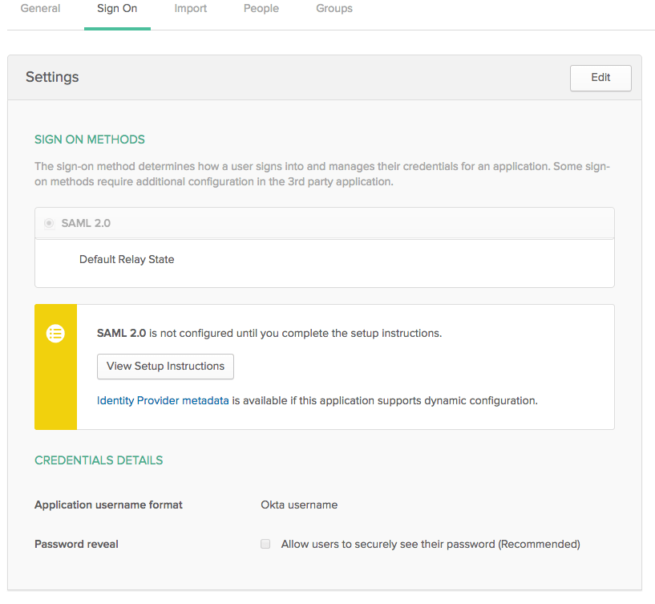

# Okta SSO provider

Okta is a [Single Sign-on provider](https://www.okta.com/products/single-sign-on/) that can be used to authenticate
with GitLab.

The following documentation enables Okta as a SAML provider.

## Configure the Okta application

The following guidance is based on this Okta article, on adding a [SAML Application with an Okta Developer account](https://support.okta.com/help/s/article/Why-can-t-I-add-a-SAML-Application-with-an-Okta-Developer-account?language=en_US):

1. On Okta administration section, make sure to select Classic UI view in the top left corner. From there, choose to **Add an App**.
1. When the app screen comes up you see another button to **Create an App** and
   choose SAML 2.0 on the next screen.
1. Optionally you can add a logo
   (you can choose it from <https://about.gitlab.com/press/>). You'll have to
   crop and resize it.
1. Next, you'll need the to fill in the SAML general configuration. Here's an example (showing the required URLs and attribute mapping):
   image.

   

1. The last part of the configuration is the feedback section where you can
   just say you're a customer and creating an app for internal use.
1. When you have your app you'll have a few tabs on the top of the app's
   profile. Click on the SAML 2.0 configuration instructions button which should
   look like the following:

   

1. On the screen that comes up take note of the
   **Identity Provider Single Sign-On URL** which you'll use for the
   `idp_sso_target_url` on your GitLab configuration file.

1. **Before you leave Okta make sure you add your user and groups if any.**

---

Now that the Okta app is configured, it's time to enable it in GitLab.

## Configure GitLab

1. See [Initial OmniAuth Configuration](../../integration/omniauth.md#initial-omniauth-configuration)
   for initial settings.

1. To allow your users to use Okta to sign up without having to manually create
   an account first, don't forget to add the following values to your
   configuration:

   **For Omnibus GitLab installations**

   Edit `/etc/gitlab/gitlab.rb`:

   ```ruby
   gitlab_rails['omniauth_allow_single_sign_on'] = ['saml']
   gitlab_rails['omniauth_block_auto_created_users'] = false
   ```

   ---

   **For installations from source**

   Edit `config/gitlab.yml`:

   ```yaml
   allow_single_sign_on: ["saml"]
   block_auto_created_users: false
   ```

1. You can also automatically link Okta users with existing GitLab users if
   their email addresses match by adding the following setting:

   **For Omnibus GitLab installations**

   Edit `/etc/gitlab/gitlab.rb`:

   ```ruby
   gitlab_rails['omniauth_auto_link_saml_user'] = true
   ```

   ---

   **For installations from source**

   Edit `config/gitlab.yml`:

   ```yaml
   auto_link_saml_user: true
   ```

1. Add the provider configuration.

   >**Notes:**
   >
   >- Change the value for `assertion_consumer_service_url` to match the HTTPS endpoint
   >  of GitLab (append `users/auth/saml/callback` to the HTTPS URL of your GitLab
   >  installation to generate the correct value).
   >
   >- To get the `idp_cert_fingerprint` fingerprint, first download the
   >  certificate from the Okta app you registered and then run:
   >  `openssl x509 -in okta.cert -noout -fingerprint`. Substitute `okta.cert`
   >  with the location of your certificate.
   >
   >- Change the value of `idp_sso_target_url`, with the value of the
   >  **Identity Provider Single Sign-On URL** from the step when you
   >  configured the Okta app.
   >
   >- Change the value of `issuer` to the value of the **Audience Restriction** from your Okta app configuration. This will identify GitLab
   >  to the IdP.
   >
   >- Leave `name_identifier_format` as-is.

   **For Omnibus GitLab installations**

   ```ruby
   gitlab_rails['omniauth_providers'] = [
     {
       name: 'saml',
       args: {
                assertion_consumer_service_url: 'https://gitlab.example.com/users/auth/saml/callback',
                idp_cert_fingerprint: '43:51:43:a1:b5:fc:8b:b7:0a:3a:a9:b1:0f:66:73:a8',
                idp_sso_target_url: 'https://gitlab.oktapreview.com/app/gitlabdev773716_gitlabsaml_1/exk8odl81tBrjpD4B0h7/sso/saml',
                issuer: 'https://gitlab.example.com',
                name_identifier_format: 'urn:oasis:names:tc:SAML:2.0:nameid-format:transient'
              },
       label: 'Okta' # optional label for SAML login button, defaults to "Saml"
     }
   ]
   ```

   **For installations from source**

   ```yaml
   - {
       name: 'saml',
       args: {
              assertion_consumer_service_url: 'https://gitlab.example.com/users/auth/saml/callback',
              idp_cert_fingerprint: '43:51:43:a1:b5:fc:8b:b7:0a:3a:a9:b1:0f:66:73:a8',
              idp_sso_target_url: 'https://gitlab.oktapreview.com/app/gitlabdev773716_gitlabsaml_1/exk8odl81tBrjpD4B0h7/sso/saml',
              issuer: 'https://gitlab.example.com',
              name_identifier_format: 'urn:oasis:names:tc:SAML:2.0:nameid-format:transient'
            },
       label: 'Okta' # optional label for SAML login button, defaults to "Saml"
     }
   ```

1. [Reconfigure](../restart_gitlab.md#omnibus-gitlab-reconfigure) or [restart](../restart_gitlab.md#installations-from-source) GitLab for Omnibus and installations
   from source respectively for the changes to take effect.

You might want to try this out on an incognito browser window.

## Configuring groups

NOTE:
Make sure the groups exist and are assigned to the Okta app.

You can take a look of the [SAML documentation](../../integration/saml.md#saml-groups) on configuring groups.

<!-- ## Troubleshooting

Include any troubleshooting steps that you can foresee. If you know beforehand what issues
one might have when setting this up, or when something is changed, or on upgrading, it's
important to describe those, too. Think of things that may go wrong and include them here.
This is important to minimize requests for support, and to avoid doc comments with
questions that you know someone might ask.

Each scenario can be a third-level heading, e.g. `### Getting error message X`.
If you have none to add when creating a doc, leave this section in place
but commented out to help encourage others to add to it in the future. -->
