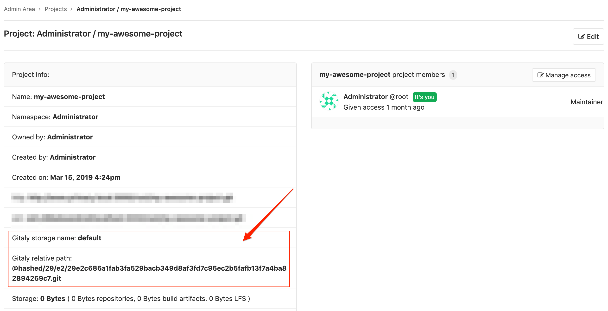

# Automatic background verification **(PREMIUM ONLY)**

NOTE: **Note:**
Automatic background verification of repositories and wikis was added in
GitLab EE 10.6 but is enabled by default only on GitLab EE 11.1. You can
disable or enable this feature manually by following
[these instructions](#disabling-or-enabling-the-automatic-background-verification).

Automatic background verification ensures that the transferred data matches a
calculated checksum. If the checksum of the data on the **primary** node matches checksum of the
data on the **secondary** node, the data transferred successfully. Following a planned failover,
any corrupted data may be **lost**, depending on the extent of the corruption.

If verification fails on the **primary** node, this indicates Geo is replicating a corrupted object.
You can restore it from backup or remove it from the **primary** node to resolve the issue.

If verification succeeds on the **primary** node but fails on the **secondary** node,
this indicates that the object was corrupted during the replication process.
Geo actively try to correct verification failures marking the repository to
be resynced with a backoff period. If you want to reset the verification for
these failures, so you should follow [these instructions][reset-verification].

If verification is lagging significantly behind replication, consider giving
the node more time before scheduling a planned failover.

## Disabling or enabling the automatic background verification

Run the following commands in a Rails console on the **primary** node:

```shell
gitlab-rails console
```

To check if automatic background verification is enabled:

```ruby
Gitlab::Geo.repository_verification_enabled?
```

To disable automatic background verification:

```ruby
Feature.disable('geo_repository_verification')
```

To enable automatic background verification:

```ruby
Feature.enable('geo_repository_verification')
```

## Repository verification

Navigate to the **Admin Area > Geo** dashboard on the **primary** node and expand
the **Verification information** tab for that node to view automatic checksumming
status for repositories and wikis. Successes are shown in green, pending work
in grey, and failures in red.


Navigate to the **Admin Area > Geo** dashboard on the **secondary** node and expand
the **Verification information** tab for that node to view automatic verification
status for repositories and wikis. As with checksumming, successes are shown in
green, pending work in grey, and failures in red.


## Using checksums to compare Geo nodes

To check the health of Geo **secondary** nodes, we use a checksum over the list of
Git references and their values. The checksum includes `HEAD`, `heads`, `tags`,
`notes`, and GitLab-specific references to ensure true consistency. If two nodes
have the same checksum, then they definitely hold the same references. We compute
the checksum for every node after every update to make sure that they are all
in sync.

## Repository re-verification

> [Introduced](https://gitlab.com/gitlab-org/gitlab/-/merge_requests/8550) in GitLab Enterprise Edition 11.6. Available in [GitLab Premium](https://about.gitlab.com/pricing/).

Due to bugs or transient infrastructure failures, it is possible for Git
repositories to change unexpectedly without being marked for verification.
Geo constantly reverifies the repositories to ensure the integrity of the
data. The default and recommended re-verification interval is 7 days, though
an interval as short as 1 day can be set. Shorter intervals reduce risk but
increase load and vice versa.

Navigate to the **Admin Area > Geo** dashboard on the **primary** node, and
click the **Edit** button for the **primary** node to customize the minimum
re-verification interval:


The automatic background re-verification is enabled by default, but you can
disable if you need. Run the following commands in a Rails console on the
**primary** node:

```shell
gitlab-rails console
```

To disable automatic background re-verification:

```ruby
Feature.disable('geo_repository_reverification')
```

To enable automatic background re-verification:

```ruby
Feature.enable('geo_repository_reverification')
```

## Reset verification for projects where verification has failed

Geo actively try to correct verification failures marking the repository to
be resynced with a backoff period. If you want to reset them manually, this
rake task marks projects where verification has failed or the checksum mismatch
to be resynced without the backoff period:

For repositories:

```shell
sudo gitlab-rake geo:verification:repository:reset
```

For wikis:

```shell
sudo gitlab-rake geo:verification:wiki:reset
```

## Reconcile differences with checksum mismatches

If the **primary** and **secondary** nodes have a checksum verification mismatch, the cause may not be apparent. To find the cause of a checksum mismatch:

1. Navigate to the **Admin Area > Projects** dashboard on the **primary** node, find the
   project that you want to check the checksum differences and click on the
   **Edit** button:
   

1. On the project admin page get the **Gitaly storage name**, and **Gitaly relative path**:
   

1. Navigate to the project's repository directory on both **primary** and **secondary** nodes
   (the path is usually `/var/opt/gitlab/git-data/repositories`). Note that if `git_data_dirs`
   is customized, check the directory layout on your server to be sure.

   ```shell
   cd /var/opt/gitlab/git-data/repositories
   ```

1. Run the following command on the **primary** node, redirecting the output to a file:

   ```shell
   git show-ref --head | grep -E "HEAD|(refs/(heads|tags|keep-around|merge-requests|environments|notes)/)" > primary-node-refs
   ```

1. Run the following command on the **secondary** node, redirecting the output to a file:

   ```shell
   git show-ref --head | grep -E "HEAD|(refs/(heads|tags|keep-around|merge-requests|environments|notes)/)" > secondary-node-refs
   ```

1. Copy the files from the previous steps on the same system, and do a diff between the contents:

   ```shell
   diff primary-node-refs secondary-node-refs
   ```

## Current limitations

Automatic background verification doesn't cover attachments, LFS objects,
job artifacts, and user uploads in file storage. You can keep track of the
progress to include them in [ee-1430]. For now, you can verify their integrity
manually by following [these instructions][foreground-verification] on both
nodes, and comparing the output between them.

In GitLab EE 12.1, Geo calculates checksums for attachments, LFS objects, and
archived traces on secondary nodes after the transfer, compares it with the
stored checksums, and rejects transfers if mismatched. Please note that Geo
currently does not support an automatic way to verify these data if they have
been synced before GitLab EE 12.1.

Data in object storage is **not verified**, as the object store is responsible
for ensuring the integrity of the data.

[reset-verification]: background_verification.md#reset-verification-for-projects-where-verification-has-failed
[foreground-verification]: ../../raketasks/check.md
[ee-1430]: https://gitlab.com/groups/gitlab-org/-/epics/1430
