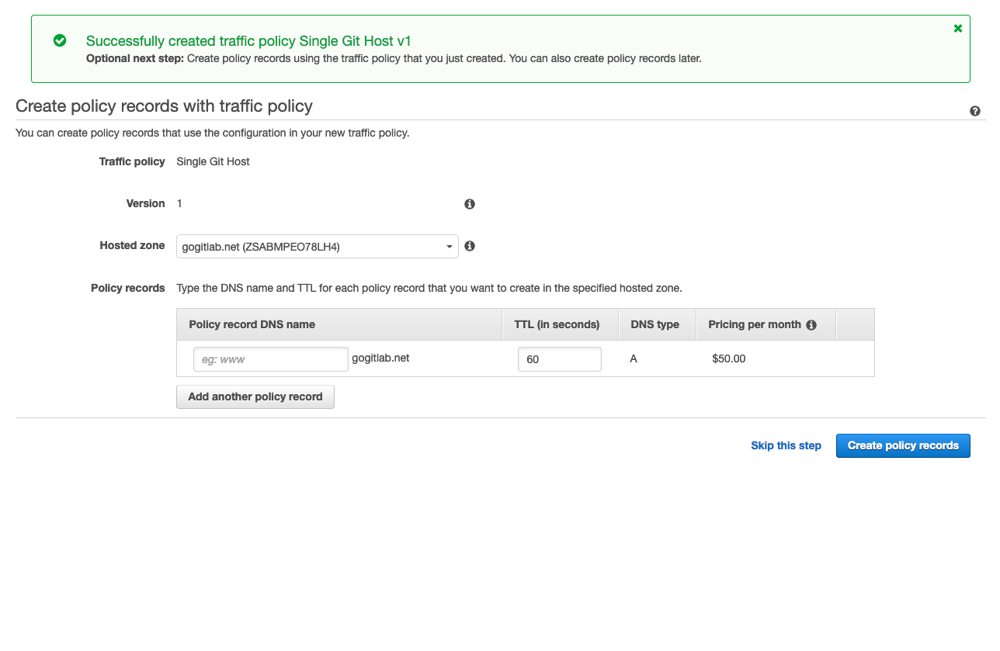

# How to set up a Geolocation-aware Git URL with AWS Route53 **(PREMIUM ONLY)**

You can provide your users with Git URLs that automatically choose the closest
Geo node based on their current geolocation. This example uses
[AWS Route53](https://aws.amazon.com/route53/) to accomplish this at the DNS
level.

This works because Git push requests are automatically redirected (HTTP) or
proxied (SSH) from secondaries to the primary.

NOTE: **Note**
This technique can similarly be used to distribute web UI or API traffic to Geo
secondary nodes. See
[Multiple secondary nodes behind a load balancer](../../../user/admin_area/geo_nodes.md#multiple-secondary-nodes-behind-a-load-balancer).
Importantly, the primary node cannot be included. See the feature request
[Support putting the primary behind a Geo node load balancer](https://gitlab.com/gitlab-org/gitlab/issues/10888)

## Prerequisites

In this example, we have already set up `primary.example.com` and
`secondary.example.com`. We will create a `git.example.com` subdomain which will
automatically direct requests from Europe to the secondary, and all other
locations to the primary.

- A working GitLab primary which is accessible at its own address, i.e.
  `primary.example.com`.
- A working GitLab secondary
- A Route53 Hosted Zone managing your domain e.g. `example.com`

## Create a traffic policy

1. Navigate to the Route 53 dashboard
https://console.aws.amazon.com/route53/home and click **Traffic policies**.

1. Click the **Create traffic policy** button.

1. Fill in the **Policy Name** field with `Single Git Host` and click **Next**.

1. Leave **DNS type** as `A: IP Address in IPv4 format`.
1. Click **Connect to...** and select **Geolocation rule**.

1. For the first **Location**, leave it as `Default`.
1. Click **Connect to...** and select **New endpoint**.
1. Choose **Type** `value` and fill it in with `<your primary IP address>`.
1. For the second **Location**, choose `Europe`.
1. Click **Connect to...** and select **New endpoint**.
1. Choose **Type** `value` and fill it in with `<your secondary IP address>`.

1. Click **Create traffic policy**.

1. Fill in **Policy record DNS name** with `git`.
1. Click **Create policy records**.

You have successfully set up a single host, e.g. `git.example.com` which
distributes traffic to your Geo nodes by geolocation!

## Configure Git clone URLs to use the special Git URL

1. Change the SSH clone URL host by setting `gitlab_rails['gitlab_ssh_host']` in
`gitlab.rb` of web nodes. As shown in
https://gitlab.com/gitlab-org/omnibus-gitlab/blob/12.2.5+ee.0/files/gitlab-config-template/gitlab.rb.template#L48.

Unfortunately the means to specify a custom HTTP clone URL is not yet
implemented. The feature request can be found at
https://gitlab.com/gitlab-org/gitlab/issues/31949.

## Example Git request behavior outside Europe

All requests are directed to the primary.

## Example Git request behavior within Europe

HTTP:

- `git clone http://git.example.com/foo/bar.git` is directed to the secondary.
-  And `git push` is initially directed to the secondary, which automatically
   redirects to `primary.example.com`.

SSH:

- `git clone git@git.example.com:foo/bar.git` is directed to the secondary.
-  And `git push` is initially directed to the secondary, which automatically
   redirects to `primary.example.com`.
