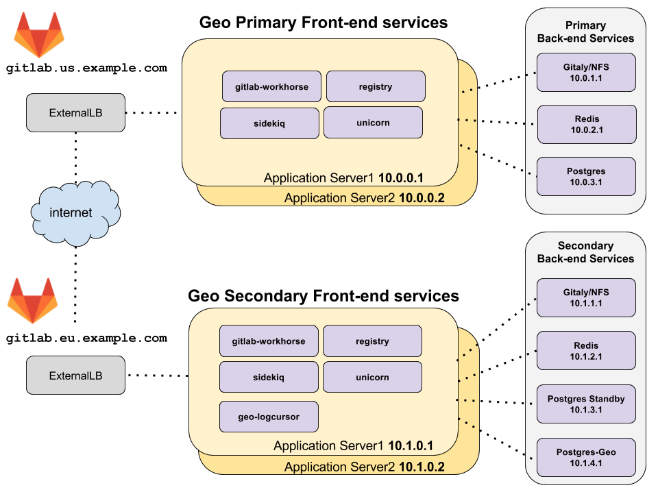

# Geo for multiple nodes **(PREMIUM ONLY)**

This document describes a minimal reference architecture for running Geo
with multi-node primary and secondary sites, and gives instructions on setting up 
a Geo deployment with multi-node sites. If your multi-node setup differs from the one
described, it is possible to adapt these instructions to your needs.

The setup instructions generally follow the same order listed under [Setting up Geo using Omnibus GitLab](../setup/#using-omnibus-gitlab), and include steps specific to multi-node Geo sites.

## Architecture overview



_[diagram source - GitLab employees only](https://docs.google.com/drawings/d/1z0VlizKiLNXVVVaERFwgsIOuEgjcUqDTWPdQYsE7Z4c/edit)_

The topology above assumes that the **primary** and **secondary** Geo sites
are located in two separate locations, on their own virtual network
with private IP addresses. The network is configured such that all nodes within
one geographic location can communicate with each other using their private IP addresses.
The IP addresses given are examples and may be different depending on the
network topology of your deployment.

The only external way to access the two Geo sites is by HTTPS at
`gitlab.us.example.com` and `gitlab.eu.example.com` in the example above.

NOTE: **Note:**
The **primary** and **secondary** Geo sites must be able to communicate to each other over HTTPS.

## Redis and PostgreSQL for multiple nodes

Geo supports:

- Redis and PostgreSQL on the **primary** site configured for multiple nodes.
- Redis on **secondary** site configured for multiple nodes.

NOTE: **Note:**
Support for PostgreSQL on **secondary** sites in multi-node configuration
[is planned](https://gitlab.com/groups/gitlab-org/-/epics/2536).

Because of the additional complexity involved in setting up this configuration
for PostgreSQL and Redis, it is not covered by this Geo multi-node documentation.

For more information about setting up a multi-node PostgreSQL cluster and Redis cluster using the omnibus package see the multi-node documentation for
[PostgreSQL](../../postgresql/replication_and_failover.md) and
[Redis](../../redis/replication_and_failover.md), respectively.

NOTE: **Note:**
It is possible to use cloud hosted services for PostgreSQL and Redis, but this is beyond the scope of this document.

## Prerequisites: Two working GitLab multi-node sites

One site will serve as the **primary** site. Use the
[GitLab multi-node documentation](../../reference_architectures/index.md) to set this up. If
you already have a working GitLab site that is in-use, it can be used as a
**primary**.

The second site will serve as the **secondary** site. Again, use the
[GitLab multi-node documentation](../../reference_architectures/index.md) to set this up.
It's a good idea to log in and test it, however, note that its data will be
wiped out as part of the process of replicating from the **primary**.

## Configure the GitLab site to be the **primary** site

The following steps enable a GitLab site to serve as the **primary** site.

### Step 1: Configure the **primary** frontend nodes
<!-- Why is this the first step when it's the 5th step for single-node, and the doc says to follow the order of steps exactly? -->

1. Follow sub-steps 1 through 4 under ["Step 1. Configure the primary server"](../setup/database.md#step-1-configure-the-primary-server) step in the single-node instructions, but use the following edits to `/etc/gitlab/gitlab.rb`:

   ```ruby
   ##
   ## Enable the Geo primary role
   ## >>>>>>>QUESTION: why not run gitlab-ctl set-geo-primary-role, as we instruct for single-node Geo?
   roles ['geo_primary_role']

   ##
   ## The unique identifier for the Geo node.
   ##
   gitlab_rails['geo_node_name'] = '<node_name_here>'

   ##
   ## Disable automatic migrations
   ##
   gitlab_rails['auto_migrate'] = false
   ```

After making these changes, [reconfigure GitLab](../../restart_gitlab.md#omnibus-gitlab-reconfigure) so the changes take effect.

NOTE: **Note:**
PostgreSQL and Redis should have already been disabled on the
application nodes, and connections from the application nodes to those
services on the backend nodes configured, during normal GitLab multi-node set up. See
multi-node configuration documentation for
[PostgreSQL](../../postgresql/replication_and_failover.md#configuring-the-application-nodes)
and [Redis](../../redis/replication_and_failover.md#example-configuration-for-the-gitlab-application).

### Step 2: Configure the **primary** database node

1. Edit `/etc/gitlab/gitlab.rb` and add the following:

   ```ruby
   ##
   ## Configure the Geo primary role and the PostgreSQL role
   ##
   roles ['geo_primary_role', 'postgres_role']
   ```

1. Follow sub-steps 5 through 12 under ["Step 1. Configure the primary server"](../setup/database.md#step-1-configure-the-primary-server) step in the single-node instructions.

## Configure a **secondary** site

A **secondary** site is similar to any other GitLab multi-node site, with two
major differences:

- The main PostgreSQL database is a read-only replica of the **primary** site's
  PostgreSQL database.
- There is also a single PostgreSQL database for the **secondary** site,
  called the "tracking database", which tracks the synchronization state of
  various resources.

Therefore, we will set up the multi-node components one-by-one, and include deviations
from the non-Geo multi-node setup. However, we highly recommend first configuring a
brand-new site as if it were not part of a Geo deployment so that it can be
tested and verified as a working site. And only then should it be modified
for use as a Geo **secondary**. This helps to separate problems that are related
and are not related to Geo setup.

### Step 0: Stop application and Sidekiq nodes

- As described in the [single-node instructions](../geo/setup/database.md#step-2-configure-the-secondary-server)

### Step 1: Configure the Redis and Gitaly services on the **secondary** site
<!-- Since the pre-requisite was two working Gitlab sites, this step should already have been done at this point. Do we need this? -->
Configure the following services, again using the non-Geo multi-node site
documentation:

- [Configuring Redis for GitLab](../../redis/replication_and_failover.md#example-configuration-for-the-gitlab-application) for multiple nodes.
- [Gitaly](../../high_availability/gitaly.md), which will store data that is
  synchronized from the **primary** site.

NOTE: **Note:**
[NFS](../../nfs.md) can be used in place of Gitaly but is not
recommended.

### Step 2: Configure the main read-only replica PostgreSQL database on the **secondary** site

NOTE: **Note:**
The following documentation assumes the database will be run on
a single node only. Multi-node PostgreSQL on **secondary** sites is
[not currently supported](https://gitlab.com/groups/gitlab-org/-/epics/2536).

Configure the [**secondary** database](../setup/database.md) as a read-only replica of
the **primary** database. Use the following as a guide.

1. (I THINK CAN SKIP THIS: THIS STEP WAS DONE WHILE SETTING UP PRIMARY DB NODE, YOU NEED TO ADD MD5 HASH OF PASSWORD TO PRIMARY DB CONFIG FILE) Generate an MD5 hash of the desired password for the database user that the
   GitLab application will use to access the read-replica database:

   Note that the username (`gitlab` by default) is incorporated into the hash.

   ```shell
   gitlab-ctl pg-password-md5 gitlab
   # Enter password: <your_password_here>
   # Confirm password: <your_password_here>
   # fca0b89a972d69f00eb3ec98a5838484
   ```

   Use this hash to fill in `<md5_hash_of_your_password>` in the next step.

1. Follow sub-steps 3 through 6 under ["Step 2. Configure the secondary server"](../setup/database.md#step-2-configure-the-secondary-server).

1. Edit `/etc/gitlab/gitlab.rb` in the replica database node, and add the
   following:

   ```ruby
   ##
   ## Configure the Geo secondary role and the PostgreSQL role
   ##
   roles ['geo_secondary_role', 'postgres_role']

   ##
   ## Secondary address
   ## - replace '<secondary_node_ip>' with the public or VPC address of your Geo secondary site
   ## - replace '<tracking_database_ip>' with the public or VPC address of your Geo tracking database node
   ##
   postgresql['listen_address'] = '<secondary_node_ip>'
   postgresql['md5_auth_cidr_addresses'] = ['<secondary_node_ip>/32', '<tracking_database_ip>/32']

   ##
   ## Database credentials password (defined previously in primary database node)
   ## - replicate same values here as defined in primary database node
   ##
   postgresql['sql_user_password'] = '<md5_hash_of_your_password>'
   gitlab_rails['db_password'] = '<your_password_here>'

   ##
   ## When running the Geo tracking database on a separate node, disable it
   ## here and allow connections from the tracking database host. And ensure
   ## the tracking database IP is in postgresql['md5_auth_cidr_addresses'] above.
   ##
   geo_postgresql['enable'] = false

   ##
   ## Disable all other services that aren't needed. Note that we had to enable
   ## geo_secondary_role to cause some configuration changes to postgresql, but
   ## the role enables single-node services by default.
   ##
   alertmanager['enable'] = false
   consul['enable'] = false
   geo_logcursor['enable'] = false
   gitaly['enable'] = false
   gitlab_exporter['enable'] = false
   gitlab_workhorse['enable'] = false
   nginx['enable'] = false
   node_exporter['enable'] = false
   pgbouncer_exporter['enable'] = false
   prometheus['enable'] = false
   redis['enable'] = false
   redis_exporter['enable'] = false
   repmgr['enable'] = false
   sidekiq['enable'] = false
   sidekiq_cluster['enable'] = false
   puma['enable'] = false
   unicorn['enable'] = false
   ```

After making these changes, [reconfigure GitLab](../../restart_gitlab.md#omnibus-gitlab-reconfigure) so the changes take effect.

If using an external PostgreSQL node, refer also to
[Geo with external PostgreSQL instances](../setup/external_database.md).

### Step 2b: Restart PostgreSQL if stopped in step 0

### Step 3: Configure the tracking database on the **secondary** site

NOTE: **Note:**
This documentation assumes the tracking database will be run on
only a single node, rather than as a PostgreSQL cluster.

Configure the tracking database.

1. Generate an MD5 hash of the desired password for the database user that the
   GitLab application will use to access the tracking database:

   Note that the username (`gitlab_geo` by default) is incorporated into the
   hash.

   ```shell
   gitlab-ctl pg-password-md5 gitlab_geo
   # Enter password: <your_password_here>
   # Confirm password: <your_password_here>
   # fca0b89a972d69f00eb3ec98a5838484
   ```

   Use this hash to fill in `<tracking_database_password_md5_hash>` in the next
   step.

1. Edit `/etc/gitlab/gitlab.rb` in the tracking database node, and add the
   following:

   ```ruby
   ##
   ## Enable the Geo secondary tracking database
   ##
   geo_postgresql['enable'] = true
   geo_postgresql['listen_address'] = '<ip_address_of_this_host>'
   geo_postgresql['sql_user_password'] = '<tracking_database_password_md5_hash>'

   ##
   ## Configure PostgreSQL connection to the replica database
   ##
   geo_postgresql['md5_auth_cidr_addresses'] = ['<replica_database_ip>/32']
   gitlab_rails['db_host'] = '<replica_database_ip>'

   # Prevent reconfigure from attempting to run migrations on the replica DB
   gitlab_rails['auto_migrate'] = false

   ##
   ## Ensure unnecessary services are disabled
   ##
   alertmanager['enable'] = false
   consul['enable'] = false
   geo_logcursor['enable'] = false
   gitaly['enable'] = false
   gitlab_exporter['enable'] = false
   gitlab_workhorse['enable'] = false
   nginx['enable'] = false
   node_exporter['enable'] = false
   pgbouncer_exporter['enable'] = false
   postgresql['enable'] = false
   prometheus['enable'] = false
   redis['enable'] = false
   redis_exporter['enable'] = false
   repmgr['enable'] = false
   sidekiq['enable'] = false
   sidekiq_cluster['enable'] = false
   puma['enable'] = false
   unicorn['enable'] = false
   ```

After making these changes, [reconfigure GitLab](../../restart_gitlab.md#omnibus-gitlab-reconfigure) so the changes take effect.

If using an external PostgreSQL node, refer also to
[Geo with external PostgreSQL instances](../setup/external_database.md).

### Step 4: Initiate the replication process on the **secondary** database node

Follow ["Step 3. Initiate the replication process"](../setup/database.md#step-3-initiate-the-replication-process). The host ip to be passed to the `replicate-geo-database` command should be the primary site's main database node's ip.

### Step 5: Configure fast lookup of authorized SSH keys

[This step](../../operations/fast_ssh_key_lookup.md) is required on the application nodes for both the primary and secondary sites.

### Step 6: Configure the frontend application nodes on the secondary site

In the architecture overview, there are two nodes running the GitLab
application services. These services are enabled selectively in the
configuration.

Configure the GitLab Rails application nodes following the relevant steps
outlined in the [reference architectures](../../reference_architectures/index.md)
<!-- This should already be done at this point since the prequisite was two working GitLab sites -->

Follow the steps for [Configuring a new secondary node](../replication/configuration.md#configuring-a-new-secondary-node) on the application servers, but for [sub-step 3](../replication/configuration.md#step-3-add-the-secondary-node) use the following to update the `/etc/gitlab/gitlab.rb` on each application node on the **secondary** site:

   ```ruby
   ##
   ## Enable the Geo secondary role
   ##
   roles ['geo_secondary_role', 'application_role']

   ##
   ## The unique identifier for the Geo site
   ##
   gitlab_rails['geo_node_name'] = '<node_name_here>'

   ##
   ## Disable automatic migrations
   ##
   gitlab_rails['auto_migrate'] = false

   ##
   ## Configure the connection to the tracking DB. And disable application
   ## servers from running tracking databases.
   ##
   geo_secondary['db_host'] = '<geo_tracking_db_host>'
   geo_secondary['db_password'] = '<geo_tracking_db_password>'
   geo_postgresql['enable'] = false

   ##
   ## Configure connection to the streaming replica database, if you haven't
   ## already
   ##
   gitlab_rails['db_host'] = '<replica_database_host>'
   gitlab_rails['db_password'] = '<replica_database_password>'

   ##
   ## Configure connection to Redis, if you haven't already
   ##
   gitlab_rails['redis_host'] = '<redis_host>'
   gitlab_rails['redis_password'] = '<redis_password>'

   ##
   ## If you are using custom users not managed by Omnibus, you need to specify
   ## UIDs and GIDs like below, and ensure they match between servers in a
   ## cluster to avoid permissions issues
   ##
   user['uid'] = 9000
   user['gid'] = 9000
   web_server['uid'] = 9001
   web_server['gid'] = 9001
   registry['uid'] = 9002
   registry['gid'] = 9002
   ```

NOTE: **Note:**
If you had set up PostgreSQL cluster using the omnibus package and you had set
up `postgresql['sql_user_password'] = 'md5 digest of secret'` setting, keep in
mind that `gitlab_rails['db_password']` and `geo_secondary['db_password']`
mentioned above contains the plaintext passwords. This is used to let the Rails
servers connect to the databases.

NOTE: **Note:**
Make sure that current node IP is listed in `postgresql['md5_auth_cidr_addresses']` setting of your remote database.

After making these changes [Reconfigure GitLab](../../restart_gitlab.md#omnibus-gitlab-reconfigure) so the changes take effect.

On the secondary the following GitLab frontend services will be enabled:

- `geo-logcursor`
- `gitlab-pages`
- `gitlab-workhorse`
- `logrotate`
- `nginx`
- `registry`
- `remote-syslog`
- `sidekiq`
- `puma`

Verify these services by running `sudo gitlab-ctl status` on the frontend
application nodes.

### Step 5: Set up the LoadBalancer for the **secondary** site
<!-- This step could be moved. It's not part of setting up Geo replication -->

In this topology, a load balancer is required at each geographic location to
route traffic to the application nodes.

See [Load Balancer for GitLab with multiple nodes](../../load_balancer.md) for
more information.

### Step 6: Configure the backend application nodes on the **secondary** site
<!-- This step is not sequential with the rest. It's part of setting up mulit-node GitLab, not specifically for multi-node Geo. This should already be done at this point.  -->

The minimal reference architecture diagram above shows all application services
running together on the same machines. However, for multiple nodes we
[strongly recommend running all services separately](../../reference_architectures/index.md).

For example, a Sidekiq node could be configured similarly to the frontend
application nodes above, with some changes to run only the `sidekiq` service:

1. Edit `/etc/gitlab/gitlab.rb` on each Sidekiq node in the **secondary**
   site, and add the following:

   ```ruby
   ##
   ## Enable the Geo secondary role
   ##
   roles ['geo_secondary_role']

   ##
   ## Enable the Sidekiq service
   ##
   sidekiq['enable'] = true

   ##
   ## Ensure unnecessary services are disabled
   ##
   alertmanager['enable'] = false
   consul['enable'] = false
   geo_logcursor['enable'] = false
   gitaly['enable'] = false
   gitlab_exporter['enable'] = false
   gitlab_workhorse['enable'] = false
   nginx['enable'] = false
   node_exporter['enable'] = false
   pgbouncer_exporter['enable'] = false
   postgresql['enable'] = false
   prometheus['enable'] = false
   redis['enable'] = false
   redis_exporter['enable'] = false
   repmgr['enable'] = false
   puma['enable'] = false
   unicorn['enable'] = false

   ##
   ## The unique identifier for the Geo site.
   ##
   gitlab_rails['geo_node_name'] = '<node_name_here>'

   ##
   ## Disable automatic migrations
   ##
   gitlab_rails['auto_migrate'] = false

   ##
   ## Configure the connection to the tracking DB. And disable application
   ## servers from running tracking databases.
   ##
   geo_secondary['db_host'] = '<geo_tracking_db_host>'
   geo_secondary['db_password'] = '<geo_tracking_db_password>'
   geo_postgresql['enable'] = false

   ##
   ## Configure connection to the streaming replica database, if you haven't
   ## already
   ##
   gitlab_rails['db_host'] = '<replica_database_host>'
   gitlab_rails['db_password'] = '<replica_database_password>'

   ##
   ## Configure connection to Redis, if you haven't already
   ##
   gitlab_rails['redis_host'] = '<redis_host>'
   gitlab_rails['redis_password'] = '<redis_password>'

   ##
   ## If you are using custom users not managed by Omnibus, you need to specify
   ## UIDs and GIDs like below, and ensure they match between servers in a
   ## cluster to avoid permissions issues
   ##
   user['uid'] = 9000
   user['gid'] = 9000
   web_server['uid'] = 9001
   web_server['gid'] = 9001
   registry['uid'] = 9002
   registry['gid'] = 9002
   ```

   You can similarly configure a node to run only the `geo-logcursor` service
   with `geo_logcursor['enable'] = true` and disabling Sidekiq with
   `sidekiq['enable'] = false`.

   These nodes do not need to be attached to the load balancer.
