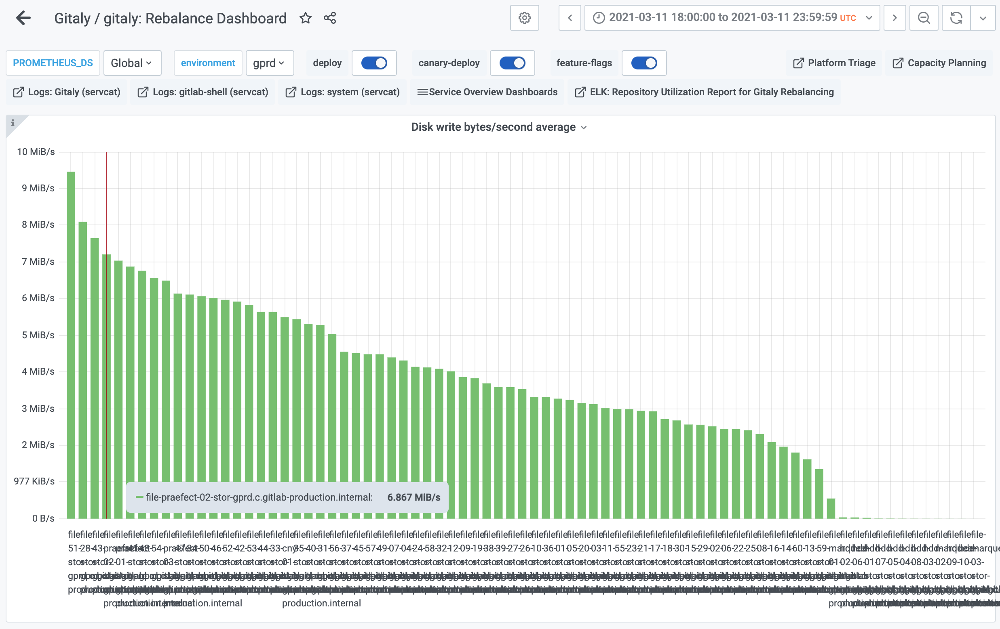
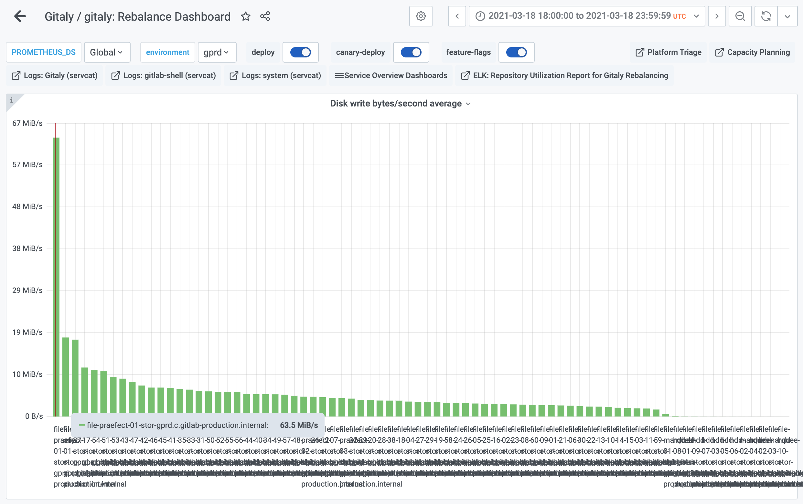

# Pack-objects cache **(FREE SELF)**

[Gitaly](index.md), the service that provides storage for Git
repositories, can be configured to cache a short rolling window of Git
clone responses. This can reduce server load when your server receives
lots of CI clone traffic.

The cache is implemented by wrapping `git pack-objects`, an internal
part of Git that gets invoked indirectly via the PostUploadPack and
SSHUploadPack Gitaly RPC's. Because we are at the level of `git
pack-objects`, the cache works equally well regardless of whether the
user clones via HTTP or SSH, via Git protocol v0 or v2, whether the
user is cloning or fetching, and whether the clone is shallow, partial
or neither. When the cache is enabled, anything that uses
PostUploadPack or SSHUploadPack can benefit from it.

The pack-objects cache is a local cache: it stores its metadata in
memory in the Gitaly process it is enabled in, and it stores the
actual Git data it is caching in files on local storage.

The pack-objects cache is designed for CI clone traffic: many clones
that ask for the same Git objects in a short time window. It will have
fewer, or even no benefits for other types of traffic. The cache key
is determined by the set of Git objects that the client is trying to
fetch. That means that for clones that fetch all branches, only one
branch has to change and you will get a cache miss.

Because the pack-objects cache can lead to a significant increase in
disk write IO and because its cache entries can be large it is off by
default.

## Configuration

|Setting|Default|Description|
|:---|:---|:---|
|`enabled`|`false`|Turns on the cache. When off, Gitaly runs a dedicated `git pack-objects` process for each request.|
|`dir`|`<PATH TO FIRST STORAGE>/+gitaly/PackObjectsCache`|Local directory where cache files get stored, see discussion below.|
|`max_age`|`5m` (5 minutes)|Cache entries older than this get expired and removed from disk.|

### Cache storage directory `dir`

The cache needs a directory to store its data in. This directory
should be in a filesystem with enough space, on a disk with enough IO
bandwidth. The default choice is a subdirectory of the first Gitaly
storage defined in the config file.

- If the cache filesystem runs out of **space**, all clones will start **failing**
- If the cache disk runs out of **IO bandwidth**, all clones, and probably the entire server, will **slow down** 

It is allowed for multiple Gitaly processes to use the same directory
for cache storage but be aware that they will not share cache entries:
there is no benefit in sharing. Each Gitaly processes uses a unique
random string as part of the cache filenames it creates so they will
not collide.

It is technically OK to put the cache directory on an NFS server but
it may not be optimal for performance, depending on your traffic and
on the performance characteristics of your NFS server.

While the default is to use a subdirectory of the first repository
storage directory defined in the Gitaly configuration file, there is
no technical need for the cache to be on the same filesystem as the
repositories. We chouse this default because the repository storage
filesystem is likely to have enough space and IO bandwidth; at least
that has been our experience on GitLab.com.

The cache directory does not have to persist across server restarts.
This is because the cache is automatically invalidated when the Gitaly
process restarts, and a server restart implies a process restart.

The amount of bandwidth required depends on the size and shape of the
repositories on your Gitaly server and on the kind of traffic your
users generate. You can use the network egress rate as an estimate.

The amount of space required depends on the bytes per second that your
users pull from the cache and the size of the `max_age` cache eviction
window. If your users pull 100 MB/s and you use a 5 minute window,
then on average you will have 5*60*100MB = 30GB of data in your cache
directory. The pack-objects cache does not enforce a limit on the
amount of data stored so there may be peaks that exceed the average,
all depending on your repositories and your traffic.

### Cache eviction window `max_age`

The `max_age` configuration setting lets us control how much data is
stored in the cache. Entries older than `max_age` get evicted from the
in-memory metadata store, and deleted from disk. Note that this does not
interfere with ongoing requests, so it is OK for `max_age` to be less
than the time it takes to do a clone over a slow connection. This is
because Unix filesystems do not truly delete a file until all
processes that are reading the deleted file have closed it.

The default value of 5 minutes was chosen after a traffic analysis on
GitLab.com; it seemed a reasonable number in terms of cache hit ratio
and cache storage size.

## Design notes

We designed this cache to solve a specific problem on GitLab.com: high
Gitaly server load due to massively parallel CI clones. Where
possible, we kept things as simple as possible, as long as the end
result would be adequate for GitLab.com.

### Streaming and backpressure

The main goal was to have both **streaming** and **backpressure**. By
"streaming" we mean that a consumer of a cache entry can start reading and
stream back data before the producer is done writing the entry.
We wanted this because Git clones are relatively slow and we did not
want to add to the end-to-end latency. By "backpressure" we mean that
the producer of a cache entry writes bytes to disk no faster than the
fastest consumer of the entry is reading them. This has two benefits.
First of all, if the consumer hangs up, we don't write data to disk
that no-one will look at. Second of all, we get a natural limit on how
much IO bandwidth we use. On its own, the producer can write data faster than the
consumers can read it. If there was no backpressure, the producer
would put excessive write IO pressure on the cache storage disk.

### Storage considerations

Early on in the project we thought we would use object storage to
store the cache data but we later decided not to, for several reasons.

1. Object storage introduces a new point of failure
1. Local storage gets a boost from the operating system's page cache; there is no page cache for object storage

To support the second point: during testing on a server with high
cache throughput, where the number of bytes read from the cache peaks
over 100MB/s once an hour, we see disk reads at near 0 bytes per
second, with peaks of less than 1MB. This is possible because the
operating system is able to serve all the pack-objects cace reads from
the page cache, i.e. from RAM. This server does use a lot of IO
bandwidth, but that is all due to cache writes, not reads. With object
storage, all those reads would have to come across the network via
HTTP requests.

### Off by default

While experimenting we found that in some cases the pack-objects cache
can use an unusually large amount of IO bandwidth. While our
infrastructure on GitLab.com is able to handle this, it did not seem
realistic to us to assume that this applies to all other GitLab
installations out there.

To give an example, look at the graph below, which ranks Gitaly
servers on GitLab.com by the number of bytes written to disk per
second. We are interested in the `file-praefect-*` servers because
they were involved in the experiment and they host a repository that
puts a lot of pressure on the cache. Note how before we enabled the
cache, the busiest `file-praefect-*` server ranked fourth, and how all
servers write less than 10 MB/s to disk.

Now look at this picture which shows data over the same window but one
week later, with the pack-objects cache enabled on the
`file-praefect-*` servers. Note how `file-praefect-01` is now the top
writer at 63MB/s, ahead of the number two who is below 20MB/s, and how
most of the other servers are still sitting below 10MB/s.

It seemed unreasonable to us to force such a (potential) jump in
resource consumption on all GitLab installations. This should be an
opt-in, not an opt-out.
