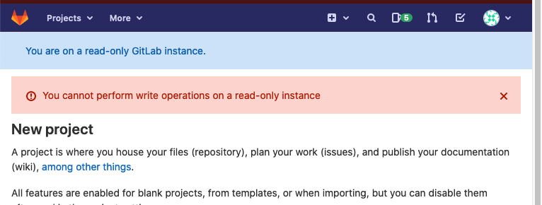

# GitLab in maintenance mode **(PREMIUM SELF)**

> [Introduced](https://gitlab.com/groups/gitlab-org/-/epics/2149) in GitLab Premium 13.9.

Maintenance mode allows administrators to reduce GitLab's internal state changes to a minimum while maintenance tasks are performed.

The main goal is to block all external actions that change GitLab's internal state (including the PG DB, but especially files, Git repos, container repos, etc). 

Then in-progress actions will finish (relatively quickly since no new actions are coming in), and internal state changes will be minimal.

In that state, various maintenance tasks are easier, and/or service can be stopped completely or further degraded for a much shorter period of time than might otherwise be needed e.g. stopping cron jobs and draining queues should be fairly quick.

Ideally, we allow all external actions that do not change internal state. That is roughly accomplished by allowing all, and only, HTTP GET requests, but many special cases are needed in practice. [Handling the special cases](internal_working.md) is most of the work behind maintenance mode.

## Enable maintenance mode

There are three ways to enable maintenance mode as an administrator:

- **Web UI**:
  1. Navigate to the **Admin Area > Application settings > General** and toggle
     the maintenance mode. You can optionally add a message for the banner as well.
  1. Click **Save** for the changes to take effect.

- **API**:

  ```shell
  curl --request PUT --header "PRIVATE-TOKEN:$ADMIN_TOKEN" "<gitlab-url>/api/v4/application/settings?maintenance_mode=true"
  ```

- [**Rails console**](../operations/rails_console.md#starting-a-rails-console-session):

  ```ruby
  ::Gitlab::CurrentSettings.update_attributes!(maintenance_mode: true)
  ::Gitlab::CurrentSettings.update_attributes!(maintenance_mode_message: "New message")
  ```

## Disable maintenance mode

There are three ways to disable maintenance mode:

- **Web UI**:
  1. Navigate to the **Admin Area > Application settings > General** and toggle
     the maintenance mode. You can optionally add a message for the banner as well.
  1. Click **Save** for the changes to take effect.

- **API**:

  ```shell
  curl --request PUT --header "PRIVATE-TOKEN:$ADMIN_TOKEN" "<gitlab-url>/api/v4/application/settings?maintenance_mode=false"
  ```

- [**Rails console**](../operations/rails_console.md#starting-a-rails-console-session):

  ```ruby
  ::Gitlab::CurrentSettings.update_attributes!(maintenance_mode: false)
  ```

## Behavior of GitLab features in maintenance mode

### Overview

When maintenance mode is enabled, a banner is displayed at the top of the page.
The banner can be customized with a specific message.

An error is displayed when a user tries to perform a write operation that isn't allowed.



**NOTE**

In some cases, the visual feedback from an action could be misleading, for example when starring a project, the **Star** button changes to show the **Unstar** action, however, this is only the frontend update, and it doesn't take into account the failed status of the POST request. These visual bugs are to be fixed [in follow-up iterations](https://gitlab.com/gitlab-org/gitlab/-/issues/295197).

### Admin functions

In maintenance mode, admins can edit the application settings. This will allow
them to disable maintenance mode after it's been enabled.

### Authentication

All users can log in and out of the GitLab instance but no new users can be created.

If there are [LDAP syncs](../auth/ldap/index.md) scheduled for that time they will fail if user creation is disabled. Similarly, [user creations based on SAML](../../integration/saml.md#general-setup) will fail.

### Git actions

All read-only Git operations will continue to work in maintenance mode, for example
`git clone` and `git pull`, but all write operations will fail, both through the CLI and Web IDE with the error message: `Git push is not allowed because this GitLab instance is currently in (read-only) maintenance mode.`

Geo secondaries are read-only instances that allow Git pushes because they are
proxied to the primary instance. However, in maintenance mode, Git pushes to
both primary and secondaries will fail.

### Merge requests, issues, epics

All write actions except those mentioned above will fail. So, in maintenance mode, a user cannot update merge requests, issues, etc.

### Incoming email

[Creating new issue replies, issues (including new Service Desk issues), merge requests by email](../incoming_email.md) will fail.

### Outgoing email

Notification emails will continue to arrive, but emails that require database writes, e.g. resetting of password, will not arrive.

### REST API

For JSON requests, POST PUT, PATCH, DELETE that are blocked, the API returns a a 403 response with error message: `You cannot perform write operations on a read-only instance`.

### CI

In maintenance mode:

- No new jobs are started. Already running jobs stay in 'running'
  status but their logs are no longer updated.
- If the job has been in 'running' state for longer than the project's time limit,
  it will **not** time out.
- Pipelines cannot be started, retried or canceled in maintenance mode.
  No new jobs can be created either.

Once maintenance mode is disabled, new jobs are picked up again. The jobs that were in the running state before enabling maintenance mode, will resume, and their logs will start getting updated again.

### Deployments

Deployments won't go through because pipelines will be unfinished.

It is recommended to disable auto deploys during maintenance mode, and enable
them once maintenance mode is disabled.

#### Terraform integration

Terraform integration depends on running CI pipelines, hence it will be blocked.

### Container Registry

In maintenance mode, `docker push` is blocked, but `docker pull` is available.

`docker push` will return this error: `denied: requested access to the resource is denied`

### Package Registry

Package Registry will allow you to install but not publish packages.

### Background jobs

Background jobs (cron jobs, Sidekiq) will continue running as is, because maintenance mode does not disable any background jobs.

[During a planned Geo failover](../geo/disaster_recovery/planned_failover.md#prevent-updates-to-the-primary-node),
it is recommended that you disable all cron jobs except for those related to Geo.

You can monitor queues and disable jobs in **Admin Area > Monitoring > Background Jobs**.

### Feature flags 

Feature flags cannot be turned on or off from the Web UI or through the API. But users who have access to the Rails console can toggle feature flags.

### Geo secondaries

The maintenance mode setting will be propagated to the secondary as they sync up.
It is important that you do not disable replication before enabling maintenance mode.

Replication and verification will continue to work in maintenance mode.

### Secure features

Features that depend on creating or approving Merge Requests, will not work.

SAST and Secret Detection cannot be initiated because depend on passing CI jobs to create artifacts.


## How does maintenance mode affect services that GitLab relies on?

Maintenance mode will only affect the following related services:

| Service | in maintenance mode|
|---------|----|
| GitLab Shell | Access requests to the rails application for Git pushes over SSH are denied |
| Geo nodes |Git pushes that are proxied from secondary to primary will be blocked. Replication and verification will continue. Secondary will be in maintenance mode too once primary is in maintenance mode.|
| Container Registry | Push to container registry is blocked, pull is allowed|
