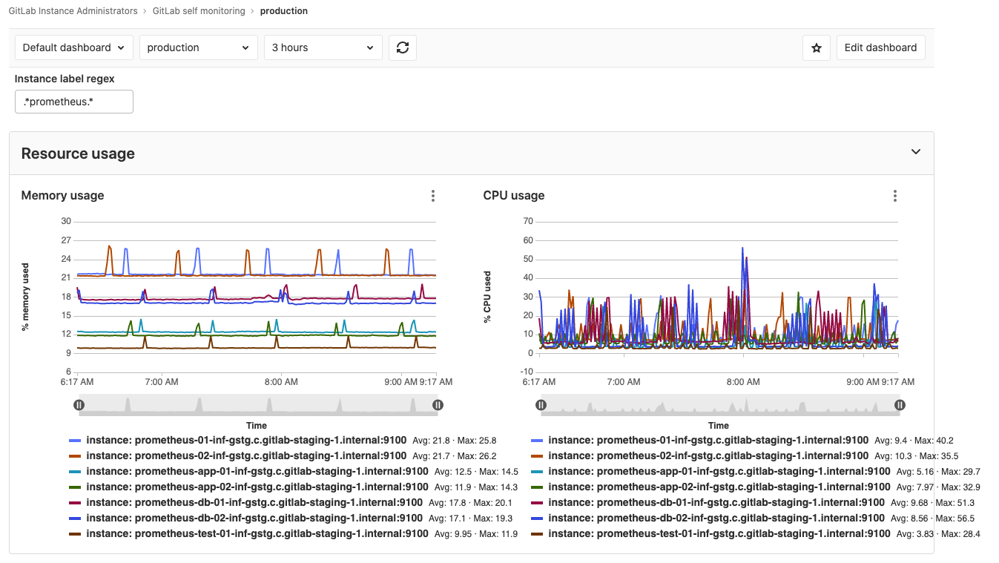

# GitLab self monitoring project

> - [Introduced](https://gitlab.com/gitlab-org/gitlab/-/issues/32351) in GitLab 12.7, behind a disabled feature flag (`self_monitoring_project`).
> - The feature flag was removed and the Self Monitoring Project was [made generally available](https://gitlab.com/gitlab-org/gitlab/-/issues/198511) in GitLab 12.8.

GitLab has been adding the ability for administrators to see insights into the health of
their GitLab instance. In order to surface this experience in a native way, similar to how
you would interact with an application deployed via GitLab, a base project called
"GitLab self monitoring" with
[internal visibility](../../../public_access/public_access.md#internal-projects) will be
added under a group called "GitLab Instance Administrators" specifically created for
visualizing and configuring the monitoring of your GitLab instance.

All administrators at the time of creation of the project and group will be added
as maintainers of the group and project, and as an admin, you'll be able to add new
members to the group in order to give them maintainer access to the project.

This project is used to self monitor your GitLab instance. The metrics dashboard
of the project shows some basic resource usage charts, such as CPU and memory usage
of each server in [Omnibus GitLab](https://docs.gitlab.com/omnibus/) installations.

You can also use the project to configure your own
[custom metrics](../../../operations/metrics/index.md#adding-custom-metrics) using
metrics exposed by the [GitLab exporter](../prometheus/gitlab_metrics.md#metrics-available).

## Creating the self monitoring project

1. Navigate to **Admin Area > Settings > Metrics and profiling**, and expand the **Self monitoring** section.
1. Toggle the **Create Project** button on.
1. Once your GitLab instance creates the project, you'll see a link to the project in the text above the **Create Project** toggle. You can also find it under **Projects > Your projects**.

## Deleting the self monitoring project

CAUTION: **Warning:**
If you delete the self monitoring project, you will lose any changes made to the
project. If you create the project again, it will be created in its default state.

1. Navigate to **Admin Area > Settings > Metrics and profiling**, and expand the **Self monitoring** section.
1. Toggle the **Create Project** button off.
1. In the confirmation dialog that opens, click **Delete project**.
   It can take a few seconds for it to be deleted.
1. After the project is deleted, GitLab displays a message confirming your action.

## Dashboards available in Omnibus GitLab

Omnibus GitLab provides a dashboard that displays CPU and memory usage
of each GitLab server. To select the servers to be displayed in the
panels, provide a regular expression in the **Instance label regex** field.
The dashboard uses metrics available in
[Omnibus GitLab](https://docs.gitlab.com/omnibus/) installations.



You can also
[create your own dashboards](../../../operations/metrics/dashboards/index.md#defining-custom-dashboards-per-project).

## Connection to Prometheus

The project will be automatically configured to connect to the
[internal Prometheus](../prometheus/index.md) instance if the Prometheus
instance is present (should be the case if GitLab was installed via Omnibus
and you haven't disabled it).

If that's not the case or if you have an external Prometheus instance or a customized setup,
you should
[configure it manually](../../../user/project/integrations/prometheus.md#manual-configuration-of-prometheus).

## Taking action on Prometheus alerts **(ULTIMATE)**

You can [add a webhook](../../../operations/metrics/index.md#external-prometheus-instances)
to the Prometheus configuration in order for GitLab to receive notifications of any alerts.

Once the webhook is setup, you can
[take action on incoming alerts](../../../operations/metrics/index.md#taking-action-on-incidents-ultimate).

## Adding custom metrics to the self monitoring project

You can add custom metrics in the self monitoring project by:

1. [Duplicating](../../../operations/metrics/dashboards/index.md#duplicating-a-gitlab-defined-dashboard) the default dashboard.
1. [Editing](../../../operations/metrics/dashboards/index.md#view-and-edit-the-source-file-of-a-custom-dashboard) the newly created dashboard file and configuring it with [dashboard YAML properties](../../../operations/metrics/dashboards/yaml.md).

## Troubleshooting

### Getting error message in logs: `Could not create instance administrators group. Errors: ["You don’t have permission to create groups."]`

There is [a bug](https://gitlab.com/gitlab-org/gitlab/-/issues/208676) which causes
project creation to fail with the following error (which appears in the log file)
when the first admin user is an
[external user](../../../user/permissions.md#external-users-core-only):

```plaintext
Could not create instance administrators group. Errors: ["You don’t have permission to create groups."]
```

Run the following in a Rails console to check if the first admin user is an external user:

```ruby
User.admins.active.first.external?
```

If this returns true, the first admin user is an external user.

If you face this issue, you can temporarily
[make the admin user a non-external user](../../../user/permissions.md#external-users-core-only)
and then try to create the project.
Once the project is created, the admin user can be changed back to an external user.
