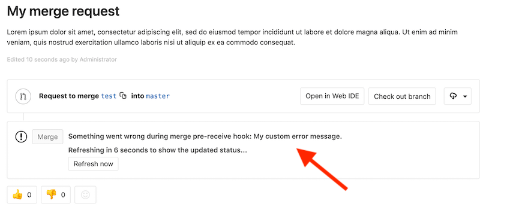

# Server hooks **(CORE ONLY)**

> **Notes:**
>
> - Server hooks were [introduced](https://gitlab.com/gitlab-org/gitlab/-/issues/196051) in GitLab 12.8 replacing Custom Hooks.
> - Server hooks must be configured on the filesystem of the GitLab server. Only GitLab server administrators will be able to complete these tasks. Please explore [webhooks](../user/project/integrations/webhooks.md) and [GitLab CI/CD](../ci/README.md) as an option if you do not have filesystem access. For a user-configurable Git hook interface, see [Push Rules](../push_rules/push_rules.md), available in GitLab Starter **(STARTER)**.
> - Server hooks won't be replicated to secondary nodes if you use [GitLab Geo](geo/replication/index.md).

Git natively supports hooks that are executed on different actions. These hooks run
on the server and can be used to enforce specific commit policies or perform other
tasks based on the state of the repository.

Examples of server-side Git hooks include `pre-receive`, `post-receive`, and `update`.
See [Git SCM Server-Side Hooks](https://git-scm.com/book/en/v2/Customizing-Git-Git-Hooks#Server-Side-Hooks)
for more information about each hook type.

## Create a server hook for a repository

Server-side Git hooks are typically placed in the repository's `hooks`
subdirectory. In GitLab, hook directories are symlinked to the GitLab Shell
`hooks` directory for ease of maintenance between GitLab Shell upgrades.
Server hooks are implemented differently, but the behavior is exactly the same
once the hook is created.

NOTE: **Note:**
If you are not using [hashed storage](repository_storage_types.md#hashed-storage), the project's
repository directory might not exactly match the instructions below. In that case,
for an installation from source the path is usually `/home/git/repositories/<group>/<project>.git`.
For Omnibus installs the path is usually `/var/opt/gitlab/git-data/repositories/<group>/<project>.git`.

Follow the steps below to set up a server hook for a
repository:

1. Find that project's path on the GitLab server, by navigating to the
   **Admin area > Projects**. From there, select the project for which you
   would like to add a hook. You can find the path to the project's repository
   under **Gitaly relative path** on that page.
1. Create a new directory in this location called `custom_hooks`.
1. Inside the new `custom_hooks` directory, create a file with a name matching
   the hook type. For a pre-receive hook the file name should be `pre-receive`
   with no extension.
1. Make the hook file executable and make sure it's owned by Git.
1. Write the code to make the server hook function as expected. Hooks can be
   in any language. Ensure the 'shebang' at the top properly reflects the language
   type. For example, if the script is in Ruby the shebang will probably be
   `#!/usr/bin/env ruby`.

Assuming the hook code is properly implemented the hook will run as appropriate.

## Set a global server hook for all repositories

To create a Git hook that applies to all of your repositories in
your instance, set a global server hook. Since GitLab will look inside the GitLab Shell
`hooks` directory for global hooks, adding any hook there will apply it to all repositories.
Follow the steps below to properly set up a server hook for all repositories:

1. On the GitLab server, navigate to the configured custom hook directory. The
   default is in the GitLab Shell directory. The GitLab Shell `hook` directory
   for an installation from source the path is usually
   `/home/git/gitlab-shell/hooks`. For Omnibus installs the path is usually
    `/opt/gitlab/embedded/service/gitlab-shell/hooks`.
   To look in a different directory for the global custom hooks,
   set `custom_hooks_dir` in the GitLab Shell config. For
   Omnibus installations, this can be set in `gitlab.rb`; and in source
   installations, this can be set in `gitlab-shell/config.yml`.
1. Create a new directory in this location. Depending on your hook, it will be
   either a `pre-receive.d`, `post-receive.d`, or `update.d` directory.
1. Inside this new directory, add your hook. Hooks can be
   in any language. Ensure the 'shebang' at the top properly reflects the language
   type. For example, if the script is in Ruby the shebang will probably be
   `#!/usr/bin/env ruby`.
1. Make the hook file executable and make sure it's owned by Git.

Now test the hook to check whether it is functioning properly.

## Chained hooks support

> [Introduced](https://gitlab.com/gitlab-org/gitlab-shell/-/merge_requests/93) in GitLab Shell 4.1.0 and GitLab 8.15.

Hooks can be also global or be set per project directories and support a chained
execution of the hooks.

NOTE: **Note:**
`<hook_name>.d` would need to be either `pre-receive.d`,
`post-receive.d`, or `update.d` to work properly. Any other names will be ignored.

NOTE: **Note:**
Files in `.d` directories need to be executable and not match the backup file
pattern (`*~`).

The hooks are searched and executed in this order:

1. Built-in GitLab server hooks (not user-customizable).
1. `<project>.git/custom_hooks/<hook_name>` - per-project hook (this was kept as the already existing behavior).
1. `<project>.git/custom_hooks/<hook_name>.d/*` - per-project hooks.
1. `<custom_hooks_dir>/<hook_name>.d/*` - global hooks: all executable files (except editor backup files).

The hooks of the same type are executed in order and execution stops on the
first script exiting with a non-zero value.

For `<project>.git` you'll need to
[translate your project name into the hashed storage format](repository_storage_types.md#translating-hashed-storage-paths)
that GitLab uses.

## Custom error messages

> [Introduced](https://gitlab.com/gitlab-org/gitlab-foss/-/merge_requests/5073) in GitLab 8.10.

To have custom error messages appear in GitLab's UI when the commit is
declined or an error occurs during the Git hook, your script should:

- Send the custom error messages to either the script's `stdout` or `stderr`.
- Prefix each message with `GL-HOOK-ERR:` with no characters appearing before the prefix.

### Example custom error message

This hook script written in bash will generate the following message in GitLab's UI:

```shell
#!/bin/sh
echo "GL-HOOK-ERR: My custom error message.";
exit 1
```


