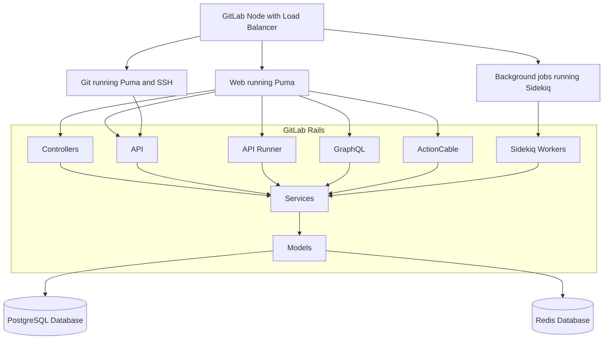
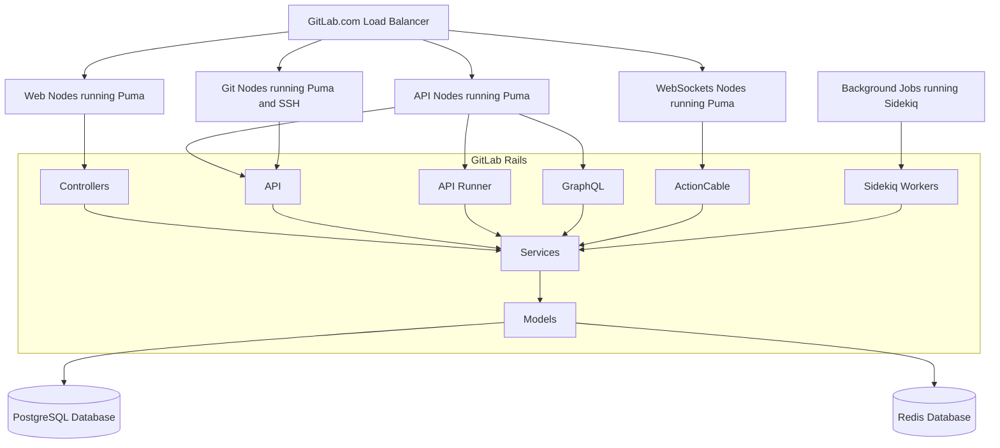

# Composable GitLab codebase

The one of the major risks of a single codebase is an infinite growth of the whole
application. The more code being added results in a ever increasing resource requirements
for running the application, but increased application coupling and explosion of the complexity.

## Executive summary

This blueprint discusses an impact of introducing **Application Layers** as a way to reduce and improve application
codebase. This discusses the positive and negative outcomes of the proposed solution and tries to estimate the impact
on GitLab.com and smaller installations.

**Application Layers** tries to split GitLab Rails codebase horizontally following the pattern how we actually
run GitLab instead of vertical split. This follows the idea that a single feature needs to run in a many ways
(CI for example has Web interface, uses API, and performs background processing), and we are not able to easily
run only a given feature separate to the rest application (like CI) due to coupling.

The proposal itself does allow us to disconnect some aspects of the features. These aspects could be treated
as components that are run separately to the rest of the stack, but still sharing a large portion of core.
This model could be implemented to provide an API interface for external tooling (Runners API, Packages API, Feature Flags Unleash API)
and allow us to have much better resillency and much easier way to scale application in the future.

## Challenges

This proves hard for various reasons:

- Deep coupling makes application harder to develop in longer term, as it leads to a sphagetti implementation
  instead of considering building more interface-based architecture
- Deep coupling between parts of the codebase making it harder to test. To test only a small portion of application
  we usually need to run a whole test suite as we cannot high confidence know which parts are affected. This to
  some extent can be improved by trying to build hearistic to aid this process, but it is prone to errors and hard
  to keep accurate at all times
- All components needs to be loaded at all times in order to run only parts of the application
- Increased resource usage, as we load parts of the application that are rarely used in a given context
- The high memory usage results in slowing the whole application as it increases GC cycles duration
  creating significantly longer latency for processing requests or worse cache usage of CPUs
- Increased application boot-up times as we need to load and parse significantly more files
- Longer boot-up times slows down the development, as running application or tests takes singificantly longer
  reducing velocity and amount of iterations

## Composable codebase dimensions

We in general can think about two ways how codebase can be modeled:

- **vertically** in Bounded Contexts, each representing a domain of the application, ex.: All features related to CI are in a given context
- **horizontally** in Application Layers: Sidekiq, GraphQL, REST API, Web Controllers, all Domain Models and Services that interface with DB directly

This blueprint explicitly talks about **horizontal** split and **Application Layers**.

## Current state of Bounded Contexts (**vertical** split)

The Bounded Contexts is a topic that was discussed extensively number of times for a couple of years.
Reflected in number of issues:

- [Create new models / classes within a module / namespace](https://gitlab.com/gitlab-org/gitlab/-/issues/212156)
- [Make teams to be maintainers of their code](https://gitlab.com/gitlab-org/gitlab/-/issues/25872)
- [Use nested structure to organize CI classes](https://gitlab.com/gitlab-org/gitlab/-/issues/209745)
- [WIP: Make it simple to build and use "Decoupled Services"](https://gitlab.com/gitlab-org/gitlab/-/issues/31121)

We are partially executing a **Bounded Contexts** idea:

- Make each team to own their own namespace, namespace which is defined as a `module` in a codebase
- Make each team to own their own tests, as namespaces would define a clear boundaries
- Since we use namespaces, individual contributor or reviewer can know who to reach from domain exports about help with
  the given context

The module namespaces are actively being used today to model codebase around team boundaries. Currently, the most
prominent namespaces being used today are `Ci::` and `Packages::`. They provide a good way to contain the code owned
by a group in a well-defined structure.

However, the **Bounded Contexts** while it helps development, it does not help with the above stated goals. This is purely
a logical split of the code. This does not prevent deep-coupling. It is still possible to create a circular dependency (and it often happens)
between a `Sidekiq Worker` and `API interface` (API can call Sidekiq Worker, Sidekiq can use API to create an endpoint path).

The **Bounded Contexts** do not make our codebase smarter to know what depends on what, as the whole codebase
is treated as single package that needs to be loaded and executed.

## The Application Layers (**horizontal* split)

While we continue leveraging **Bounded Contexts** in form of namespace separation that aids development and review process
the **Application Layers** can provide a way to create a clean separation between different functional parts.

Our main codebase (`GitLab Rails` after a GitLab running on Ruby on Rails) consists many implicit **Application Layers**.
This distinction today is implicit. There are no clear boundaries between them which results in a deep coupling.

The concept of **Application Layers** looks more at application from perspective how we run the application
instead of perspective of individual features (like CI or Packages). GitLab application today can be decomposed into the following
application layers. This list is not exhaustive, but shows a general different parts of a single monolithic codebase:

- Web Controllers: we use that to process Web requests coming from users visiting web interface
- Web API: we use that to process API calls coming from the automated tooling, in some cases also users visiting web interface
- Web Runners API: we use that to process API calls from the Runners, that allows Runner to fetch new jobs, or update trace log
- Web GraphQL: we use that to provide a flexible API interface, allowing the Web frontend to fetch data only needed that allows to reduce amount of compute and data transfer
- Web ActionCable: we use that to provide bi-directional connection to enable real-time features for Users visiting web interface
- Web Feature Flags Unleash Backend: we use that to provide a Unleash-compatible Server that uses GitLab API
- Web Packages API: all code that provides REST API compatible with the packaging tools: Debian, Maven, Container Registry Proxy, etc.
- Git nodes: all code required to authorize `git pull/push` over `SSH` or `HTTPS`
- Sidekiq: all code requires to run background jobs
- Services/Models/DB: all code required to maintain our database structure, data validation, business logic and policies models

### Application Layers for on-premise installations

The on-premise installations are significantly smaller and they usually run GitLab Rails in two main flavors:

### Application Layers on GitLab.com

GitLab.com due to its scale requires much more attention to run. This is needed in order to better manage resources
and provide SLAs for different functional parts. This is a simplistic view of GitLab.com application layers.
It does not include all components, like Object Storage nor Gitaly nodes, but shows the GitLab Rails dependencies between
different components and how they are configured on GitLab.com today:

### Layer dependencies

The way how we run GitLab for the on-premise and GitLab.com does show a main division line in GitLab Rails:

- Web: containing all API, all Controllers, all GraphQL and ActionCable functionality
- Sidekiq: containing all background processing jobs
- Core: containig all database, models and services that needs to be shared between Web and Sidekiq

Each of these top-level application layers do depend only on a fraction of the codebase with all relevant dependencies:

- In all cases we need underlaying database structure and application models
- In some cases we need dependent services
- We only need a part of the application common library
- We need gems to support the requested functionality
- Layer should not use another sibling layer, rather connect via API, Redis or DB to share data

## Proposal

The Memory team group conducted a Proof-of-Concept phase to understand the impact of introducing **Application Layers**.
We did this to understand the complexity, impact, and needed iterations to execute this proposal.

### PoC using Rails Engines

We decided to use Rails Engines by modeling a Web Application Layer. The Web Engine did contain Controllers, API, GraphQL.
This allowed us to run Web Nodes with all dependencies, but measure the impact on Sidekiq not having these components loaded.

All work can be found in these merge requests:

- [Provide mechanism to load GraphQL with all dependencies only when needed](https://gitlab.com/gitlab-org/gitlab/-/issues/288044)
- [Draft: PoC - Move Graphql to the WebEngine](https://gitlab.com/gitlab-org/gitlab/-/merge_requests/50180)
- [Draft: PoC - Move Controllers and Grape API:API to the WebEngine](https://gitlab.com/gitlab-org/gitlab/-/merge_requests/53720)
- [Draft: PoC - Move only Grape API:API to the WebEngine](https://gitlab.com/gitlab-org/gitlab/-/merge_requests/53982)

What was done?

- We used Rails Engines
- The 99% of changes as visible in the above MRs is moving files as-is
- We moved all GraphQL code and specs into `engines/web_engine/` as-is
- We moved all API and Controllers code into `engines/web_engine`
- We adapted CI to test `engines/web_engine/` as a self-sufficient component of stack
- We configured GitLab to load `gem web_engine` running Web nodes (Puma web server)
- We disabled loading `web_engine` when running Background processing nodes (Sidekiq)

### Results

The effect on introducing these changes:

- Savings for RSS
- 61.06 MB  (7.76%) - Sidekiq without GraphQL
- 100.11 MB (12.73%) - Sidekiq without GraphQL and API
- 208.83 MB (26.56%) - Sidekiq without GraphQL, API, Controllers
- The size of Web nodes (running Puma) stayed the same as before

TBD: measure more

- RSS/USS in Puma Single, a single Sidekiq cluster
- GC stat: amount of allocated objects, and poll sizes after doing a bunch of GC cycles
- Boot-up time for each process
- A number of loaded code files
- A duration of a single full GC cycle

Now, once we have this data:

- Compare with GitLab.com and document memory savings across fleet
- Compare application load time and impact on deployment of GitLab
- Compare GC cycles and impact on responsiveness of the application in processing many concurrent requests

### Impact on GitLab.com

Estimating the results for the scale of running GitLab.com, today we use:

- Currently individual GC cycle takes around [130ms for Web](https://thanos-query.ops.gitlab.net/graph?g0.range_input=1h&g0.max_source_resolution=0s&g0.expr=avg(rate(ruby_gc_duration_seconds_sum%7Bstage%3D%22main%22%2Ctype%3D%22web%22%7D%5B5m%5D)%2Frate(ruby_gc_duration_seconds_count%5B5m%5D))&g0.tab=0)
  and [200ms for Sidekiq](https://thanos-query.ops.gitlab.net/graph?g0.range_input=1h&g0.max_source_resolution=0s&g0.expr=avg(rate(ruby_gc_duration_seconds_sum%7Bstage%3D%22main%22%2Ctype%3D%22sidekiq%22%7D%5B5m%5D)%2Frate(ruby_gc_duration_seconds_count%5B5m%5D))&g0.tab=0) on GitLab.com
- On average we do around [2 GC cycles per-second](https://thanos-query.ops.gitlab.net/graph?g0.range_input=1h&g0.end_input=2021-02-17%2017%3A56&g0.max_source_resolution=0s&g0.expr=avg(rate(ruby_gc_duration_seconds_count%7Bstage%3D%22main%22%2Ctype%3D%22web%22%7D%5B5m%5D))&g0.tab=0)
  or [0.12 cycles per second for Sidekiq](https://thanos-query.ops.gitlab.net/graph?g0.range_input=1h&g0.end_input=2021-02-17%2017%3A56&g0.max_source_resolution=0s&g0.expr=avg(rate(ruby_gc_duration_seconds_count%7Bstage%3D%22main%22%2Ctype%3D%22sidekiq%22%7D%5B5m%5D))&g0.tab=0)
- This translates to using [around 9.5 vCPUs per-second for Web](https://thanos-query.ops.gitlab.net/graph?g0.range_input=1h&g0.max_source_resolution=0s&g0.expr=sum(rate(ruby_gc_duration_seconds_sum%7Bstage%3D%22main%22%2Ctype%3D%22web%22%7D%5B5m%5D))&g0.tab=0)
  and [around 8 vCPUs per-second for Sidekiq](https://thanos-query.ops.gitlab.net/graph?g0.range_input=1h&g0.max_source_resolution=0s&g0.expr=sum(rate(ruby_gc_duration_seconds_sum%7Bstage%3D%22main%22%2Ctype%3D%22sidekiq%22%7D%5B5m%5D))&g0.tab=0) of spend on GC alone
- Sidekiq [uses 2.1GB on average](https://thanos-query.ops.gitlab.net/graph?g0.range_input=1h&g0.max_source_resolution=0s&g0.expr=max(ruby_process_unique_memory_bytes%7Btype%3D%22sidekiq%22%7D)%2F1024%2F1024%2F1024&g0.tab=1)
  or [550GB in total](https://thanos-query.ops.gitlab.net/graph?g0.range_input=1h&g0.max_source_resolution=0s&g0.expr=sum(ruby_process_unique_memory_bytes%7Btype%3D%22sidekiq%22%7D)%2F1024%2F1024%2F1024&g0.tab=0) of memory on GitLab.com

We estimate the possible maximum savings for introducing `web_engine`:

- Reduce a GC cycle time by 40%, from to 200ms to 120ms
- The amount of GC cycles per-second would stay the same, but due to GC cycle time reduction we would use around 5 vCPUs instead of 8 vCPUs
- In the best case we would be looking at Sidekiq alone we would be estimating to save up-to 137GB of memory on GitLab.com

This model could be extended to introduce `sidekiq_engine` giving a similar benefits (even more important due to visible impact on users)
for Web nodes.

### Outcome

We achieved a number of benefits introducing these changes.

Pros:

- Significantly lower memory usage
- Significantly shorter application load time for Sidekiq
- Significantly improved responsivness of Sidekiq service due to much shorter GC cycles
- Significantly easier testing of a portion of application, ex. changing `web_engines/` does require
  re-running test only for this application layer
- We retained a monolithic architecture of the codebase, but sharing database and application models
- A significant saving from the infrastracture side
- Ability to comfortably run on constrainted environments by reducing application footprint

Cons:

- It is harder to implement GraphQL subscriptions as in case of Sidekiq as we need another way to pass subscriptions

### Example: GraphQL

TBD

Today, loading GraphQL requires a bunch of [dependencies](https://gitlab.com/gitlab-org/gitlab/-/issues/288044):

> We also discovered that we load/require 14480 files, [gitlab-org/memory-team/memory-team-2gb-week#9](https://gitlab.com/gitlab-org/memory-team/memory-team-2gb-week/-/issues/9#note_452530513)
> when we start GitLab. 1274 files belong to Graphql. This means that if we don't load 1274 application files
> and all related Graphql gems when we don't need them (Sidekiq), we could save a lot of memory.

GraphQL only needs to run in a specific context. If we could limit when it is being loaded we could effectively improve application efficiency, by reducing application load time and required memory. This, for example, is applicable for every size installation.

Potential challenge with GraphQL and Websockets is that at some point we might want to use Action Cable subscriptions and push GraphQL/API payload from Sidekiq to clients. This would likely using Redis to pass data through, where Sidekiq would publish information on Redis, and ActionCable Node would passthrough that to connected clients. This way of working is possible in the above model, but we would have to use GraphQL or API (over HTTP endpoint) to calculate what should be sent.

Alternative way is to use a notification system that would make always `ActionCable` node (the one handling WebSockets) to generate a payload based on a send query instead of performing passthrough. This could be applicable since `ActionCable` is the one handling a given connection for a client. This could have a downside of having to recalculate the same payload if many clients would be wathching the same resource. However, this behavior of system might still be desired for security puroses, as generated payload might be dependent on permission of watching client (we would show different for anonymous, and different for the member of the project).

### Example: API

TBD

### Example: Controllers

TBD

## Future impact

**Application Layers** and this proposal currently defines only `web_engine`. Following the same pattern we could easily introduce
additional engines dedicated for supporting that would allow us to maintain much better separation, lower memory usage
and much better maintanability of GitLab Rails into the future.

This would be a framework for introducing all new interfaces for features that do not need to be part of the core codebase,
like support for additional Package services. Allowing us to better scale application in the future, but retaining a single codebase
and monolithic architecture of GitLab.

As of today, it seems reasonable to define three **application layers**:

- `gitlab-core`: a core functionality: DB structure, models, services, common library
- `gitlab-web`: a Controllers/API/GraphQL/ActionCable functionality needed to run in a web server context (depends on `gitlab-core`)
- `gitlab-sidekiq`: a background jobs functionality needed to run Sidekiq Workers (depends on `gitlab-core`)

## Issues and Merge Requests

- [Split application into functional parts to ensure that only needed code is loaded with all dependencies](https://gitlab.com/gitlab-org/gitlab/-/issues/290935)
- [Provide mechanism to load GraphQL with all dependencies only when needed](https://gitlab.com/gitlab-org/gitlab/-/issues/288044)
- [Draft: PoC - Move Graphql to the WebEngine](https://gitlab.com/gitlab-org/gitlab/-/merge_requests/50180)
- [Draft: PoC - Move Controllers and Grape API:API to the WebEngine](https://gitlab.com/gitlab-org/gitlab/-/merge_requests/53720)
- [Draft: PoC - Move only Grape API:API to the WebEngine](https://gitlab.com/gitlab-org/gitlab/-/merge_requests/53982)
- [Create new models / classes within a module / namespace](https://gitlab.com/gitlab-org/gitlab/-/issues/212156)
- [Make teams to be maintainers of their code](https://gitlab.com/gitlab-org/gitlab/-/issues/25872)
- [Use nested structure to organize CI classes](https://gitlab.com/gitlab-org/gitlab/-/issues/209745)
- [WIP: Make it simple to build and use "Decoupled Services"](https://gitlab.com/gitlab-org/gitlab/-/issues/31121)

## Who

Proposal:

<!-- vale gitlab.Spelling = NO -->

| Role                         | Who
|------------------------------|-------------------------|
| Author                       |    Kamil Trzciński      |
| Architecture Evolution Coach |    ?                    |
| Engineering Leader           |    ?                    |

DRIs:

| Role                         | Who
|------------------------------|------------------------|
| Product                      |    ?                   |
| Leadership                   |    Craig Gomes         |
| Engineering                  |    ?                   |

Domain Experts:

| Role                         | Who
|------------------------------|------------------------|
| Domain Expert                |    ?                   |
| Domain Expert                |    ?                   |
| Domain Expert                |    ?                   |

<!-- vale gitlab.Spelling = YES -->
