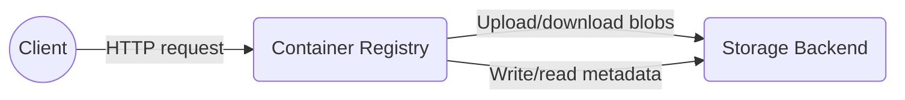
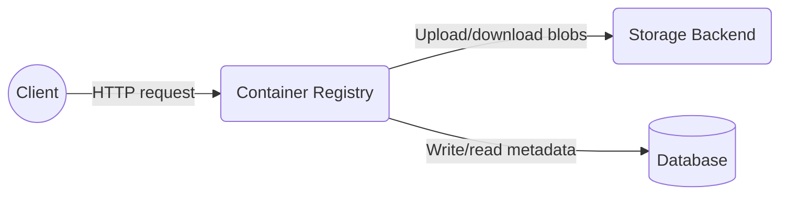

# Container Registry New Architecture

## Usage of the GitLab Container Registry

With the [Container Registry](https://gitlab.com/gitlab-org/container-registry) integrated into GitLab, every GitLab project can have its own space to store its Docker images. You can use the registry to build, push and share images using the Docker client, CI/CD or the GitLab API.

Each day on GitLab.com, between [150k and 200k images are pushed to the registry](https://app.periscopedata.com/app/gitlab/527857/Package-GitLab.com-Stage-Activity-Dashboard?widget=9620193&udv=0), generating about [700k API events](https://app.periscopedata.com/app/gitlab/527857/Package-GitLab.com-Stage-Activity-Dashboard?widget=7601761&udv=0). It’s also worth noting that although some customers use other registry vendors, [more than 96% of instances](https://app.periscopedata.com/app/gitlab/527857/Package-GitLab.com-Stage-Activity-Dashboard?widget=9832282&udv=0) are using the GitLab Container Registry. 

For GitLab.com and for GitLab's customers, the Container Registry is a critical component to building and deploying software. 

## Current Architecture

The Container Registry is a single [Go](https://golang.org/) application. Its only dependency is the storage backend on which images and metadata are stored.

Client applications (e.g. GitLab Rails and Docker CLI) interact with the Container Registry through its [HTTP API](https://gitlab.com/gitlab-org/container-registry/-/blob/master/docs/spec/api.md). The most common operations are pushing and pulling images to/from the registry, which require a series of HTTP requests in a specific order. The request flow for these operations is detailed [here](https://gitlab.com/gitlab-org/container-registry/-/blob/master/docs-gitlab/push-pull-request-flow.md).

The registry supports multiple [storage backends](https://gitlab.com/gitlab-org/container-registry/-/blob/master/docs/configuration.md#storage), including Google Cloud Storage (GCS) which is used for the GitLab.com registry. In the storage backend, images are stored as blobs, deduplicated, and shared across repositories. These are then linked (like a symlink) to each repository that relies on them, giving them access to the central storage location.

The name and hierarchy of repositories, as well as image manifests and tags are also stored in the storage backend, represented by a nested structure of folders and files. [This video](https://www.youtube.com/watch?v=i5mbF2bgWoM&feature=youtu.be) gives a practical overview of the registry storage structure.

### Challenges

#### Garbage Collection

The container registry relies on an offline *mark* and *sweep* garbage collection (GC) algorithm. To run it, the registry needs to be either shutdown or set to read-only, remaining like that during the whole GC run.

During the *mark* phase, the registry analyzes all repositories, creating a list of configurations, layers, and manifests that are referenced/linked in each one of them. The registry will then list all existing configurations, layers, and manifests (stored centrally) and obtain a list of those that are not referenced/linked in any repository. This is the list of blobs eligible for deletion.

With the output from the *mark* phase in hand, the registry starts the *sweep* phase, where it will loop over all blobs identified as eligible for deletion and delete them from the storage backend, one by one.

Doing this for a huge registry may require multiple hours/days to complete, during which the registry must remain in read-only mode. This is not feasible for platforms with tight availability requirements, such as GitLab.com.

#### Performance

Due to the current architecture and its reliance on the (possibly remote) storage backend to store repository and image metadata, even the most basic operations, such as listing repositories or tags, can become prohibitively slow, and it only gets worse as the registry grows in size.

For example, to be able to tell which repositories exist, the registry has to walk through all folders in the storage backend and identify repositories in them. Only when all folders that exist have been visited, the registry can then reply to the client with the list of repositories. If using a remote storage backend (such as GCS or S3), performance becomes even worse, as for each visited folder multiple HTTP requests are required to list and inspect their contents.

#### Insights

For similar reasons as highlighted above, currently, it's not feasible to extract valuable information from the registry, such as how much space a repository is using, which repositories are using the most space, which ones are more active, detailed push/pull metrics for each image or tag, and others. Not having access to these insights and metrics strongly weakens the ability to make informed decisions in regards to the product strategy.

#### Additional Features

Due to the metadata limitations, it's currently not feasible to implement valuable features such as [pagination](https://gitlab.com/gitlab-org/container-registry/-/issues/13#note_271769891), filtering and sorting for HTTP API, and more advanced features such as the ability to [distinguish between Docker and Helm charts images](https://gitlab.com/gitlab-org/gitlab/issues/38047).

Because of all these constraints, we decided to [freeze the development of new features](https://gitlab.com/gitlab-org/container-registry/-/issues/44) until we have a solution in place to overcome all these foundational limitations.

## New Architecture

To overcome all challenges described above, we started an effort to migrate the registry metadata (the list of blobs, repositories, and which manifest/layers are referenced/linked in each one of them) from the storage backend into a [PostgreSQL database](#database).

The ultimate goal of the new architecture is to enable online garbage collection ([&2313](https://gitlab.com/groups/gitlab-org/-/epics/2313)), but once the database is in place, we will also be able to implement all features that have been blocked by the metadata limitations. The performance of the existing API should drastically increase as well.

The introduction of a database will affect the registry architecture, as we will have one more component involved:

With a database in place, the registry will no longer use the storage backend to write and read metadata. Instead, metadata will be stored and manipulated on the PostgreSQL database. The storage backend will then be used only for uploading and downloading blobs.

### Database

For GitLab.com, the registry database will be on a separate dedicated cluster. For self-managed instances, the registry database should reside in the same instance as the GitLab database. Please see [#93](https://gitlab.com/gitlab-org/container-registry/-/issues/93) and [GitLab-com/gl-infra/infrastructure#10109](https://gitlab.com/gitlab-com/gl-infra/infrastructure/-/issues/10109) for additional context.

Following the GitLab [Go standards and style guidelines](https://docs.gitlab.com/ee/development/go_guide), no ORM is used to manage the database, only the [`database/sql`](https://golang.org/pkg/database/sql/) package from the Go standard library, a PostgreSQL driver ([`lib/pq`](https://pkg.go.dev/github.com/lib/pq?tab=doc)) and raw SQL queries, over a TCP connection pool.

The design and development of the registry database adhere to the GitLab [database guidelines](https://docs.gitlab.com/ee/development/database/). Being a Go application, the required tooling to support the database will have to be developed, such as for running database migrations.

Support for running *online* migrations is already supported by the registry CLI, as described in the [documentation](/container-registry/-/blob/master/docs-gitlab/database-migrations.md). Apart from online migrations, [*post deployment* migrations](/development/post_deployment_migrations.html) are also a requirement to be implemented as outlined in [container-registry#220](https://gitlab.com/gitlab-org/container-registry/-/issues/220).

The registry database will be partitioned from start to achieve greater performance (by limiting the amount of data to act upon and enable parallel execution), easier maintenance (by splitting tables and indexes into smaller units), and high availability (with partition independence). By partitioning the database from start we can also facilitate a sharding implementation later on if necessary.

#### PostgreSQL 12

PostgreSQL introduced major improvements for partitioning in [version 12](https://www.postgresql.org/docs/12/release-12.html#id-1.11.6.9.5)), among which we highlight:

- Major performance improvements for inserts, selects, and updates with less locking and consistent performance for a large number of partitions ([benchmarks](https://www.2ndquadrant.com/en/blog/postgresql-12-partitioning));
- Major improvements to the planning algorithm for tables with a large number of partitions, with some tests finding speedups of up to 10,000 times ([source](https://aws.amazon.com/blogs/database/postgresql-12-a-deep-dive-into-some-new-functionality/));
- Attaching new partitions to an existing table no longer requires locking the entire table;
- Bulk load (`COPY`) now uses bulk inserts instead of inserting one row at a time;
- Last but not least, it's now possible for foreign keys to reference partitioned tables, which is a must-have to guarantee consistency and integrity.

To be able to leverage these performance improvements and features (especially the foreign key constraints) we want to use PostgreSQL 12 from start.

For self-managed instances, GitLab currently ships with PostgreSQL 11, but GitLab 14.0 and PostgreSQL 12 will most likely land before we ship the metadata database support for self-managed instances.

Given that the metadata database will unblock the implementation of the most requested features for the GitLab Container Registry integration, most of these features may only be available for those using a GitLab version which ships with PostgreSQL 12. We will continue to support the current version 2 of the registry (with no database) with security backports and bug fixes.

## Iterations

1. ✓ Design metadata database schema;
1. ✓ Add support for managing metadata using the database;
1. Design plans and tools to facilitate the migration of small, medium and large repositories (in progress);
1. Implement online garbage collection (in progress);
1. Create database clusters in staging and production for GitLab.com;
1. Create automated deployment pipeline for GitLab.com;
1. Deployment and gradual migration of the existing registry for GitLab.com;
1. Rollout support for the metadata database to self-managed installs.

A more detailed list of all tasks, as well as periodic progress updates can be found in the epic [&2313](https://gitlab.com/groups/gitlab-org/-/epics/2313).

## Relevant Links

- [Allow admin to run garbage collection with zero downtime](https://gitlab.com/groups/gitlab-org/-/epics/2313)
- [Proposal for continuous, on-demand online garbage collection](https://gitlab.com/gitlab-org/container-registry/-/issues/199)
- [Gradual migration proposal for the GitLab.com container registry](https://gitlab.com/gitlab-org/container-registry/-/issues/191)
- [Create a self-serve registry deployment](https://gitlab.com/groups/gitlab-com/gl-infra/-/epics/316)
- [Database cluster for container registry](https://gitlab.com/gitlab-com/gl-infra/infrastructure/-/issues/11154)

## Who

Proposal:

| Role                         | Who
|------------------------------|-------------------------|
| Author                       |                         |
| Architecture Evolution Coach |                         |
| Engineering Leader           |                         |
| Domain Expert                |                         |

DRIs:

| Role                         | Who
|------------------------------|------------------------|
| Product                      |                        |
| Leadership                   |                        |
| Engineering                  |                        |
