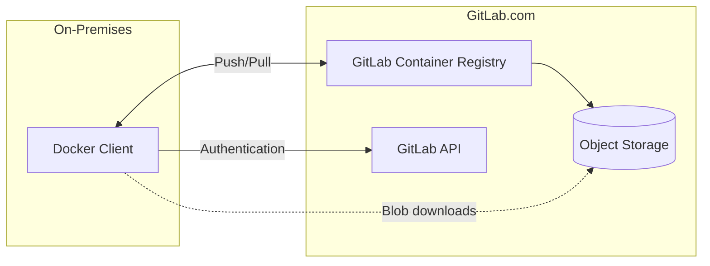

# Self-Hosted Proxy and Preheated Cache for the GitLab.com Container Registry

**TODO:** Add consise description.

## GitLab Container Registry

### Usage

With the [Container Registry](https://gitlab.com/gitlab-org/container-registry) integrated into GitLab, every GitLab project can have its own space to store its Docker images. You can use the registry to build, push, and share images using the Docker client, CI/CD, or the GitLab API.

Each day on GitLab.com, around [150K and 15M](https://thanos-query.ops.gitlab.net/new/graph?g0.expr=sort_desc(%0A%20%20sum%20by(handler%2C%20method)(%0A%20%20%20%20rate(%0A%20%20%20%20%20%20registry_http_requests_total%7B%0A%20%20%20%20%20%20%20%20cluster%3D~%22gprd-.*%22%2C%0A%20%20%20%20%20%20%20%20handler%3D~%22manifest%22%2C%0A%20%20%20%20%20%20%20%20method%3D~%22get%7Cput%22%2C%0A%20%20%20%20%20%20%20%20code%3D~%22200%7C201%22%2C%0A%20%20%20%20%20%20%7D%5B7d%5D%0A%20%20%20%20)))*60*60*24%0A&g0.tab=1&g0.stacked=0&g0.range_input=1h&g0.max_source_resolution=0s&g0.deduplicate=1&g0.partial_response=0&g0.store_matches=%5B%5D) images are uploaded and downloaded from the registry, respectively. It is also worth noting that although some self-managed customers use other registry vendors, [99%](https://app.periscopedata.com/app/gitlab/527857/Package-GitLab.com-Stage-Activity-Dashboard?widget=9832282&udv=0) are using the GitLab Container Registry.

### Architecture

Currently, GitLab.com customers pushing and pulling images from the registry through Docker's or other custom clients (referred to as *client* from now on) have to communicate with three services: the registry, the GitLab API, and object storage.

At login or when initiating a push or pull command, the registry will instruct the client to obtain a JWT token from the authentication service - the GitLab API.

Additionally, after validating the request for blob downloads, the registry redirects clients to object storage using pre-signed URLs so that they can download them directly from there, without passing the data through the GitLab.com infrastructure.

### Challenges

#### Availability

For GitLab.com customers, the Container Registry is a critical component to building and deploying software. Therefore, the registry availability is of the utmost importance.

The current SLA is 99.95%. For context, the table below lists the SLA of other managed container registry services:

| Vendor    | Product                          | SLA                                                          |
| --------- | -------------------------------- | ------------------------------------------------------------ |
| Amazon    | Elastic Container Registry (ECR) | [99.9%](https://aws.amazon.com/ecr/sla/)                     |
| Google    | Container Registry (GCR)         | [None](https://cloud.google.com/container-registry/sla)      |
| Microsoft | Azure Container Registry (ACR)   | [99.9%](https://azure.microsoft.com/en-us/support/legal/sla/container-registry/) |
| GitHub    | GitHub Container Registry        | [99.9%](https://docs.github.com/en/free-pro-team@latest/github/site-policy/github-enterprise-service-level-agreement#uptime-guarantee) |
| Docker    | DockerHub                        | [None](https://www.docker.com/legal/master-services-agreement) |
| JFrog     | Container Registry Cloud         | [Unknown](https://jfrog.com/container-registry-eula/)        |
| Red Hat   | Quay.io                          | Unknown. For reference, OpenShift Dedicated is [99.95%](https://www.openshift.com/products/dedicated/). |

Although the GitLab Container Registry compares favorably against the competition, it became a critical runtime dependency for major enterprise customers. Even the smallest downtime or performance degradation periods can have a significant negative impact on the ability to rapidly and efficiently scale their platforms on-demand.

Apart from GitLab's services, the registry is also dependent on the availability of object storage. For GitLab.com, this is provided by Google Cloud Storage (GCS), which has an SLA of [99.95%](https://cloud.google.com/storage/sla).

Overall, the registry availability is ultimately dependent on the availability of its dependencies, namely the GitLab API and object storage. Therefore, an outage or performance degradation in any of these has a direct impact on the registry. We are currently working on identifying ways to [improve the GitLab API availability](https://gitlab.com/gitlab-org/gitlab/-/issues/277419) and have planned to investigate a [multi-cloud replication](https://gitlab.com/gitlab-org/gitlab/-/issues/276396) solution.

Although we expect these efforts to increase the registry availability, a target of 100% availability for the GitLab.com registry is likely unachievable. 

Additionally, we are currently working towards a significant architecture change to enable online garbage collection by leveraging a [metadata database](https://gitlab.com/gitlab-org/gitlab/-/merge_requests/43754). By doing so, we will add one more variable to the registry availability formula. We are aware of this and working to ensure that availability will not be affected.

Apart from GitLab.com outages and performance degradations, customers may also be affected by network constraints between them and GitLab.com or its service providers' infrastructure.

For these reasons, we should offer customers with extremely high availability requirements the possibility to shield themselves from any possible outages or performance degradations that may affect the GitLab.com registry, no matter how rarely they occur and how quickly we mitigate them.

#### Security and Compliance

Some customers might have to comply with strict security requirements, which may require them to operate systems that are either isolated from the outside world or require them to rely on a local copy of all or part of their images in a specific geographical location.

**TODO:** Collect additional feedback from customers on this area.

#### Performance and Efficiency

For some customers, the time required to pull images from a remote registry, sometimes hosted in a distant geographical location, can affect how quickly and efficiently they can react and scale their platforms on-demand.

Apart from speed, the need to repeatedly download the same images can be inefficient and account for unnecessary resources and bandwidth costs. Such is especially relevant in the container registry context when images are treated as immutable artifacts.

**TODO:** Collect additional feedback from customers on this area.

### Solution

The most effective way of mitigating the previously described challenges is to use a self-hosted mirror/proxy of the GitLab.com registry.

## Architecture

**TODO**

