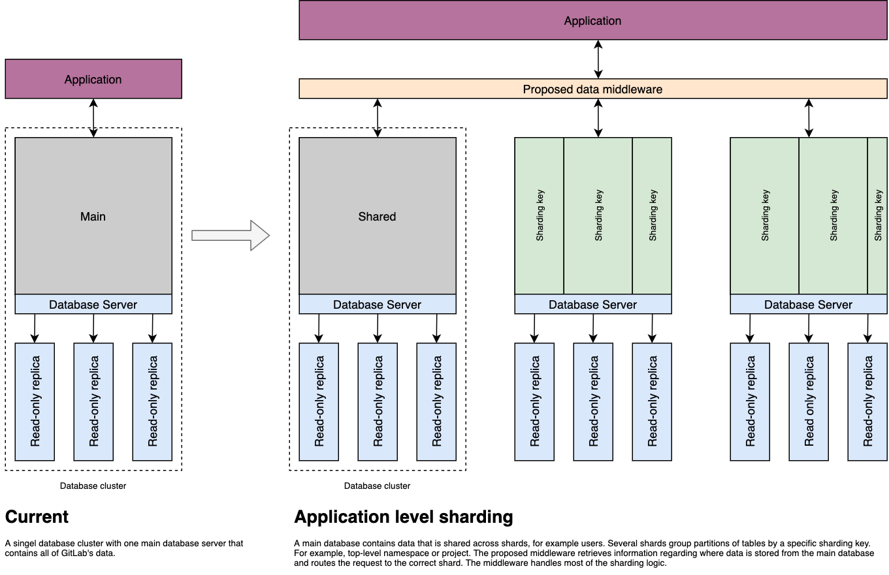
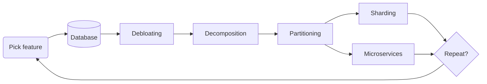

# Database Sharding

This document describes an architecture evolution of scalable database for GitLab.
It describes steps with a goals and expected outcome to drive a highly scalable GitLab Database
architecture. It describes a 5 step process to make GitLab Database to be scalable.

Go to section [discussing scaling steps](#steps-to-scalable-gitlab-database)

## Goals

Massive growth of GitLab over time hits a limits of a scalability of a monolithic databases.
Today, a single database of GitLab contains all aspects needed to run the application.
All tables share the same schema and their structure is joined with a vast number of foreign
keys definining relations.

### Vertical scalability of a single database

A single database at some point hits a verticial capacity limits, because of:

- a growth of data set
- a number of connections from applications
- a growth of amount of reads
- a growth of amount of writes resulting in excessive dead tuples and vacuuming
- a inefficient features
- a billions of rows in a single table

This becomes a problem, because:

- a single machine have a limited amount of CPU cores, memory and attached high-performance storage
- a efficiency of a single machine goes down with vertical increase of capacity due to volume
  of traffic and threading efficiency
- handling thousands of application nodes becomes a problem of distributing all connections across
  limited amount of CPUs that need to cross talk with other threads, the CPU cache evict and memory
  performance becomes a problem
- significant amount of writes slows down reads, increases amount of vacuuming needed and time needed
  for this to be executed
- single database becomes a single point of failure, especially for misbehaving feature
- billion of rows makes vacuuming, index search or update slower over time

This can be solved, by:

- buying bigger machine
- adding read-only replicas, as most of application mostly reads data
- deduplicating a table
- removing or archiving old data
- moving data out of server into another storage (Object Storage?)
- splitting database into vertical (based by feature) or horizontal slices (based on a customer)
- shard database

### Pattern: Functional decomposition

Or said differently a **decomposition** or **vertical sharding** or **logical partitioning**.

This is a pattern where a significant of size feature is moved into it's own database with all associated tables.
This results in making application to connect to this database when a given feature is used.
Joins that would otherwise be executed with the rest of application would be split and instead managed
via the application not a database server.

In this pattern a feature should mostly not affect other features.
The single customer hitting limits of the feature can impact other customers using this feature.

This was discussed in a more details as part of the
[Proof of Concept: Shard the GitLab database using decomposition](https://gitlab.com/groups/gitlab-org/-/epics/5883).

### Pattern: Horizontal Sharding

Or said differently a **sharding** or **tenant sharding**.

This is a pattern when each customer or group of customers uses a dedicated database server. This pattern
assumes that features implemented do not need to access data from other customers, rather a single database
is enough to hold all data that a given customer might need.

In this pattern customer does not affect another customer.
The misbehaving feature can affect another features of the given customer.

This was discussed in a more details as part of the
[Proof of Concept: Shard the GitLab database using horizontal application-level sharding](https://gitlab.com/groups/gitlab-org/-/epics/5838).

## Steps to scalable GitLab database

The above cycle should be followed for every feature to split that
into smaller and more managenable in size.

### 1. Database

We always start with a single database that receives all new features.
It is hard to optimise features for massive scalability, so we expect
that we will work on optimising data structure of the features
when they are still small enough.

At this stage we expect:

1. We can build features fully iteratively
1. We are at a scale that does not warrant yet massive optimisations
1. We ensure that features are isolated and do not harm
1. Ideally they use their special purpose database for a given group
   (like Verify or Packages)
1. We tightly monitor the feature growth, efficiency and technical debt
   associated with incremental development

### 2. Debloating

This is one of the most important steps. A lot of scalability problems
comes from not optimised features that are build iteratively without
tackling technical debt when the data set is still small enough.

Very often it is enough to debloat the feature to achieve a significant
headroom before feature needs to be scaled further. This is still relatively
easy steps, as we have to perform limited amount of data transformation
to achieve big gains.

The debloating is essential to make feature scalable. Moving data over
will increase the capacity, but will not solve structural and growth
problems of the feature in the first place.

At this stage we expect:

1. We look at used data structures and we aim at reducing their data storage
   requirements
1. We look at used algorithm and change how they are implemented to reduce
   amount of writes happening
1. We optimise application processing code to prefer read-only replicas
   as we can assume that we have close to infinite read capacity using replicas
1. We denormalize or normalize tables depending on a usage pattern as it
   is expected that features that evolve over time no longer have the most
   efficient data structure in database. Example could be moving a single
   big column that is used infrequently of an already big table to a new table
   that uses DB partitioning already
1. We truly prefer to drop data instead of trying hard to retain it
1. We question status-quo why we need this data

### 3. Decomposition

Once a feature or a subset of an existing feature overgrows a single database
due to storage or compute requirements the best is to move feature out of
a database into it's own fully managed logical database. This very rapidly
increases a capacity of a given feature without (usually) making a lot of structural
changes.

Decomposition opens an ability to perform a number of optimisations on a feature
by decomposing it from the rest of data structures used, breaking joins,
and uncovering inefficient algorightms used.

The most important is that the decomposition makes feature isolated, which results
in a (very often, not always) for the feature to not affect performance of the other
features.

The decomposition at some point is necessity for a big features that generate a lot
of load. We cannot assume that a single database server even if feature is highly optimised
can handle the expected growth.

At this stage we expect:

1. Decomposed feature owns its own logical database
1. Decomposed feature is isolated
1. Cross-joins (across different databases) are impossible, so they are optimised
   to widen the search space via application logic
1. Additional database brings a significant headroom to execute next scalability step
1. Since we have more headroom we can better mutate existing structure
   and further optimise it
1. Smaller database is faster to execute queries, perform updates and is more robust
   in running vacuum

### 4. Partitioning

The natural step after decomposition after we already uncovered and broke a lot of cycles of
the existing and big feature is to partition a database schema.

At this point we assume that we can reasonably approach the structure by looking at
usually between 10-40 tables what is the best partitioning strategy. This is also the moment
where partitioning can be well measured, as we already have in place a fresh idea
of all tooling needed to migrating, so it is very likely that we can mutate existing schema
from unpartitioned into partitioned fairly easily. Likely go through different partitioning
schemas to find the best one and ship needed changes.

The crucial at this point is to iterate on partitioning strategy and finding a needed application
changes to best deploy that to a running application. We need to take into account that we
work on a big feature and we are used to this feature running. Partitioning without optimisation
very often will result in a worse performance due to query being executed across many partitions.

At this stage we expect:

1. We mutate a very small amount of tables that are deeply interconnected and is easier to reason
   about their interdepdenencies
1. We can try different partition schemas, iterate, validate on production and confidently ship it
1. We can look at feature parititioning holisticly with anticipation for sharding
1. We partition based on data access pattern, especially aiming at finding strong time decay patterns
1. We tend to avoid hash partitioning unless we have a clear need for this for sharding

### 5. Sharding

Partitioning improves efficiency on a single server, but at some point we need to spread feature across
many servers. The partitioning is great first steps as we kind of prepared structure for sharding at this
point, and optimised application. With sharding we aim to find a best and most maintanable solution
that allows us to leverage partitions and spread them across many physical nodes to increase capacity
horizontally.

Sharding is ultimate solution to provide close to infinity database capacity. Getting to a fully sharded
application is also very hard and long process that requires optimisation of the application to prepare
it to physically distributed application. With partitioning in place we can already assume that majority
of the work was done. 

At this stage we expect:

1. That we can use database technology to distribute parittions across many servers
1. We aim to shard based on data access pattern
1. Dependending on a usage pattern we might prefer to designate shards for archive of time-decay data,
   or spread uniformly based on a sharding key

### 6. Microservices

Sharding even though provides infinite capacity for data storage does not solve inefficiency of running
a monolith application. Since we have a feature debloated, decomposed, own logical database, partitioned
and handling billions of requests per-day this is likely the moment where we can get additional
benefits by writing a highly optimised single-purpose Microservice.

The microservice has access to a well described and feature-owned database, and usually since it is rewritten
it focuses on a single most inefficient aspect of the feature. The usage of technology is not limited at this
point to what is used by the rest of stack, but we might decide to use the best technology at our disposal.

At this stage we expect:

1. Optimised an specific aspect of a feature
1. Use a best available technology to reduce compute cost to fraction of inefficiency of a single monolith application
1. Make it self-sufficient and highly monitorable feature
1. Open new possibilites of offered features

### 7. Repeat?

At this point we can make decision whether we decide to tackle next feature, or split the current feature further.

## Roadmap

TBD

## Who

<!-- vale gitlab.Spelling = NO -->

| Role                         | Who
|------------------------------|-------------------------|
| Author                       |     Kamil Trzciński     |
| Architecture Evolution Coach |                         |
| Engineering Leader           |                         |
| Domain Expert                |                         |
| Domain Expert                |                         |

DRIs:

| Role                         | Who
|------------------------------|------------------------|
| Product                      |                         |
| Leadership                   |                         |
| Engineering                  |                         |

<!-- vale gitlab.Spelling = YES -->
