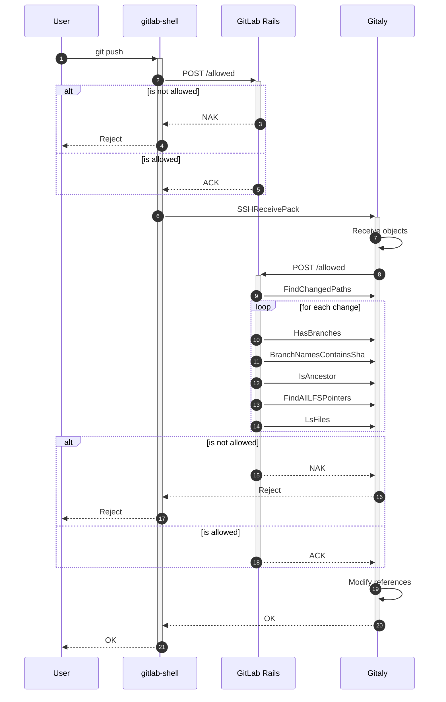
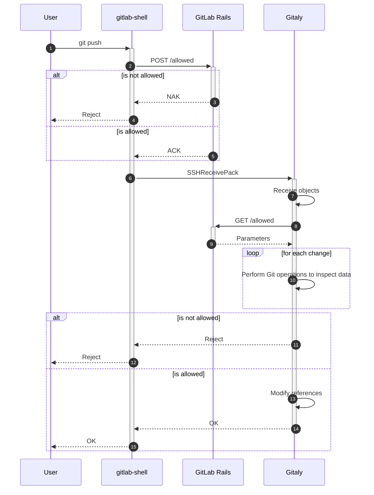

# Authentication and authorization

When doing various Git operations, we need to verify that the user triggering
the operation is in fact allowed to perform the operation. This ranges from
simple authentication (is the user who they claim to be?) to superficial checks
like whether the user has access to a given project at all and ultimately to
more fine grained checks inspecting the specific modifications the user wants to
do as part of the operation.

These checks are currently located in both gitlab-shell for authentication and
shallow access checks and in the GitLab Rails application for the more
fine-grained access checks which directly inspect the user-proposed changes.
But because Rails has no other means to inspect Git-specific modifications than
to invoke Gitaly's API, it is hard to scale these access checks when the number
of modifications in a single operation grows. On customer side, this causes high
delays or even the inability to perform modifications at all when serving huge
monorepos.

## Current architecture

The following sequence diagram depicts the current flow of authentication. As an
example, the diagram uses a git push via the SSH protocol. While the first part
would look different for push via HTTP given that it would directly hit GitLab
Rails instead of gitlab-shell, the more relevant part is the authorization
checks done in SSHReceivePack.

As can be seen, there are two calls to `/allowed`. The first check is done by
gitlab-shell (2): it takes the SSH key of the user and the username and does a
POST against the `/internal/allowed` API of Rails. This is a superficial check
which only verifies whether the user is allowed to perform the given action at
all, it does not do deep inspection of proposed changes and instead simply sends
`_any` as changes.

This first authentication check is specific to SSH-based transports. Other
actions like e.g. those of Gitaly's OperationsService do not perform this check.
In the context of SSH pushes, this check serves as a first gateway to not waste
time to serve a push which could've been determined to not be authorized at an
earlier stage already.

If this superficial check grants access to the user (5), then gitlab-shell
forwards the request to Gitaly's SSHReceivePack RPC (6), which hosts the actual
logic to serve the push. It will initially receive all objects by the user and
put these objects into a quarantine environment (7). This quarantine environment
allows Git to easily discard all objects in case the push is ultimately
rejected, without modifying the actual repository's object database.

After having received all objects and the set of references which is about to be
updated, Gitaly will POST to `/internal/allowed` API again. In contrast to the
first POST done by gitlab-shell (2), this POST includes information about all
changes proposed by the client in the form of the sef of references with their
respective old and new values.

From here on, Rails will first authenticate the user again and verify that he's
allowed to perfom the given action on the project at all. Afterwards, it will
inspect all proposed changes by calling various RPCs of Gitaly. Because there
are no specialized RPCs for this, this process needs to be repeated for each of
the pushed reference updates and thus scales linearly with the number of pushed
references.

If all pushes are allowed, Rails will return OK and Gitaly accepts the reference
updates.

### Shortcomings

- User authentication and authorization of the action is duplicated across
  gitlab-shell and Gitaly.

- Instead of batching authorization of the actual changes, Rails performs them
  per reference. This causes increased latency and even the inability to perform
  any changes for repositories of a certain size. While this may be accomodated
  via more specialized RPCs on Gitaly's side, this would likely lead to an
  inflation of Gitaly's RPC surface. The result would be specially catered RPCs
  which are inflexible and hard to iterate on.

- Because of the use of quarantine directories to store received objects, Gitaly
  needs to tell GitLab Rails what these quarantine directories are. This has
  led to leaky abstractions and requires heuristics to efficiently answer some
  of the queries which would've been a lot easier to check in Gitaly directly.

- The `/allowed` check is mostly a black box to Gitaly. While this relieves
  Gitaly of the duty do handle authentication, it has caused various incidents
  in the past where changes to Gitaly's infrastructure caused access checks to
  be broken silently.

## New architecture

In order to fix shortcomings of the current architecture, a new architecture is
proposed which moves authentication and authorization checks from GitLab Rails
into Gitaly, with the idea that Gitaly is in a better position to efficiently
implement queries while considering all information at once and to iterate on
these implementations faster.

For the sake of this blueprint, we only consider the second POST to `/allowed`.
It is the one that is shared across all authenticating RPCs, while the initial
superficial check is only specific to SSH transports.

The following sequence diagram represents the new architecture:

Instead of doing a POST to `/allowed`, Gitaly is now doing a GET (8). The request
will contain the same information as it previously did: the user on whose behalf
we're performing the operation, the action we're about to perform as well as the
referencfes we're about to update. But instead of performing authorization on
Rails' side, it will return parameters to Gitaly which allow it to perform the
checks itself. These parameters would include e.g. whether force-pushes are
allowed or whether LFS pointer integrity needs to be verified.

With this information, Gitaly can now perform required authentication checks on
the Git repository directly. While a first iteration is likely to carry over the
architecture of those checks from how they're implemented in Rails, later
iterations may optimize them to batch checks and thus amortize costs when many
references are about to change.

## Existing checks

This section discusses relevant checks which currently exist in GitLab Rails and
what it needs to port these checks to Gitaly or whether it makes sense to move
these checks in the first place.

### File count

Repositories can be configured to only contain a specified amount of files. This
limitation can both require that at least one file must exist, or that at most a
certain limit of files can exist. The current implementation only verifies the
tip of each pushed reference, which is the result of API limitations of Gitaly.
Ideally, all pushed commits would be inspected to satisfy the limit.

This check needs to inspect pushed objects. In order for Gitaly to decide
whether a commit satsifies the restrictions, it needs to obtain both the minimum
and maximum number of files a commit may have.

### Signed commits

Projects can be configured to only allow signed commits. To implement this check
on Gitaly's side, it needs a simple boolean to tell it whether this check is
active or not.

### Commit author

Projects can be configured to only allow commits whose author is an existing
GitLab user. While authors can be easily determined by Gitaly, it has no
information on which users exist. It would thus need a new endpoint on GitLab's
side to determine whether the set of authors are registered GitLab users.

### Protected tags

Project maintainers can protect tags by specifying one or more regular
expressions in the project's settings. If an operation would modify or delete
such a protected tag, then the operation would be refused.

This check works on reference names and does not need any access to pushed
objects. In order for Gitaly to decide whether a reference modifies a protected
tag or not, it would need all patterns as configured by the maintainer.

### Protected branches

Branches can be protected such that only a certain set of users is allowed to
merge into the branch or to push onto the branch, optionally restricting the
ability to do force-pushes.

In order to verify whether a push is allowed or not, Gitaly needs information
about all push rules created by the administrator.

### LFS integrity

For repositories which have Git's Large File Storage extension enabled, GitLab
verifies whether all newly pushed LFS pointers have a corresponding LFS object.
This is done to assure integrity of the repository so that other users can
successfully clone the repository and check out all files.

This check needs two pieces of information: first whether LFS pointer integrity
needs to be verified in the first place, and second whether a given LFS pointer
has a corresponding LFS object. While the first part is easily sent as part of
the parameters, it is infeasible to send a list of all existing LFS objects.
This check would thus need a corresponding endpoint on Rails side which allows
Gitaly to ask whether all new pointers are satisfied.

### LFS file locks

By default, Git does not grant the ability to lock certain files for
modification. But with the LFS extension, users can lock files for modification.
This lock must then be honored by the server implementation to determine whether
a given push modifies that file or not.

In order to determine whether a change would modify an existing check, Gitaly
needs a list of all LFS file locks which are currently active.

## Discussion

### Should SSH authentication be moved into Gitaly?

The superficial check in gitlab-shell only authorizes the user and checks
whether he is allowed to perform the given action at all. While this check may
be moved into Gitaly, too, it is debatable whether it provides much of a
benefit.

### Should changes be part of the GET?

Some of the access checks can be implemented without having access to Git data,
e.g. those that only work on reference names. It is thus imaginable that some of
the checks stay in GitLab if Gitaly always sends the set of all references which
are about to change. As a result, GitLab would be in a position to retain some
of the access checks, ending up with a hybrid approach where checks are
distributed across both implementations.
