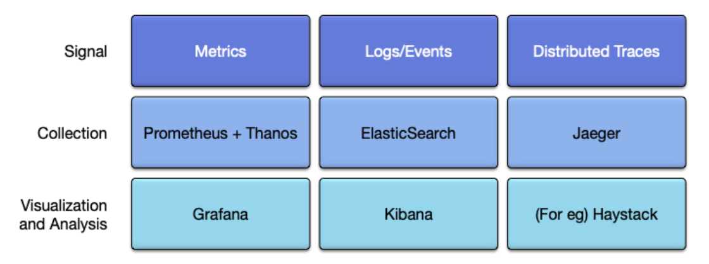
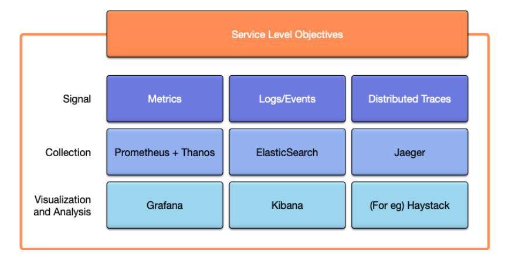
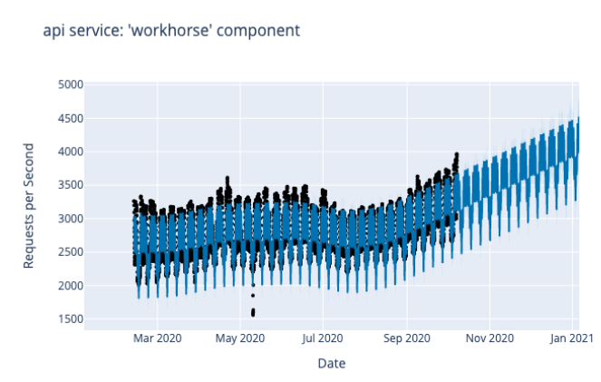
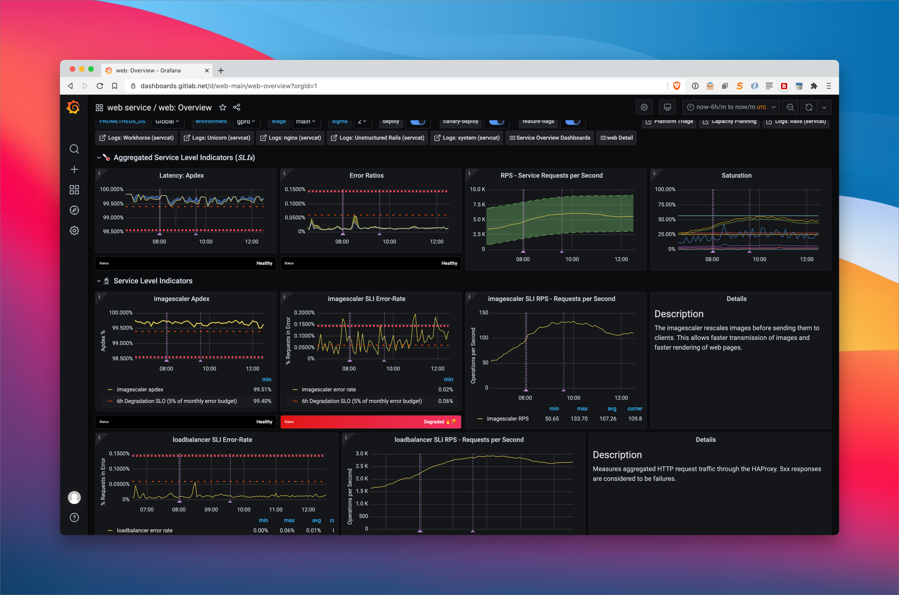
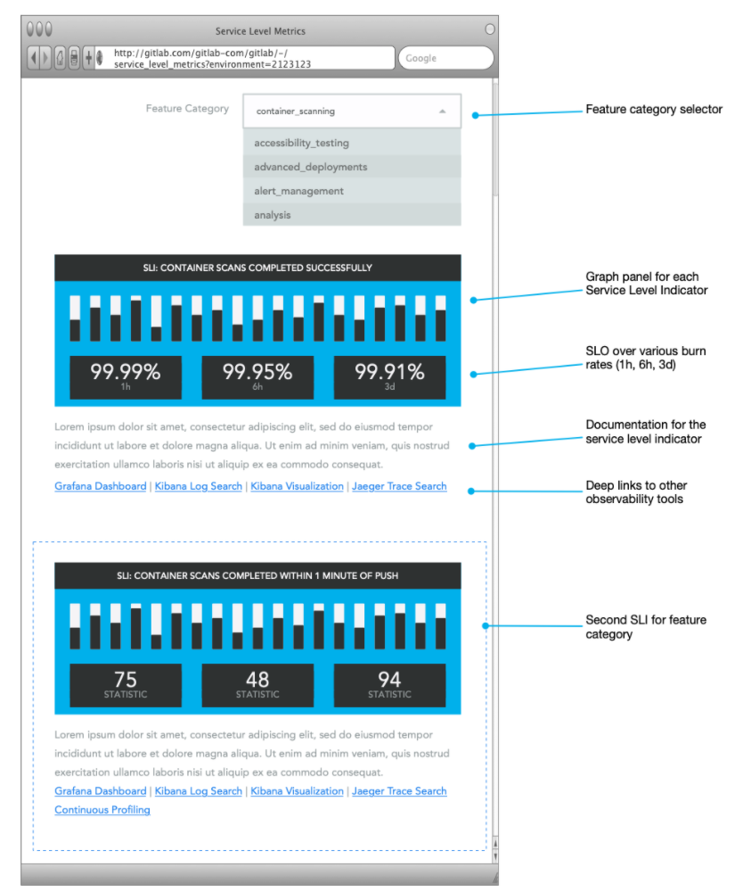

# Second GitLab Service Level Monitoring

## Background

From the Infrastructure General Conversation: 2020-10-15, [Sid suggested that Infrastructure build Monitor APM](https://docs.google.com/document/d/1D9rW65d4w0UwSRw_0jJMRk5wAxdhAd4ynrHLbMMwIjo/edit#bookmark=id.ai8dzanj35zd). This proposal stems from that discussion.

## Executive Summary

Modern observability is built on three main signals: metrics (for which we use Thanos, Prometheus, AlertManager; and Grafana for visualization), logs/events (we use Elasticsearch and Kibana for visualization) and distributed tracing (we use Jaeger and OpenTracing, and are considering a move to OpenTelemetry).



Grafana does an excellent job of visualization metrics, but in the bigger scheme of things, it’s a single component within our observability stack. While we could replace it, with our own implementation, we have a greater need for a higher-level abstraction than a metric visualization tool. Service Level Objectives fit this abstraction well.

Instead of focusing on the visualization component for metrics, we should focus on delivering Service Level Objectives. Datadog, Google Stackdriver, Honeycomb and others are amongst the companies offering products in this space. An SLO offering is about building metrics in a repeatable manner using a common definition of reliability and availability, shared across an organisation, from Product, Engineering and Operations, rather than simply presenting signals.

Over the past 2 years, GitLab.com has migrated much of it’s monitoring over to Service Level Objectives. This work is captured in the [Metrics Catalog](https://gitlab.com/gitlab-com/runbooks/-/tree/master/metrics-catalog). The migration has allowed us to mature our service and helped us improve reliability greatly. We are currently in the process of building an Error Budget process based on them too. The experience we have gained through this process can initially be applied to building much better self-monitoring tools for all GitLab instances, ultimately leading to GitLab.com being monitored through dogfooding self-monitoring features in the product itself.

Once this is complete, the service-level monitoring features built for self-monitoring could be generalised for customer applications.



## Introduction

### History and Background

Before migrating to service level monitoring, GitLab.com was monitored using specific causal alerts, focused on specific alert conditions, rather than general user-focused, service-level alerting.

Following an incident, an alert would be devised retrospectively to address the root cause of a specific failure. This was an ineffective approach to monitoring: the application and the platform were constantly changing, and with it, the root cause of each incident. This left the infrastructure team perpetually catching up with writing new alerts to address the last incident, while being perpetually surprised by the next incident, for which we didn’t have appropriate alerts. This approach to alerting is now widely considered to be an anti-pattern in the industry. An excellent read on this topic is [Rob Ewaschuk’s “My Philosophy on Alerting”](https://docs.google.com/document/d/199PqyG3UsyXlwieHaqbGiWVa8eMWi8zzAn0YfcApr8Q/edit)

Service-level monitoring moves away from monitoring on the causes of incidents, which are too numerous, and focusing instead on the quality of service, from the user’s point-of-view. It is analogous to measuring a patient’s blood pressure, temperature and heart rate (the symptoms), instead of testing for every disease known to medicine (the causes).

Over the past two years GitLab has been transitioning over to service-level monitoring. This work was kicked off [in this issue](https://gitlab.com/gitlab-com/gl-infra/infrastructure/-/issues/4881).

### Current State of Service Level Monitoring at GitLab

The state of service level monitoring at GitLab is as follows:

- Service level monitoring of all services, with three key metrics: Apdex (Latency),  Error Rates and Request Rates.
- SLOs for monitoring and deployment
- Anomaly detection on request rates
- SLA calculation driven off the same metrics
- [Tamland](https://gitlab-com.gitlab.io/gl-infra/tamland/operations.html): Long-term forecasting utilization and usage using [Facebook Prophet](https://facebook.github.io/prophet/).


**Example Tamland Long Term Utilization Trend Forecasting**

### How SLIs are defined for GitLab.com

Service-level monitoring is currently structured as follows:

- The application is broken down into multiple services (`api`, `git`, `web`, `gitaly` etc)
- Each service is broken down into multiple Service Level Indicators (`puma`, `workhorse`, etc)
- Each SLIs can measure Apdex/Latency, Errors, or both. All SLIs also include a requests-per-second measurement.

This approach has worked well, allowing us to transition from the casual-based alerts over to _symptom-based_ service-level monitoring.

During the transition, our monitoring has migrated from imperative alert rules over to a declarative style, called the metrics-catalog.

The metrics catalog is a declarative definition of the services,  components, and metrics and SLOs. The metrics catalog is used to automatically generate imperative recording rules, dashboards, alerting rules and more.

The metrics catalog is defined in Jsonnet, a configuration language. Competitor products (Datadog, Google Cloud Stackdriver, etc) have a similar definition rely exclusively on a UI for these definitions. Using a code approach allows these definitions to be controlled through a devops workflow.

 **Example of a generated service overview dashboard for the web service**

We monitor each SLI over 4 ranges (burn rates) to evaluate whether, based on the current error burn rate, whether the SLI will be able to meet its monthly SLO target. This approach is called multi-window, multi-burn-rate approach, and is described in [Chapter 5 of the SRE Workbook](https://landing.google.com/sre/workbook/chapters/alerting-on-slos/).

This SLI infrastructure is also used as the basis of the SLA monitoring on GitLab.com, as reported in the Infrastructure weekly call, and visualised in the [SLA Dashboard](https://dashboards.gitlab.net/d/general-slas/general-slas?orgId=1).

### Advantages of current implementation of SLO monitoring

Because we don’t have the appropriate service-level data, going back historically to before when the service-level monitoring was implemented, it’s hard to make comparisons to determine the effect that service-level monitoring has had on the site.

### Areas for improvement in the next iteration

1. SLIs are defined by infrastructure, once the code has been pushed over the wall. It would be better if it shifted left.
1. No ownership of SLIs by development teams, and no shared vocabulary for reliability between product, engineering and operations teams.
1. It can be difficult to diagnose the cause of an SLO alert (the symptom). Doing so requires detailed knowledge of the application, observability tools and the infrastructure.
1. SLIs are request-focused, not feature-focused. They are limited to single requests. Features are often spread across multiple services and requests (eg: a git push + sidekiq jobs will result in changes being reflected in a merge request).
1. Mapping SLIs to teams or feature categories is difficult, reducing ownership. For example, a controller owned by one team may invoke code within the monolith owned by another team and SLIs at the request level may be misattributed.
1. SLIs are highly aggregated up to the service level, so cannot be used to determine the quality of individual features. (eg: 99.95% of requests are succeeding, but only 80% of a low-traffic endpoint are -- this is difficult to detect at present).
1. SLOs should be met globally, but also on a per-customer basis. Our current implementation does not allow us to evaluate SLIs on a per-customer basis.

### Team Attribution within a Monolithic Application

GitLab, the application, is primarily a monolithic application. This is a deliberate choice and a strategic decision.

While this approach provides many advantages, as the application grows in complexity, it presents some challenges, and this leads many organizations to investigate microservices.

One of these challenges is attribution of incidents within the monolith. In a microservice architecture, it’s relatively easy to find the change that led to an outage. This is not the case in a monolith. Changes to the monolith tend to be batched and multiple teams may work on the same code. Attributing an incident to a specific change is more difficult, and more so as the monolith grows.

Without quick attribution, it’s often easier for the reliability team to investigate the problem themselves rather than call on the author of the change, but this is not always ideal.

### Ownership of SLIs and a Shared Language for Reliability

At present on GitLab.com, all monitoring, including SLI monitoring is owned by the infrastructure team. Development teams add metrics to the application, but it’s up to the infrastructure team to interpret these metrics and craft the appropriate dashboards and alerting rules. There is no ownership of monitoring, alerts or service-levels by the teams that define the metrics.

A side-effect of this approach is that self-monitoring and visualization and alerting for GitLab, the product is handled by a stage engineering team, whereas, for GitLab.com, the SAAS, this is handled by the infrastructure department. While monitoring for GitLab.com is iterated on an almost daily basis, the parallel development of rules in GitLab, the product, receive at most a handful of changes per year. Unsurprisingly, the difference in maturity between the two is large.

By moving away from a model of throwing the product over the wall to infrastructure to monitor, and shifting SLI ownership left, we could improve the quality and ownership of SLIs. Additionally, this process would provide a shared language for the development engineering teams and the infrastructure teams to use with regards to service-levels.

## Proposed Strategy for Service Monitoring


1. Define service-levels at the feature level from inside the monolithic application: Instead of the level of the monolithic service Define service-level indicators, alongside the existing SLIs that we currently monitor from the outside.
    1. The initial SLIs would be implemented by the Infrastructure department, to prove the developer experience and provide a working demonstration.
    1. Documentation and materials would be produced to educate the stage group engineering teams and Product Managers on what SLIs are how to define them.
    1. Stage group engineering teams would be invited to build SLIs for their features. These would gradually ramp up to cover the product.
1. Define dashboards for monitoring SLIs
    1. Initially, these dashboards would be built in our existing monitoring visualization system, Grafana. This would allow us to iterate quickly on the implementation and would initially cover only GitLab.com
    1. Engineers, operators, PMs and managers could review feature performance in the dashboards in Grafana
1. Migrate the dashboards into the product
    1. SLO Dashboards exist under the Operations/Environment section of a project/group.
    1. See screenshot mockups
    1. Self-managed instances could use SLO monitoring for self-monitoring purposes
    1. Support teams could use this data for support purposes
    1. Potentially: Telemetry could relay this information back to GitLab (in aggregated/anonymous form) for further analysis by PMs/engineers/quality/etc.

This approach would be one that we can gradually adopt, and does not require a rewrite of the existing tooling. Much of the work would be about moving what we have left into the product. This could be done gradually. Self-managed instances would gradually gain the same monitoring advantages that this approach has delivered for gitlab.com.

### Shifting Sevice Level Monitoring Left

We build two client libraries, one for Go and one for Ruby, named SkyLab. These libraries provide an API for defining SLIs.

In the abstract, the library would allow Developers to define SLIs directly in their code.

#### Sidebar: Sidekiq Worker Class Attribution

During 2019, GitLab.com experienced multiple major incidents related to Sidekiq. After initially stabilising the cluster, work was undertaken to push ownership of  these queues left, by assigning ownership of each queue to a feature category (and therefore, indirectly, a team). Each worker class was also assigned an urgency and other attributes. These attributes are owned by the development teams and are used to define latency SLIs for each queue (a high urgency job needs to run within a certain time frame, etc). This, along with other related changes, has led to [greatly improved reliability in the Sidekiq service](https://about.gitlab.com/blog/2020/06/24/scaling-our-use-of-sidekiq/).

#### Programmatic API via SkyLab Library

The programmatic interface would be extremely simple. An SLI is a boolean indicator - it either succeeds or fails. The API would allow development teams to declare an SLI with a unique identifier, assign an appropriate feature category and optionally specify the maximum duration that the code could take to complete.

```ruby
SkyLab::service_level_indicator(
  identifier: :perform_chatops_command,
  max_duration: 1.second
) do |sli|
  # By default, the SLI is assumed to succeed if it completes without an exception
  # but this behaviour can be changed by calling `sli.success` or `sli.fail`.
end
```

> This can be considered to be a type of test, but unlike a unit test, it remains part of the application after it has been deployed to production, and, instead of failing fast when the test fails, the code is given an _error budget_, such as “99.9% of the time over a 30 day period, the code should succeed”. When we're burning errors at a rate which will mean that we won't make our monthly budget, we alert.

An example of an SLI in this form could be “A chatops bot should start executing within 1 second of the command being submitted” or “A merge request should update to reflect the changes following a commit push within 30 seconds of the push completing”.

SLIs in this manner would be gradually added across the codebase, in a manner similar to how unit tests can be gradually added to the codebase.

SLIs could be aggregated to the service level (as is currently done with V1 SLO monitoring), and also to feature category, team or stage levels. By default the existing weighted average approach would be used, with weights being determined by the volume of traffic. In future, other aggregation strategies could be applied too.

#### Service Level Indicator Definition

From our experience of building SLIs, we’re learned that providing documentation on what the SLIs are testing helps provide context for operators and developers. Including paragraphs of text in the codebase can be awkward, so the SLIs could contain additional documentation and details stored in a YAML (or other) definition.

```yaml
service_levels:
  - identifier: perform_chatops_command
    description: |
      ChatOps operations are latency sensitive and should be scheduled for exeuction within 1s.
    labels:
      feature_category: chatops
    slo: 99.95%
  - identifier: ci_execution_latency
    description: |
      CI jobs run on GitLab-managed runners should start within 1 minute of being scheduled.
    labels:
      feature_category: continuous_integration
    slo: 95%
```

#### Metrics Implementation

Each probe would generate two new Prometheus series for SLI success and SLI count.

```ruby
# Number of times (successful and unsuccessful) that an SLI was invoked
sli_count_total{identifier="perform_chatops_command", feature_category="chatops"}
# Number of times (successful and unsuccessful) that an SLI was invoked
sli_success_count_total{identifier="perform_chatops_command", feature_category="chatops"}
```

These metrics could then be used to generate multiple burn rate recording rules, for fast (1h), slow (6h) and multi-day (3d) burn rates. These can be used to alert on whether, based on current error spent, the monthly burn budget is attainable. When it is not, an alert is fired.

#### Improving the ability to diagnose the cause of a problem

Much of the feedback in the initial SLO implementation has been around the difficulty in finding the cause of an incident, for a given SLO alert. At present, this requires operators to have a complete knowledge of both the infrastructure and the application. Additionally, excellent knowledge of the observability toolset is required to quickly isolate the problem. Various tools, such as pre-canned queries have helped to reduce the mean-time to diagnosis, but a lot more can be done.

Having stage group engineers own the SLIs, and using an API to instrument the SLIs in the codebase has huge advantages in this respect, since metrics, traces and Sentry exceptions can be augmented with additional detail describing the state of SLIs that were involved in the request.

#### Improving Diagnostics with Log Correlation

Access logs (part of the LabKit) would include a field to describe all SLIs that the request was involved with.

This would allow very fast correlation between SLIs not meeting their SLOs and a set of requests on a service.

#### Improving Diagnostics with Exception Reporting

Sentry exceptions would automatically include the “current” SLI context.

Given an alert of a SLI not making its SLO, the operation would be able to filter Sentry by the failing SLI, to immediately bring up associated exception reports.

#### Improving Diagnostics with Distributed Traces

`SkyLab::service_level_indicator` would automatically inject a distributed tracing span into the current trace. The span would include the sli_id for the associated SLI probe. If the SLI failed, the span would be marked in error.

This would allow SREs and engineers to quickly connect a poorly performing SLI with associated traces.

## Mockups



## Future Iterations

### Per-Customer SLO accounting

(Draft) emit structured log events with LabKit context metadata/OpenTelemetry baggage for SLIs.

Segmenting SLO data at a per-customer level would be a major milestone in the maturity of our customer offering.

Having this would allow us to monitor service levels on low traffic endpoints that are critical to a small number of customers.

```json
{
  "msg": "sli",
  "status": "succeeded",
  "meta.username": "andrewn",
  "meta.plan": "gold",
  "meta.project": "gitlab-org/gitlab",
  "meta.root_namespace": "gitlab-org"
}
```

## Alternative Products

Some analysis of other service-level monitoring product offerings [is available in this Google Doc](https://docs.google.com/document/d/1MwhjrrEAL52DzFR22fnDtjNGTgCayBbJuPI78nt1020/edit#heading=h.6nmpe16k9rv7).
