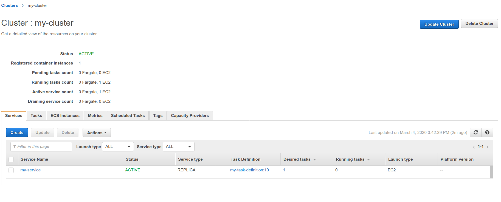
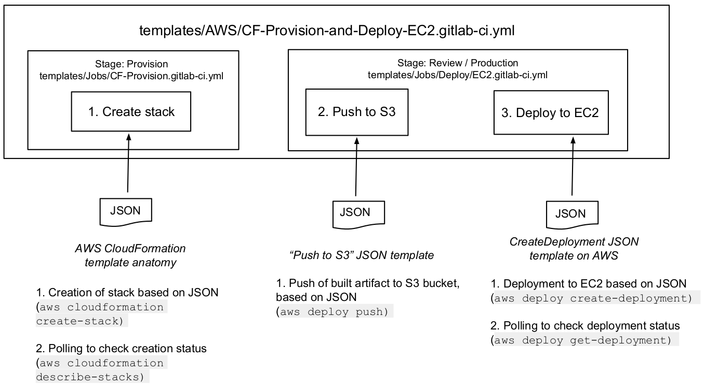

# Cloud deployment

Interacting with a major cloud provider may have become a much needed task that's
part of your delivery process. With GitLab you can
[deploy your application anywhere](https://about.gitlab.com/stages-devops-lifecycle/deploy-targets/).

For some specific deployment targets, GitLab makes this process less painful by providing Docker images
that come with the needed libraries and tools pre-installed.
By referencing them in your CI/CD pipeline, you'll be able to interact with your chosen
cloud provider more easily.

## AWS

GitLab provides Docker images that you can use to [run AWS commands from GitLab CI/CD](#run-aws-commands-from-gitlab-cicd), and a template to make
it easier to [deploy to AWS](#deploy-your-application-to-the-aws-elastic-container-service-ecs).

### Run AWS commands from GitLab CI/CD

> [Introduced](https://gitlab.com/gitlab-org/gitlab/-/issues/31167) in GitLab 12.6.

GitLab's AWS Docker image provides the [AWS Command Line Interface](https://aws.amazon.com/cli/),
which enables you to run `aws` commands. As part of your deployment strategy, you can run `aws` commands directly from
`.gitlab-ci.yml` by specifying [GitLab's AWS Docker image](https://gitlab.com/gitlab-org/cloud-deploy).

Some credentials are required to be able to run `aws` commands:

1. Sign up for [an AWS account](https://docs.aws.amazon.com/IAM/latest/UserGuide/getting-set-up.html) if you don't have one yet.
1. Log in onto the console and create [a new IAM user](https://console.aws.amazon.com/iam/home#/home).
1. Select your newly created user to access its details. Navigate to **Security credentials > Create a new access key**.

   NOTE: **Note:**
   A new **Access key ID** and **Secret access key** pair will be generated. Please take a note of them right away.

1. In your GitLab project, go to **Settings > CI / CD**. Set the following as
   [environment variables](../variables/README.md#gitlab-cicd-environment-variables)
   (see table below):

   - Access key ID.
   - Secret access key.
   - Region code. You can check the [list of AWS regional endpoints](https://docs.aws.amazon.com/general/latest/gr/rande.html#regional-endpoints).
     You might want to check if the AWS service you intend to use is
     [available in the chosen region](https://aws.amazon.com/about-aws/global-infrastructure/regional-product-services/).

   | Env. variable name      | Value                  |
   |:------------------------|:-----------------------|
   | `AWS_ACCESS_KEY_ID`     | Your Access key ID     |
   | `AWS_SECRET_ACCESS_KEY` | Your Secret access key |
   | `AWS_DEFAULT_REGION`    | Your region code       |

1. You can now use `aws` commands in the `.gitlab-ci.yml` file of this project:

   ```yaml
   deploy:
     stage: deploy
     image: registry.gitlab.com/gitlab-org/cloud-deploy/aws-base:latest  # see the note below
     script:
       - aws s3 ...
       - aws create-deployment ...
   ```

   NOTE: **Note:**
   The image used in the example above
   (`registry.gitlab.com/gitlab-org/cloud-deploy/aws-base:latest`) is hosted on the [GitLab
   Container Registry](../../user/packages/container_registry/index.md) and is
   ready to use. Alternatively, replace the image with one hosted on AWS ECR.

### Use an AWS Elastic Container Registry (ECR) image in your CI/CD

Instead of referencing an image hosted on the GitLab Registry, you can
reference an image hosted on any third-party registry, such as the
[Amazon Elastic Container Registry (ECR)](https://aws.amazon.com/ecr/).

To do so, [push your image into your ECR
repository](https://docs.aws.amazon.com/AmazonECR/latest/userguide/docker-push-ecr-image.html).
Then reference it in your `.gitlab-ci.yml` file and replace the `image`
path to point to your ECR image.

### Deploy your application to the AWS Elastic Container Service (ECS)

> - [Introduced](https://gitlab.com/gitlab-org/gitlab/-/issues/207962) in GitLab 12.9.
> - The `Deploy-ECS.gitlab-ci.yml` template was [moved](https://gitlab.com/gitlab-org/gitlab/-/issues/220821) to `AWS/Deploy-ECS.gitlab-ci.yml` in GitLab 13.2.

GitLab provides a series of [CI templates that you can include in your project](../yaml/README.md#include).
To automate deployments of your application to your [Amazon Elastic Container Service](https://aws.amazon.com/ecs/) (AWS ECS)
cluster, you can `include` the `AWS/Deploy-ECS.gitlab-ci.yml` template in your `.gitlab-ci.yml` file.

GitLab also provides [Docker images](https://gitlab.com/gitlab-org/cloud-deploy/-/tree/master/aws) that can be used in your `gitlab-ci.yml` file to simplify working with AWS:

- Use `registry.gitlab.com/gitlab-org/cloud-deploy/aws-base:latest` to use AWS CLI commands.
- Use `registry.gitlab.com/gitlab-org/cloud-deploy/aws-ecs:latest` to deploy your application to AWS ECS.

Before getting started with this process, you need a cluster on AWS ECS, as well as related
components, like an ECS service, ECS task definition, a database on AWS RDS, etc.
[Read more about AWS ECS](https://docs.aws.amazon.com/AmazonECS/latest/developerguide/Welcome.html).

The ECS task definition can be:

- An existing task definition in AWS ECS
- A JSON file containing a task definition. Create the JSON file by using the template provided in
  the [AWS documentation](https://docs.aws.amazon.com/AmazonECS/latest/developerguide/create-task-definition.html#task-definition-template).
  Copy the task definition into a new file in your project, for example `<project-root>/ci/aws/task-definition.json`.
  [Available](https://gitlab.com/gitlab-org/gitlab/-/issues/222618) in GitLab 13.3 and later.

After you have these prerequisites ready, follow these steps:

1. Make sure your AWS credentials are set up as environment variables for your
   project. You can follow [the steps above](#run-aws-commands-from-gitlab-cicd) to complete this setup.
1. Add these variables to your project's `.gitlab-ci.yml` file, or in the project's
   [CI/CD settings](../variables/README.md#create-a-custom-variable-in-the-ui):

   - `CI_AWS_ECS_CLUSTER`: The name of the AWS ECS cluster that you're targeting for your deployments.
   - `CI_AWS_ECS_SERVICE`: The name of the targeted service tied to your AWS ECS cluster.
   - `CI_AWS_ECS_TASK_DEFINITION`: The name of an existing task definition in ECS tied
     to the service mentioned above.

   ```yaml
   variables:
     CI_AWS_ECS_CLUSTER: my-cluster
     CI_AWS_ECS_SERVICE: my-service
     CI_AWS_ECS_TASK_DEFINITION: my-task-definition
   ```

   You can find these names after selecting the targeted cluster on your [AWS ECS dashboard](https://console.aws.amazon.com/ecs/home):

   

   Alternatively, if you want to use a task definition defined in a JSON file, use
   `CI_AWS_ECS_TASK_DEFINITION_FILE` instead:

   ```yaml
   variables:
     CI_AWS_ECS_CLUSTER: my-cluster
     CI_AWS_ECS_SERVICE: my-service
     CI_AWS_ECS_TASK_DEFINITION_FILE: ci/aws/my_task_definition.json
   ```

   You can create your `CI_AWS_ECS_TASK_DEFINITION_FILE` variable as a
   [file-typed environment variable](../variables/README.md#custom-environment-variables-of-type-file) instead of a
   regular environment variable. If you choose to do so, set the variable value to be the full contents of
   the JSON task definition. You can then remove the JSON file from your project.

   In both cases, make sure that the value for the `containerDefinitions[].name` attribute is
   the same as the `Container name` defined in your targeted ECS service.

   CAUTION: **Warning:**
   `CI_AWS_ECS_TASK_DEFINITION_FILE` takes precedence over `CI_AWS_ECS_TASK_DEFINITION` if both these environment
   variables are defined within your project.

   NOTE: **Note:**
   If the name of the task definition you wrote in your JSON file is the same name
   as an existing task definition on AWS, then a new revision is created for it.
   Otherwise, a brand new task definition is created, starting at revision 1.

1. Include this template in `.gitlab-ci.yml`:

   ```yaml
   include:
     - template: AWS/Deploy-ECS.gitlab-ci.yml
   ```

   The `AWS/Deploy-ECS` template ships with GitLab and is available [on
   GitLab.com](https://gitlab.com/gitlab-org/gitlab/-/blob/master/lib/gitlab/ci/templates/AWS/Deploy-ECS.gitlab-ci.yml).

1. Commit and push your updated `.gitlab-ci.yml` to your project's repository, and you're done!

   Your application Docker image will be rebuilt and pushed to the GitLab registry.
   If your image is located in a private registry, make sure your task definition is
   [configured with a `repositoryCredentials` attribute](https://docs.aws.amazon.com/AmazonECS/latest/developerguide/private-auth.html).

   Then the targeted task definition will be updated with the location of the new
   Docker image, and a new revision will be created in ECS as result.

   Finally, your AWS ECS service will be updated with the new revision of the
   task definition, making the cluster pull the newest version of your
   application.

CAUTION: **Warning:**
The [`AWS/Deploy-ECS.gitlab-ci.yml`](https://gitlab.com/gitlab-org/gitlab/-/blob/master/lib/gitlab/ci/templates/AWS/Deploy-ECS.gitlab-ci.yml)
template includes both the [`Jobs/Build.gitlab-ci.yml`](https://gitlab.com/gitlab-org/gitlab/-/blob/master/lib/gitlab/ci/templates/Jobs/Build.gitlab-ci.yml)
and [`Jobs/Deploy/ECS.gitlab-ci.yml`](https://gitlab.com/gitlab-org/gitlab/-/blob/master/lib/gitlab/ci/templates/Jobs/Deploy/ECS.gitlab-ci.yml)
"sub-templates". Do not include these "sub-templates" on their own, and only include the main
`AWS/Deploy-ECS.gitlab-ci.yml` template. The "sub-templates" are designed to only be
used along with the main template. They may move or change unexpectedly causing your
pipeline to fail if you didn't include the main template. Also, the job names within
these templates may change. Do not override these jobs names in your own pipeline,
as the override will stop working when the name changes.

Alternatively, if you don't wish to use the `AWS/Deploy-ECS.gitlab-ci.yml` template
to deploy to AWS ECS, you can always use our
`aws-base` Docker image to run your own [AWS CLI commands for ECS](https://docs.aws.amazon.com/cli/latest/reference/ecs/index.html#cli-aws-ecs).

```yaml
deploy:
  stage: deploy
  image: registry.gitlab.com/gitlab-org/cloud-deploy/aws-base:latest
  script:
    - aws ecs register-task-definition ...
```

### Provision and deploy to your AWS Elastic Compute Cloud (EC2)

> [Introduced](https://gitlab.com/gitlab-org/gitlab/-/issues/201742) in GitLab 13.5.

You can use the `AWS/CF-Provision-and-Deploy-EC2` CI template to perform the
following actions within the same pipeline:

1. **Create stack**: Provision your own infrastructure by leveraging the [AWS CloudFormation](https://aws.amazon.com/cloudformation/) API.
1. **Push to S3**: Push your previously-built artifact to an [AWS S3](https://aws.amazon.com/s3/) bucket.
1. **Deploy to EC2**: Deploy this pushed content onto an [AWS EC2](https://aws.amazon.com/ec2/) instance.



#### Run the `AWS/CF-Provision-and-Deploy-EC2.gitlab-ci.yml` template

To run the `AWS/CF-Provision-and-Deploy-EC2.gitlab-ci.yml` template, you must
pass three JSON input objects, based on existing templates:

1. The AWS documentation provides templates for the _Create stack_ and _Deploy to EC2_ steps (links
   below). We provide the template for the remaining step, _Push to S3_:

   - [Template for the _Create stack_ step on AWS](https://docs.aws.amazon.com/AWSCloudFormation/latest/UserGuide/template-anatomy.html).
   - Template for the _Push to S3_ step. Note that `source` is where a preceding `build` job built
     your application, exporting the build through [`artifacts:paths`](../yaml/README.md#artifactspaths):

     ```json
     {
       "applicationName": "string",
       "source": "string",
       "s3Location": "s3://your/bucket/project_built_file...]"
     }
     ```

   - [Template for the _Deploy to EC2_ step on AWS](https://docs.aws.amazon.com/codedeploy/latest/APIReference/API_CreateDeployment.html).

1. Once you have completed these three templates based on your requirements, you
   have two ways to pass in these JSON objects:

   - They can be three actual files located in your project. You must specify their path relative to
     your project root in your `.gitlab-ci.yml` file, using the following variables. For example, if
     your files are in a `<project_root>/aws` folder:

     ```yaml
     variables:
       CI_AWS_CF_CREATE_STACK_FILE: 'aws/cf_create_stack.json'
       CI_AWS_S3_PUSH_FILE: 'aws/s3_push.json'
       CI_AWS_EC2_DEPLOYMENT_FILE: 'aws/create_deployment.json'
     ```

   - Alternatively, you can provide these JSON objects as [file-typed environment variables](../variables/README.md#custom-environment-variables-of-type-file).
   In your project, go to **Settings > CI / CD > Variables** and add
   the three variables listed above as file-typed environment variables.
   For each variable, set the value to its corresponding JSON object.

1. Provide the name of the stack you're creating and/or targeting, as an environment variable:

   ```yaml
   variables:
     CI_AWS_CF_STACK_NAME: 'YourStackName'
   ```

1. Add this CI template to your `.gitlab-ci.yml`:

   ```yaml
   include:
     - template: AWS/CF-Provision-and-Deploy-EC2.gitlab-ci.yml
   ```

When running your project pipeline at this point:

- Your AWS CloudFormation stack is created based on the content of your
  `CI_AWS_CF_CREATE_STACK_FILE` file/variable.
  If your stack already exists, this step is skipped, but the `provision` job it belongs to still
  runs.
- Your built application is pushed to your S3 bucket then and deployed to your EC2 instance, based
  on the related JSON object's content. The deployment job finishes whenever the deployment to EC2
  is done or has failed.

   ### Deploy Amazon EKS 

- [How to deploy your application to a GitLab-managed Amazon EKS cluster with Auto DevOps](https://about.gitlab.com/blog/2020/05/05/deploying-application-eks/)
- [Deploying with GitLab on Google Cloud](https://about.gitlab.com/solutions/google-cloud-platform/)

