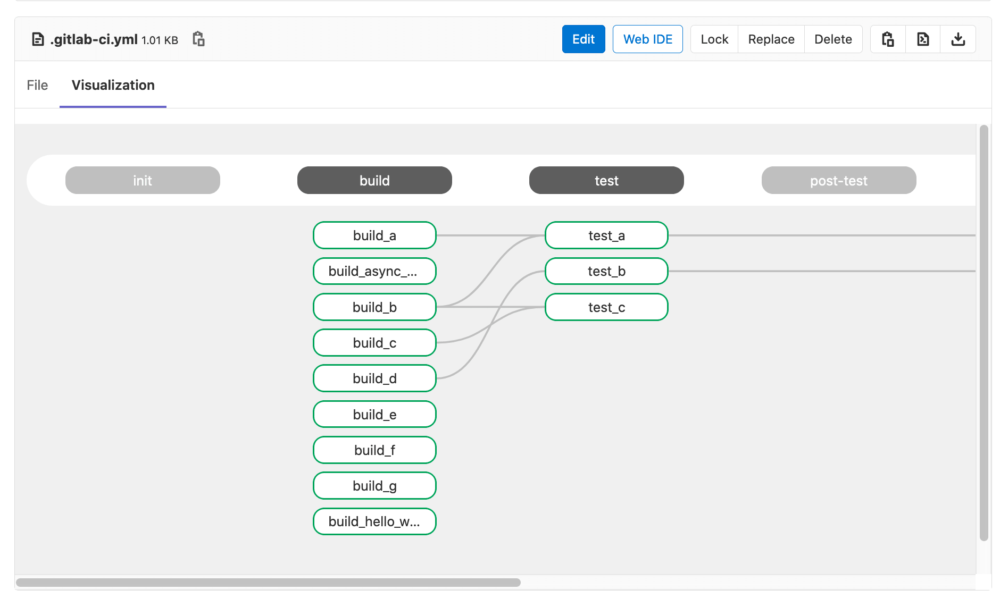
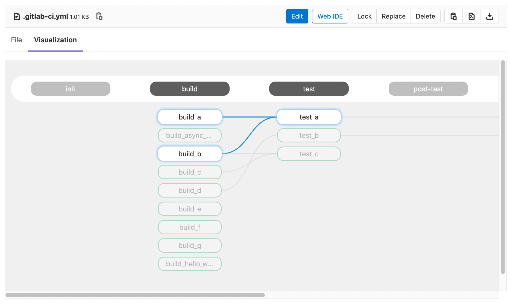

# CI Config Visualization

> [Introduced](https://gitlab.com/gitlab-org/gitlab/-/issues/241722) in GitLab 13.5 behind a disabled feature flag (`gitlab_ci_yml_preview`).

If you want to preview what your `gitlab-ci.yml` file structure looks like
in a more visual way, you can navigate to any CI config file and click on the
`Visualization` tab to see what your architecture looks like. This will show
all stages and jobs with their `needs` drawn on the graph to represent the 
hierarchy of execution. 

Hovering on a job will highlights its requirement before executing.

If the file only use stage-based jobs (and therefore no `needs`), 
then no lines will be drawn as each job simply depends on the previous stage being
completed, no job has individual requirements.

Currently, you can only preview one `gitlab-ci.yml` at a time which will ignore `includes`.
This is known and we are working on improving this limitation.
