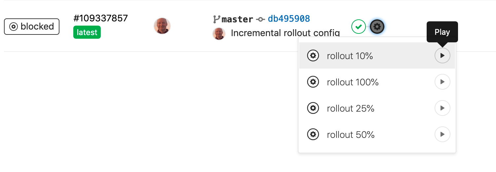

# Incremental Rollouts with GitLab CI/CD

When rolling out changes to your application, it is possible to release production changes
to only a portion of your Kubernetes pods as a risk mitigation strategy. By releasing
production changes gradually, error rates or performance degradation can be monitored, and
if there are no problems, all pods can be updated.

GitLab supports both manually triggered and timed rollouts to a Kubernetes production system
using Incremental Rollouts. When using Manual Rollouts, the release of each tranche
of pods is manually triggered, while in Timed Rollouts, the release is performed in
tranches after a default pause of 5 minutes.
Timed rollouts can also be manually triggered before the pause period has expired.

Manual and Timed rollouts are included automatically in projects controlled by
[AutoDevOps](../../topics/autodevops/index.md), but they are also configurable through
GitLab CI/CD in the `.gitlab-ci.yml` configuration file.

Manually triggered rollouts can be implemented with your [Continuously Delivery](../introduction/index.md#continuous-delivery)
methodology, while timed rollouts do not require intervention and can be part of your
[Continuously Deployment](../introduction/index.md#continuous-deployment) strategy.
You can also combine both of them in a way that the app is deployed automatically
unless you eventually intervene manually if necessary.

We created sample applications to demonstrate the three options, which you can
use as examples to build your own:

- [Manual incremental rollouts](https://gitlab.com/gl-release/incremental-rollout-example/blob/master/.gitlab-ci.yml)
- [Timed incremental rollouts](https://gitlab.com/gl-release/timed-rollout-example/blob/master/.gitlab-ci.yml)
- [Both manual and timed rollouts](https://gitlab.com/gl-release/incremental-timed-rollout-example/blob/master/.gitlab-ci.yml)

## Manual Rollouts

> [Introduced](https://gitlab.com/gitlab-org/gitlab/-/issues/5415) in GitLab 10.8.

It is possible to configure GitLab to do incremental rollouts manually through `.gitlab-ci.yml`. Manual configuration
allows more control over the this feature. The steps in an incremental rollout depend on the
number of pods that are defined for the deployment, which are configured when the Kubernetes
cluster is created.

For example, if your application has 10 pods and a 10% rollout job is run, the new instance of the
application will be deployed to a single pod while the remaining 9 will present the previous instance.

First we [define the template as manual](https://gitlab.com/gl-release/incremental-rollout-example/blob/master/.gitlab-ci.yml#L100-103):

```yaml
.manual_rollout_template: &manual_rollout_template
  <<: *rollout_template
  stage: production
  when: manual
```

Then we [define the rollout amount for each step](https://gitlab.com/gl-release/incremental-rollout-example/blob/master/.gitlab-ci.yml#L152-155):

```yaml
rollout 10%:
  <<: *manual_rollout_template
  variables:
    ROLLOUT_PERCENTAGE: 10
```

When the jobs are built, a **play** button will appear next to the job's name. Click the **play** button
to release each stage of pods. You can also rollback by running a lower percentage job. Once 100%
is reached, you cannot roll back using this method. It is still possible to roll back by redeploying
the old version using the **Rollback** button on the environment page.



A [deployable application](https://gitlab.com/gl-release/incremental-rollout-example) is
available, demonstrating manually triggered incremental rollouts.

## Timed Rollouts

> [Introduced](https://gitlab.com/gitlab-org/gitlab/-/issues/7545) in GitLab 11.4.

Timed rollouts behave in the same way as manual rollouts, except that each job is defined with a delay
in minutes before it will deploy. Clicking on the job will reveal the countdown.


It is possible to combine this functionality with manual incremental rollouts so that the job will
countdown and then deploy.

First we [define the template as timed](https://gitlab.com/gl-release/timed-rollout-example/blob/master/.gitlab-ci.yml#L86-89):

```yaml
.timed_rollout_template: &timed_rollout_template
  <<: *rollout_template
  when: delayed
  start_in: 1 minutes
```

We can define the delay period using the `start_in` key:

```yaml
start_in: 1 minutes
```

Then we [define the rollout amount for each step](https://gitlab.com/gl-release/timed-rollout-example/blob/master/.gitlab-ci.yml#L97-101):

```yaml
timed rollout 30%:
  <<: *timed_rollout_template
  stage: timed rollout 30%
  variables:
    ROLLOUT_PERCENTAGE: 30
```

A [deployable application](https://gitlab.com/gl-release/timed-rollout-example) is
available, [demonstrating configuration of timed rollouts](https://gitlab.com/gl-release/timed-rollout-example/blob/master/.gitlab-ci.yml#L86-95).

## Blue-Green Deployment

Also sometimes known as A/B deployment or red-black deployment, this technique is used to reduce
downtime and risk during a deployment. When combined with incremental rollouts, you can
minimize the impact of a deployment causing an issue.

With this technique there are two deployments ("blue" and "green", but any naming can be used).
Only one of these deployments is live at any given time, except during an incremental rollout.

For example, your blue deployment can be currently active on production, while the
green deployment is "live" for testing, but not deployed to production. If issues
are found, the green deployment can be updated without affecting the production
deployment (currently blue). If testing finds no issues, you switch production to the green
deployment, and blue is now available to test the next release.

This process reduces downtime as there is no need to take down the production deployment
to switch to a different deployment. Both deployments are running in parallel, and
can be switched to at any time.

An [example deployable application](https://gitlab.com/gl-release/blue-green-example)
is available, with a [`gitlab-ci.yml` CI/CD configuration file](https://gitlab.com/gl-release/blue-green-example/blob/master/.gitlab-ci.yml)
that demonstrates blue-green deployments.
