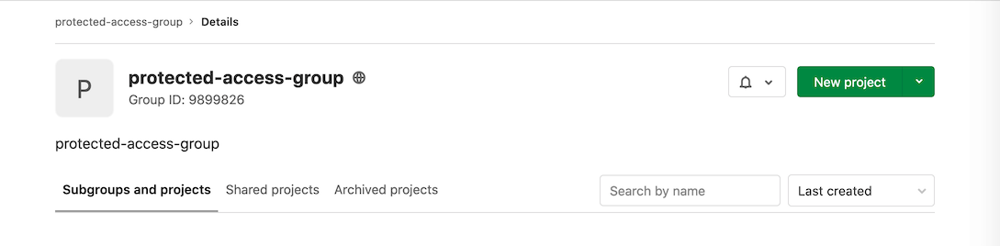

# Protected environments **(PREMIUM)**

> [Introduced](https://gitlab.com/gitlab-org/gitlab/-/merge_requests/6303) in [GitLab Premium](https://about.gitlab.com/pricing/) 11.3.

[Environments](../environments/index.md) can be used for different reasons:

- Some of them are just for testing.
- Others are for production.

Since deploy jobs can be raised by different users with different roles, it is important that
specific environments are "protected" to prevent unauthorized people from affecting them.

By default, a protected environment does one thing: it ensures that only people
with the right privileges can deploy to it, thus keeping it safe.

NOTE:
A GitLab admin is always allowed to use environments, even if they are protected.

To protect, update, or unprotect an environment, you need to have at least
[Maintainer permissions](../../user/permissions.md).

## Protecting environments

To protect an environment:

1. Navigate to your project's **Settings > CI/CD**.
1. Expand the **Protected environments** section.
1. From the **Environment** dropdown menu, select the environment you want to protect.
1. In the **Allowed to Deploy** dropdown menu, select the role, users, or groups you
   want to give deploy access to. Keep in mind that:
   - There are two roles to choose from:
     - **Maintainers**: Allows access to all maintainers in the project.
     - **Developers**: Allows access to all maintainers and all developers in the project.
   - You can only select groups that are already associated with the project.
   - Only users that have at least the Developer permission level appear in
     the **Allowed to Deploy** dropdown menu.
1. Click the **Protect** button.

The protected environment now appears in the list of protected environments.

### Use the API to protect an environment

Alternatively, you can use the API to protect an environment:

1. Use a project with a CI that creates an environment. For example:

   ```yaml
   stages:
     - test
     - deploy

   test:
     stage: test
     script:
       - 'echo "Testing Application: ${CI_PROJECT_NAME}"'

   production:
     stage: deploy
     when: manual
     script:
       - 'echo "Deploying to ${CI_ENVIRONMENT_NAME}"'
     environment:
       name: ${CI_JOB_NAME}
   ```

1. Use the UI to [create a new group](../../user/group/index.md#create-a-group).
   For example, this group is called `protected-access-group` and has the group ID `9899826`. Note
   that the rest of the examples in these steps use this group.

   

1. Use the API to add a user to the group as a reporter:

   ```shell
   $ curl --request POST --header "PRIVATE-TOKEN: <your_access_token>" --data "user_id=3222377&access_level=20" "https://gitlab.com/api/v4/groups/9899826/members"

   {"id":3222377,"name":"Sean Carroll","username":"sfcarroll","state":"active","avatar_url":"https://assets.gitlab-static.net/uploads/-/system/user/avatar/3222377/avatar.png","web_url":"https://gitlab.com/sfcarroll","access_level":20,"created_at":"2020-10-26T17:37:50.309Z","expires_at":null}
   ```

1. Use the API to add the group to the project as a reporter:

   ```shell
   $ curl --request POST --header "PRIVATE-TOKEN: <your_access_token>" --request POST "https://gitlab.com/api/v4/projects/22034114/share?group_id=9899826&group_access=20"

   {"id":1233335,"project_id":22034114,"group_id":9899826,"group_access":20,"expires_at":null}
   ```

1. Use the API to add the group with protected environment access:

   ```shell
   curl --header 'Content-Type: application/json' --request POST --data '{"name": "production", "deploy_access_levels": [{"group_id": 9899826}]}' --header "PRIVATE-TOKEN: <your_access_token>" "https://gitlab.com/api/v4/projects/22034114/protected_environments"
   ```

The group now has access and can be seen in the UI.

## Environment access by group membership

A user may be granted access to protected environments as part of
[group membership](../../user/group/index.md). Users with
[Reporter permissions](../../user/permissions.md), can only be granted access to
protected environments with this method.

## Deployment branch access

Users with [Developer permissions](../../user/permissions.md) can be granted
access to a protected environment through any of these methods:

- As an individual contributor, through a role.
- Through a group membership.

If the user also has push or merge access to the branch deployed on production,
they have the following privileges:

- [Stopping an environment](index.md#stopping-an-environment).
- [Delete a stopped environment](index.md#delete-a-stopped-environment).
- [Create an environment terminal](index.md#web-terminals).

## Deployment-only access to protected environments

Users granted access to a protected environment, but not push or merge access
to the branch deployed to it, are only granted access to deploy the environment. An individual in a
group with the Reporter permission, or in groups added to the project with Reporter permissions,
appears in the dropdown menu for deployment-only access.

To add deployment-only access:

1. Add a group with Reporter permissions.
1. Add user(s) to the group.
1. Invite the group to be a project member.
1. Follow the steps outlined in [Protecting Environments](#protecting-environments).

Note that deployment-only access is the only possible access level for groups with [Reporter permissions](../../user/permissions.md).

## Modifying and unprotecting environments

Maintainers can:

- Update existing protected environments at any time by changing the access in the
  **Allowed to Deploy** dropdown menu.
- Unprotect a protected environment by clicking the **Unprotect** button for that environment.

After an environment is unprotected, all access entries are deleted and must
be re-entered if the environment is re-protected.

For more information, see [Deployment safety](deployment_safety.md).

## Group-level protected environments

> [Introduced](https://gitlab.com/gitlab-org/gitlab/-/issues/215888) in [GitLab Premium](https://about.gitlab.com/pricing/) 14.0.
> - [Deployed behind a feature flag](../../user/feature_flags.md), disabled by default.
> - Disabled on GitLab.com.
> - Not recommended for production use.
> - To use in GitLab self-managed instances, ask a GitLab administrator to [enable it](#anchor-to-section). **(FREE SELF)**

This in-development feature might not be available for your use. There can be
[risks when enabling features still in development](../../user/feature_flags.md#risks-when-enabling-features-still-in-development).
Refer to this feature's version history for more details.

Typically, large enterprise organiations have an explicit permission boundary between [developers and operators](https://about.gitlab.com/topics/devops/). Developers build and test their code/application, and operators deploy and monitor the application. The permission of each group is carefully configured in order to avoid unauthorized users gain an access to a critical component.

Speaking this permissions in [Continuous Deployment/Delivery (CD)](https://docs.gitlab.com/ee/ci/environments/) context, we can illustrate the permissions of allowance of deployments in the following table:
| Environment | Developer | Operator | Category |
|-------------|-----------|----------|----------|
| Development | Allowed |  | Lower Environment |
| Testing | Allowed |  | Lower Environment |
| Staging | Disallowed | Allowed | Higher Environment |
| Produciton | Disallowed | Allowed | Higher Environment |

(Reference: [Deployment environments](https://en.wikipedia.org/wiki/Deployment_environment))

GitLab CD has a bunch of [deployment safety](https://docs.gitlab.com/ee/ci/environments/deployment_safety.html) features to ensure that the deployments can only be proceeded by the right group at the right time. However, we don't have a solution at the organization/group-level yet. In a large organization, they host thousands of projects under the group, so for example, making sure that all of the [project-level protected environments](#protecting-environments) are properly configured is not scalable solution. Developers might accidentally change the configuration.

We introduce a group-level deployment permission configuration. This is conceptually same with [project-level protected environments](#protecting-environments), but this feature is built at group-level. Here are the main points of the feature spec:

* Users who have [maintainer role](../../user/permissions.md) (or above) at a group can access to the group-level protected environments configuration.
* Users who have [developer role](../../user/permissions.md) (or below) at a group can *NOT* access to the configuration.
* If a deployer is about to run a deployment job in a project and allowed to deploy to the environment, the deployment job will be proceeded.
* If a deployer is about to run a deployment job in a project but disallowed to deploy to the environment, the deployment job fails with a message.
* Regarding [sub-groups](https://docs.gitlab.com/ee/user/group/subgroups/) (i.e. a group under a group), if a higher group has configured the group-level protected environment, the lower groups can't override it.
* [Project-level protected environments](#protecting-environments) can be combined with this feature. If both group-level and project-level environments configurations exist, the deployer must be allowed in **both** rulesets. The project-level config is still used by developers to do a fine-graned tuning for their lower environments, but still, they can't access to the higher environments.

### The GitLab Roles in a group, sub-groups and belonging projects

The idea of this approach is to separete the operator's resource and developer's resource by depending on the group > project hierarchy, meaning that the organization must properly configure the [GitLab Roles](../../user/permissions.md). Here is an example of role setup:

* **Operator group** is assigned to the top-level group as `Maintainer` role, meaning they can configure the oraganization-wide deployment ruleset. This effectively protect group-level resources, such as [group-level clusters](../../user/group/clusters/index.md) and [group-level runners](../runners/README.md#group-runners).

* **Develoepr group** is assigned to the top-level group as `Developer` role, meaning they don't have an access to the configuration.
* In a subsequent project of the group, **developer group** can be promoted to `Maintainer` role, meaning they have an access to project configuration to setup deployments to lower environments.

### Access Control Spec

The group-level configuration can define authorization spec flexibily that takes the following paramter:
| Name | Type | Description |
|------|------|-------------|
| Deployment Tier | Enum | One of `production`, `staging`, `testing`, `development` or `other`. See more in the [doc](https://docs.gitlab.com/ee/ci/environments/#deployment-tier-of-environments). |
| Allowed to deploy | Roles/Users/Groups | GitLab Roles (Developers + Maintainers or Maintainers), specific users or groups. |

Example configuration:
| Deployment Tier | Allowed to deploy | Access Control Type       |
|-----------------|-------------------| -------------------       |
| `production`    | `@operator-group` | Group-based access control |
| `staging`       | `@operator-group` | Group-based access control |

### Configuration interface

Users can configure the group-level protected environments via [Rest API](../../api/group_protected_environments.md).

We also have a plan to suport UI. See https://gitlab.com/gitlab-org/gitlab/-/issues/325249.

### Enable or disable Group-level protected environments **(FREE SELF)**

Group-level protected environments is under development and not ready for production use. It is
deployed behind a feature flag that is **disabled by default**.
[GitLab administrators with access to the GitLab Rails console](../../administration/feature_flags.md)
can enable it.

To enable it:

```ruby
Feature.enable(:group_level_protected_environments)
```

To disable it:

```ruby
Feature.disable(:group_level_protected_environments)
```

<!-- ## Troubleshooting

Include any troubleshooting steps that you can foresee. If you know beforehand what issues
one might have when setting this up, or when something is changed, or on upgrading, it's
important to describe those, too. Think of things that may go wrong and include them here.
This is important to minimize requests for support, and to avoid doc comments with
questions that you know someone might ask.

Each scenario can be a third-level heading, e.g. `### Getting error message X`.
If you have none to add when creating a doc, leave this section in place
but commented out to help encourage others to add to it in the future. -->
