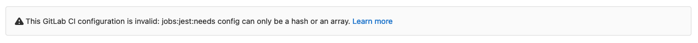
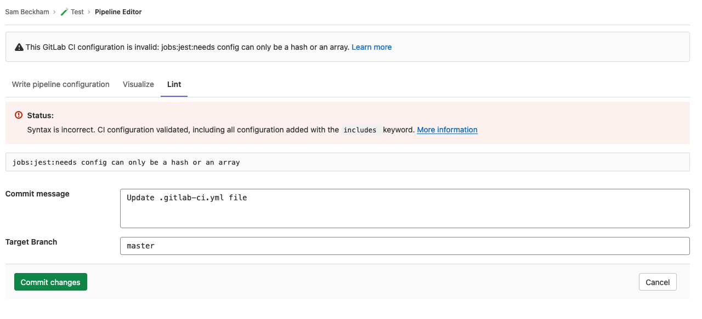
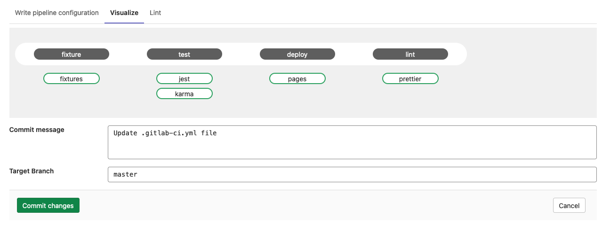

# Pipeline Editor **(CORE)**

> [Introduced](https://gitlab.com/gitlab-org/gitlab/-/issues/263147) in GitLab 13.8.

The pipeline editor brings together all your pipeline editing needs into one place.
The current MVC allows you to edit your `.gitlab-ci.yml` file, with helpful features such as validating, linting, and visualizing your changes.
This feature is useful for both creating new pipeline configurations and editing existing ones.

## Validate

As you edit your pipeline configuration, it is continually validated against our pipeline schema.
It checks the syntax of your CI YAML configuration and also runs some basic logical validations.
The result of this is shown above your config.
If your config is invalid, a tip is shown to help you fix your config:

## Lint

If you want to test the validity of your GitLab CI/CD configuration before committing the changes, you can use the lint tab.
This tool checks for syntax and logical errors but goes into more detail than the [validator](#validate).
As with the validation, this is updated in real-time so any changes you make to the config will be reflected in the linter.
This feature will display the same results as the existing [CI Linter](../lint.md).

## Visualize

You can visualize your changes on the [visualization tab](../yaml/visualization.md).
Any changes made to the config will be reflected in the visualization.

## Commit

The commit form will appear at the bottom of each tab in the editor so you can commit your changes at any time.
When you are satisfied with your changes, add a descriptive commit message and choose a branch.
The branch field will default to your projects default branch.
If you enter a new branch name, a checkbox will appear, allowing you to start a new merge request after you commit the changes.
When you are ready, click Commit Changes at the bottom.

