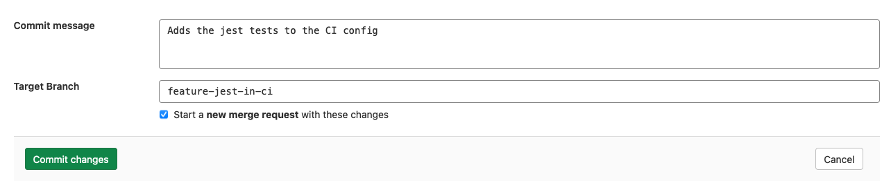

# Pipeline Editor **(CORE)**

> [Introduced](https://gitlab.com/gitlab-org/gitlab/-/issues/263147) in GitLab 13.8.

The pipeline editor brings together all your pipeline editing needs into one place.
You can edit your `.gitlab-ci.yml` file. To access it, go to **CI/CD > Editor**.

From the pipeline editor page you can:

- [Validate](#validate) your configuration syntax while editing the file.
- Do a deeper [Lint](#lint) of your configuration, that verifies it with any configuration
  added with the [`include`](../yaml/README.md#include) keyword.
- See a visualization of the current configuration.
- [Commit](#commit) the changes to a specific branch.

NOTE:
You need to have an existing CI config file to use the editor. See the steps for
[adding a file](../../gitlab-basics/add-file.md) to get started.

## Validate

As you edit your pipeline configuration, it is continually validated against our
pipeline schema. It checks the syntax of your CI YAML configuration, and also runs
some basic logical validations.

The result of this validation is shown at the top of the editor page. If your configuration
is invalid, a tip is shown to help you fix the problem:

## Lint

To test the validity of your GitLab CI/CD configuration before committing the changes,
you can use the CI lint tool. To access it, go to **CI/CD > Editor** and select the **Lint** tab.

This tool checks for syntax and logical errors but goes into more detail than the
automatic [validation](#validate) in the editor.

The results are updated in real-time. Any changes you make to the configuration are
reflected in the CI lint. It displays the same results as the existing [CI Lint tool](../lint.md).

## Visualize

To see a [visualization](../yaml/visualization.md) of your configuration, go to
**CI/CD > Editor** and select the **Visualize** tab.

## Commit

The commit form appears at the bottom of each tab in the editor so you can commit
your changes at any time.

When you are satisfied with your changes, add a descriptive commit message and enter
a branch. The branch field defaults to your project's default branch.

If you enter a new branch name, the **Start a new merge request with these changes**
checkbox appears. Select it to start a new merge request after you commit the changes.

