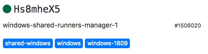

# Get started with GitLab CI/CD

Use this document to get started with GitLab
[continuous integration](https://about.gitlab.com/stages-devops-lifecycle/continuous-integration/).

Before you start, make sure you have:

- GitLab 8.0 or later, or access to [GitLab.com](https://gitlab.com).
- A project in GitLab that you would like to use CI/CD for.
- Maintainer or owner access for the project.

If you are migrating from another CI/CD tool, view this documentation:

- [Migrate from CircleCI](../migration/circleci.md).
- [Migrate from Jenkins](../migration/jenkins.md).

## CI/CD process overview

To use GitLab CI/CD:

1. [Choose a runner to run your jobs](#choose-or-register-a-runner).
   If you don't have a runner, [install GitLab Runner](https://docs.gitlab.com/runner/install/)
   and [register a runner](https://docs.gitlab.com/runner/register/) for your instance, project, or group.
1. [Create a `.gitlab-ci.yml` file](#create-a-gitlab-ciyml-file)
   at the root of your repository. This file tells the runner what to do.
1. [Push the `.gitlab-ci.yml` file](#push-gitlab-ciyml-to-gitlab) to your repository.

The runner runs your jobs. The jobs [are displayed in a pipeline](#view-the-status-of-your-pipeline-and-jobs).

### Choose or register a runner

In GitLab, runners are agents that run your CI/CD jobs.

You may already have runners available for your project. These runners
include [shared runners](../runners/README.md#shared-runners), which are
available to all projects in your GitLab instance.

To view runners, go to **Settings > CI/CD** and expand **Runners**.
You can use any of the runners that are listed there.

Under each runner is a list of tags in white text on a blue background.
When you configure CI/CD, you can use these tags to specify that a specific runner should run your job.



These tags are not the same as tags on Docker images. Instead, if you have
a Windows runner and a macOS runner, for example, you can run specific jobs on each.

If no runners are listed on the **Runners** page in the UI, you or an administrator
must [install GitLab Runner](https://docs.gitlab.com/runner/install/) and
[register individual runners](https://docs.gitlab.com/runner/register/).

### Create a `.gitlab-ci.yml` file

The `.gitlab-ci.yml` file is a [YAML](https://en.wikipedia.org/wiki/YAML) file where
you configure specific instructions for GitLab CI/CD.

In this file, you define:

- The structure and order of jobs that the runner should execute.
- The decisions the runner should make when specific conditions are encountered.

For example, you may want to run a suite of tests when you check in to
any branch except `master`. Then, when you check in to `master`, you want
to run the same suite, but also publish your application.

All of this is defined in the `.gitlab-ci.yml` file.

A `.gitlab-ci.yml` file commonly has three [stages](../yaml/README.md#stages):

- `build`
- `test`
- `deploy`

You do not need to use all three stages; stages with no jobs are ignored.

To create a `.gitlab-ci.yml` file:

- In the root of your repository, create a file called `.gitlab-ci.yml`.
  Or, if you want to use a template from the project home page, click **Set up CI/CD**.
  From the **Apply a template** list, select a template.

If you have a generic project, you can use this example:

```yaml
test:
  stage: test
  script:
    - echo Hello, $GITLAB_USER_LOGIN!

deploy_prod:
  stage: deploy
  script:
    - echo Goodbye, $GITLAB_USER_LOGIN!
```

`$GITLAB_USER_LOGIN` is a [predefined variable](../variables/predefined_variables.md)
that is populated with your GitLab username when the job runs.

If you want to use a runner that has a `tag` of `windows`, you would specify it for the job:

```yaml
test:
  stage: test
  tags:
    - windows
  script:
    - echo Hello, $GITLAB_USER_LOGIN!
```

If you want the runner to use a Docker image to run the jobs, edit the `.gitlab-ci.yml` file to include:

```yaml
image: ruby:2.7.2
```

This command tells the runner to use a Ruby image from Docker Hub.

To validate your `.gitlab-ci.yml` file, use the
[CI Lint tool](../lint.md), which is available in every project.

You can also use [CI/CD configuration visualization](../yaml/visualization.md) to
view a graphical representation of your `.gitlab-ci.yml` file.

For the complete `.gitlab-ci.yml` syntax, see
[the `.gitlab-ci.yml` reference topic](../yaml/README.md).

A [Ruby on Rails example](#ruby-on-rails-example) is also included below.

### Push `.gitlab-ci.yml` to GitLab

After you create a `.gitlab-ci.yml` file, add it to your Git repository
and push it to GitLab. You can do this in the GitLab UI or from the
command line:

```shell
git add .gitlab-ci.yml
git commit -m "Add .gitlab-ci.yml"
git push origin master
```

### View the status of your pipeline and jobs

To view your running pipeline, go **CI/CD > Pipelines**.

If you used the earlier example, you should see a pipeline with two stages:


If you hover over either stage, you can view the status. Click the name
of the stage, for example `test`, to view the job details.


NOTE: **Note:**
If your instance of GitLab pulls from a [mirrored repository](../../user/project/repository/repository_mirroring.md#pulling-from-a-remote-repository),
you may need to enable pipeline triggering. Go to your project's
**Settings > Repository > Pull from a remote repository** and select **Trigger pipelines for mirror updates**.

You can also view the pipeline by going to **Repository > Commits**.

Or view each individual job by going to **CI/CD > Jobs**.

If the job status is `stuck`, a runner is probably not configured for the project.

## Additional resources

View a list of [examples](../examples/README.md) that show how to use
various languages with GitLab CI/CD.

For help making your new pipelines faster and more efficient, see the
[pipeline efficiency documentation](../pipelines/pipeline_efficiency.md).

## Ruby on Rails example

If you have a Ruby on Rails project, you can use this example. The `ruby:2.7.2` image
referred to in this example is from Docker Hub.

```yaml
default:
  image: ruby:2.7.2
  before_script:
    - apt-get update
    - apt-get install -y sqlite3 libsqlite3-dev nodejs
    - ruby -v
    - which ruby
    - gem install bundler --no-document
    - bundle install --jobs $(nproc) "${FLAGS[@]}"

rspec:
  script:
    - bundle exec rspec

rubocop:
  script:
    - bundle exec rubocop
```

This configuration works for most Ruby applications.

- Two jobs are defined: `rspec` and `rubocop`. The names are arbitrary.
- Each job has different commands to be executed.
- Before each job, the commands defined by `before_script` are executed.
- The runner runs each job independently.
