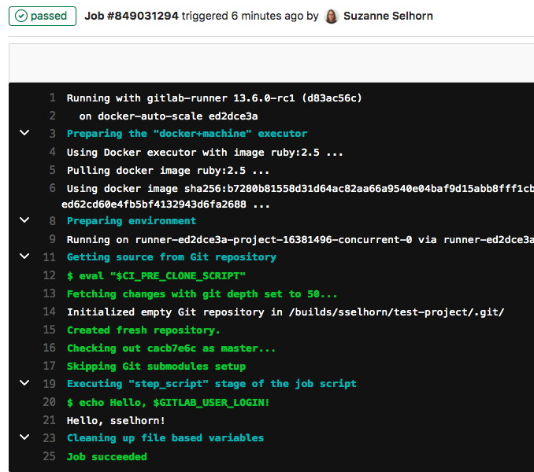

# Get started with GitLab CI/CD

Use this document to get started with
GitLab [continuous integration](https://about.gitlab.com/stages-devops-lifecycle/continuous-integration/).

Before you start, make sure you have:

- A project in GitLab that you would like to use CI/CD for.
- Maintainer or owner access for the project.

If you are migrating from another CI/CD tool, view this documentation:

- [Migrate from CircleCI](../migration/circleci.md).
- [Migrate from Jenkins](../migration/jenkins.md).

## CI/CD process overview

To use GitLab CI/CD:

1. [Ensure you have runners available](#ensure-you-have-runners-available) to run your jobs.
   If you don't have a runner, [install GitLab Runner](https://docs.gitlab.com/runner/install/)
   and [register a runner](https://docs.gitlab.com/runner/register/) for your instance, project, or group.
1. [Create a `.gitlab-ci.yml` file](#create-a-gitlab-ciyml-file)
   at the root of your repository. This file tells the runner what to do.

When you commit the file to your repository, the runner runs your jobs.
The job results [are displayed in a pipeline](#view-the-status-of-your-pipeline-and-jobs).

### Ensure you have runners available

In GitLab, runners are agents that run your CI/CD jobs.

You might already have runners available for your project, including
[shared runners](../runners/README.md#shared-runners), which are
available to all projects in your GitLab instance.

To view runners:

- Go to **Settings > CI/CD** and expand **Runners**.

As long as you have at least one runner that's active, with a green circle next to it,
you have a runner available to process your job.

If no runners are listed on the **Runners** page in the UI, you or an administrator
must [install GitLab Runner](https://docs.gitlab.com/runner/install/) and
[register individual runners](https://docs.gitlab.com/runner/register/).

If you are testing CI/CD, you can install GitLab Runner and register runners on your local machine.
When your CI/CD jobs run, they will run on your local machine.

### Create a `.gitlab-ci.yml` file

The `.gitlab-ci.yml` file is a [YAML](https://en.wikipedia.org/wiki/YAML) file where
you configure specific instructions for GitLab CI/CD.

In this file, you define:

- The structure and order of jobs that the runner should execute.
- The decisions the runner should make when specific conditions are encountered.

For example, you may want to run a suite of tests when you check in to
any branch except `master`. Then, when you check in to `master`, you want
to run the same suite, but also publish your application.

All of this is defined in the `.gitlab-ci.yml` file.

To create a `.gitlab-ci.yml` file:

1. Go to **Project overview > Details**.
1. Above the file list, select the branch you want to commit to,
   click the plus icon, then select **New file**:

   

1. From the **Select a template type** list, select `.gitlab-ci.yml`.
   Then select a template from the list.
   
   Or, for the **File name** type `.gitlab-ci.yml` and in the larger window,
   paste this sample code:

   ```yaml
   test:
     stage: test
     script:
       - echo Hello, $GITLAB_USER_LOGIN!

   deploy_prod:
     stage: deploy
     script:
       - echo Goodbye, $GITLAB_USER_LOGIN!
   ```

   `$GITLAB_USER_LOGIN` is a [predefined variable](../variables/predefined_variables.md)
   that is populated with your GitLab username when the job runs.

1. Click **Commit changes**.

The pipeline starts when the commit is successful.

#### `.gitlab-ci.yml` tips

- If you want the runner to use a Docker image to run the jobs, edit the `.gitlab-ci.yml` file to include:

  ```yaml
  image: ruby:2.7.2
  ```

  This command tells the runner to use a Ruby image from Docker Hub.

- To validate your `.gitlab-ci.yml` file, use the
  [CI Lint tool](../lint.md), which is available in every project.

- You can also use [CI/CD configuration visualization](../yaml/visualization.md) to
  view a graphical representation of your `.gitlab-ci.yml` file.

- For the complete `.gitlab-ci.yml` syntax, see
  [the `.gitlab-ci.yml` reference topic](../yaml/README.md).

- A [Ruby on Rails example](#ruby-on-rails-example) is also included below.

### View the status of your pipeline and jobs

When you committed your changes, a pipeline started. To view your pipeline:

- Go **CI/CD > Pipelines**.

If you used the earlier sample code, a pipeline with two stages should be displayed:


If you hover over either stage, you can view the status. Click the name
of the stage, for example `test`, to view the job details. The output should be
similar to this:



NOTE: **Note:**
If your instance of GitLab pulls from a [mirrored repository](../../user/project/repository/repository_mirroring.md#pulling-from-a-remote-repository),
you may need to enable pipeline triggering. Go to your project's
**Settings > Repository > Pull from a remote repository** and select **Trigger pipelines for mirror updates**.

You can also view the pipeline by going to **Repository > Commits**.

Or view each individual job by going to **CI/CD > Jobs**.

If the job status is `stuck`, a runner is probably not configured for the project.

## Ruby on Rails example

If you have a Ruby on Rails project, you can use this example. The `ruby:2.7.2` image
in this example is on [Docker Hub](https://hub.docker.com/).

```yaml
default:
  image: ruby:2.7.2
  before_script:
    - apt-get update
    - apt-get install -y sqlite3 libsqlite3-dev nodejs
    - ruby -v
    - which ruby
    - gem install bundler --no-document
    - bundle install --jobs $(nproc) "${FLAGS[@]}"

rspec:
  script:
    - bundle exec rspec

rubocop:
  script:
    - bundle exec rubocop
```

This configuration works for most Ruby applications.

- Two jobs are defined: `rspec` and `rubocop`. The names are arbitrary.
- Each job has different commands to be executed.
- Before each job, the commands defined by `before_script` are executed.
- The runner runs each job independently.
