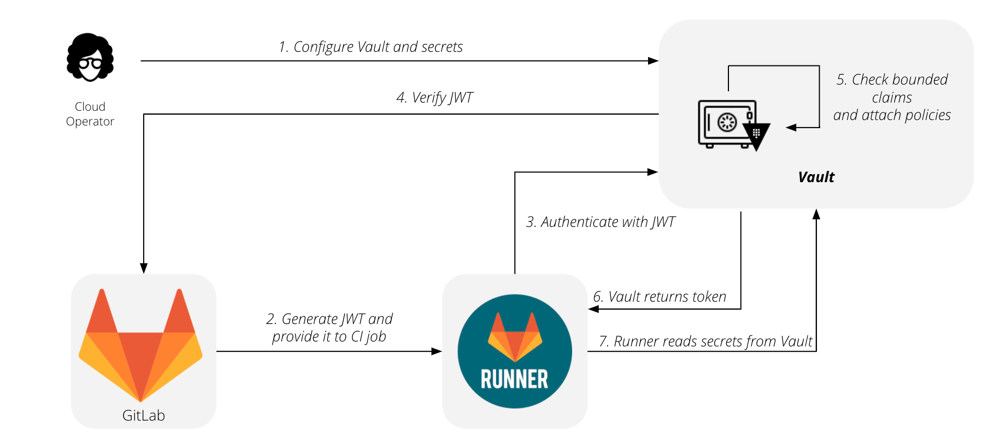

# Using external secrets in CI

> - [Introduced](https://gitlab.com/gitlab-org/gitlab/-/issues/218746) in GitLab 13.4 and GitLab Runner 13.4.

Secrets represent sensitive information your CI job needs to complete work. This
sensitive information can be items like API tokens, database credentials, or private keys.
Secrets are sourced from your secrets provider.

Unlike CI variables, which are always presented to a job, secrets must be explicitly
required by a job. Read [GitLab CI/CD pipeline configuration reference](../yaml/README.md#secrets)
for more information about the syntax.

GitLab has selected [Vault by HashiCorp](https://www.vaultproject.io) as the
first supported provider, and [KV-V2](https://www.vaultproject.io/docs/secrets/kv/kv-v2)
as the first supported secrets engine.

GitLab authenticates using Vault's
[JSON Web Token (JWT) authentication method](https://www.vaultproject.io/docs/auth/jwt#jwt-authentication), using
the [JSON Web Token](https://gitlab.com/gitlab-org/gitlab/-/issues/207125) (`CI_JOB_JWT`)
introduced in GitLab 12.10.

You must [configure your Vault server](#configure-your-vault-server) before you
can use [use Vault secrets in a CI job](#use-vault-secrets-in-a-ci-job).

The flow for using GitLab with HashiCorp Vault
is summarized by this diagram:



1. Configure your vault and secrets.
1. Generate your JWT and provide it to your CI job.
1. Runner contacts HashiCorp Vault and authenticates using the JWT.
1. HashiCorp Vault verifies the JWT.
1. HashiCorp Vault checks the bounded claims and attaches policies.
1. HashiCorp Vault returns the token.
1. Runner reads secrets from the HashiCorp Vault.

NOTE:
Read the [Authenticating and Reading Secrets With HashiCorp Vault](../examples/authenticating-with-hashicorp-vault/index.md)
tutorial for a version of this feature. It's available to all
subscription levels, supports writing secrets to and deleting secrets from Vault,
and supports multiple secrets engines.

## Configure your Vault server

To configure your Vault server:

1. Enable the authentication method by running these commands. They provide your Vault
   server the [JSON Web Key Set](https://tools.ietf.org/html/rfc7517) (JWKS) endpoint for your GitLab instance, so Vault
   can fetch the public signing key and verify the JSON Web Token (JWT) when authenticating:

   ```shell
   $ vault auth enable jwt

   $ vault write auth/jwt/config \
     jwks_url="https://gitlab.example.com/-/jwks" \
     bound_issuer="gitlab.example.com"
   ```

1. Configure policies on your Vault server to grant or forbid access to certain
   paths and operations. This example grants read access to the set of secrets
   required by your production environment:

   ```shell
   vault policy write myproject-production - <<EOF
   # Read-only permission on 'ops/data/production/*' path

   path "ops/data/production/*" {
     capabilities = [ "read" ]
   }
   EOF
   ```

1. Configure roles on your Vault server, restricting roles to a project or namespace,
   as described in [Configure Vault server roles](#configure-vault-server-roles) on this page.
1. [Create the following CI variables](../variables/README.md#custom-environment-variables)
   to provide details about your Vault server:
   - `VAULT_SERVER_URL` - The URL of your Vault server, such as `https://vault.example.com:8200`.
     Required.
   - `VAULT_AUTH_ROLE` - (Optional) The role to use when attempting to authenticate.
     If no role is specified, Vault uses the [default role](https://www.vaultproject.io/api/auth/jwt#default_role)
     specified when the authentication method was configured.
   - `VAULT_AUTH_PATH` - (Optional) The path where the authentication method is mounted, default is `jwt`.

   NOTE:
   Support for [providing these values in the user interface](https://gitlab.com/gitlab-org/gitlab/-/issues/218677)
   is planned but not yet implemented.

## Use Vault secrets in a CI job **(PREMIUM)**

> - [Introduced](https://gitlab.com/gitlab-org/gitlab/-/issues/28321) in [GitLab Premium](https://about.gitlab.com/pricing/) 13.4 and GitLab Runner 13.4.

After [configuring your Vault server](#configure-your-vault-server), you can use
the secrets stored in Vault by defining them with the `vault` keyword:

```yaml
secrets:
  DATABASE_PASSWORD:
    vault: production/db/password@ops  # translates to secret `ops/data/production/db`, field `password`
```

In this example:

- `production/db` - The secret.
- `password` The field.
- `ops` - The path where the secrets engine is mounted.

After GitLab fetches the secret from Vault, the value is saved in a temporary file.
The path to this file is stored in environment variable named `DATABASE_PASSWORD`,
similar to [CI variables of type `file`](../variables/README.md#custom-environment-variables-of-type-file).

For more information about the supported syntax, read the
[`.gitlab-ci.yml` reference](../yaml/README.md#secretsvault).

## Configure Vault server roles

When a CI job attempts to authenticate, it specifies a role. You can use roles to group
different policies together. If authentication is successful, these policies are
attached to the resulting Vault token.

[Bound claims](https://www.vaultproject.io/docs/auth/jwt#bound-claims) are predefined
values that are matched to the JWT's claims. With bounded claims, you can restrict access
to specific GitLab users, specific projects, or even jobs running for specific Git
references. You can have as many bounded claims you need, but they must *all* match
for authentication to be successful.

Combining bounded claims with GitLab features like [user roles](../../user/permissions.md)
and [protected branches](../../user/project/protected_branches.md), you can tailor
these rules to fit your specific use case. In this example, authentication is allowed
only for jobs running for protected tags with names matching the pattern used for
production releases:

```shell
$ vault write auth/jwt/role/myproject-production - <<EOF
{
  "role_type": "jwt",
  "policies": ["myproject-production"],
  "token_explicit_max_ttl": 60,
  "user_claim": "user_email",
  "bound_claims_type": "glob",
  "bound_claims": {
    "project_id": "42",
    "ref_protected": "true",
    "ref_type": "tag",
    "ref": "auto-deploy-*"
  }
}
EOF
```

WARNING:
Always restrict your roles to a project or namespace by using one of the provided
claims like `project_id` or `namespace_id`. Without these restrictions, any JWT
generated by this GitLab instance may be allowed to authenticate using this role.

For a full list of `CI_JOB_JWT` claims, read the
[How it works](../examples/authenticating-with-hashicorp-vault/index.md#how-it-works) section of the
[Authenticating and Reading Secrets With HashiCorp Vault](../examples/authenticating-with-hashicorp-vault/index.md) tutorial.

You can also specify some attributes for the resulting Vault tokens, such as time-to-live,
IP address range, and number of uses. The full list of options is available in
[Vault's documentation on creating roles](https://www.vaultproject.io/api/auth/jwt#create-role)
for the JSON web token method.

## Troubleshooting

### Updating `db_key_base` before upgrading to 13.6

A GitLab instance with a `db_key_base` shorter than 32 characters
will encounter a problem when upgrading to [GitLab 13.6](https://about.gitlab.com/releases/2020/11/22/gitlab-13-6-released/)
because it starts checking the `db_key_base` size
([gitlab!43950](https://gitlab.com/gitlab-org/gitlab/-/merge_requests/43950/)).

```plaintext
== 20201008013434 GenerateCiJwtSigningKey: migrating ==========================
STDERR:
---- End output of "bash"  "/tmp/chef-script..." ----
Ran "bash"  "/tmp/chef-script..." returned 1

Deprecations:
...

===
There was an error running gitlab-ctl reconfigure. Please check the output above for more
details.
===

dpkg: error processing package gitlab-ee (--configure):
 installed gitlab-ee package post-installation script subprocess returned error exit status 1
E: Sub-process /usr/bin/dpkg returned an error code (1)
```

#### Quick work-around

This problem can be addressed by skipping the related migration.
Executing the following in a
[Rails console](../../administration/operations/rails_console.md):

```ruby
ActiveRecord::Base.connection.execute("INSERT INTO schema_migrations VALUES ('20201008013434')")
```

After running `sudo gitlab-ctl reconfigure` to complete the upgrade,
the above can be reverted with

````ruby
ActiveRecord::Base.connection.execute("DELETE FROM schema_migrations WHERE version='20201008013434')")
```

This workaround has the known side-effect of
[the predefined `CI_JOB_JWT` variable](../variables/predefined_variables.md)
not being available, which is used mostly for integration with Hashicorp Vault.

#### Long-term solution

The long-term solution is to update the `db_key_base` and
to force a reset of each depent secret, key and token.
You can so so as follows:

1. Backup [your `gitlab-secrets.json` file](../../raketasks/backup_restore.md#storing-configuration-files).
1. Using a text editor, fill the short `db_key_base` value in `gitlab-secrets.json` with `0`s to the desired length (64, 128, etc.)
1. Run `sudo gitlab-ctl reconfigure` and `sudo gitlab-ctl restart`
1. Check the output of `sudo gitlab-rails runner "puts Settings.attr_encrypted_db_key_base.size"`. If that shows the same length you extended `db_key_base` earlier, it's safe to proceed.
1. Enter the [Rails console](../../administration/operations/rails_console.md).
1. Run the following script to check the affected secrets:

````ruby
table_column_combos = [
  [Namespace, "runners_token_encrypted"],
  [Project, "runners_token_encrypted"],
  [Ci::Build, "token_encrypted"],
  [Ci::Runner, "token_encrypted"],
  [ApplicationSetting, "runners_registration_token_encrypted"],
  [Group, "runners_token_encrypted"],
]
table_column_combos.each do |table,column|
  total = 0
  bad = []
  table.find_each do |data|
    begin
      total += 1
      ::Gitlab::CryptoHelper.aes256_gcm_decrypt(data[column])
    rescue => e
      bad << data
    end
  end
  puts "#{table.name}: #{bad.length} / #{total}"
end
````
    curl -o /tmp/secrets.rb https://gitlab.com/snippets/1800209/raw
    sudo gitlab-rails runner /tmp/secrets.rb

1. Proceed with resetting them by running with the following script:

````ruby
table_column_combos = [
  [Namespace, "runners_token_encrypted", "runners_token"],
  [Project, "runners_token_encrypted", "runners_token"],
  [Ci::Build, "token_encrypted", "token"],
  [Ci::Runner, "token_encrypted", "token"],
  [ApplicationSetting, "runners_registration_token_encrypted", "runners_registration_token"],
  [Group, "runners_token_encrypted"],
]

table_column_combos.each do |table,column,column2|
  total = 0
  fixed = 0
  removed = 0
  bad = []
  table.find_each do |data|
    begin
      total += 1
      ::Gitlab::CryptoHelper.aes256_gcm_decrypt(data[column])
    rescue => e
      if data[column2].to_s.empty?
        data[column] = nil
        data.save()
        removed += 1
      else
        data[column] = ::Gitlab::CryptoHelper.aes256_gcm_encrypt(data[column2])
        data.save()
        fixed += 1
      end
      bad << data
    end
  end
  puts "Table: #{table.name}    Bad #{bad.length} / Good #{total}, Fixed #{fixed}, Removed #{removed}"
end
````
