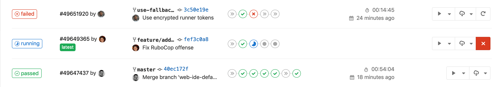
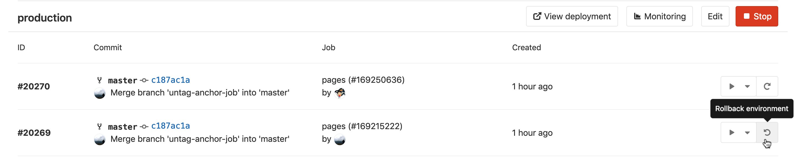

<!-- markdownlint-disable MD044 -->
# The .gitlab-ci.yml file
<!-- markdownlint-enable MD044 -->

To use GitLab CI/CD, you need:

- Application code hosted in a Git repository.
- Build, test, and deployment scripts in a file called [`.gitlab-ci.yml`](README.md),
  which is located in the root of your repository.

In the `.gitlab-ci.yml` file, you can define:

- The scripts you want to run.
- The dependencies you want to include and cache.
- The commands you want to run in sequence and those you want to run in parallel.
- The location to deploy your application to.
- Whether you want to run the scripts automatically or trigger any of them manually.

You should organize your scripts in a sequence that suits your application and is in accordance with
the tests you wish to perform. To [visualize](visualization.md) the process, imagine
the scripts you add are the same as the commands you would run on a terminal on your computer.

The scripts are grouped into **jobs**, and jobs run as part of a larger
**pipeline**.

When you add a `.gitlab-ci.yml` file to your
repository, GitLab detects it and an application called [GitLab Runner](https://docs.gitlab.com/runner/)
runs the jobs. Runner works similarly to your terminal.

A `.gitlab-ci.yml` file might contain:

```yaml
before_script:
  - apt-get install rubygems ruby-dev -y

run-test:
  script:
    - ruby --version
```

In this example, the `before_script` job installs the dependencies
for your app. Then a **job** called `run-test` prints the Ruby version of the current system.
Both of these jobs compose a **pipeline** that is triggered for every push
to any branch of the repository.

GitLab CI/CD not only executes the jobs but also shows you what's happening during execution,
just as you would see in your terminal:


You create the strategy for your app and GitLab runs the pipeline
according to what you've defined. Your pipeline status is also
displayed by GitLab:



If anything goes wrong, you can
[roll back](../environments/index.md#retrying-and-rolling-back) the changes:



[View the full syntax for the `.gitlab-ci.yml` file](README.md).
