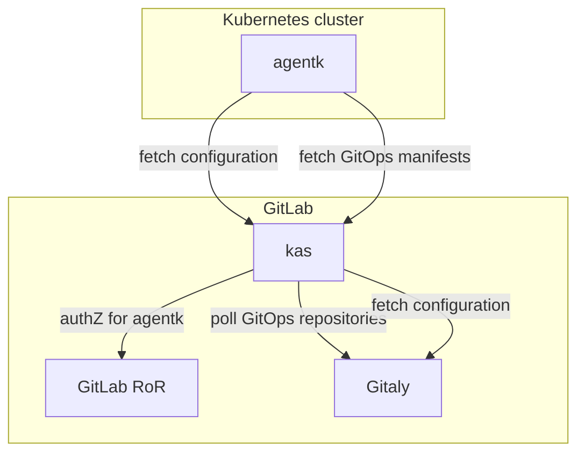

# GitOps with the Kubernetes Agent **(PREMIUM ONLY)**

The [GitLab Kubernetes Agent](../../user/clusters/agent/index.md) supports the
[pull-based version](https://www.gitops.tech/#pull-based-deployments) of
[GitOps](https://www.gitops.tech/). To use it, you must be able to perform these tasks:

- Connect one or more Kubernetes clusters to a GitLab project or group.
- Synchronize cluster-wide state from a Git repository.
- Synchronize namespace-scoped state from a Git repository.
- Control the following settings:

  - The kinds of objects an agent can merge.
  - Enabling the namespaced mode of operation for managing objects only in a specific namespace.
  - Enabling the non-namespaced mode of operation for managing objects in any namespace, and
    managing non-namespaced objects.

- Synchronize state from one or more Git repositories into a cluster.
- Configure multiple agents running in different clusters to synchronize state
  from the same repository.

## GitOps architecture

In this architecture, the Kubernetes cluster (`agentk`) periodically fetches
configuration from (`kas`), spawning a goroutine for each configured GitOps
repository. Each goroutine makes a streaming `GetObjectsToSynchronize()` gRPC call.
`kas` accepts these requests, then checks if this agent is authorized to access
this GitLab repository. If authorized, `kas` polls Gitaly for repository updates
and sends the latest manifests to the agent.

Before each poll, `kas` verifies with GitLab that the agent's token is still valid.
When `agentk` receives an updated manifest, it performs a synchronization using
[`gitops-engine`](https://github.com/argoproj/gitops-engine).

If a repository is removed from the list, `agentk` stops the `GetObjectsToSynchronize()`
calls to that repository.

