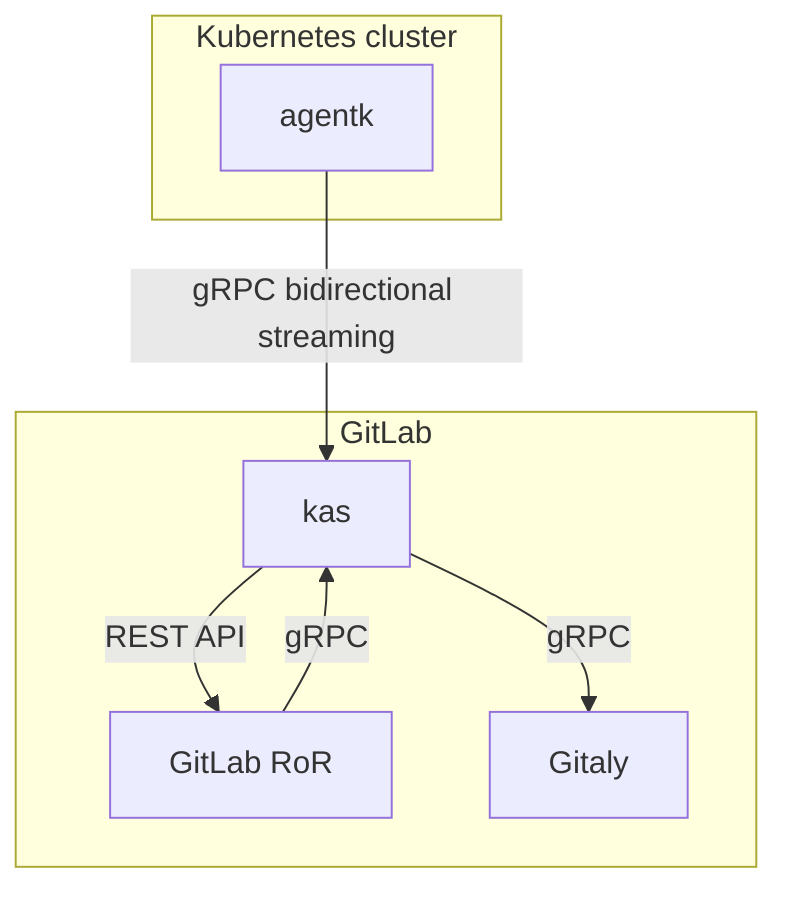

# GitLab Kubernetes Agent developer information **(PREMIUM ONLY)**

This page contains developer-specific information about the GitLab Kubernetes Agent.
[End-user documentation about the GitLab Kubernetes Agent](../../user/clusters/agent/index.md)
is also available.

## Architecture of the Kubernetes Agent

The GitLab Kubernetes Agent and the GitLab Kubernetes Agent Server use
[bidirectional streaming](https://grpc.io/docs/guides/concepts/#bidirectional-streaming-rpc)
to allow the connection acceptor (the gRPC server, GitLab Kubernetes Agent Server) to
act as a client, sending requests as gRPC replies. The client-server relationship is
inverted because the connection must by initiated from inside the Kubernetes cluster
to bypass any firewall or NAT the cluster may be located behind. To learn more about
this inversion, read [issue #212810](https://gitlab.com/gitlab-org/gitlab/-/issues/212810).

This diagram describes how GitLab (`GitLab RoR`), the GitLab Kubernetes Agent (`agentk`), and the GitLab Kubernetes Agent Server (`kas`) work together.

- `GitLab RoR` is the main GitLab application. It uses gRPC to talk to `kas`.
- `agentk` is the GitLab Kubernetes Agent. It keeps a connection established to a
  `kas` instance, waiting for requests to process. It may also actively send information
  about things happening in the cluster.
- `kas` is the GitLab Kubernetes Agent Server, and is responsible for:
  - Accepting requests from `agentk`.
  - Authentication of requests from `agentk` by querying `GitLab RoR`.
  - Fetching agent's configuration from a corresponding Git repository by querying Gitaly.
  - Matching incoming requests from `GitLab RoR` with existing connections from
    the right `agentk`, forwarding requests to it and forwarding responses back.
  - (Optional) Sending notifications through ActionCable for events received from `agentk`.
  - Polling manifest repositories for [GitOps support](gitops.md) by communicating with Gitaly.
