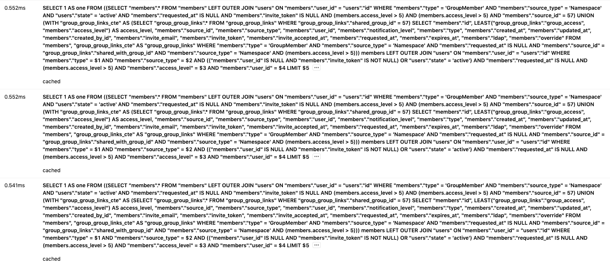
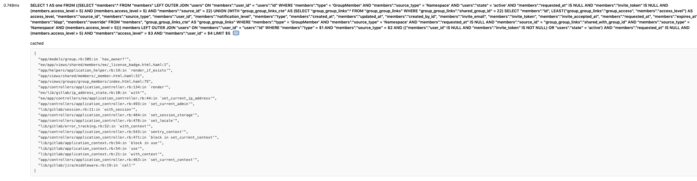

# Cached Queries

Rails provides an [SQL query cache](https://guides.rubyonrails.org/caching_with_rails.html#sql-caching), 
used to cache the results of database queries for the duration of the request. 
If Rails encounters the same query again for that request,
it will use the cached result set as opposed to running the query against the database again.
The query results are only cached for the duration of that single request, it does not persist across multiple requests.

## Why cached queries are considered bad

The cached queries help with reducing DB load, but they still:

- Consume memory.
- Require as to re-instantiate each `ActiveRecord` object.
- Require as to re-instantiate each relation of the object.
- Make us spend additional CPU-cycles to look into a list of cached queries.

They are cheaper, but they are not cheap at all from `memory` perspective.
 
Cached SQL queries, could mask [N+1 query problem](https://guides.rubyonrails.org/active_record_querying.html#eager-loading-associations).
If those N queries are executing the same query, it will not hit the database N times, it will return the cached results instead,
which is still expensive since we need to re-initialize objects each time, and this is CPU/Memory expensive.
Instead, you should use the same in-memory objects, if possible. 

## How to detect

### 1. Detect potential offenders by using Kibana

On GitLab.com, we are logging entries with the number of executed cached queries in the
`pubsub-redis-inf-gprd*` index with the [`db_cached_count`](https://log.gprd.gitlab.net/goto/77d18d80ad84c5df1bf1da5c2cd35b82).
We can filter end-points that have a large number of executed cached queries. 

For more cached queries Kibana visualizations see [this issue](https://gitlab.com/gitlab-org/gitlab/-/issues/)

### 2. Inspect suspicious end-point using Performance Bar

When building features, you could use [Performance bar](../administration/monitoring/performance/performance_bar.md)
in order to list Database queries, which will include cached queries as well. 

## What to look for

Using [`Kibana`](cached_queries.md#detect-potential-offenders-by-using-kibana), you can look for a large number
of executed cached queries. End-points with large number of `db_cached_count` could indicate that there are 
probably a lot of duplicated cached queries, which often indicates a masked N+1 query.

When you investigate specific endpoint, you could use [Performance bar](cached_queries.md#2-inspect-suspicious-end-point-using-performance-bar).
If you see a lot of similar queries, this often indicates an N+1 query issue (or a similar kind of query batching problem).
If you see same cached query executed multiple times, this often indicates a masked N+1 query problem.

For example, let's say you wanted to debug `GroupMembers` page. 

In `Performance bar` left corner you could see **Database queries** showing the total number of database queries, 
and the number of executed cached queries, displayed in the format `00ms / 00 (00 cached) pg`.


We can see that there are 55 cached queries. By clicking on the number, a modal window with more details is shown:



Cached queries are marked with `cached` label, so they are easy to spot. We can see that there are multiple duplicated
cached queries. If we click on `...` for one of them, it will expand the actual stack trace:



The stack trace, shows us that we obviously have an N+1 problem, since we are repeatably executing:

```ruby
group.has_owner?(current_user)
```

for each group member. 

This is easily solvable by extracting this check, above the loop.

After [the fix](https://gitlab.com/gitlab-org/gitlab/-/issues/231468), we now have:


We can see that we reduced the number of total executed queries from 144 to 95. 
We have improved duration time by 87%, and reduced the number of executed cached queries (from 55 to 6).

## How to measure the impact of the change

We can use [Memory profiling](performance.md#memory-profiling) 
