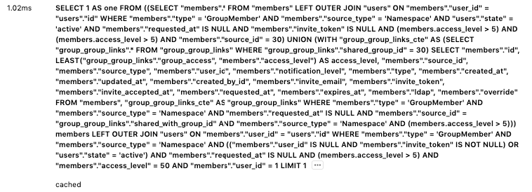

# Cached queries guidelines

Rails provides an [SQL query cache](https://guides.rubyonrails.org/caching_with_rails.html#sql-caching)
which is used to cache the results of database queries for the duration of a request.

If Rails encounters the same query again for that request,
it will use the cached result set as opposed to running the query against the database again.

The query results are only cached for the duration of that single request, they do not persist across multiple requests.

## Why cached queries are considered bad

Cached queries help by reducing the load on the database, but they still:

- Consume memory
- Require Rails to re-instantiate each `ActiveRecord` object
- Require Rails to re-instantiate each relation of the object
- Make us spend additional CPU-cycles to look into a list of cached queries

Although cached queries are cheaper from a database perspective, they are potentially more expensive from a `memory` perspective.
They could mask [N+1 query problems](https://guides.rubyonrails.org/active_record_querying.html#eager-loading-associations),
so we should treat them the same way we treat regular N+1 queries.

In cases of N+1 queries masked by cached queries, we are executing the same query N times.
It will not hit the database N times but will instead return the cached results N times.
This is still expensive since we need to re-initialize objects each time at a greater expense to our CPU & Memory resources.
Instead, we should use the same in-memory objects whenever possible.

When we introduce a new feature, we should avoid N+1 problems,
minimize the [query count](merge_request_performance_guidelines.md#query-counts), and pay special attention that [cached
queries](merge_request_performance_guidelines.md#cached-queries) are not masking N+1 problems.

## How to detect

### Detect potential offenders by using Kibana

On GitLab.com, we are logging entries with the number of executed cached queries in the
`pubsub-redis-inf-gprd*` index with the [`db_cached_count`](https://log.gprd.gitlab.net/goto/77d18d80ad84c5df1bf1da5c2cd35b82).
We can filter endpoints that have a large number of executed cached queries. For example, if we encounter an endpoint
that has 100+ `db_cached_count`, this could indicate that there is an N+1 problem which  is masked by cached queries.
We should investigate this endpoint further to see if we are indeed executing duplicated cached queries.

For more cached-queries-related Kibana visualizations see [this issue](https://gitlab.com/gitlab-org/gitlab/-/issues/259007).

### Inspect suspicious endpoints using the Performance Bar

When building features, you should use the [performance bar](../administration/monitoring/performance/performance_bar.md)
to view the list of database queries, which will also include any cached queries. The performance bar will show a warning
when the threshold of total executed queries (including cached ones) has exceeded 100 queries.

## What to look for

Using [Kibana](cached_queries.md#detect-potential-offenders-by-using-kibana), you can look for a large number
of executed cached queries. End-points with a large `db_cached_count` could indicate that there
are a lot of duplicated cached queries, which often indicates a masked N+1 problem.

When you investigate a specific endpoint, you should use
the [performance bar](cached_queries.md#inspect-suspicious-endpoint-using-performance-bar)
to see if there are a lot of similar queries. This often indicates an N+1 query issue (or a similar kind of query batching problem).
If you see the same cached query executed multiple times, this often indicates a masked N+1 query problem.

### An example

For example, let's say you wanted to debug the `GroupMembers` page.

In the left corner of the performance bar you can see **Database queries** showing the total number of database queries
and the number of executed cached queries:


We can see that there are 55 cached queries. By clicking on that number, a modal window with more details is shown.
Cached queries are marked with the `cached` label, so they are easy to spot. We can see that there are multiple duplicate
cached queries:



If we click on `...` for one of them, it will expand the actual stack trace:

```ruby
[
  "app/models/group.rb:305:in `has_owner?'",
  "ee/app/views/shared/members/ee/_license_badge.html.haml:1",
  "app/helpers/application_helper.rb:19:in `render_if_exists'",
  "app/views/shared/members/_member.html.haml:31",
  "app/views/groups/group_members/index.html.haml:75",
  "app/controllers/application_controller.rb:134:in `render'",
  "ee/lib/gitlab/ip_address_state.rb:10:in `with'",
  "ee/app/controllers/ee/application_controller.rb:44:in `set_current_ip_address'",
  "app/controllers/application_controller.rb:493:in `set_current_admin'",
  "lib/gitlab/session.rb:11:in `with_session'",
  "app/controllers/application_controller.rb:484:in `set_session_storage'",
  "app/controllers/application_controller.rb:478:in `set_locale'",
  "lib/gitlab/error_tracking.rb:52:in `with_context'",
  "app/controllers/application_controller.rb:543:in `sentry_context'",
  "app/controllers/application_controller.rb:471:in `block in set_current_context'",
  "lib/gitlab/application_context.rb:54:in `block in use'",
  "lib/gitlab/application_context.rb:54:in `use'",
  "lib/gitlab/application_context.rb:21:in `with_context'",
  "app/controllers/application_controller.rb:463:in `set_current_context'",
  "lib/gitlab/jira/middleware.rb:19:in `call'"
]
```

The stack trace, shows us that we obviously have an N+1 problem, since we are repeatably executing `has_owner?(current_user)` for each group member:

```ruby
group.has_owner?(current_user)
```

This is easily solvable by moving this check to be outside of the loop:

```erb
- current_user_is_group_owner = @group && @group.has_owner?(current_user)

= render  partial: 'shared/members/member',
          collection: @members, as: :member,
          locals: { membership_source: @group,
                    group: @group,
                    show_controls: false,
                    current_user_is_group_owner: current_user_is_group_owner }
```

After [the fix](https://gitlab.com/gitlab-org/gitlab/-/merge_requests/44626/diffs#27c2761d66e496495be07d0925697f7e62b5bd14), we'll now see this in the performance bar:


## How to measure the impact of the change

We can use the [memory profiler](performance.md#using-memory-profiler) to profile our code.
In [our example](#an-example), we could wrap the profiler around the `Groups::GroupMembersController#index` action.

We had the following stats before the fix:

- Total allocated: 7133601 bytes (84858 objects)
- Total retained: 757595 bytes (6070 objects)
- `db_count`: 144
- `db_cached_count`: 55
- `db_duration`: 303ms

And after the fix, we can see that we have reduced the allocated memory as well as the number of cached queries and have improved the overall execution time:

- Total allocated: 5313899 bytes (65290 objects), 1810KB (25%) less
- Total retained: 685593 bytes (5278 objects), 72KB (9%) less
- `db_count`: 95 (34% less)
- `db_cached_count`: 6 (89% less)
- `db_duration`: 162ms (87% faster)

## See also

- [Metrics that would help us detect the potential N+1 Cached SQL calls](https://gitlab.com/gitlab-org/gitlab/-/issues/259007)
- [Merge Request performance guidelines for cached queries](merge_request_performance_guidelines.md#cached-queries)
- [Improvements for biggest offenders](https://gitlab.com/groups/gitlab-org/-/epics/4508)
