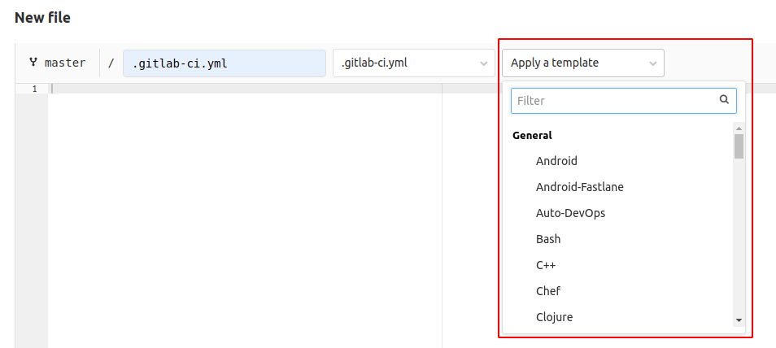

# Development guide for GitLab CI/CD templates

This document explains how to develop [GitLab CI/CD templates](../../ci/examples/README.md).

## Requirements

Before submitting a template for review in a merge request, you must ensure that
the template submission:

- Name follows the `*.gitlab-ci.yml` format.
- Is in the correct [directory](#template-directories).
- Uses valid [`.gitlab-ci.yml` syntax](../../ci/yaml/README.md). Verify it's valid
  with the [CI/CD lint tool](../../ci/lint.md). Follow the [CI/CD template authoring guidelines](#template-authoring-guidelines).
- Includes [a changelog](../changelog.md) if your merge request introduces a user-facing change.
- Follows the [template review process](#contribute-cicd-template-merge-requests).

## Template directories

All template files are in `lib/gitlab/ci/templates`. Place most general templates
in this directory. Certain template types have a specific directory reserved for
them. The ability to [select a template in new file UI](#make-sure-the-new-template-can-be-selected-in-ui)
is determined by the directory it is in:

| Sub-directory  | Selectable in UI | Template type |
|----------------|------------------|---------------|
| `/*` (root)    | Yes              | General templates. |
| `/AWS/*`       | No               | Templates related to Cloud Deployment (AWS). |
| `/Jobs/*`      | No               | Templates related to Auto DevOps. |
| `/Pages/*`     | Yes              | Sample templates for using Static site generators with GitLab Pages. |
| `/Security/*`  | Yes              | Templates related to Security scanners. |
| `/Terraform/*` | No               | Templates related to infrastructure as Code (Terraform). |
| `/Verify/*`    | Yes              | Templates related to Testing features. |
| `/Workflows/*` | No               | Sample templates for using the `workflow:` keyword. |

## Template authoring guidelines

Use the following guidelines to ensure your template submission follows standards.

- Avoid using [global keywords](../../ci/yaml/README.md#global-keywords), such as
  `image`, `stages` and `variables` at top-level. When a root `.gitlab-ci.yml`
  [includes](../../ci/yaml/README.md#include) multiple templates, these global keywords
  could be overridden by the others and cause an unexpected behavior.
- Use [`rules`](../../ci/yaml/README.md#rules) instead of [`only` or `except`](../../ci/yaml/README.md#onlyexcept-basic),
  if possible.

### Syntax guidelines

To make templates easier to follow, templates should all use clear syntax styles,
with a consistent format.

#### Do not hardcode the default branch

Use [`$CI_COMMIT_BRANCH == $CI_DEFAULT_BRANCH`](../../ci/variables/predefined_variables.md)
instead of a hardcoded `main` branch, and never use `master`:

```yaml
job1:
  rules:
    if: $CI_COMMIT_BRANCH == $CI_DEFAULT_BRANCH
  script:
    echo "example job 1"

job2:
  only:
    variables:
      - $CI_COMMIT_BRANCH == $CI_DEFAULT_BRANCH
  script:
    echo "example job 2"

```

#### Break up long commands

If a command is very long, or has many command line flags, like `-o` or `--option`:

- Split these up into a multi-line command to make it easier to see every part of the command.
- Use the full name of the flags, if possible.

```yaml
job1:
  script:
    - 'curl -X POST -H "PRIVATE-TOKEN: $TOKEN" -F description="my description" "https://gitlab.example.com/api/v4/projects/1/triggers"'

better-job1:
  script:
    - 'curl --request POST
            --header "PRIVATE-TOKEN: $TOKEN"
            --form description="my description"
            --url "https://gitlab.example.com/api/v4/projects/1/triggers"'
```

### Explain the template with comments

The templates can be accessed from the new file menu, and this might be the only
place users see information about the template. It's important to clearly document
the behavior of the template directly in the template itself.

The following guidelines are the basic comments expected in all template submissions,
but more comments are useful, especially for [template reviewers](#contribute-cicd-template-merge-requests).

#### Explain requirements and expectations

Give the details on how to use the template in `#` comments at the top of the file.
This includes:

- Repository/project requirements.
- Expected behavior.
- Any places that need to be edited by users before using the template.
- If the template should be used by copy pasting it into a configuration file, or
  by using it with the `include` keyword in an existing pipeline.
- If any variables need to be saved in the project's CI/CD settings.

```yaml
# Use this template to publish an application that uses the ABC server.
# You can copy and paste this template into a new `.gitlab-ci.yml` file.
# You should not add this template to an existing `.gitlab-ci.yml` file with the `include:` keyword.
#
# Requirements:
# - An ABC project with content saved in /content and tests in /test
# - A CI/CD variable named ABC-PASSWORD saved in the project CI/CD settings. The value
#   should be the password used to deploy to your ABC server.
# - An ABC server configured to listen on port 12345.
#
# You must change the URL on line 123 to point to your ABC server and port.
#
# For more information, see https://gitlab.com/example/abcserver/README.md

job1:
  ...
```

#### Explain variables

If the template uses variables, explain them in `#` comments where they are first
defined. You can skip the comment when the variable is trivially clear:

```yaml
variables:                        # (Good to have a comment here)
  TEST-CODE-PATH: <path/to/code>  # Update this variable with the relative path to your Ruby specs

job1:
  variables:
    - ERROR-MESSAGE: "The $TEST-CODE-PATH is invalid"  # (No need for a comment here, it's already clear)
  script:
    - echo ${ERROR-MESSAGE}
```

### Backward compatibility

A template might be dynamically included with the `include:template:` keyword. If
you make a change to an *existing* template, you **must** make sure that it doesn't break
CI/CD in existing projects.

For example, changing a job name in a template could break pipelines in an existing project.
Let's say there is a template named `Performance.gitlab-ci.yml` with the following content:

```yaml
performance:
  image: registry.gitlab.com/gitlab-org/verify-tools/performance:v0.1.0
  script: ./performance-test $TARGET_URL
```

and users include this template with passing an argument to the `performance` job.
This can be done by specifying the CI/CD variable `TARGET_URL` in _their_ `.gitlab-ci.yml`:

```yaml
include:
  template: Performance.gitlab-ci.yml

performance:
  variables:
    TARGET_URL: https://awesome-app.com
```

If the job name `performance` in the template is renamed to `browser-performance`,
the user's `.gitlab-ci.yml` immediately causes a lint error because there
are no such jobs named `performance` in the included template anymore. Therefore,
users have to fix their `.gitlab-ci.yml` that could annoy their workflow.

Please read [versioning](#versioning) section for introducing breaking change safely.

## Versioning

Versioning allows you to introduce a new template without modifying the existing
one. This process is useful when we need to introduce a breaking change,
but don't want to affect the existing projects that depends on the current template.

### Stable version

A stable CI/CD template is a template that only introduces breaking changes in major
release milestones. Name the stable version of a template as `<template-name>.gitlab-ci.yml`,
for example `Jobs/Deploy.gitlab-ci.yml`.

You can make a new stable template by copying [the latest template](#latest-version)
available in a major milestone release of GitLab like `13.0`. All breaking changes
must be announced in a blog post before the official release, for example
[GitLab.com is moving to 13.0, with narrow breaking changes](https://about.gitlab.com/blog/2020/05/06/gitlab-com-13-0-breaking-changes/)

You can change a stable template version in a minor GitLab release like `13.1` if:

- The change is not a [breaking change](#backward-compatibility).
- The change is ported to [the latest template](#latest-version), if one exists.

### Latest version

Templates marked as `latest` can be updated in any release, even with
[breaking changes](#backward-compatibility). Add `.latest` to the template name if
it's considered the latest version, for example `Jobs/Deploy.latest.gitlab-ci.yml`.

When you introduce [a breaking change](#backward-compatibility),
you **must** test and document [the upgrade path](#verify-breaking-changes).
In general, we should not promote the latest template as the best option, as it could surprise users with unexpected problems.

If the `latest` template does not exist yet, you can copy [the stable template](#stable-version).

### How to include an older stable template

Users may want to use an older [stable template](#stable-version) that is not bundled
in the current GitLab package. For example, the stable templates in GitLab v13.0 and
GitLab v14.0 could be so different that a user wants to continue using the v13.0 template even
after upgrading to GitLab 14.0.

You can add a note in the template or in documentation explaining how to use `include:remote`
to include older template versions. If other templates are included with `include: template`,
they can be combined with the `include: remote`:

```yaml
# To use the v13 stable template, which is not included in v14, fetch the specific
# template from the remote template repository with the `include:remote:` keyword.
# If you fetch from the GitLab canonical project, use the following URL format:
# https://gitlab.com/gitlab-org/gitlab/-/raw/<version>/lib/gitlab/ci/templates/<template-name>
include:
  - template: Auto-DevOps.gitlab-ci.yml
  - remote: https://gitlab.com/gitlab-org/gitlab/-/raw/v13.0.1-ee/lib/gitlab/ci/templates/Jobs/Deploy.gitlab-ci.yml
```

### Further reading

There is an [open issue](https://gitlab.com/gitlab-org/gitlab/-/issues/17716) about
introducing versioning concepts in GitLab CI/CD Templates. You can check that issue to
follow the progress.

## Testing

Each CI/CD template must be tested in order to make sure that it's safe to be published.

### Manual QA

It's always good practice to test the template in a minimal demo project.
To do so, please follow the following steps:

1. Create a public sample project on <https://gitlab.com>.
1. Add a `.gitlab-ci.yml` to the project with the proposed template.
1. Run pipelines and make sure that everything runs properly, in all possible cases
   (merge request pipelines, schedules, and so on).
1. Link to the project in the description of the merge request that is adding a new template.

This is useful information for reviewers to make sure the template is safe to be merged.

### Make sure the new template can be selected in UI

Templates located under some directories are also [selectable in the **New file** UI](#place-the-template-file-in-a-relevant-directory).
When you add a template into one of those directories, make sure that it correctly appears in the dropdown:



### Write an RSpec test

You should write an RSpec test to make sure that pipeline jobs are generated correctly:

1. Add a test file at `spec/lib/gitlab/ci/templates/<template-category>/<template-name>_spec.rb`
1. Test that pipeline jobs are properly created via `Ci::CreatePipelineService`.

### Verify breaking changes

When you introduce a breaking change to [a `latest` template](#latest-version),
you must:

1. Test the upgrade path from [the stable template](#stable-version).
1. Verify what kind of errors users encounter.
1. Document it as a troubleshooting guide.

This information is important for users when [a stable template](#stable-version)
is updated in a major version GitLab release.

## Security

A template could contain malicious code. For example, a template that contains the `export` shell command in a job
might accidentally expose secret project CI/CD variables in a job log.
If you're unsure if it's secure or not, you need to ask security experts for cross-validation.

## Contribute CI/CD Template Merge Requests

After your CI/CD Template MR is created and labeled with `ci::templates`, DangerBot
suggests one reviewer and one maintainer that can review your code. When your merge
request is ready for review, please `@mention` the reviewer and ask them to review
your CI/CD Template changes. See details in the merge request that added
[a DangerBot task for CI/CD Template MRs](https://gitlab.com/gitlab-org/gitlab/-/merge_requests/44688).
