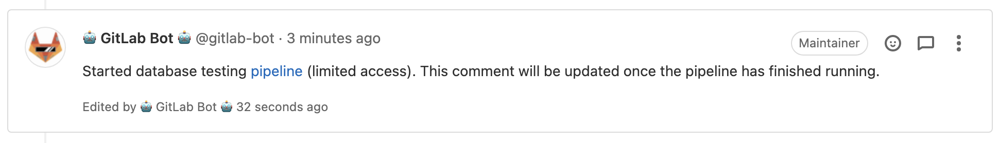
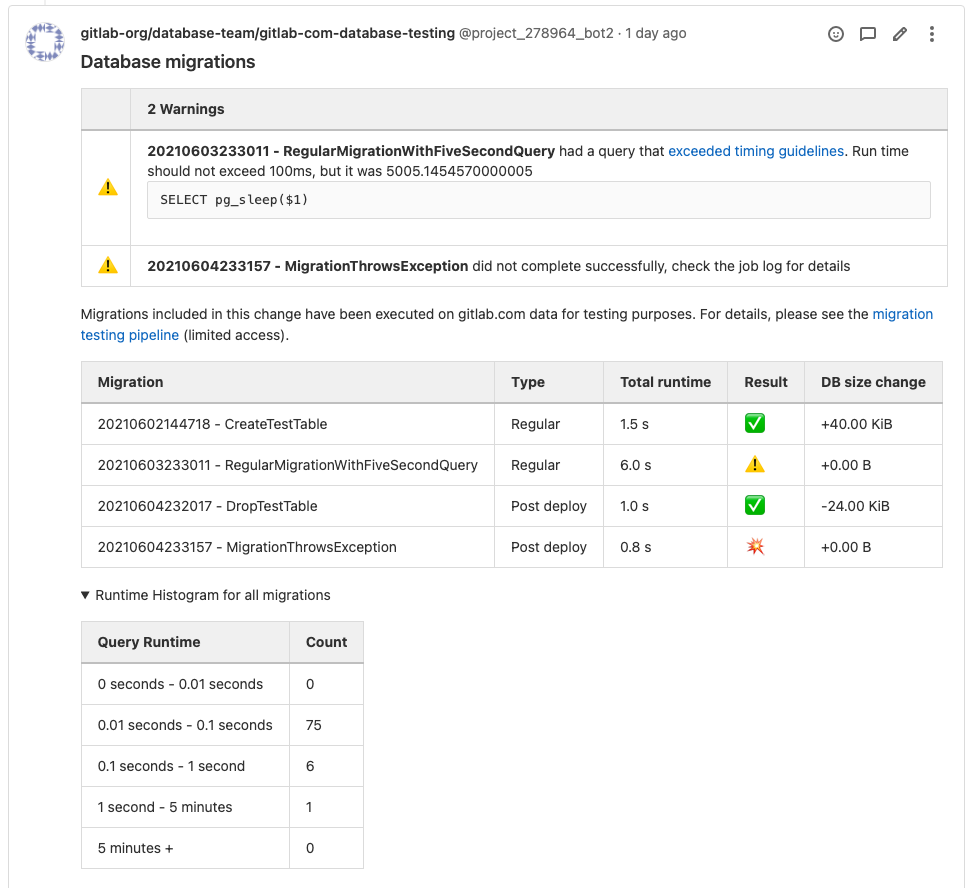
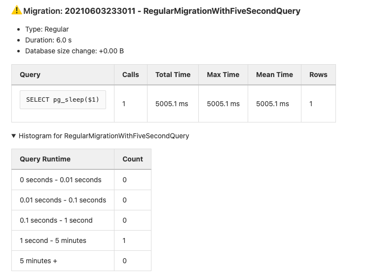
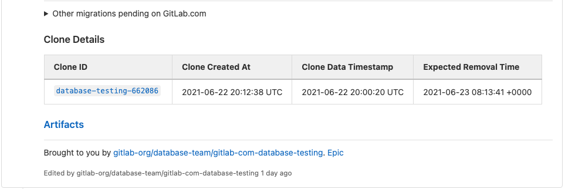

# Automated Migration Testing Pipeline

The Database team has developed a tool to automatically test migrations in a production-like environment (similar to `#database-lab`). It is based on an [architecture blueprint](../../architecture/blueprints/database_testing/index.md), and the project repo can be found [here](https://gitlab.com/gitlab-org/database-team/gitlab-com-database-testing).

Migration testing is enabled in the `gitlab-org/gitlab` project for MRs that add a new database migration. The testing pipeline is triggerred manually by running the `db:gitlabcom-database-testing` job within in `test` stage. This will start a pipeline on the `ops` GitLab instance. For security reason, access to the pipeline is restricted to database maintainers.

Once the pipeline is triggered, a comment will be posted on the MR to indicate that the pipeline is running:

When the pipeline is finished running, this comment will be updated with the test results.

The first section of the comment contains a summary of the test results. This is split into three parts:

1. Warnings - this section highlights critical issues such as exceptions or long-running queries.
2. Summary table - this section shows how long each migration took, whether or not it was successful, and how much it changed the size of the database.
3. Runtime histogram - this section (initially collapsed) shows a histogram of query runtimes across all migrations.

Below the summary section, the details of each migration are shown individually. There are three parts here:

1. Details - the type of migration, total duration, and database size change.
2. Queries - a table with all the queries that were executed during the migration, along with the number of calls, timings, and the number of rows touched.
3. Histogram - indicates the distribution of query times for the migration.

At the bottom of the comment, there are a few other pieces of information that may be useful:

1. Migrations pending on GitLab.com - a summary of migrations not yet deployed to GitLab's production environment. This section is useful when testing a migration that has already been merged, but has not yet been deployed.
2. Clone details - a link to the Postgres.ai thin clone created for this testing pipeline, along with information about its expiry. This is useful to further explore the results of running the migration.
3. Artifacts - a link to the pipeline's artifacts (accessible by database maintainers only). Full query logs for each migration (ending in `.log`) are available here.

