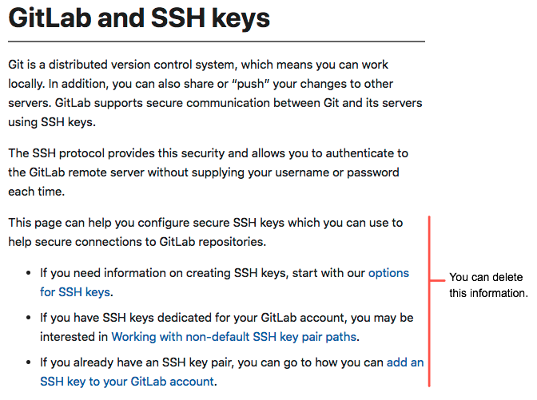
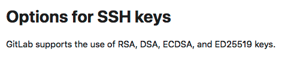
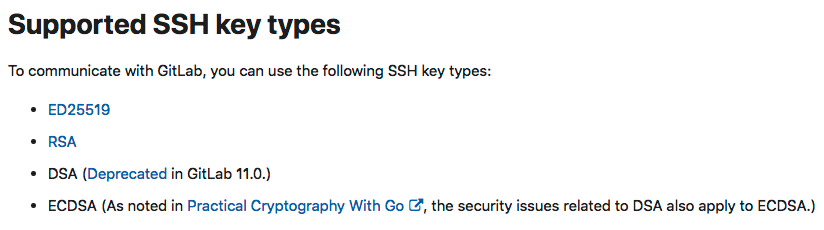
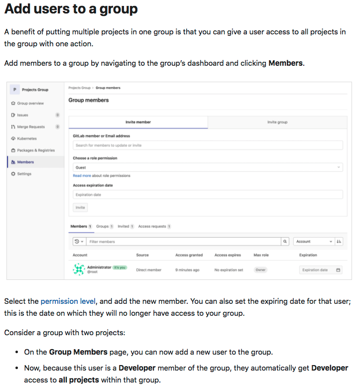
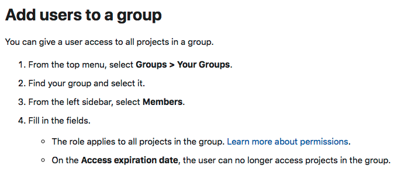
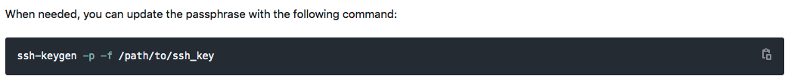
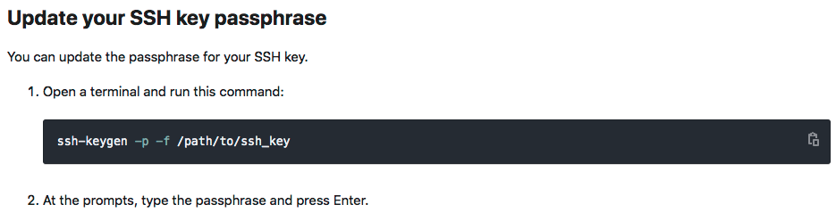

# Editing examples

The following examples show tips for how to edit your content so it's easier to scan.

## Don't repeat text from the navigation

Users want to scan quickly to find what they need. While you might
add extra text with the intention of being helpful, it's better to
pare down text so users can scan more easily. Less is more.

For example, we want to train people to navigate a page by using the right or left nav.

## Don't write what GitLab did

Rather than talking about the process GitLab went through to make something happen,
talk about how the reader can use what GitLab provides. For example:

> It is difficult to publish new GitLab Runner images to the RedHat OperatorHub, so we don't do it frequently.
> However, we maintain a repo where you can find other images.

Instead, talk directly to the reader:

> If you want a version of GitLab Runner that's not listed in the RedHat OperatorHub,
> go to this repo.

## Use titles someone might search for

Heading titles are an important aspect of search. When you create
a new topic, think of what you would type into Google. For example:

Instead, use a phrase that is closer to what you might search for.
And to build on the last example, you can also re-phrase this content to remove
what GitLab did.

## Use numbered steps for tasks

Research has shown that the human brain understands more quickly when it can recognize patterns.
When it comes to documentation, patterns make the content easier to scan. For example:

Instead, format this content in a numbered list:

## Keep each topic to one idea

Everything under a topic heading should be about one idea. If you find
yourself starting to describe multiple ideas, split them into multiple topics.

For example, this text was at the bottom of a topic about generating SSH keys:

Instead, make it its own topic that's findable with search:

## Use patterns

If you scan this page, you might notice that the content in each topic follows a pattern.

Each topic has:

- A title that starts with an active verb.
- An introductory sentence that explains a rule.
- A phrase that starts with "For example," followed by a screenshot.
- A phrase that starts with "Instead," followed by a screenshot.

This pattern was intentional, to try to help your brain process the page more easily.
