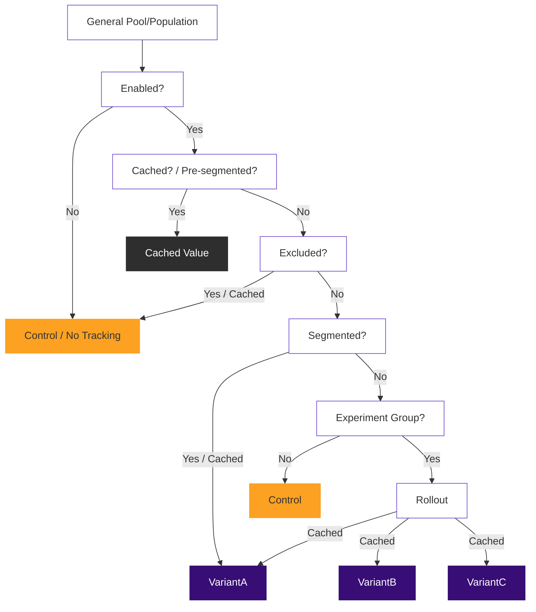

## Introduction

Gitlab::Experiment (GLEX) is tightly coupled with the concepts provided by [Feature flags in development of GitLab](https://docs.gitlab.com/ee/development/feature_flags). In this documentation we refer to this layer as feature flags, and may also use the term "Flipper" because this is the library that our development (and so experiment) feature flags are built atop.

You're strongly encouraged to read and understand the [Feature flags in development of GitLab](https://docs.gitlab.com/ee/development/feature_flags/) portion of the documentation before considering running experiments. Experiments add additional concepts which may seem confusing or advanced without understanding the underpinnings of how GitLab uses feature flags in development. One of these concepts is that GLEX supports multivariate experiments, which are sometimes referred to as A/B/n tests.

The [gitlab-experiment project](https://gitlab.com/gitlab-org/gitlab-experiment) exists in a separate repo so it can be shared across any GitLab property that utilizes Ruby. You should feel comfortable reading the documentation on that project as well if you want to dig into more advanced topics.

## Glossary of terms

To have a shared language, these are a few of the fundamental are important terms you'll come across and should understand when communicating about experiments.

- `experiment` is any deviation of code paths we want to run sometimes and not others.
- `context` is used to identify a consistent experience we'll provide in an experiment.
- `control` is the default, or "original" code path.
- `candidate` defines that there's one experimental code path.
- `variant(s)` is used when more than one experimental code path exists.

## Implementing an experiment

Start by generating a feature flag using the `bin/feature-flag` command as you normally would for a development feature flag, making sure to use "experiment" for the type. For the sake of documentation let's name our feature flag (and experiment) "pill_color".

```shell
bin/feature-flag pill_color -t experiment
```

Once you've generated the desired feature flag, you can immediately implement an experiment in code. An experiment implementation can be as simple as:

```ruby
experiment(:pill_color, actor: current_user) do |e|
  e.use { 'control' }
  e.try(:red) { 'red' }
  e.try(:blue) { 'blue' }
end
```

When this code is executed, the experiment will be run, and (if in a controller or view) you'll get a `window.gon.experiment.pillColor` object in the client layer, with details like the variant that was assigned and the context key for client tracking events.

In addition to this, whenever an experiment is run, an event will be tracked for the `:assignment` of the experiment. We'll cover more about events, tracking, and the client layer later.

In local development you can make the experiment active by using the feature flag interface. You can also target specific cases by providing the relevant experiment to our call to enable the feature flag.

```ruby
Feature.enable(:pill_color) # enable for everyone

include Gitlab::Experiment::Dsl # get the `experiment method` -- already available in controllers, views, and mailers.
Feature.enable(:pill_color, experiment(:pill_color, actor: User.first)) # enable for only the first user
``` 

To roll out your experiment feature flag (on dev/staging/production) you can run the following command in chatops (which is covered in more depth in the [Feature flags in development of GitLab](https://docs.gitlab.com/ee/development/feature_flags/) documentation):

```
/chatops run feature set pill_color 50 --actors
```

The above command would create a scenario where half of everyone who encounters the experiment would get `"control"`, 25% would get `"red"`, and 25% would get `"blue"`. If you wanted an even distribution you could change the command to set it to 66% instead of 50.

We strongly recommend using the `--actors` flag when using the chatops commands because anything else may give odd behaviors due to how the caching of variant assignment is handled and how the default "percentage_of_time" is unpredictable and psuedo-random.
{: .alert .alert-warning}

To immediately stop running an experiment, you can use the `/chatops run feature set pill_color false` command.
{: .alert .alert-info}

### The importance of context

In our example experiment above, our context (this is an important term) is a hash that's set to `{ actor: current_user }`. Context has to be unique based on how you want to run your experiment, but should be understood at a lower level.

It's generally expected, and recommended to understand and use some of the following contexts to simplify things:

- `{ actor: current_user }` would assign a variant and be "sticky" to each user (or "client" if `current_user` is nil) who enters the experiment.
- `{ project: project }` would assign a variant and be "sticky" to the project currently being viewed. If your experiment is more useful to be run when a project is viewed, and not when a specific user is viewing any project, consider this approach.
- `{ group: group }` is similar to the project example but would apply to a wider scope of projects and users.
- `{ actor: current_user, project: project }` would assign a variant and be "sticky" to the user who is viewing a given project. This would create a different variant assigment possibility for every project that _I_ look at. Understand this can create a large cache size if this experiment were placed in a highly trafficked part of the application.
- `{ wday: Time.current.wday }` is an example of running your experiment on different days of the week. In this example, it would consistently assign one variant on friday, and potentially a different variant on saturday, which is probably only useful for illustration here.

You can start to see how the context is critical with how you define and report on your experiment. The context is usually the most important aspect of how you choose to implement your experiment. Consider it carefully, and discuss it with the wider team if you need to. Also take into account that the context used has an impact on our cache size.

Now that we have the above examples, we can state the general case: given a specific and consistent context, we can provide a consistent experience and track events for that experience. To dive a bit deeper into the implementation details a context key is generated from the context that's provided. This context key is used in determining the variant that's assigned and for identifying events that have been tracked against that context key.

We can also model this, or think about it as the experience that we've rendered, which is dictated by the context key, and that context key is used to track the interaction and results of the experience we've rendered to that context key. These are somewhat abstract and hard to understand concepts initially, but thinking of it this way allows us to communicate about experiments as something that's wider than just user behavior.

Using `actor:` utilizes cookies if the `current_user` is nil. If you don't need cookies though (meaning that the exposed functionality would only be visible to signed in users), `{ user: current_user }` would be just as effective.
{: .alert .alert-info}

The caching of variant assignment is done by using this context, and so consider your impact on the cache size when defining your experiment. If you were to use `{ time: Time.current }` you would be inflating the cache size every time the experiment is run. Not only that, your experiment would not be "sticky" and events wouldn't be resolvable.
{: .alert .alert-danger}

### How it works

The way GLEX works is best illustration using the following decision tree diagram. When an experiment is run the following logic is executed to resolve what variant should be provided, given how the experiment is defined, and using the context provided.



### Utilizing advanced experimentation

GLEX allows for two general implementation styles; the simple experiment style that's outlined above, and a more advanced style where an experiment class can be provided. This is handled by naming convention, and works a bit like what you would expect within Rails.

To generate a custom experiment class that can override the defaults within `ApplicationExperiment` (which is our base GLEX implementation) you can use the rails generator:

```shell
$ rails generate gitlab:experiment pill_color control red blue
```

This will generate an experiment class in `app/experiments/pill_color_experiment.rb` with the variants we've provided to the generator. Here's an example of how that class might look after migrating our simple example above, into the class.

```ruby
class PillColorExperiment < ApplicationExperiment
  def control_behavior
    'control'
  end

  def red_behavior
    'red'
  end

  def blue_behavior
    'blue'
  end
end
```

We can now simplify where we run our experiment to the following call instead of providing the block we were initially providing, by explicitly calling `run`:

```ruby
experiment(:pill_color, actor: current_user).run
```

The behavior methods we've defined in our experiment class represent the default implementation. You can still use the block syntax to override the behavior methods, so the following would also be valid:

```ruby
experiment(:pill_color, actor: current_user) do |e|
  e.use { '<strong>control</strong>' }
end
```

When passing a block to the `experiment` method, it will implicitly be invoked as if `run` has been called.
{: .alert .alert-info}

Within haml views, this is also fairly straight forward and clean to implement. Here's an example of our experiment with some html wrappings to make it more interesting.

```haml
#cta-interface
  - experiment(:pill_color, actor: current_user) do |e|
    - e.use do
      .pill-button control
    - e.try(:red) do
      .pill-button.red red
    - e.try(:blue) do
      .pill-button.blue blue
```

#### Segmentation rules

You can use runtime segmentation rules to segment contexts into a specific variant for instance. The `segment` method is a callback, so works by providing a block or method name.

```ruby
class PillColorExperiment < ApplicationExperiment
  segment(variant: :red) { context.actor.first_name == 'Richard' }
  segment :old_account?, variant: :blue
  
  # ...behaviors

  private

  def old_account?
    context.actor.created_at < 2.weeks.ago
  end
end
```

In the previous example, any user named `'Richard'` would always receive the "red" variant. As well, any account older than 2 weeks old would get the alternate experience defined in the "blue" variant.

When an experiment is run, the segmentation rules are executed in the order they're defined. The first segmentation rule to produce a truthy result is the one which gets used to assign the variant. The remaining segmentation rules are skipped to achieve optimal performance. Please keep this in mind when defining segmentation rules.

This means that any user named `'Richard'`, regardless of account age, will always be provided the experience as defined in the "red" variant. If you wanted the opposite logic, simply flip the order.

#### Exclusion rules

Exclusion rules are similar to segmentation rules, but are intended to determine if a context should even be considered as something we should include in the experiment and track events towards. Exclusion means we don't care about the events in relation to the given context.

```ruby
class PillColorExperiment < ApplicationExperiment
  exclude :old_account?, ->{ context.actor.first_name == 'Richard' }

  # ...behaviors

  private

  def old_account? 
    context.actor.created_at < 2.weeks.ago
  end
end
```

The previous examples will exclude all users named `'Richard'` as well as any account older than 2 weeks old. Not only will they be given the control behavior (which could be nothing), but no events will be tracked in these cases as well. 

We can also do some exclusion logic when we run the experiment as well. For instance, if we wanted to keep non-admins from being included in an experiment we might consider the following simple experiment. This type of logic allows us to do complex experiments while also keeps us from having to pass a bunch of things into our experiments, because we want to minimize passing things into our experiments.

```ruby
experiment(:pill_color, actor: current_user) do |e|
  e.exclude! unless can?(current_user, :admin_project, project)
end 
```

You may also need to check exclusion in custom tracking logic by calling `should_track?`:

```ruby
class PillColorExperiment < ApplicationExperiment
  # ...behaviors
  
  def expensive_tracking_logic
    return unless should_track?
    
    track(:my_event, value: expensive_method_call)
  end
end
```

Exclusion rules aren't the best way to determine if an experiment is active. There's an `enabled?` method that can be overridden to have a high-level way of determining if an experiment should be running and tracking at all. This `enabled?` check should be as efficient as possible because it's the first early opt out path an experiment can implement.
{: .alert .alert-info}

### Tracking events

One of the most important aspects of experiments is to gather data and report on that data. So GLEX provides an interface that allows tracking events across an experiment, and this can be implemented consistently if you provide the same context between calls to your experiment. Please read about the context if this is not yet an understood concept.

In simple terms, we can assume we run the experiment in one or a few places, and track events potentially in many places. A tracking call is as simple as any tracking call you might implement, with the arguments you would normally use when [tracking events using snowplow](https://docs.gitlab.com/ee/development/snowplow.html) in general. The easiest example of tracking an event in ruby would be something like:

```ruby
experiment(:pill_color, actor: current_user).track(:created)
```

When you run an experiment, using any of the examples above, an `:assigned` event will be tracked automatically by default. All events that are tracked from an experiment have a special [experiment context](https://gitlab.com/gitlab-org/iglu/-/blob/master/public/schemas/com.gitlab/gitlab_experiment/jsonschema/1-0-0) added to the event. This can be used (typically by the data team) to create a connection between the events on a given experiment.

If our current user hasn't encountered the experiment yet (meaning where the experiment is run), and we track an event for them, they will be assigned a variant and would see that variant if they ever encountered the experiment later, when an `:assignment` event would be tracked at that time for them.
{: .alert .alert-info}

Tracking is something that GitLab tries to be sensitive and respectful of our customers about, so GLEX allows us to implement an experiment without ever tracking identifying ids. This however is not always possible based on experiment reporting requirements and you may be asked from time to time to track a specific record id within experiments. How this is approached is largely up to the PM and engineer being asked to do that. No recommendations are provided here at this time.
{: .alert .alert-info}

## Testing with rspec

This gem comes with some rspec helpers and custom matchers. These are in flux at the time of writing.

First, require the rspec support file:

```ruby
require 'gitlab/experiment/rspec'
```

This mixes in some of the basics, but the matchers and other aspects need to be included. This happens automatically for files in `spec/experiments`, but for other files and specs you want to include it in, you can specify the `:experiment` type:

```ruby
it "tests", :experiment do
end
```

### Stub helpers

You can stub experiments using `stub_experiments`. Pass it a hash using experiment names as the keys and the variants you want each to resolve to as the values:

```ruby
# Ensures the experiments named `:example` & `:example2` are both
# "enabled" and that each will resolve to the given variant
# (`:my_variant` & `:control` respectively).
stub_experiments(example: :my_variant, example2: :control)

experiment(:example) do |e|
  e.enabled? # => true
  e.variant.name # => 'my_variant'
end

experiment(:example2) do |e|
  e.enabled? # => true
  e.variant.name # => 'control'
end
```

### Exclusion and segmentation matchers

You can also easily test the exclusion and segmentation matchers.

```ruby
class ExampleExperiment < ApplicationExperiment
  exclude { context.actor.first_name == 'Richard' }
  segment(variant: :candidate) { context.actor.username == 'jejacks0n' }
end

excluded = double(username: 'rdiggitty', first_name: 'Richard')
segmented = double(username: 'jejacks0n', first_name: 'Jeremy')

# exclude matcher
expect(experiment(:example)).to exclude(actor: excluded)
expect(experiment(:example)).not_to exclude(actor: segmented)

# segment matcher
expect(experiment(:example)).to segment(actor: segmented).into(:candidate)
expect(experiment(:example)).not_to segment(actor: excluded)
```

### Using the tracking matcher

Tracking events is a major aspect of experimentation, and because of this we try to provide a flexible way to ensure your tracking calls are covered.

You can do this on the instance level or at an "any instance" level. At an instance level this is pretty straight forward:

```ruby
subject = experiment(:example)

expect(subject).to track(:my_event)

subject.track(:my_event)
```

You can use the `on_any_instance` chain method to specify that it could happen on any instance of the experiment. This can be useful if you're calling `experiment(:example).track` downstream:

```ruby
expect(experiment(:example)).to track(:my_event).on_any_instance

experiment(:example).track(:my_event)
```

And here's a full example of the methods that can be chained onto the `track` matcher:

```ruby
expect(experiment(:example)).to track(:my_event, value: 1, property: '_property_')
  .on_any_instance
  .with_context(foo: :bar)
  .for(:variant_name)

experiment(:example, :variant_name, foo: :bar).track(:my_event, value: 1, property: '_property_')
```

## Experimenting in the client layer

This is in flux and so cannot be documented just yet.

## Notes on feature flags

We use the terms "enabled" and "disabled" here, even though it's against our [documentation style guide recommendations](https://docs.gitlab.com/ee/development/documentation/styleguide/index.html#avoid-ableist-language) because these are the terms that the feature flag documentation uses.
{: .alert .alert-info}

You may already be familiar with the concept of feature flags within GitLab, but there's a very distinct aspect worth calling out about how you may view feature flags and how they're used for experiments. In general terms a feature flag is viewed as being either "on", or "off" -- but this isn't accurate.

Generally "off" means that when we ask if a feature flag is enabled, it will return `false`, and "on" means that asking will always return `true`. But there is actually an interim state that is considered "conditional". GLEX takes advantage of this trinary state of feature flags. This "conditional" aspect can be understood when you consider that setting a `percentage_of_actors` of 50% puts a feature flag into this state, or if you were to enable it for a single user or group. Conditional means that it will return `true` in some situations, but not all situations.

When a feature flag is disabled (meaning the state is "off"), the experiment will not be considered running. You can visualize this in the [decision tree diagram](#how-it-works), as hitting the first [Enabled?] node and traversing the negative path.

When a feature flag is rolled out to a `percentage_of_actors` or similar (meaning the state is "conditional") the experiment will be considered to be in a running state where sometimes the control is rendered, and sometimes the candidate is rendered. We'll not refer to this as "being enabled", because that's a confusing and overloaded term here. In the experiment terms, our experiment is "running", and the feature flag is "conditional".

When a feature flag is enabled (meaning the state is "on"), everyone will get the candidate experience.

We should try to be consistent with our terms, and so for experiments, we have an "inactive" experiment until we set the feature flag to "conditional". After which, our experiment is then considered "running". If you choose to "enable" your feature flag, you should consider the experiment to be "resolved", since everyone will be getting the candidate (unless they've oped out of experimentation -- using DNT headers for now). There is currently work being done to improve this process.
