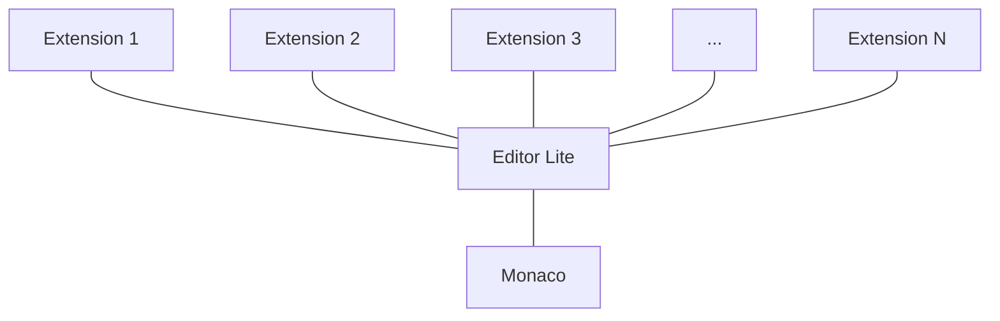

# Editor Lite

## Background

**Editor Lite** is a technological product driving [Web Editor](https://docs.gitlab.com/ee/user/project/repository/web_editor.html#gitlab-web-editor), [Snippets](https://docs.gitlab.com/ee/user/snippets.html#snippets), [CI Linter](https://docs.gitlab.com/ee/ci/lint.html#ci-lint), etc. Basically, Editor Lite is the driving technology for any single-file editing experience across the product.

Editor Lite is a thin wrapper around [the Monaco editor](https://microsoft.github.io/monaco-editor/index.html) that provides the basic helpers and abstractions, and extends Monaco using extensions.


## Extensions

Editor Lite has been built to provide a universal, extensible editing tool to the whole product that would not depend on any particular group: even though the core of the Editor Lite is owned by [Create::Editor FE Team](https://about.gitlab.com/handbook/engineering/development/dev/create-editor-fe/) the main functional elements — extensions — can be owned by any group. The main idea behind Editor Lite's extensions is that the core of the editor remains very slim and stable, while whatever new functionality is needed, can be added as an extension to this core, without touching the core itself. This allows any group to build and own any new editing functionality without being afraid of it being broken or overridden with the changes in the Editor Lite.

Structurally, the complete implementation of Editor Lite could be presented as the following diagram:



## Examples 
## FAQ
### Multi-file support
### Live-preview 

## `<editor-lite>` Vue component

To make adoption of Editor Lite easier across the product, [a Vue component](https://gitlab.com/gitlab-org/gitlab/-/blob/master/app/assets/javascripts/vue_shared/components/editor_lite.vue) is provided.

In its simplest form, the component can be added as normal to your Vue applications.

1. Import

```javascript
import EditorLite from '~/vue_shared/components/editor_lite.vue';
...
export default {
  components: {
    EditorLite,
    ...
  }
}
```

1. Use

```html
<editor-lite />
```

3. Enjoy the output (pictured in Snippet edit form)


### Properties

| Name | Required? | Description |
| ---- | --- | --- |
| `value` | `false` | `String`: Initial content to be rendered in the editor |
| `fileName` | `false` | `String`: File name, containing the file extension. Is used to find correct syntax highlighting. Reactively updating this prop on the component, will automatically update syntax highlighting in the editor. |
| `fileGlobalId` | `false` | Unique ID for the editor. Helps to avoid several issues when having more than one editors on the smae page (like multi-file snippets). If yo uhave only one editor, this prop can be omitted. |
| `extensions` | `false` | `[Strings, Array]`: Path(s) to extensions to be loaded into the editor. [Read more about extensions below]((#extensions)). Allows to customize editor on per-instance basis |
| `editorOptions` | `false` | `Object`: An object with the set of custom editor options. Accepts all [standard Monaco editor options](https://microsoft.github.io/monaco-editor/api/modules/monaco.editor.html#editoroptions). Allows to customize editor on per-instance basis |

### Events

| Name | Arguments | Description |
| ---- | --- | --- |
| `editor-ready` | `null` | Fired after the editor has been bootstrapped and, if applicable, finished applying all extension. |
| `input` | The updated content | Fired after the text content of the editor has been changed. Passes the updated content to event handler |


### <a id="extensions"></a> What about Extensions in the component?

`<editor-lite>` accepts the `extensions` property where you can specify extensions to be loaded for this instance of the Editor Lite. At the moment the prop accepts either a `String or an `Array` of strings each of which represents the file name of the extension to be used. The component supports not only standfard extensions (located in `~/editor/`) but also provides an opportunity to point to a custom path within `~/` path. Examples:

1. Load one of the default extensions from `~/editor/`. In this case we can specify the file name right away:

```html
<editor-lite extensions='editor_markdown_ext' />
```

In this case, the extension from `~/editor/editor_markdown_ext.js` file will be loaded

2. Load custom extention from the non-default location:

```html
<editor-lite extensions='snippet/my_custom_ext' />
```

In this case, the extension from `~/snippet/my_custom_ext.js` file will be loaded

3. Load several extentions:

```html
<editor-lite :extensions="['editor_markdown_ext', 'snippet/my_custom_ext']" />
```

:warning: Keep in mind that the order of the extentions matters in this case: methods of the same name won't be merged and the right most extension with such method will override all previous instances.

### Examples of the component

1. Editor with initial value and syntax highlighting based on the file's extension:

```html
<editor-lite
  :value="blob.content"
  :file-name="blob.path"
/>
```

**NB:** if the file path doesn't change, you can "hardcode" `file-name`. For example, `file-name="*.js""` will initialize javascript syntax highlighting and won't be changed.

2. Listen to the text changes in the editor:

```html
<editor-lite
  :value="blob.content"
  file-name="blob.path"
  @input="textChangesHandler($event)"
/>
```

3. Run code after the editor has been bootstrapped with all passed extensions:

```html
```

