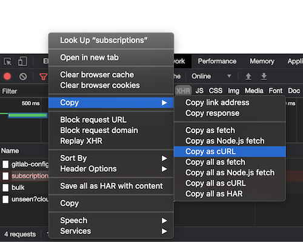
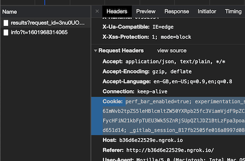

# Setting up a development environment

The following are required to install and test the app:

1. A Jira Cloud instance

   Atlassian provides free instances for development and testing. [Click here to sign up](https://developer.atlassian.com/platform/marketplace/getting-started/#free-developer-instances-to-build-and-test-your-app).

1. A GitLab instance available over the internet

   For the app to work, Jira Cloud should be able to connect to the GitLab instance through the internet.

   To easily expose your local development environment, you can use tools like
   [serveo](https://medium.com/automationmaster/how-to-forward-my-local-port-to-public-using-serveo-4979f352a3bf)
   or [ngrok](https://ngrok.com). These also take care of SSL for you because Jira
   requires all connections to the app host to be over SSL.

## Installing the app in Jira

1. Enable Jira development mode to install apps that are not from the Atlassian Marketplace

   1. Navigate to **Jira settings** (cog icon) > **Apps** > **Manage apps**.
   1. Scroll to the bottom of the **Manage apps** page and click **Settings**.
   1. Select **Enable development mode** and click **Apply**.

1. Install the app

   1. Navigate to Jira, then choose **Jira settings** (cog icon) > **Apps** > **Manage apps**.
   1. Click **Upload app**.
   1. In the **From this URL** field, provide a link to the app descriptor. The host and port must point to your GitLab instance.

      For example:

      ```plaintext
      https://xxxx.serveo.net/-/jira_connect/app_descriptor.json
      ```

   1. Click **Upload**.

   If the install was successful, you should see the **GitLab for Jira** app under **Manage apps**.
   You can also click **Getting Started** to open the configuration page rendered from your GitLab instance.
   If the app install failed, you might need to delete `jira_connect_installations` from your database.

   _Note that any changes to the app descriptor requires you to uninstall then reinstall the app._

## Adding a namespace

1. Make sure you are logged in on your GitLab development instance.
1. On the Jira GitLab app page click **Get started**.
1. Open your browsers developer tools and navigate to the network tab.
1. Try adding the namespace.
1. If the request fails with 401 "not authorized", copy the request as cURL and paste it in your terminal.

1. Go to your development instance (localhost:3000), open developer tools, navigate to the network tab and reload the page.
1. Copy all cookies from the first request.\

1. Append the cookies to the cURL command in your terminal `--cookies "PASTE COOKIES HERE"`.
1. Submit the cURL request.
1. If the response is `{"success":true}` the namespace was added.
