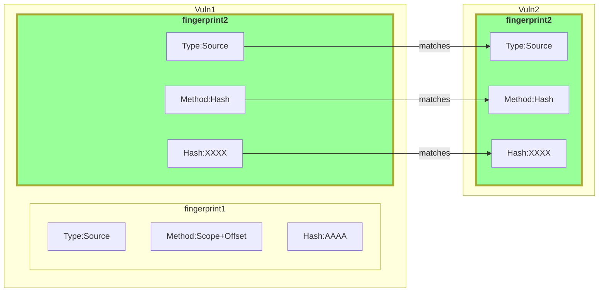
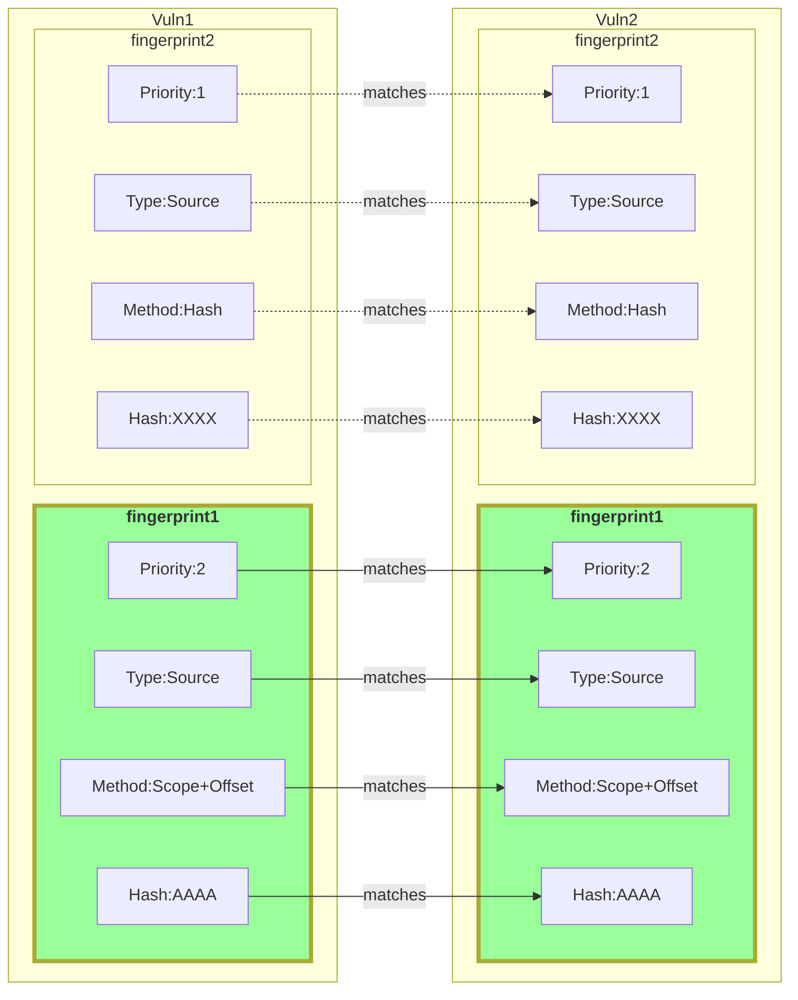
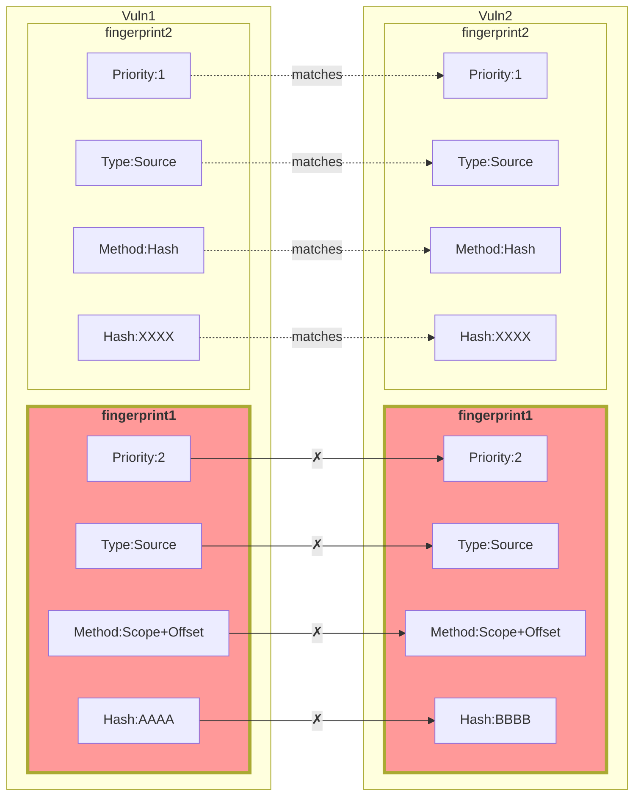
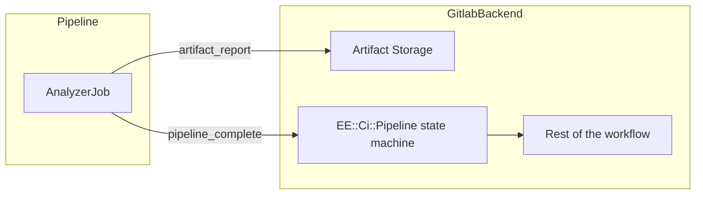
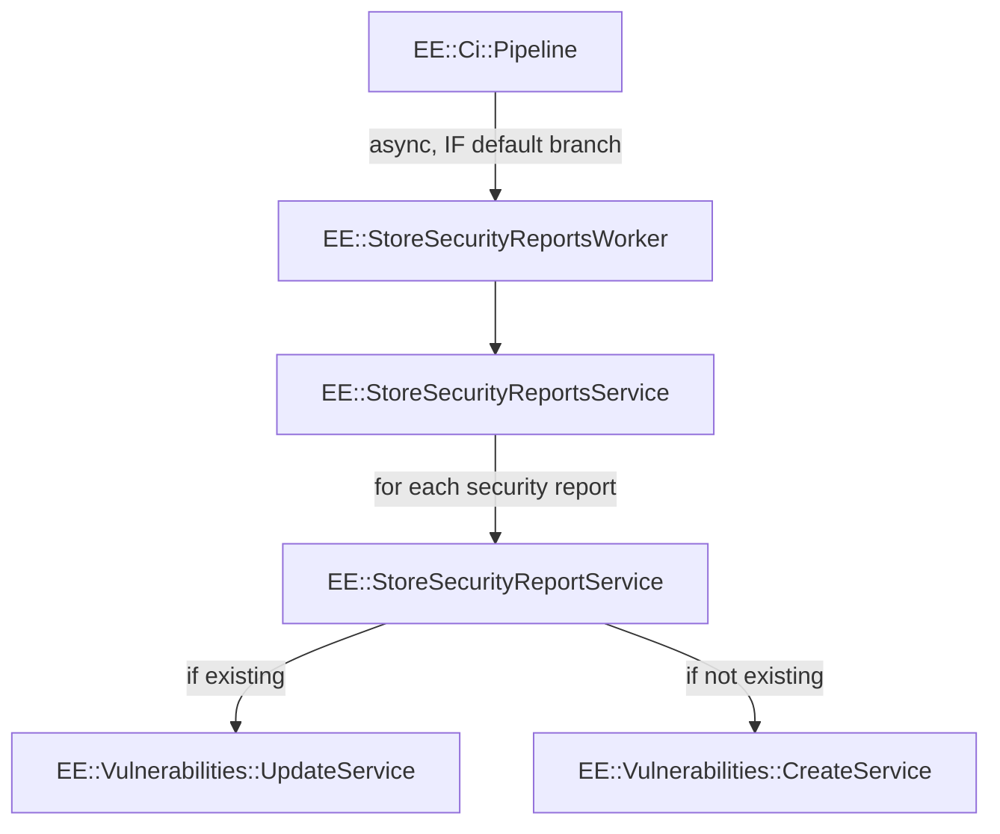

# Vulnerability Tracking

Tracking vulnerabilities throughout the lifetime of a project involves
technical challenges on many levels. Code is added, removed, shifted,
auto-formatted, etc. as the project grows.

This makes straightforward location-based approaches to tracking
vulnerabilities (file-name and line-number) fragile.

-   [Distinct Vulnerabilities](#distinct-vulnerabilities)
-   [General Architecture](#general-architecture)
-   [Comparing Vulnerabilities](#comparing-vulnerabilities)
-   [Workflows](#workflows)

## Distinct Vulnerabilities

Deciding whether a vulnerability in one version of a project is the same as
a vulnerability in another version of a project cannot be done without a clear
definition of what makes one vulnerability distinct from another.

In other words, how much would lines of source code that contain a
vulnerablity have to be changed before the vulnerability should be considered a
new, or distinct vulnerability?

In GitLab's vulnerability tracking implementation, the following changes will
cause a vulnerability to be considered a distinct vulnerability from one found
in a previous version of the code:

-   Scope
-   Tracking fingerprint
-   Vulnerability type

### Scope Change

The scope of a vulnerability is the context in which the vulnerability is found.

For example, the vulnerability below is in the scope
`custom_widget.rb > Widgets > CustomWidget > run`:

```ruby
# file custom_widget.rb

module Widgets
  class CustomWidget
    def run(user_supplied_arg)
      exec("echo #{user_supplied_arg}") # << Vulnerability
    end
  end
end
```

The exact scope calculation used for a vulnerability's location depends on
the supported algorithms for the source file language. In the default case
where no advanced algorithms are available for a source language, the scope of
the vulnerability is the file itself.

### Tracking Fingerprint Change

The tracking fingerprint is a unique, algorithm-specific value used to track
a vulnerability within a scope. The default case is for the filename to
be the scope, and the line number to be the location within the scope.

### Vulnerability Type Change

The type of a vulnerability classifies the type of flaw present in the code.

The previous example contained a command injection vulnerability
([CWE-78](https://cwe.mitre.org/data/definitions/78.html)):

```ruby
exec("echo #{user_supplied_arg}") # << Vulnerability
```

If the `exec` exec call instead ran the `ls` command, using a shell-escaped,
user-supplied argument to construct the path, the code could now contain a
directory traversal vulnerability
([CWE-23](https://cwe.mitre.org/data/definitions/23.html)):

```ruby
exec("ls base/path/#{escaped_user_arg}")
```

## General Architecture

GitLab's vulnerability tracking implementation uses the following concepts:

-   Security analyzers can declare how vulnerabilities should be tracked
-   Each vulnerability can have multiple tracking fingerprints

### Analyzer Tracking Declaration

Analyzers declare how the vulnerabilities they detect can be tracked via a
`tracking` field in the vulnerability JSON report produced in a pipeline:

```javascript
{
  // ...
  "vulnerabilities": [
    {
      // ...
      "tracking": {
        "type": "source",
        "positions": [
          { "file": "path/to/file1.ext", "line_start": 10, "line_end": 20 },
          { "file": "path/to/file2.ext", "line_start": 10, "line_end": 20 },
          { "file": "path/to/file3.ext", "line_start": 10, "line_end": 20 }
        ]
      },
      // ...
    }
  ],
}
```

See the [TODO SCHEMA DOCUMENTATION]() for details on the `tracking` field.

Once the tracking type is declared by the analyzer, GitLab calculates a
unique tracking fingerprint for the vulnerability using the best available
fingerprinting algorithms for the source language.

### Multiple Tracking Fingerprints

Each vulnerability may have multiple tracking fingerprints, one each for each
applicable fingerprint algorithm. This enables:

-   Backwards compatability
    -   Newly deployed tracking algorithms build on top of existing tracking
        fingerprints
-   Priority-based matching
    -   Fingerprints are matched based on priority, with higher-priority and
        more accurate fingerprinting algorithms having first say if two
        vulnerabilities are a match.

### Tracking Algorithm Implementation

Tracking algorithm implementations are run as a post-analyzer in a pipeline job
after the analyzer runs. The post-analyzer enriches the JSON report that was
produced by the analyzer to include the tracking fingerprint values.

## Comparing Vulnerabilities

Each tracking fingerprint algorithm has a priority defined in the GitLab backend.
Vulnerabilities with matching tracking fingerprint values are compared in
order of descending priority.

Below are a few scenarios to demonstrate how this works:

<details>
<summary>One matching lower-priority fingerprint</summary>
<br/>

In this example, `Vuln1`'s `Source:Hash` tracking fingerprint is the only
match with `Vuln2`'s tracking fingerprints. As this is the first
and only match, they are considered the same vulnerability.

This scenario is expected to occur when tracking algorithms are initially
deployed.



</details>

<details>
<summary>Two matching fingerprints</summary>
<br />

In this example, `Vuln1` and `Vuln2` have several matching fingerprints.
However, the first and highest priority (most accurate) match is with the
`Source:Scope+Offset` tracking fingerprint. As a successful match was found,
the two vulnerabilities are considered the same vulnerability.

This scenario is expected to be a common case.



</details>

<details>
<summary>Non-matching high Priority fingerprints & matching low-priority fingerprints</summary>
<br/>

Prioritized tracking fingerprints are also used to **disprove** matches.

In the example below, `Vuln1` and `Vuln2` both have matching low-priority
`Source:Hash` fingerprints, but the high-priority `Source:Scope+Offset`
tracking fingerprints do not match. As the highest-priority fingerprints
exist in both `Vuln1` and `Vuln2`, but do not match, it is determined that
`Vuln1` and `Vuln2` are not the same vulnerability.

This scenario should be uncommon, but may occur. In this case, defaulting to the
fingerprinting algorithm with the highest accuracy is desired.



</details>

## Workflows

-   [Pipeline Vulnerabilitiles Workflow](#pipeline-vulnerabilities-workflow)
-   [Default Branch Workflow](#default-branch-workflow)
-   [Feedback Workflow](#feedback-workflow)

### Pipeline Vulnerabilities Workflow

The flow chart below shows the process of comparing security vulnerabilities
from a pipeline with known vulnerabilities in the project:

### Default Branch Workflow

The flow chart below shows the process of storing security vulnerabilities
from a pipeline into the database:



`EE::Ci::Pipeline` [contains a state machine](https://gitlab.com/gitlab-org/gitlab/-/blob/v13.8.1-ee/ee/app/models/ee/ci/pipeline.rb#L54-59)
that performs action when pipelines change state.

For security reports and pipeline vulnerabilities, the rest of the workflow
goes as follows:



The [`EE::Vulnerabilities::StoreSecurityReportService`](https://gitlab.com/gitlab-org/gitlab/-/blob/v13.8.1-ee/ee/app/services/security/store_report_service.rb)
service contains the logic to

### Feedback Workflow

TODO
