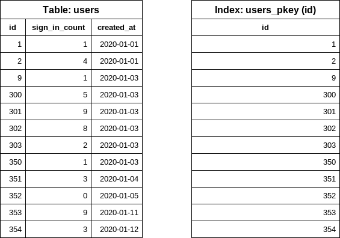
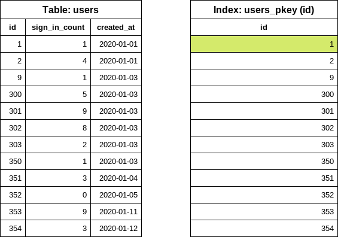
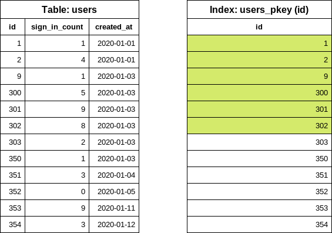

# Iterating Tables In Batches

Rails provides a method called `in_batches` that can be used to iterate over
rows in batches. For example:

```ruby
User.in_batches(of: 10) do |relation|
  relation.update_all(updated_at: Time.now)
end
```

Unfortunately this method is implemented in a way that is not very efficient,
both query and memory usage wise.

To work around this you can include the `EachBatch` module into your models,
then use the `each_batch` class method. For example:

```ruby
class User < ActiveRecord::Base
  include EachBatch
end

User.each_batch(of: 10) do |relation|
  relation.update_all(updated_at: Time.now)
end
```

This will end up producing queries such as:

```plaintext
User Load (0.7ms)  SELECT  "users"."id" FROM "users" WHERE ("users"."id" >= 41654)  ORDER BY "users"."id" ASC LIMIT 1 OFFSET 1000
  (0.7ms)  SELECT COUNT(*) FROM "users" WHERE ("users"."id" >= 41654) AND ("users"."id" < 42687)
```

The API of this method is similar to `in_batches`, though it doesn't support
all of the arguments that `in_batches` supports. You should always use
`each_batch` _unless_ you have a specific need for `in_batches`.

## Efficient Batching

Using `EachBatch` is necessary when iterating over large tables. It's important to highlight that `EachBatch` itself won't be effective without correctly configured database indexes.

### Example 1: Simple iteration

Let's consider that we want to iterate over the `users` table and write the `ActiveRecord` models into a CSV file. The `users` table contains millions of records, thus running one query to fetch the users will likely time out.



Avoid:

```ruby
users = User.all

users.each { |user| write_to_file(user) }
```

Prefer:

```ruby
# Note: for this example I picked 5 as the batch size, the default is 1_000
User.each_batch(of: 5) do |relation| 
  relation.each { |user| write_to_file(user) }
end
```

`each_batch` does the following:

Find the lowest `id` in the table. This requires only one index lookup in the database since all primary keys have an index.

```sql
SELECT "users"."id" FROM "users" ORDER BY "users"."id" ASC LIMIT 1
```



Notice that the query only read data from the index (`INDEX ONLY SCAN`) and since database indexes are, sorted taking out the first item is a very cheap operation. 

The next step is to find the next `id` according to the batch size configuration. In the example we used batch size of 5, so we use `OFFSET` to get the `id` value.

```sql
SELECT "users"."id" FROM "users" WHERE "users"."id" >= 1 ORDER BY "users"."id" ASC LIMIT 1 OFFSET 5
```



Again, the query only looks into the index. The `OFFSET 5` will take the 6th `id` value out: this query will read maximum 6 items from the index.

At this point we know the `id` range of a batch. Now it's time to construct the query for the `relation` block.

```sql
SELECT "users".* FROM "users" WHERE "users"."id" >= 1 AND "users"."id" < 6
```

{inser_image}

Notice the `<` sign. Previously we read 6 items from the index and in this query we "exclude" the last value from the query so we make sure that maximum 5 items will be returned.

The query will look at the index to get the location of the 5 `user` rows on the disk and read the rows. The returned array will be processed in ruby.

The first iteration is done. For the next iteration, we reuse the last `id` value from the previous iteration to find out the end `id` value.

```sql
SELECT "users"."id" FROM "users" WHERE "users"."id" >= 6 ORDER BY "users"."id" ASC LIMIT 1 OFFSET 5
```

Now we can easily construct the `users` query for the second iteration.

```sql
SELECT "users".* FROM "users" WHERE "users"."id" >= 6 AND "users"."id" < 11
```


### Example 2: Iteration with filters

Building on top of the previous example, we want to export the users whom never logged into the system. We keep track of the number of sign ins in the `sign_in_count` column, so we write the following code:

```ruby
users = User.where(sign_in_count: 0)

users.each_batch(of: 5) do |relation| 
  relation.each { |user| write_to_file(user) }
end
```

`each_batch` will produce the following SQL query for the first `id` value:

```sql
SELECT "users"."id" FROM "users" WHERE "users"."sign_in_count" = 0 ORDER BY "users"."id" ASC LIMIT 1;
```

Selecting only the `id` column and ordering by `id` is going to "force" the database to still use the index on the `id` (primary key index) column, however we also have an extra condition on `sign_in_count`. The column is not part of the index, so the database needs to look into the actual table to filter the rows. 

{image}

The number of scanned rows in the index and in the table are depending on the data distribution:

- Best scenario: the first user was never logged in. The database reads only one item from the index and from the table.
- Worst scenario: all users were logged in at least once. The database reads the whole index and the table. (Likely to time out)

Finding the end `id` for the first iteration has similar problems. The database needs to read an unknown number of rows to determine the `id` value.


#### How to improve filtering with `each_batch`

##### Specialized filtered index

```sql
CREATE INDEX index_on_users_never_logged_in ON users (id) WHERE sign_in_count = 0
```

This index definition covers all conditions on the `id` and `sign_in_count` columns thus makes the `each_batch` queries very effective (similar to the simple iteration example).

It's rare when a user was never logged in so we anticipate small index size. Including only the `id` also helps keeping the index size small.

##### Index on columns

Later on we might want to iterate over the table filtering for different `sign_in_count` values, in those cases we simply cannot use the previously suggested filtered index. We have two choices:

- Create another index to cover our use-case.
- Replace the index with more generalized configuration.

Note: Having multiple indexes on the same table and on the same columns could be a performance bottleneck when writing data.


Let's consider the following index (avoid):

```sql
CREATE INDEX index_on_users_never_logged_in ON users (id, sign_in_count)
```

The index definition starts with the `id` column which makes the index very inefficient from data selectivity point of view.

```sql
SELECT "users"."id" FROM "users" WHERE "users"."sign_in_count" = 0 ORDER BY "users"."id" ASC LIMIT 1;
```

Executing the query above will query the index only (`INDEX ONLY SCAN`), however it still need to iterate over the items and find the first item where the `sign_in_count` is `0`.


We can improve the query significantly by swapping the columns in the index definition (prefer).

```sql
CREATE INDEX index_on_users_never_logged_in ON users (sign_in_count, id)
```

Note: Make sure that the column which is used for the iteration (`id`) is part of the index.

The following index definition is not going to work well with `each_batch` (avoid).

```sql
CREATE INDEX index_on_users_never_logged_in ON users (sign_in_count)
```

Since `each_batch` builds range queries based on the `id` column, this index cannot be used effectively. The DB will read the rows from the table or uses a bitmap where the primary key index is read.

##### "Slow" iteraton

Slow iteration means that we use a good index configuration to iterate over the table and apply filtering on the yielded relation.

```ruby
User.each_batch(of: 5) do |relation| 
  relation.where(sign_in_count: 0).each { |user| write_to_file(user) }
end
```

The iteration will use the primary key index (on `id`) for the iteration which makes it safe from statement timeouts. The filter (`sign_in_count: 0`) is applied on the `relation` where the `id` is already constrained (range). The number of rows are limited.

Slow iteration will generally take longer time to finish since the iteration count is much higher.

