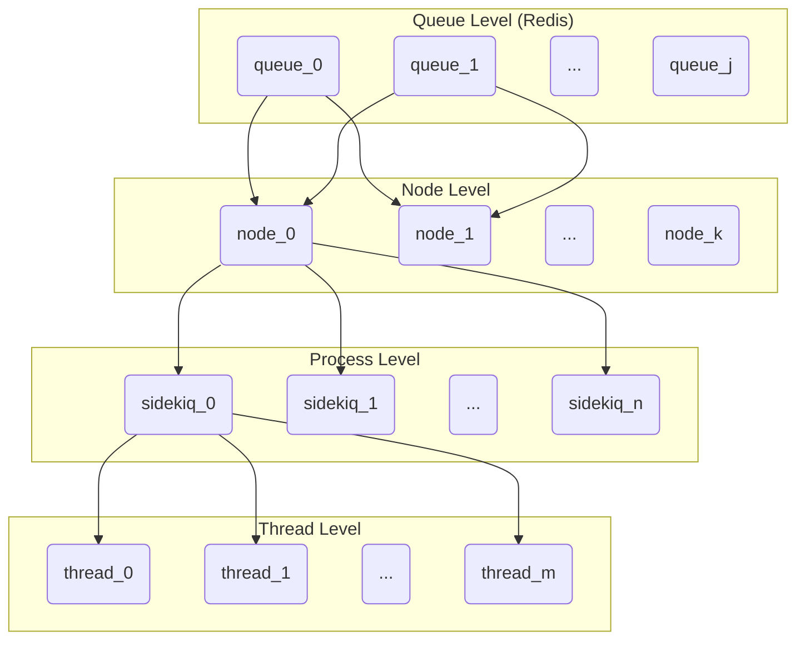

# Sidekiq debugging

GitLab uses [Sidekiq](https://github.com/mperham/sidekiq) to handle long running work loads. A good example for a long running work load is an email notification that needs to be dispatched in response to a user action. By moving these long running actions off the request/response path, we can keep latency low. This section contains a brief overview of what Sidekiq is, how it works, and how to interact with it when working with the GitLab source code.

## Sidekiq conceptually

Sidekiq is based on three main concepts: workers, jobs, and queues. In Sidekiq terms, a **worker** is a description of an application work load you want to run (such as dispatching an email), encoded as a Ruby class that mixes in the `Sidekiq::Worker` module. Note that the term "worker" can have different meanings depending on the context it's used in, and Sidekiq itself does not consistently apply it either, since [a thread executing a `Worker`](https://github.com/mperham/sidekiq/wiki/API#workers) is also called "worker", and at GitLab we furthermore call the application *processes* that run Sidekiq worker *threads* "workers", too. Hereafter I will use **worker thread** to refer to the thread running the code defined in the **worker class**, to distinguish them from the Sidekiq worker processes that run GitLab's Rails application.

A **job** is a request to Sidekiq for a worker thread to instantiate and execute the worker class. So for any one worker class, there can be many jobs executing its instances (e.g. emails sent).

Jobs are posted to shared **queues**, from which Sidekiq reads and assigns jobs to the next available worker thread.

## Sidekiq execution model

GitLab can run Sidekiq in different modes: as a single process or as multiple processes (also called "clustered"). As mentioned above, at GitLab each such process running Sidekiq is called a worker process or just worker. Whether a single- or multi-process setup should be used is largely a question of scalability. At development time and for single-node deployments, a single Sidekiq process is typically sufficient. Note that even in clustered mode, there is no primary or master; only workers. Coordination happens through a supervising script instead, see [Multi-process setup](#multi-process-setup).

Each Sidekiq process operates a thread pool, where each worker thread is assigned a work unit through a job. The number of threads is also referred to as the _concurrency level_ at which a Sidekiq process operates. Job queues are stored in Redis, so that the main application process(es) as well as multiple Sidekiq processes can read from and write to any given queue. This is also why job parameters _must_ be serializable, as jobs are stored in Redis as JSON.

The execution flow is as follows:

- One or several Sidekiq worker processes start and connect to Redis
- The main web application posts a new job to a queue by calling `Worker.perform_async`
- Sidekiq will serialize this request to JSON and write it to Redis
- A Sidekiq process assigned to the given queue will pick up the job and dispatch it to an available worker thread

Which Sidekiq process ends up picking up a job depends on which queues they are assigned to. The way this assignment works
is described in the following section.

## Sidekiq at GitLab

At GitLab we have dozens of queues. The way workers are assigned queues differs between
running a single- or multi-process setup, which is outlined below.

### Single-process setup

When running GitLab locally e.g. with the GDK, but also in small Omnibus deployments, Sidekiq by default executes in a single process. We can see this when running `gdk start redis rails-background-jobs` to bring up Redis and Sidekiq and running `pstree -atp`:

```text
...
  │   │   ├─runsv,1471 rails-background-jobs
  │   │   │   ├─bundle,14559
  │   │   │   │   ├─{base_reliable_*},14627
  │   │   │   │   ├─{connection_poo*},14568
  │   │   │   │   ├─{connection_poo*},14628
  │   │   │   │   ├─{daemon.rb:38},14618
  │   │   │   │   ├─{daemon.rb:38},14640
  │   │   │   │   ├─{util.rb:23},14792
  │   │   │   │   ├─{util.rb:23},14793
  │   │   │   │   ├─{util.rb:23},14794
  │   │   │   │   ├─{util.rb:23},14795
  │   │   │   │   ├─{util.rb:23},14796
...
```

`runsv` is the process supervisor for a service called `rails-background-jobs`. That service will run a GDK script called `sv/rails-background-jobs/run`, which in return runs `gitlab/bin/background_jobs`, which in turn runs `bundle exec sidekiq`. That's why the process name here is `bundle`, not `sidekiq` (although `ps` will list the process as `sidekiq`.) The elements underneath that node wrapped in curly braces `{...}` are threads.

Since there is only one process, all jobs from all queues are being processed by all worker threads in that process.
Which queues should be processed is defined in [`config/sidekiq_queues.yml`](https://gitlab.com/gitlab-org/gitlab/blob/master/config%2Fsidekiq_queues.yml).

### Multi-process setup

You can run Sidekiq in **clustered** i.e. multi-process mode. What this does is spin up several Sidekiq processes, each of which then runs its own worker thread pool. Depending on the environment, different steps are required to enable clustered mode:

- For development with e.g. the GDK, but also installations from source, set the `SIDEKIQ_WORKERS` environment variable to the desired number of workers. For installations from source, clustered mode is [enabled by default](../install/installation.md#using-sidekiq-instead-of-sidekiq-cluster).
- For Omnibus installations, refer to [Run multiple Sidekiq processes](../administration/operations/extra_sidekiq_processes.md) instead.

On `gitlab.com`, Sidekiq always runs in clustered mode; we additionally have multiple **instances** i.e. server nodes, each running their own cluster of Sidekiq processes. This is illustrated in the diagram below.



In this example we have `K` server nodes, two of which (`node_0` and `node_1`) are configured to process any jobs written to queues `queue_0` and `queue_1`.
Each node runs `N` Sidekiq processes, each of which in return runs `M` threads. So in total this setup can processes at most `2 * N * M` jobs from the given queues.
Connections in the diagram are only drawn for the left-most elements for better readability.

Queues are furthermore grouped into **queue groups** based on the workloads they represent.
How queues are mapped to queue groups is described in [Run multiple Sidekiq processes](../administration/operations/extra_sidekiq_processes.md).

We furthermore assign production nodes to run Sidekiq clusters based on their particular resource requirements.
This mapping is defined in [`sidekiq-queue-configurations.libsonnet`](https://ops.gitlab.net/gitlab-cookbooks/chef-repo/blob/master/tools/sidekiq-config/sidekiq-queue-configurations.libsonnet).

#### The `sidekiq-cluster` script

When running multiple Sidekiq processes, we use a coordinator script called [`sidekiq-cluster`](https://gitlab.com/gitlab-org/gitlab/blob/master/ee%2Flib%2Fgitlab%2Fsidekiq_cluster.rb). Its main function is to do the following:

- Interpret and map command line options supported by Sidekiq and forward them.
- Interpret and map command line options specific to queue grouping.
- For every queue group identified:
  - Fork off a new Sidekiq process configured with the queues for that group.
  - Set an appropriate concurrency level for that process.
  - Spawn a supervisor thread that will await the child process.
- Enter a loop that continuously polls for all child processes to be alive, and shut down the cluster if any of them stops running.

For instance, `bin/sidekiq-cluster a b,c` will spawn two Sidekiq processes (say `P1` and `P2`) with the following settings:

`P1`:

- queues: `a`
- concurrency: `2`

`P2`:

- queues: `b`, `c`
- concurrency: `3`

### Sidekiq metrics

We currently track Sidekiq metrics in Prometheus in three different places:

1. [`prometheus-app`](https://prometheus-app.gprd.gitlab.net) contains `sidekiq_` metrics that are specific to application code executing in Sidekiq workers, most importantly anything we export through our [Sidekiq middleware](https://gitlab.com/gitlab-org/gitlab/blob/master/lib%2Fgitlab%2Fsidekiq_middleware%2Fmetrics.rb). Anything that measures per-worker metrics or that relies on the process or thread that is executing jobs needs to go here.
1. [`prometheus-main`](https://prometheus.gprd.gitlab.net) contains `sidekiq_` metrics that track general infrastructure and cluster health and which have meaning outside of the application context.
1. [`gitlab-exporter`](https://gitlab.com/gitlab-org/gitlab-exporter) contains a Sidekiq specific endpoint that Prometheus can scrape for metrics. This mostly exists for customers running self-managed environments and should not be used to expose metrics for `gitlab.com`.

_Note that for the staging environment of `gitlab.com`, metrics are available on dedicated Prometheus servers ([main](https://prometheus.gstg.gitlab.net) and [app](https://prometheus-app.gstg.gitlab.net))._

In `development` mode, all web-app metrics can be fetched from the `/-/metrics` endpoint, however, the Sidekiq middleware will not export metrics by default. You can enable it in `gitlab.yml` by enabling the `sidekiq_exporter`:

```yaml
sidekiq_exporter:
      enabled: true
      address: localhost
      port: 3807
```

Note that the endpoint for here is `/metrics`, not `/-/metrics`.

### Log arguments to Sidekiq jobs

This content has been moved to the
[Troubleshooting Sidekiq docs](../administration/troubleshooting/sidekiq.md).
