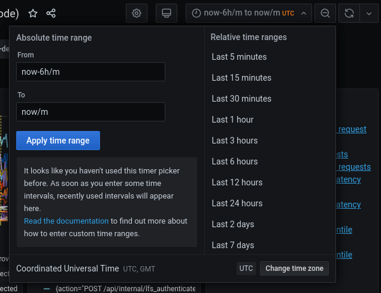
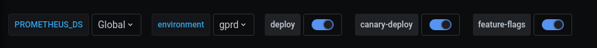
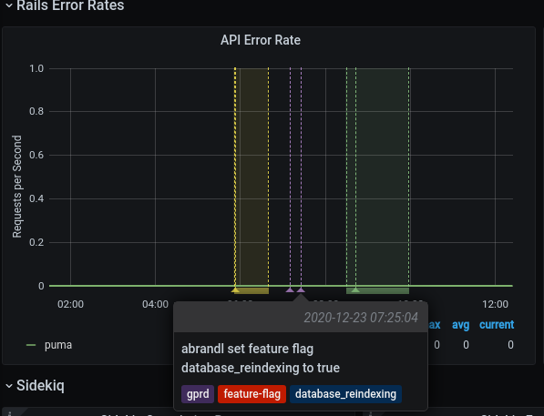
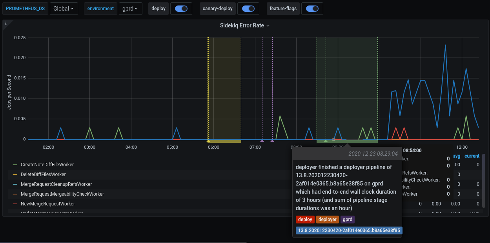
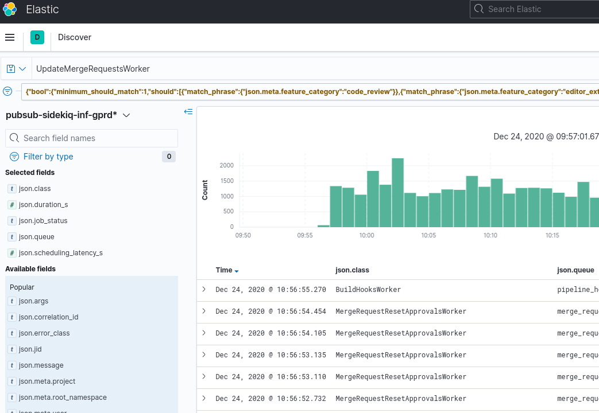
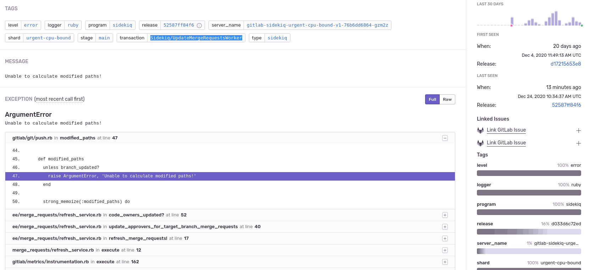

# Dashboards for stage groups

## Introduction

Observability is an important part to create a good software system. Observability is about bringing visibility into a system to see and understand the state of each component, with context to support performance tuning and debugging. Gitlab soon builds a rich and detailed observability platform, and a set of [monitoring dashboards](https://dashboards.gitlab.net/dashboards/f/stage-groups/stage-groups) on top. It becomes indispensable to daily activities of [Infrastructure folks](https://about.gitlab.com/handbook/engineering/infrastructure/) at Gitlab. However, all the items in the mointoring system reflect the perspectives of the infrastructure engineers heavily. As our production system grows, a lot of components are added, lead to the growth of complexity of the monitoring system. An engineer from a development department would be overwhelmed by the amount of information, in which most of them are irrelevant.

Dashboards for stage groups are a set of dashboards tailored for the needs of Development stage group. They are borned to bring the Stage Groups closer to understanding how their code operates on GitLab.com and will make them more aware of the impact of code changes, deployments, and feature toggles. Each stage group has a dashboard consisting of metrics at application levels, such as Rails Web Requests, Rails API Requests, Sidekiq Jobs, etc. The metrics in each dashboard are filtered and accumulated based on the [Gitlab product ownership](https://about.gitlab.com/handbook/product/categories/) and [Feature Categorization](https://docs.gitlab.com/ee/development/feature_categorization/) in the main Rails resource code.

The list of dashboards for each stage group is accessible at [https://dashboards.gitlab.net/dashboards/f/stage-groups/stage-groups](https://dashboards.gitlab.net/dashboards/f/stage-groups/stage-groups) for Gitlab employees only.

Please note that the dashboards for stage groups are at the very early stage. All contributions are welcome. If you have any questions or suggestions, please fire us an issue in the [Scalability Team issues tracker](https://gitlab.com/gitlab-com/gl-infra/scalability/-/issues).

## Usage

Inside a stage group dashboard, [Source Code group's dashboard](https://dashboards.gitlab.net/d/stage-groups-source_code/stage-groups-group-dashboard-create-source-code?orgId=1) for example, there are some notable components.

**Disclaimer**: the stage group dashboard used for example here is arbitrarily picked without any reasons.

### Time filter

- By default, all the times are in UTC timezone. You can change the timezone to your local timezone. However, please be aware of this change when communicate with others.
- All metrics recorded in the [Gitlab] production system have 14-day retention.

### Filters and annotations

In each dashboard, there are two filters and some annotations switch on the top of the page.

- `PROMETHEUS_DS`: filter the selective Prometheus datasource. Most of the time, you won't need to care about this filter.
- `environment`: filter the environment the metrics are fetched from. The default setting is production (`gprd`). Read more at [Production Environment](https://about.gitlab.com/handbook/engineering/infrastructure/production/architecture/#environments).

[Grafana annotations](https://grafana.com/docs/grafana/latest/dashboards/annotations/) marks some special events, which are meaningful to development and operational activities, directly on the graphs. The dashboard supports some annotations:

- `deploy`: mark a deployment event.
- `canary-deploy`: mark a [canary deployment](https://about.gitlab.com/handbook/engineering/#sts=Canary%20Testing) event.
- `feature-flags`: mark the time point where a feature flag is updated.

### Metrics panels

Most of the metrics displayed in the panels are self-explained. There are something needed to pay attention:
- The metrics are calculated using statistics method. They help you have an overview of the stage of a system over time. They are not meant to give you a precise numbers of discrete events. If you need a higher level accuracy, please look at another monitoring tool like [logs](https://about.gitlab.com/handbook/engineering/monitoring/#logs).
- All the rate metrics' units are `requests per second`. The default aggregate time frame is 1 minute.
- Take an example metric and explain. For example, What does `0.022` requests per minute on the panel suppose to mean?
- Some more notes here about the metric accuracy

One more paragraph about explore more with Grafana and promql
Link to references of Grafana manual page and Prometheus promql

## How to debug an issue?

Considering this scenario:
- A member of the Code Review group has merged a MR and deployed it into the production.
- To verify the deployment, that member accesses the [Code Review grou's dashboard](https://dashboards.gitlab.net/d/stage-groups-code_review/stage-groups-group-dashboard-create-code-review?orgId=1).
- Sidekiq Error Rate panel seems to have an issue. `UpdateMergeRequestsWorker`'s error rate' suddenly increases after your deployment.

- Clicking on` Kibana: Kibana Sidekiq failed request logs` link in the Extra links session, that member continue filtering for `UpdateMergeRequestsWorker` and skim through the logs.

- That member opens [Sentry](https://sentry.gitlab.net/gitlab/gitlabcom), filter by transaction type and correlation_id from a Kibana's result item.

- Tada, the precise exception, including stacktrace, job arguments, and other information, appears. Happy debugging!

## How to customize the dashboard?
- Explain how the dashboard is generated, link to the jsonnet documents
- Basic customization with keyword arguments
- More customization, create an example of simple dashboard.
- Deep customizations like custom metrics, custom alerts, etc. => Link to runbook dashboard readme
