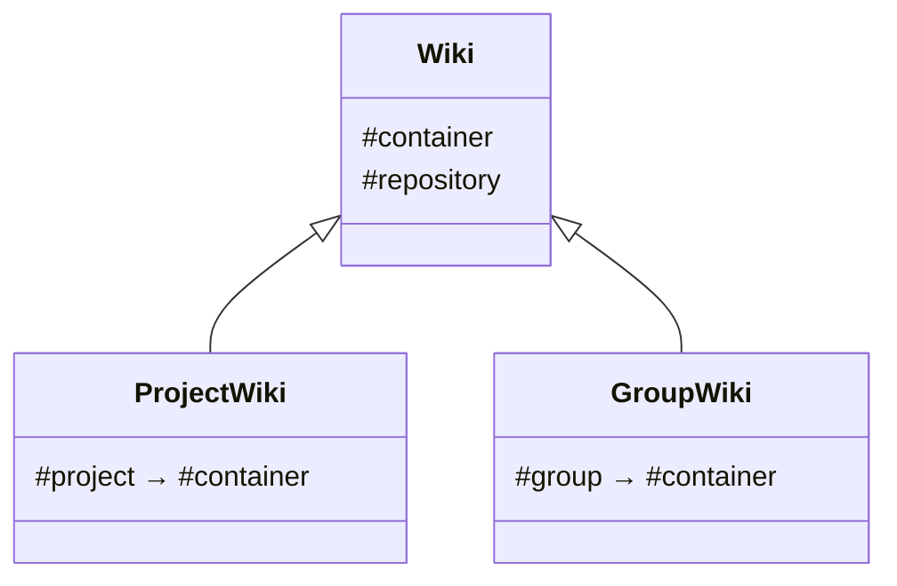

# Wikis development guide

## Overview

The wiki functionality in GitLab is based on [Gollum 4.x](https://github.com/gollum/gollum/),
which is used in [Gitaly's](gitaly.md) Ruby service and accessed from the Rails app through Gitaly RPC calls.

Wikis use Git repositories as storage backend, and can be accessed through the
[web interface](../user/project/wiki/index.md) and the [REST API](../api/wikis.md).

Starting with GitLab 13.5 wikis are also available on groups, in addition to projects.

## Model classes

The `Wiki` class is the main abstraction around a wiki repository, it needs to be initialized
with a container which can be either a `Project` or `Group`:

Some models wrap similar classes from Gitaly and Gollum:

| Rails Model | Gitaly Class                                            | Gollum         |
|:------------|:--------------------------------------------------------|:---------------|
| `Wiki`      | `Gitlab::Git::Wiki`                                     | `Gollum::Wiki` |
| `WikiPage`  | `Gitlab::Git::WikiPage`, `Gitlab::Git::WikiPageVersion` | `Gollum::Page` |
|             | `Gitlab::Git::WikiFile`                                 | `Gollum::File` |

Only some data is persisted in the database:

| Model                 | Description                              |
|:----------------------|:-----------------------------------------|
| `WikiPage::Meta`      | Metadata for wiki pages                  |
| `WikiPage::Slug`      | Current and previous slugs of wiki pages |
| `ProjectRepository`   | Gitaly storage data for project wikis    |
| `GroupWikiRepository` | Gitaly storage data for group wikis      |

## Gollum

We only use Gollum as a storage abstraction layer, the rendering goes through our own Banzai pipeline
and our custom [`GollumTagsFilter`](https://gitlab.com/gitlab-org/gitlab/-/blob/master/lib/banzai/filter/gollum_tags_filter.rb), which implements Gollum's `[[link]]` syntax.

We plan to move away from Gollum entirely at some point, [see this epic](https://gitlab.com/groups/gitlab-org/-/epics/2381).

### Involved gems

These are defined in [Gitaly's `Gemfile`](https://gitlab.com/gitlab-org/gitaly/-/blob/master/ruby/Gemfile):

| Description                         | Gem name                       | GitLab fork                                                                                             | Upstream project                                                    |
|:------------------------------------|:-------------------------------|:--------------------------------------------------------------------------------------------------------|:--------------------------------------------------------------------|
| Main Gollum library                 | `gitlab-gollum-lib`            | [`gitlab-org/gollum-lib`](https://gitlab.com/gitlab-org/gollum-lib)                                     | [`gollum/gollum-lib`](https://github.com/gollum/gollum-lib)         |
| Gollum Git adapter for Rugged       | `gitlab-gollum-rugged_adapter` | [`gitlab-org/gitlab-gollum-rugged_adapter`](https://gitlab.com/gitlab-org/gitlab-gollum-rugged_adapter) | [`gollum/rugged_adapter`](https://github.com/gollum/rugged_adapter) |
| Rugged (also used in Gitaly itself) | `rugged`                       | -                                                                                                       | [`libgit2/rugged`](https://github.com/libgit2/rugged)               |

## Attachments

The web editor uploads attachments through the REST API, which stores the images as commits in the wiki repository.

Prior to GitLab 11.3 attachments were stored outside of the repository, [see this issue](https://gitlab.com/gitlab-org/gitlab-foss/-/issues/33475).
