# How to install GitLab on OpenShift Origin 3

WARNING:
This article is deprecated. Use the official Kubernetes Helm charts for
installing GitLab to OpenShift. Check out the
[official installation docs](https://docs.gitlab.com/charts/installation/cloud/openshift.html)
for details.

## Introduction

[OpenShift Origin](https://www.okd.io/) (**Note:** renamed to OKD in Aug 2018) is an open source container application
platform created by [RedHat](https://www.redhat.com/en), based on [Kubernetes](https://kubernetes.io/) and [Docker](https://www.docker.com). That means
you can host your own PaaS for free and almost with no hassle.

In this tutorial, we will see how to deploy GitLab in OpenShift using GitLab's
official Docker image while getting familiar with the web interface and CLI
tools that will help us achieve our goal.

For a video demonstration on installing GitLab on OpenShift, check the article [In 13 minutes from Kubernetes to a complete application development tool](https://about.gitlab.com/blog/2016/11/14/idea-to-production/).

## Prerequisites

WARNING:
This information is no longer up to date, as the current versions
have changed and products have been renamed.

OpenShift 3 is not yet deployed on RedHat's offered [Online platform](https://www.openshift.com/),
so in order to test it, we will use an [all-in-one Virtualbox image](https://www.okd.io/minishift/) that is
offered by the OpenShift developers and managed by Vagrant. If you haven't done
already, go ahead and install the following components as they are essential to
test OpenShift easily:

- [VirtualBox](https://www.virtualbox.org/wiki/Downloads)
- [Vagrant](https://www.vagrantup.com/downloads.html)
- [OpenShift Client](https://docs.okd.io/3.11/cli_reference/get_started_cli.html) (`oc` for short)

It is also important to mention that for the purposes of this tutorial, the
latest Origin release is used:

- **oc** `v1.3.0` (must be [installed](https://github.com/openshift/origin/releases/tag/v1.3.0) locally on your computer)
- **OpenShift** `v1.3.0` (is pre-installed in the [VM image](https://app.vagrantup.com/openshift/boxes/origin-all-in-one))
- **Kubernetes** `v1.3.0` (is pre-installed in the [VM image](https://app.vagrantup.com/openshift/boxes/origin-all-in-one))

NOTE:
If you intend to deploy GitLab on a production OpenShift cluster, there are some
limitations to bare in mind. Read on the [limitations](#current-limitations)
section for more information and follow the linked links for the relevant
discussions.

Now that you have all batteries, let's see how easy it is to test OpenShift
on your computer.

## Getting familiar with OpenShift Origin

The environment we are about to use is based on CentOS 7 which comes with all
the tools needed pre-installed: Docker, Kubernetes, OpenShift, etcd.

### Test OpenShift using Vagrant

As of this writing, the all-in-one VM is at version 1.3, and that's
what we will use in this tutorial.

In short:

1. Open a terminal and in a new directory run:

   ```shell
   vagrant init openshift/origin-all-in-one
   ```

1. This will generate a Vagrantfile based on the all-in-one VM image
1. In the same directory where you generated the Vagrantfile
   enter:

   ```shell
   vagrant up
   ```

This will download the VirtualBox image and fire up the VM with some preconfigured
values as you can see in the Vagrantfile. As you may have noticed, you need
plenty of RAM (5GB in our example), so make sure you have enough.

Now that OpenShift is set up, let's see how the web console looks like.

### Explore the OpenShift web console

Once Vagrant finishes its thing with the VM, you will be presented with a
message which has some important information. One of them is the IP address
of the deployed OpenShift platform and in particular `https://10.2.2.2:8443/console/`.
Open this link with your browser and accept the self-signed certificate in
order to proceed.

Let's login as admin with username/password `admin/admin`. This is what the
landing page looks like:

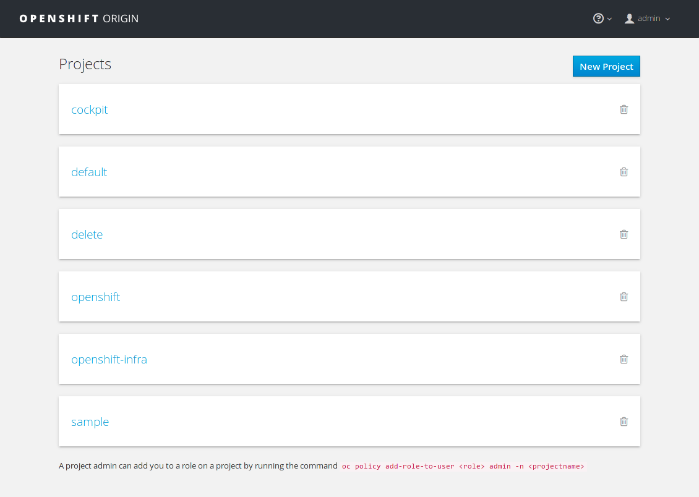

You can see that a number of [projects](https://docs.okd.io/3.11/dev_guide/projects.html) are already created for testing purposes.

If you head over the `openshift-infra` project, a number of services with their
respective pods are there to explore.

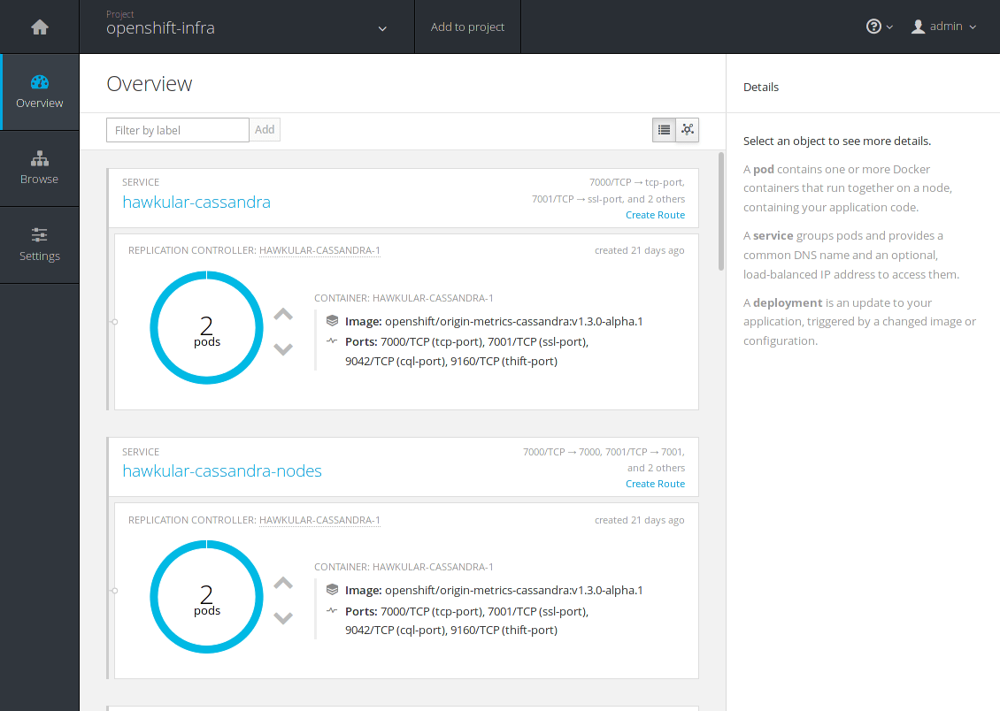

We are not going to explore the whole interface, but if you want to learn about
the key concepts of OpenShift, read the [core concepts reference](https://docs.okd.io/3.11/architecture/core_concepts/index.html)
in the official documentation.

### Explore the OpenShift CLI

OpenShift Client (`oc`), is a powerful CLI tool that talks to the OpenShift API
and performs pretty much everything you can do from the web UI and much more.

Assuming you have [installed](https://docs.okd.io/3.11/cli_reference/get_started_cli.html) it, let's explore some of its main
functionalities.

Let's first see the version of `oc`:

```shell
$ oc version

oc v1.3.0
kubernetes v1.3.0+52492b4
```

With `oc help` you can see the top level arguments you can run with `oc` and
interact with your cluster, Kubernetes, run applications, create projects and
much more.

Let's login to the all-in-one VM and see how to achieve the same results like
when we visited the web console earlier. The username/password for the
administrator user is `admin/admin`. There is also a test user with username/
password `user/user`, with limited access. Let's login as admin for the moment:

```shell
$ oc login https://10.2.2.2:8443

Authentication required for https://10.2.2.2:8443 (openshift)
Username: admin
Password:
Login successful.

You have access to the following projects and can switch between them with 'oc project <projectname>':

- cockpit
- default (current)
- delete
- openshift
- openshift-infra
- sample

Using project "default".
```

Switch to the `openshift-infra` project with:

```shell
oc project openshift-infra
```

And finally, see its status:

```shell
oc status
```

The last command should spit a bunch of information about the statuses of the
pods and the services, which if you look closely is what we encountered in the
second image when we explored the web console.

You can always read more about `oc` in the [OpenShift CLI documentation](https://docs.okd.io/3.11/cli_reference/get_started_cli.html).

### Troubleshooting the all-in-one VM

Using the all-in-one VM gives you the ability to test OpenShift whenever you
want. That means you get to play with it, shutdown the VM, and pick up where
you left off.

Occasionally, you may encounter issues, like OpenShift not running when booting
up the VM. The web UI may not respond, or you may see issues when trying to sign
in with `oc`, like:

```plaintext
The connection to the server 10.2.2.2:8443 was refused - did you specify the right host or port?
```

In that case, the OpenShift service might not be running, so in order to fix it:

1. SSH into the VM by going to the directory where the Vagrantfile is and then
   run:

   ```shell
   vagrant ssh
   ```

1. Run `systemctl` and verify by the output that the `openshift` service is not
   running (it will be in red color). If that's the case start the service with:

   ```shell
   sudo systemctl start openshift
   ```

1. Verify the service is up with:

   ```shell
   systemctl status openshift -l
   ```

You can now sign in by using `oc` (like we did before) and visit the web console.

## Deploy GitLab

Now that you got a taste of what OpenShift looks like, let's deploy GitLab!

### Create a new project

First, we will create a new project to host our application. You can do this
either by running the CLI client:

```shell
oc new-project gitlab
```

or by using the web interface:

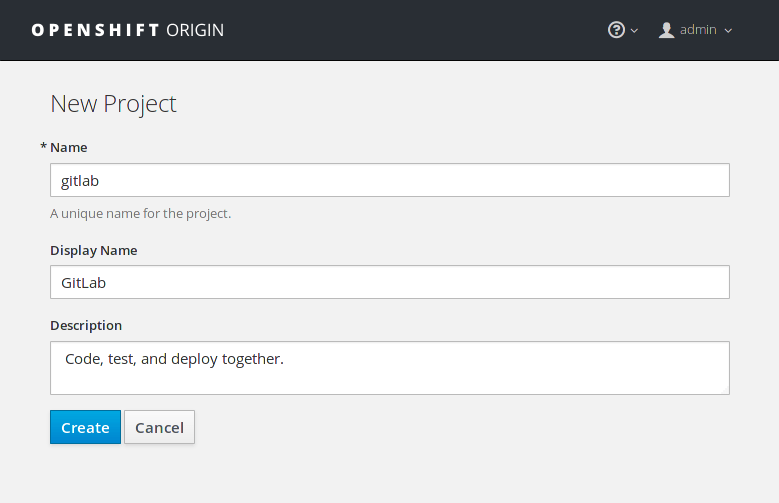

If you used the command line, `oc` automatically uses the new project and you
can see its status with:

```shell
$ oc status

In project gitlab on server https://10.2.2.2:8443

You have no services, deployment configs, or build configs.
Run 'oc new-app' to create an application.
```

If you visit the web console, you can now see `gitlab` listed in the projects list.

The next step is to import the OpenShift template for GitLab.

### Import the template

The [template](https://docs.okd.io/3.11/architecture/core_concepts/templates.html) is basically a JSON file which describes a set of
related object definitions to be created together, as well as a set of
parameters for those objects.

The template for GitLab resides in the Omnibus GitLab repository under the
Docker directory. Let's download it locally with `wget`:

```shell
wget https://gitlab.com/gitlab-org/omnibus-gitlab/raw/master/docker/openshift-template.json
```

And then let's import it in OpenShift:

```shell
oc create -f openshift-template.json -n openshift
```

NOTE:
The `-n openshift` namespace flag is a trick to make the template available to all
projects. If you recall from when we created the `gitlab` project, `oc` switched
to it automatically, and that can be verified by the `oc status` command. If
you omit the namespace flag, the application will be available only to the
current project, in our case `gitlab`. The `openshift` namespace is a global
one that the administrators should use if they want the application to be
available to all users.

We are now ready to finally deploy GitLab!

### Create a new application

The next step is to use the template we previously imported. Head over to the
`gitlab` project and hit the **Add to Project** button.

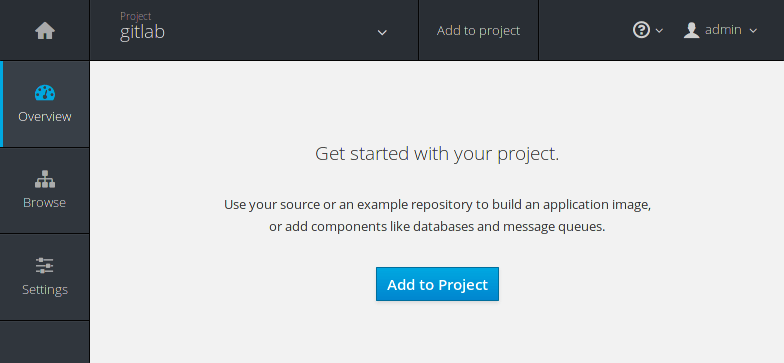

This will bring you to the catalog where you can find all the pre-defined
applications ready to deploy with the click of a button. Search for `gitlab`
and you will see the previously imported template:

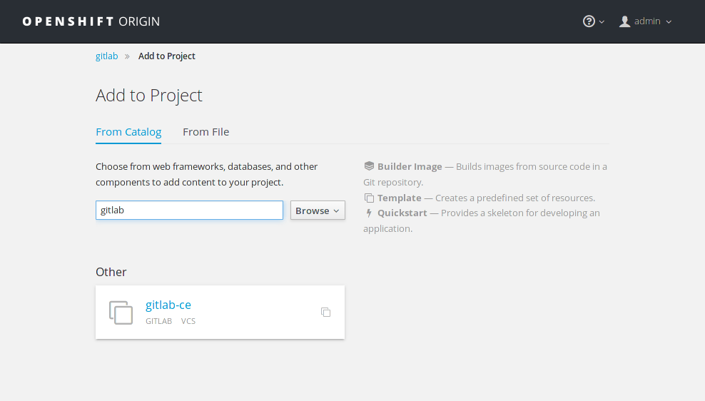

Select it, and in the following screen you will be presented with the predefined
values used with the GitLab template:

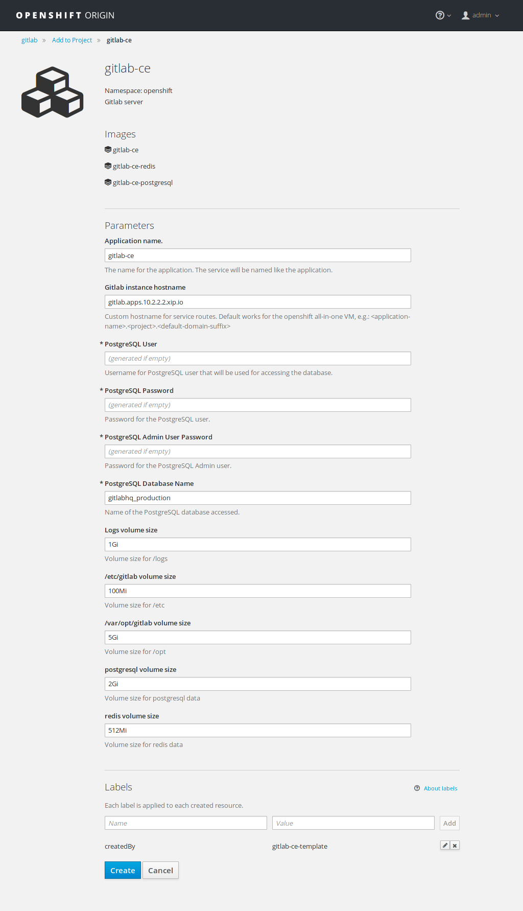

Notice at the top that there are three resources to be created with this
template:

- `gitlab-ce`
- `gitlab-ce-redis`
- `gitlab-ce-postgresql`

While PostgreSQL and Redis are bundled in Omnibus GitLab, the template is using
separate images as you can see from [this line](https://gitlab.com/gitlab-org/omnibus-gitlab/blob/658c065c8d022ce858dd63eaeeadb0b2ddc8deea/docker/openshift-template.json#L239) in the template.

The predefined values have been calculated for the purposes of testing out
GitLab in the all-in-one VM. You don't need to change anything here, hit
**Create** to start the deployment.

If you are deploying to production you will want to change the **GitLab instance
hostname** and use greater values for the volume sizes. If you don't provide a
password for PostgreSQL, it will be created automatically.

NOTE:
The `gitlab.apps.10.2.2.2.nip.io` hostname that is used by default will
resolve to the host with IP `10.2.2.2` which is the IP our VM uses. It is a
trick to have distinct FQDNs pointing to services that are on our local network.
Read more on how this works in <https://nip.io>.

Now that we configured this, let's see how to manage and scale GitLab.

## Manage and scale GitLab

Setting up GitLab for the first time might take a while depending on your
internet connection and the resources you have attached to the all-in-one VM.
GitLab's Docker image is quite big (~500MB), so you'll have to wait until
it's downloaded and configured before you use it.

### Watch while GitLab gets deployed

Navigate to the `gitlab` project at **Overview**. You can notice that the
deployment is in progress by the orange color. The Docker images are being
downloaded and soon they will be up and running.

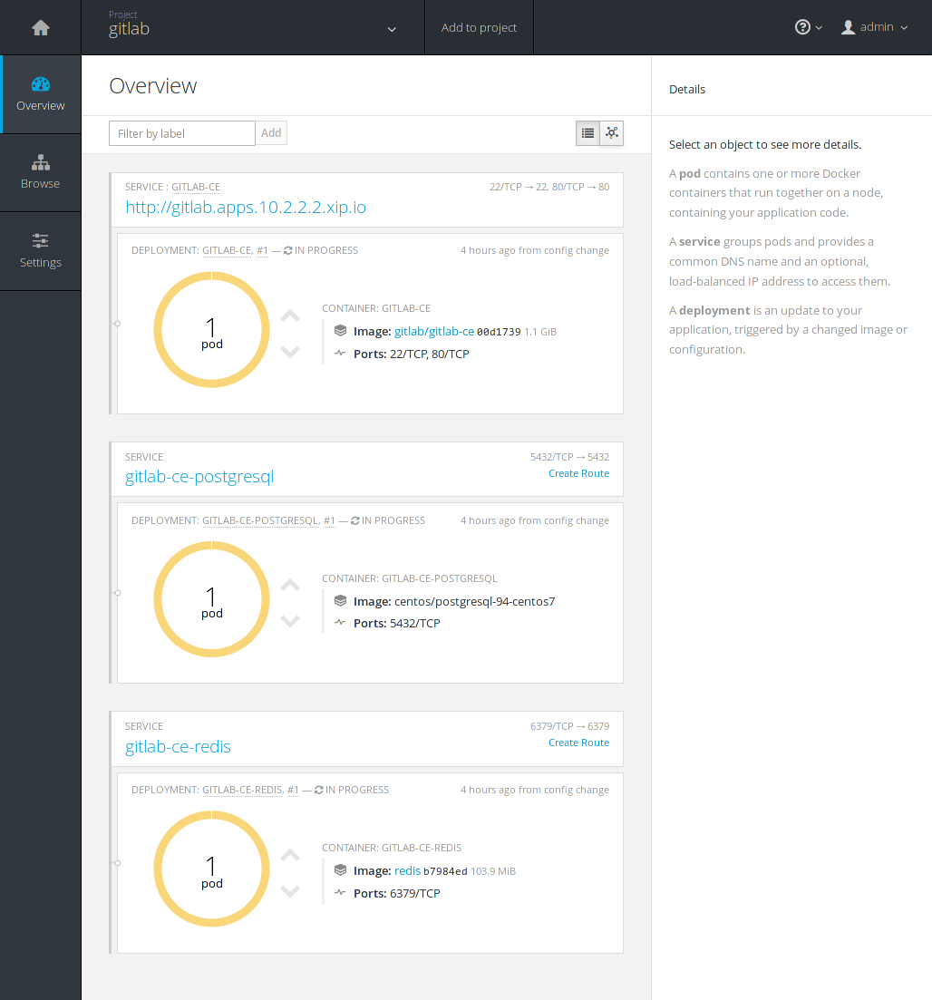

Switch to the **Browse > Pods** and you will eventually see all 3 pods in a
running status. Remember the 3 resources that were to be created when we first
created the GitLab app? This is where you can see them in action.

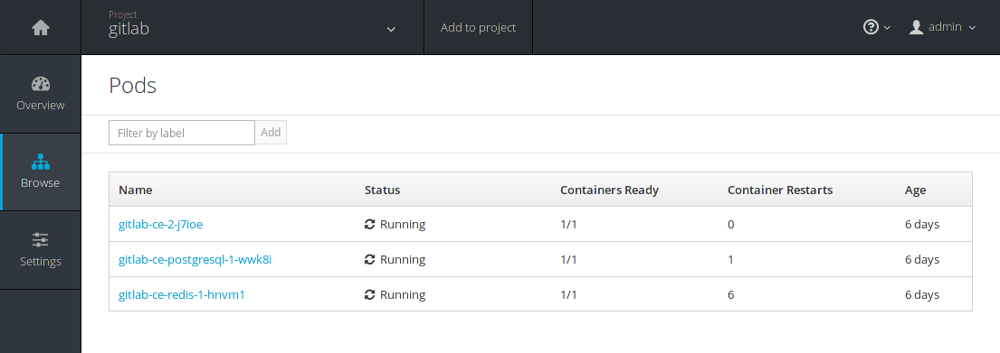

You can see GitLab being reconfigured by taking look at the logs in realtime.
Click on `gitlab-ce-2-j7ioe` (your ID will be different) and go to the **Logs**
tab.

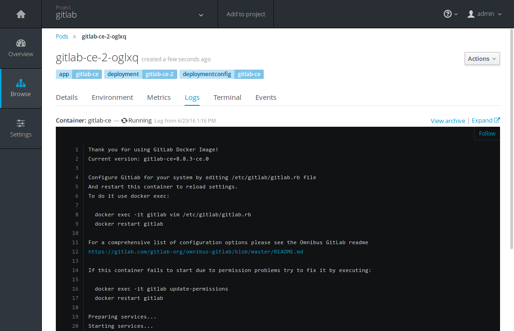

At a point you should see a `gitlab Reconfigured!` message in the logs.
Navigate back to the **Overview** and hopefully all pods will be up and running.

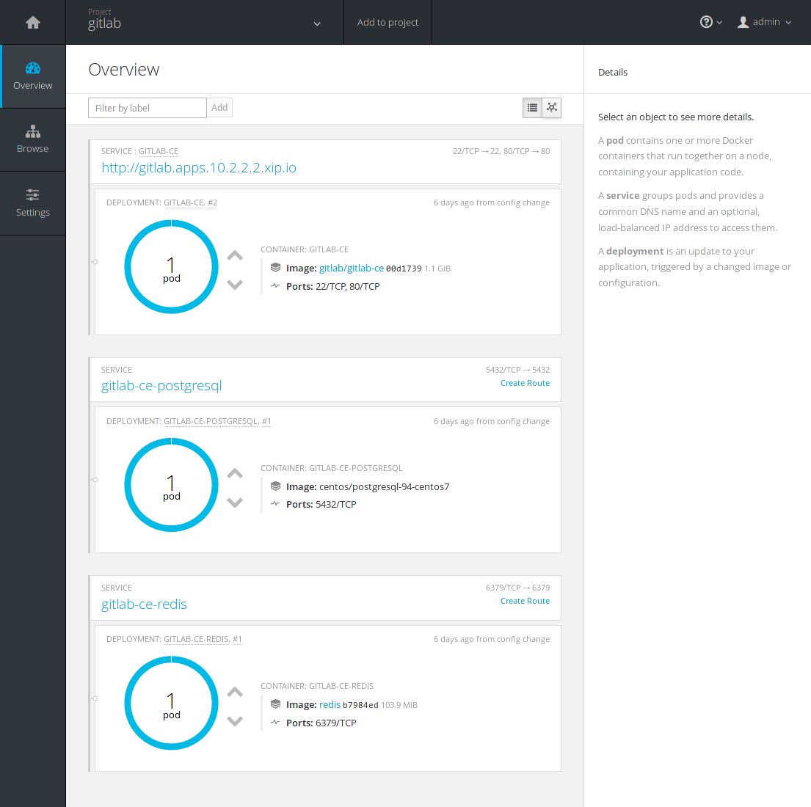

Congratulations! You can now navigate to your new shinny GitLab instance by
visiting `http://gitlab.apps.10.2.2.2.nip.io` where you will be asked to
change the root user password. Login using `root` as username and providing the
password you just set, and start using GitLab!

### Scale GitLab with the push of a button

If you reach to a point where your GitLab instance could benefit from a boost
of resources, you'd be happy to know that you can scale up with the push of a
button.

In the **Overview** page just click the up arrow button in the pod where
GitLab is. The change is instant and you can see the number of [replicas](https://docs.okd.io/3.11/architecture/core_concepts/deployments.html#replication-controllers) now
running scaled to 2.

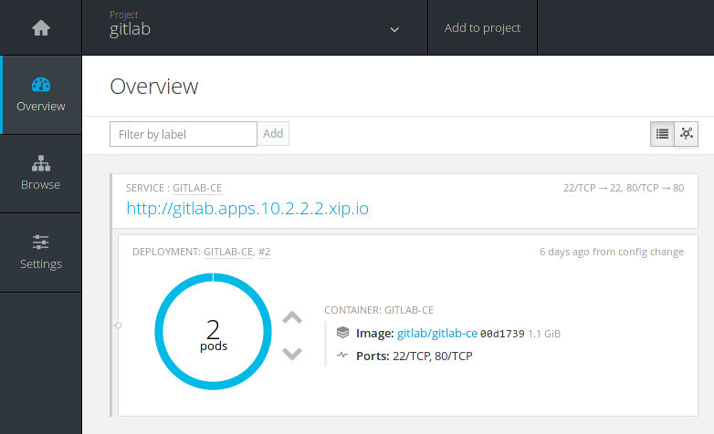

Upping the GitLab pods is actually like adding new application servers to your
cluster. You can see how that would work if you didn't use GitLab with
OpenShift by following the [HA documentation](../../administration/reference_architectures/index.md) for the application servers.

Bare in mind that you may need more resources (CPU, RAM, disk space) when you
scale up. If a pod is in pending state for too long, you can navigate to
**Browse > Events** and see the reason and message of the state.


### Scale GitLab using the `oc` CLI

Using `oc` is super easy to scale up the replicas of a pod. You may want to
skim through the [basic CLI operations](https://docs.okd.io/3.11/cli_reference/basic_cli_operations.html) to get a taste how the CLI
commands are used. Pay extra attention to the object types as we will use some
of them and their abbreviated versions below.

In order to scale up, we need to find out the name of the replication controller.
Let's see how to do that using the following steps.

1. Make sure you are in the `gitlab` project:

   ```shell
   oc project gitlab
   ```

1. See what services are used for this project:

   ```shell
   oc get svc
   ```

   The output will be similar to:

   ```plaintext
   NAME                   CLUSTER-IP       EXTERNAL-IP   PORT(S)         AGE
   gitlab-ce              172.30.243.177   <none>        22/TCP,80/TCP   5d
   gitlab-ce-postgresql   172.30.116.75    <none>        5432/TCP        5d
   gitlab-ce-redis        172.30.105.88    <none>        6379/TCP        5d
   ```

1. We need to see the replication controllers of the `gitlab-ce` service.
   Get a detailed view of the current ones:

   ```shell
   oc describe rc gitlab-ce
   ```

   This will return a large detailed list of the current replication controllers.
   Search for the name of the GitLab controller, usually `gitlab-ce-1` or if
   that failed at some point and you spawned another one, it will be named
   `gitlab-ce-2`.

1. Scale GitLab using the previous information:

   ```shell
   oc scale --replicas=2 replicationcontrollers gitlab-ce-2
   ```

1. Get the new replicas number to make sure scaling worked:

   ```shell
   oc get rc gitlab-ce-2
   ```

   which will return something like:

   ```plaintext
   NAME          DESIRED   CURRENT   AGE
   gitlab-ce-2   2         2         5d
   ```

And that's it! We successfully scaled the replicas to 2 using the CLI.

As always, you can find the name of the controller using the web console. Just
click on the service you are interested in and you will see the details in the
right sidebar.

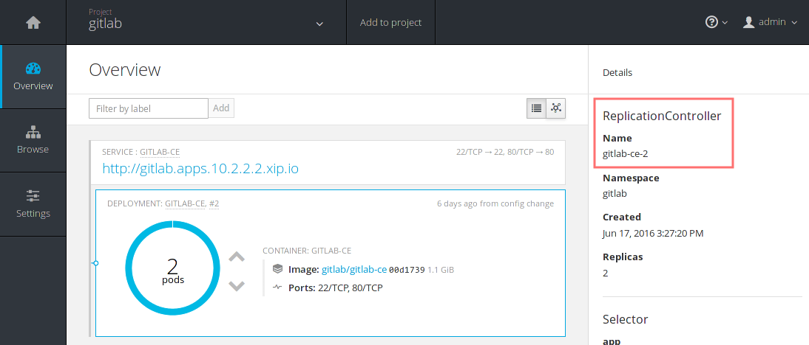

### Autoscaling GitLab

In case you were wondering whether there is an option to autoscale a pod based
on the resources of your server, the answer is yes, of course there is.

We will not expand on this matter, but feel free to read the documentation on
OpenShift's website about [autoscaling](https://docs.okd.io/3.11/dev_guide/pod_autoscaling.html).

## Current limitations

As stated in the [all-in-one VM](https://www.okd.io/minishift/) page:

> By default, OpenShift will not allow a container to run as root or even a
non-random container assigned userid. Most Docker images in the Dockerhub do not
follow this best practice and instead run as root.

The all-in-one VM we are using has this security turned off so it will not
bother us. In any case, it is something to keep in mind when deploying GitLab
on a production cluster.

In order to deploy GitLab on a production cluster, you will need to assign the
GitLab service account to the `anyuid` [Security Context Constraints](https://docs.okd.io/3.11/admin_guide/manage_scc.html).

For OpenShift v3.0, you will need to do this manually:

1. Edit the Security Context:

   ```shell
   oc edit scc anyuid
   ```

1. Add `system:serviceaccount:<project>:gitlab-ce-user` to the `users` section.
   If you changed the Application Name from the default the user will
   will be `<app-name>-user` instead of `gitlab-ce-user`

1. Save and exit the editor

For OpenShift v3.1 and above, you can do:

```shell
oc adm policy add-scc-to-user anyuid system:serviceaccount:gitlab:gitlab-ce-user
```

## Conclusion

You should now have an understanding of the basic OpenShift Origin concepts, and
a sense of how things work using the web console or the CLI.

Upload a template, create a project, add an application, and you're done. You're
ready to sign in to your new GitLab instance.

Remember that this tutorial doesn't address all that Origin is capable of. As
always, refer to the detailed [documentation](https://docs.okd.io) to learn more
about deploying your own OpenShift PaaS and managing your applications with
containers.
