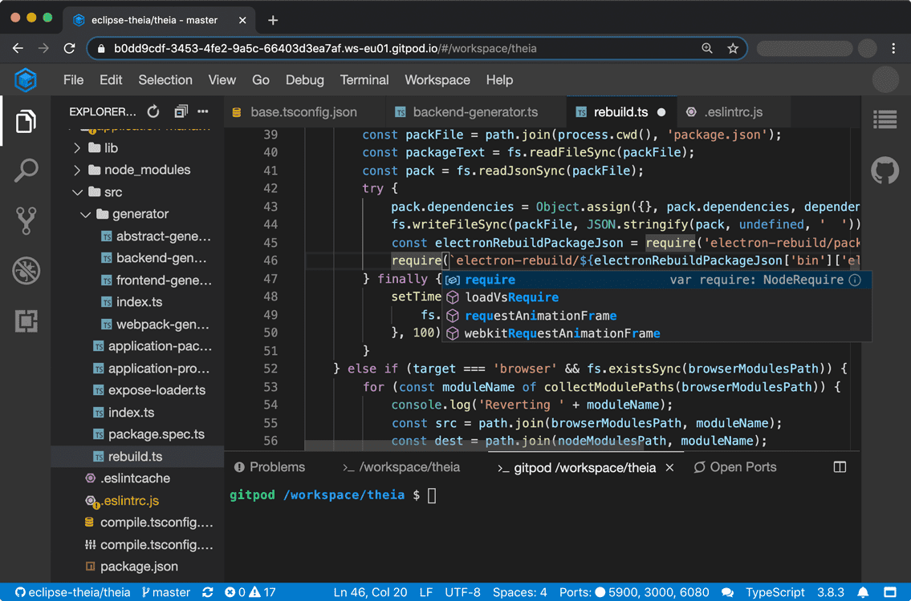

# Gitpod Integration

> - [Introduced](https://gitlab.com/gitlab-org/gitlab/-/issues/228893) in GitLab 13.4.
> - [Feature flag removed](https://gitlab.com/gitlab-org/gitlab/-/258206) in GitLab 13.8

With [Gitpod](https://gitpod.io/) you can describe your dev environment as code to get fully set
up, compiled, and tested dev environments for any GitLab project. The dev environments are not only
automated but also prebuilt which means that Gitpod continuously builds your Git branches like a CI
server. By that you don’t have to wait for dependencies to be downloaded and builds to finish, but
you can start coding immediately.

In short: With Gitpod you can start coding instantly on any project, branch, and merge request from
any device, at any time.

You can launch Gitpod directly from GitLab by clicking the **Gitpod** button from the **Web IDE**
dropdown on the project page:

To learn more about Gitpod, see their [features](https://www.gitpod.io/features/) and
[documentation](https://www.gitpod.io/docs/).

To use the GitLab-Gitpod integration, you need to enable it from your user preferences:

1. From the GitLab UI, click your avatar in the top-right corner, then click **Settings**.
1. On the left-hand nav, click **Preferences**.
1. Under **Integrations**, find the **Gitpod** section.
1. Check **Enable Gitpod**.

Users of GitLab.com can enable it and start using straightaway. Users of GitLab self-managed instances
can follow the same steps once the integration has been enabled and configured by a GitLab administrator.

## Configure your GitLab instance with Gitpod **(CORE ONLY)**

The integration of Gitpod with GitLab is enabled on GitLab.com and available to all users.
For GitLab self-managed instances, a GitLab administrator needs to enable it through the admin settings.

First, you (GitLab admin) need to set up a Gitpod instance to integrate with GitLab.
Head over to the [Gitpod documentation](https://www.gitpod.io/docs/self-hosted/latest/self-hosted/) to
get your instance up and running. Once done:

1. In GitLab, go to **Admin Area > Settings > General**.
1. Expand the **Gitpod** configuration section.
1. Check **Enable Gitpod**.
1. Add your Gitpod instance URL (for example, `https://gitpod.example.com`).
