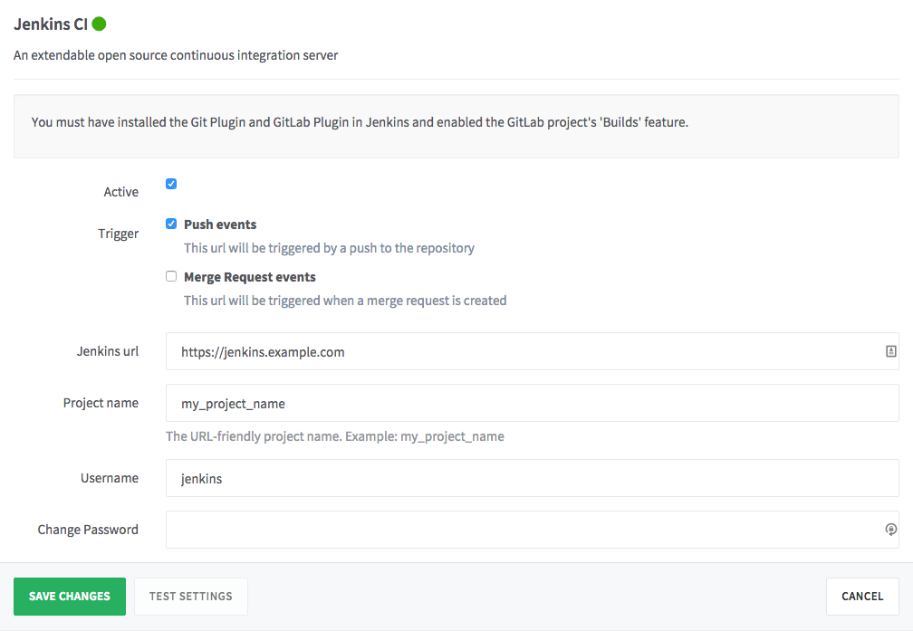

# Jenkins CI service

>**Note:**
In GitLab 8.3, Jenkins integration using the
[GitLab Hook Plugin](https://wiki.jenkins-ci.org/display/JENKINS/GitLab+Hook+Plugin)
was deprecated in favor of the
[GitLab Plugin](https://wiki.jenkins-ci.org/display/JENKINS/GitLab+Plugin).
The deprecated integration has been renamed to [Jenkins CI (Deprecated)](jenkins_deprecated.md) in the
project service settings. We may remove this in a future release and recommend
using the new 'Jenkins CI' project service instead which is described in this
document.

## Overview

[Jenkins](https://jenkins.io/) is a great Continuous Integration tool, similar to our built-in
[GitLab CI](../ci/README.md).

GitLab's Jenkins integration allows you to trigger a Jenkins build when you
push code to a repository, or when a merge request is created. Additionally,
it shows the pipeline status on merge requests widgets and on the project's home page.

## Use cases

- Suppose you are new to GitLab, and want to keep using Jenkins until you prepare
your projects to build with [GitLab CI/CD](../ci/README.md). You set up the
integration between GitLab and Jenkins, then you migrate to GitLab CI later. While
you organize yourself and your team to onboard GitLab, you keep your pipelines
running with Jenkins, but view the results in your project's repository in GitLab.
- Your team uses [Jenkins Plugins](https://plugins.jenkins.io/) for other proceedings,
therefore, you opt for keep using Jenkins to build your apps. Show the results of your
pipelines directly in GitLab.

## Requirements

* [Jenkins GitLab Plugin](https://wiki.jenkins-ci.org/display/JENKINS/GitLab+Plugin)
* [Jenkins Git Plugin](https://wiki.jenkins-ci.org/display/JENKINS/Git+Plugin)
* Git clone access for Jenkins from the GitLab repository
* GitLab API access to report build status

## Configure GitLab users

Create a user or choose an existing user that Jenkins will use to interact
through the GitLab API. This user will need to be a global Admin or added
as a member to each Group/Project. Developer permission is required for reporting
build status. This is because a successful build status can trigger a merge
when 'Merge when pipeline succeeds' feature is used. Some features of the GitLab
Plugin may require additional privileges. For example, there is an option to
accept a merge request if the build is successful. Using this feature would
require developer, maintainer or owner-level permission.

Copy the private API token from **Profile Settings -> Account**. You will need this
when configuring the Jenkins server later.

## Configure the Jenkins server

Install [Jenkins GitLab Plugin](https://wiki.jenkins-ci.org/display/JENKINS/GitLab+Plugin)
and [Jenkins Git Plugin](https://wiki.jenkins-ci.org/display/JENKINS/Git+Plugin).

Go to Manage Jenkins -> Configure System and scroll down to the 'GitLab' section.
Enter the GitLab server URL in the 'GitLab host URL' field and paste the API token
copied earlier in the 'API Token' field.

## Configure a Jenkins project

Follow the GitLab Plugin documentation under the
[Using it With a Job](https://github.com/jenkinsci/gitlab-plugin#using-it-with-a-job)
heading. You *do not* need to complete instructions under the 'GitLab
Configuration (>= 8.0)'. Be sure to check the 'Use GitLab CI features' checkbox
as described under the 'GitLab Configuration (>= 8.1)'.

## Configure a GitLab project

Create a new GitLab project or choose an existing one. Then, go to **Integrations ->
Jenkins CI**.

Check the 'Active' box. Select whether you want GitLab to trigger a build
on push, Merge Request creation, tag push, or any combination of these. We
recommend unchecking 'Merge Request events' unless you have a specific use-case
that requires re-building a commit when a merge request is created. With 'Push
events' selected, GitLab will build the latest commit on each push and the build
status will be displayed in the merge request.

Enter the Jenkins URL and Project name. The project name should be URL-friendly
where spaces are replaced with underscores. To be safe, copy the project name
from the URL bar of your browser while viewing the Jenkins project.

Optionally, enter a username and password if your Jenkins server requires
authentication.

## Plugin functional overview

GitLab does not contain a database table listing commits. Commits are always
read from the repository directly. Therefore, it is not possible to retain the
build status of a commit in GitLab. This is overcome by requesting build
information from the integrated CI tool. The CI tool is responsible for creating
and storing build status for Commits and Merge Requests.

### Steps required to implement a similar integration

>**Note:**
All steps are implemented using AJAX requests on the merge request page.

1. In order to display the build status in a merge request you must create a project service in GitLab.
2. Your project service will do a (JSON) query to a URL of the CI tool with the SHA1 of the commit.
3. The project service builds this URL and payload based on project service settings and knowledge of the CI tool.
4. The response is parsed to give a response in GitLab (success/failed/pending).
