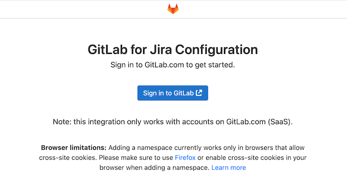
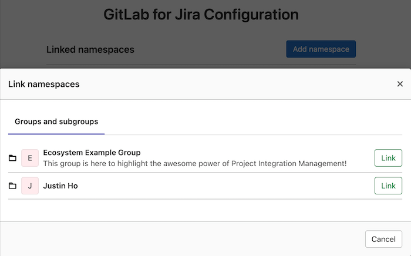

# GitLab for Jira app **(FREE SAAS)**

You can integrate GitLab.com and Jira Cloud using the
[GitLab for Jira](https://marketplace.atlassian.com/apps/1221011/gitlab-com-for-jira-cloud)
app in the Atlassian Marketplace. The user configuring GitLab for Jira must have
[Maintainer](../../user/permissions.md) permissions in the GitLab namespace.

This method is recommended when using GitLab.com and Jira Cloud because data is synchronized in real-time. The DVCS connector updates data only once per hour. If you are not using both of these environments, use the [Jira DVCS Connector](dvcs.md) method.

<i class="fa fa-youtube-play youtube" aria-hidden="true"></i>
For a walkthrough of the integration with GitLab for Jira, watch [Configure GitLab Jira Integration using Marketplace App](https://youtu.be/SwR-g1s1zTo) on YouTube.

1. Go to **Jira Settings > Apps > Find new apps**, then search for GitLab.
1. Click **GitLab for Jira**, then click **Get it now**, or go to the
   [App in the marketplace directly](https://marketplace.atlassian.com/apps/1221011/gitlab-com-for-jira-cloud).

   
1. After installing, click **Get started** to go to the configurations page.
   This page is always available under **Jira Settings > Apps > Manage apps**.

   
1. If not already signed in to GitLab.com, you must sign in as a user with
   [Maintainer](../../user/permissions.md) permissions to add namespaces.

   
1. Select **Add namespace** to open the list of available namespaces.

1. Identify the namespace you want to link, and select **Link**.

   

NOTE:
The GitLab user only needs access when adding a new namespace. For syncing with
Jira, we do not depend on the user's token.

After a namespace is added:

- All future commits, branches, and merge requests of all projects under that namespace
  are synced to Jira.
- From GitLab 13.8, past merge request data is synced to Jira.

Support for syncing past branch and commit data [is planned](https://gitlab.com/gitlab-org/gitlab/-/issues/263240).

For more information, see [Usage](index.md#usage).

## Install the GitLab Jira Cloud application for self-managed instances **(FREE SELF)**

If your GitLab instance is self-managed, you must follow some
extra steps to install the GitLab Jira Cloud application.

Each Jira Cloud application must be installed from a single location. Jira fetches
a [manifest file](https://developer.atlassian.com/cloud/jira/platform/connect-app-descriptor/)
from the location you provide. The manifest file describes the application to the system. To support
self-managed GitLab instances with Jira Cloud, you can either:

- [Install the application manually](#install-the-application-manually).
- [Create a Marketplace listing](#create-a-marketplace-listing).

### Install the application manually **(FREE SELF)**

You can configure your Atlassian Cloud instance to allow you to install applications
from outside the Marketplace, which allows you to install the application:

1. Sign in to your Jira instance as a user with administrator permissions.
1. Place your Jira instance into
   [development mode](https://developer.atlassian.com/cloud/jira/platform/getting-started-with-connect/#step-2--enable-development-mode).
1. Sign in to your GitLab application as a user with [Administrator](../../permissions.md) permissions.
1. Install the GitLab application from your self-managed GitLab instance, as
   described in the [Atlassian developer guides](https://developer.atlassian.com/cloud/jira/platform/getting-started-with-connect/#step-3--install-and-test-your-app)).
1. In your Jira instance, go to **Apps > Manage Apps** and click **Upload app**:

   

1. For **App descriptor URL**, provide full URL to your manifest file, modifying this
   URL based on your instance configuration: `https://your.domain/your-path/-/jira_connect/app_descriptor.json`
1. Click **Upload**, and Jira fetches the content of your `app_descriptor` file and installs
   it for you.
1. If the upload is successful, Jira displays a modal panel: **Installed and ready to go!**
   Click **Get started** to configure the integration.

   

The **GitLab for Jira** app now displays under **Manage apps**. You can also
click **Get started** to open the configuration page rendered from your GitLab instance.

NOTE:
If you make changes to the application descriptor, you must uninstall, then reinstall, the
application.

### Create a Marketplace listing **(FREE SELF)**

If you prefer to not use development mode on your Jira instance, you can create
your own Marketplace listing for your instance, which enables your application
to be installed from the Atlassian Marketplace.

For full instructions, review the Atlassian [guide to creating a marketplace listing](https://developer.atlassian.com/platform/marketplace/installing-cloud-apps/#creating-the-marketplace-listing). To create a
Marketplace listing, you must:

1. Register as a Marketplace vendor.
1. List your application, using the application descriptor URL.
   - Your manifest file is located at: `https://your.domain/your-path/-/jira_connect/app_descriptor.json`
   - GitLab recommends you list your application as `private`, because public
     applications can be viewed and installed by any user.
1. Generate test license tokens for your application.

Review the
[official Atlassian documentation](https://developer.atlassian.com/platform/marketplace/installing-cloud-apps/#creating-the-marketplace-listing)
for details.

NOTE:
DVCS means distributed version control system.

## Troubleshooting GitLab for Jira

The GitLab for Jira App uses an iframe to add namespaces on the settings page. Some browsers block cross-site cookies. This can lead to a message saying that the user needs to log in on GitLab.com even though the user is already logged in.

> "You need to sign in or sign up before continuing."

In this case, use [Firefox](https://www.mozilla.org/en-US/firefox/) or enable cross-site cookies in your browser.
