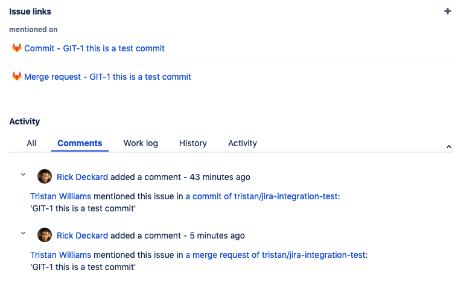
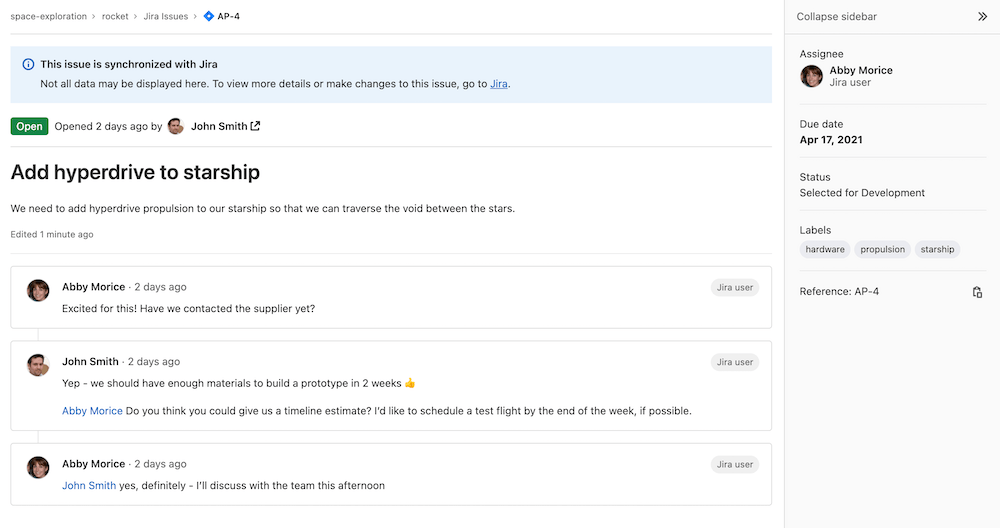

# Jira integration issue management **(FREE)**

Integrating issue management with Jira requires you to [configure Jira](development_panel.md#configuration)
and [enable the Jira service](development_panel.md#configure-gitlab) in GitLab.
After you configure and enable the integration, you can reference and close Jira
issues by mentioning the Jira ID in GitLab commits and merge requests. Jira issue IDs
must be formatted in uppercase.

## Reference Jira issues

With this integration, you can cross-reference Jira issues while you work in
GitLab issues and merge requests. Mention a Jira issue in a GitLab issue,
merge request, or comment, and GitLab adds a formatted comment to the Jira issue.
The comment links back to your work in GitLab: For example, this commit references
the Jira issue `GIT-1`:

```shell
git commit -m "GIT-1 this is a test commit"
```

GitLab adds a reference to the **Issue Links** section of Jira issue `GIT-1`:



GitLab also adds a comment to the issue, and uses this format:

```plaintext
USER mentioned this issue in RESOURCE_NAME of [PROJECT_NAME|COMMENTLINK]:
ENTITY_TITLE
```

- `USER`: The name of the user who mentioned the issue, linked to their GitLab user profile.
- `COMMENTLINK`: A link to where the Jira issue was mentioned.
- `RESOURCE_NAME`: The type of resource, such as a commit or merge request, which referenced the issue.
- `PROJECT_NAME`: The GitLab project name.
- `ENTITY_TITLE`: The title of the merge request, or the first line of the commit.

## Close Jira issues

If you have configured GitLab transition IDs, you can close a Jira issue directly
from GitLab by using a trigger word, followed by a Jira issue ID, in a commit or merge request.
When you push a commit containing a trigger word and Jira issue ID, GitLab:

- Comments in the mentioned Jira issue.
- Closes the Jira issue. If the Jira issue has a resolution, it is not transitioned.

You can use any of these trigger words to close Jira issue `PROJECT-1`:

- `Resolves PROJECT-1`
- `Closes PROJECT-1`
- `Fixes PROJECT-1`

The commit, or merge request, must target your project's [default branch](../../user/project/repository/branches/default.md).
You can change your project's default branch under [project settings](img/jira_project_settings.png).

### Use case for closing issues

Consider this example:

1. A user creates Jira issue `PROJECT-7` to request a new feature.
1. You create a merge request in GitLab to build the requested feature.
1. In the merge request, you add the issue closing trigger `Closes PROJECT-7`.
1. When the merge request is merged:
   - GitLab closes the Jira issue for you:
     
   - GitLab adds a formatted comment to Jira, linking back to the commit that
     resolved the issue.

## View Jira issues **(PREMIUM)**

> [Introduced](https://gitlab.com/groups/gitlab-org/-/epics/3622) in [GitLab Premium](https://about.gitlab.com/pricing/) 13.2.

You can browse, search, and view issues from a selected Jira project directly in GitLab,
if your GitLab administrator [has configured it](development_panel.md#configure-gitlab):

1. In the left navigation bar, go to **Jira > Issues list**.
1. The issue list sorts by **Created date** by default, with the newest issues listed at the top:

   

1. To display the most recently updated issues first, click **Last updated**.
1. In GitLab versions 13.10 and later, you can view [individual Jira issues](#view-a-jira-issue).

Issues are grouped into tabs based on their [Jira status](https://confluence.atlassian.com/adminjiraserver070/defining-status-field-values-749382903.html):

- The **Open** tab displays all issues with a Jira status in any category other than Done.
- The **Closed** tab displays all issues with a Jira status categorized as Done.
- The **All** tab displays all issues of any status.

## View a Jira issue

> - [Introduced](https://gitlab.com/gitlab-org/gitlab/-/issues/299832) in [GitLab Premium](https://about.gitlab.com/pricing/) 13.10 behind a feature flag, disabled by default.
> - [Feature flag removed](https://gitlab.com/gitlab-org/gitlab/-/issues/299832) in [GitLab Premium](https://about.gitlab.com/pricing/) 13.11.

When viewing the [Jira issues list](#view-jira-issues), select an issue from the
list to open it in GitLab:



## Search and filter the issues list

To refine the list of issues, use the search bar to search for any text
contained in an issue summary (title) or description.

You can also filter by labels, status, reporter, and assignee using URL parameters.
Enhancements to be able to use these through the user interface are [planned](https://gitlab.com/groups/gitlab-org/-/epics/3622).

- To filter issues by `labels`, specify one or more labels as part of the `labels[]`
parameter in the URL. When using multiple labels, only issues that contain all specified
labels are listed. `/-/integrations/jira/issues?labels[]=backend&labels[]=feature&labels[]=QA`

- To filter issues by `status`, specify the `status` parameter in the URL.
`/-/integrations/jira/issues?status=In Progress`

- To filter issues by `reporter`, specify a reporter's Jira display name for the
`author_username` parameter in the URL. `/-/integrations/jira/issues?author_username=John Smith`

- To filter issues by `assignee`, specify their Jira display name for the
`assignee_username` parameter in the URL. `/-/integrations/jira/issues?assignee_username=John Smith`

## Automatic issue transitions

> [Introduced](https://gitlab.com/gitlab-org/gitlab/-/merge_requests/...) in GitLab 13.10.

In this mode the referenced Jira issue is transitioned to the next available status with a category of "Done".

See the [Configure GitLab](development_panel.md#configure-gitlab) section, check the **Enable Jira transitions** setting and select the **Move to Done** option.

## Custom issue transitions

For advanced workflows you can specify custom Jira transition IDs.

See the [Configure GitLab](development_panel.md#configure-gitlab) section, check the **Enable Jira transitions** setting, select the **Custom transitions** option, and enter your transition IDs in the text field.

If you insert multiple transition IDs separated by `,` or `;`, the issue is moved to each state, one after another, using the given order. If a transition fails the sequence is aborted.

To see the transition IDs on Jira Cloud, edit a workflow in the **Text** view.
The transition IDs display in the **Transitions** column.

On Jira Server you can get the transition IDs in either of the following ways:

1. By using the API, with a request like `https://yourcompany.atlassian.net/rest/api/2/issue/ISSUE-123/transitions`
   using an issue that is in the appropriate "open" state
1. By mousing over the link for the transition you want and looking for the
   "action" parameter in the URL

Note that the transition ID may vary between workflows (for example, bug vs. story),
even if the status you are changing to is the same.

## Disabling comments on Jira issues

You can continue to have GitLab cross-link a source commit/MR with a Jira issue while disabling the comment added to the issue.

See the [Configure GitLab](development_panel.md#configure-gitlab) section and uncheck the **Enable comments** setting.
