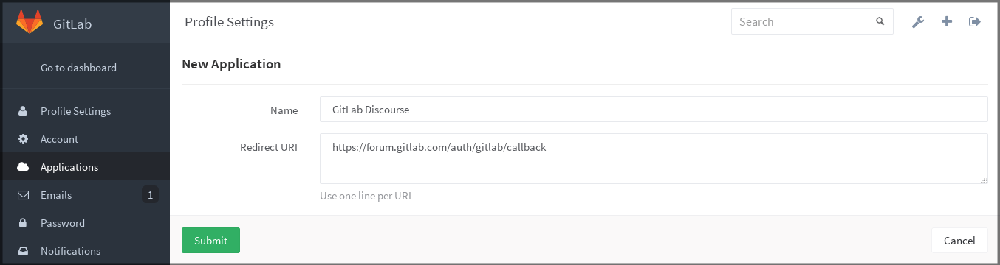
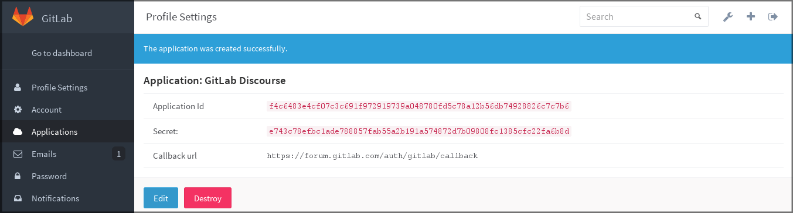
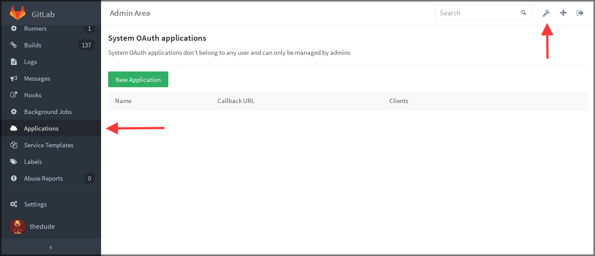
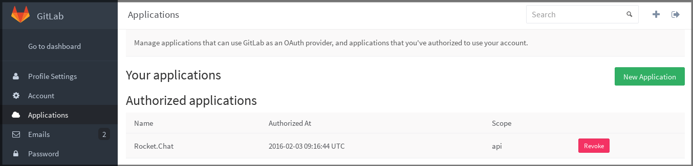

# GitLab as OAuth2 authentication service provider

This document describes how you can use GitLab as an OAuth 2
authentication service provider.

If you want to use:

- The [OAuth2](https://oauth.net/2/) protocol to access GitLab resources on user's behalf,
  see [OAuth2 provider](../api/oauth2.md)
- Other OAuth 2 authentication service providers to sign in to
  GitLab, see the [OAuth2 client documentation](omniauth.md).
- The related API, see [Applications API](../api/applications.md).

## Introduction to OAuth

[OAuth 2](https://oauth.net/2/) provides to client applications a 'secure delegated
access' to server resources on behalf of a resource owner. In fact, OAuth 2 allows an
authorization server to issue access tokens to third-party clients with the approval
of the resource owner or the end-user.

While OAuth 2 is primarily used as a Single Sign-On service (SSO), it can also
be used:

- To allow users to sign in to your application with their GitLab.com account.
- To set up GitLab.com for authentication to your GitLab instance
(see [GitLab OmniAuth](gitlab.md)).

The 'GitLab Importer' feature also uses OAuth 2 to give access
to repositories without sharing user credentials to your GitLab.com account.

GitLab supports two ways of adding a new OAuth 2 application to an instance:

- As a regular user, for user-wide apps.
- Through the Admin Area menu for instance-wide apps.

The only difference between these apps is the permission levels (user or admin).
The default callback URL is `http://your-gitlab.example.com/users/auth/gitlab/callback`.

## Add an application through the profile

To add a new application via your profile, select your avatar, and then select
**Settings > Applications**. You can then  and select **New Application**.

In the application form, enter a **Name** (arbitrary), and make sure to set up
correctly the **Redirect URI** which is the URL where users are sent after
they authorize with GitLab.

When you click **Submit** you are provided with the application ID and
the application secret which you can then use with your application that
connects to GitLab.

## OAuth applications in the Admin Area

To create an application that does not belong to a certain user, you can create
it from the Admin Area.

You're also able to mark an application as _trusted_ when creating it through the Admin Area. By doing that,
the user authorization step is automatically skipped for this application.

## Authorized applications

Every application you authorized to use your GitLab credentials is shown
in the **Authorized applications** section under **Profile Settings > Applications**.

The GitLab OAuth applications support scopes, which allow various actions that any given
application can perform such as `read_user` and `api`. There are many more scopes
available.

At any time you can revoke any access by just clicking **Revoke**.
