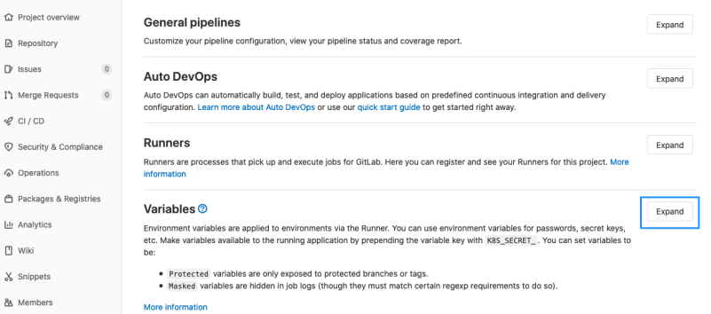
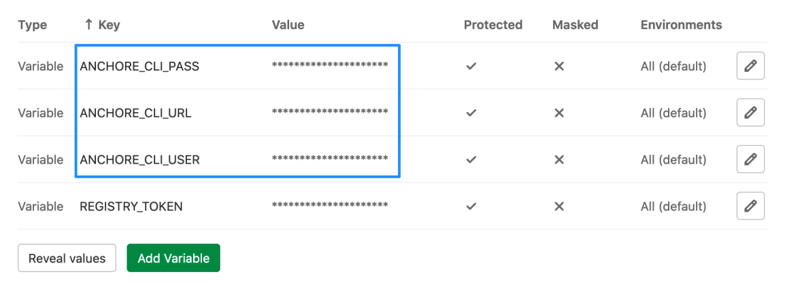
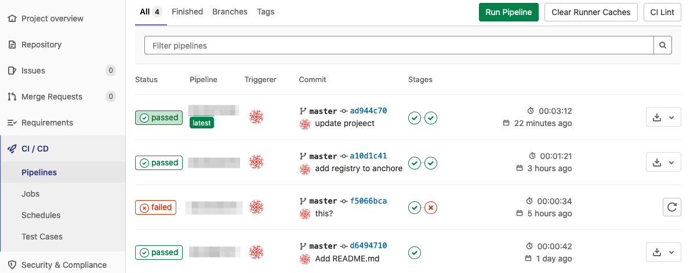
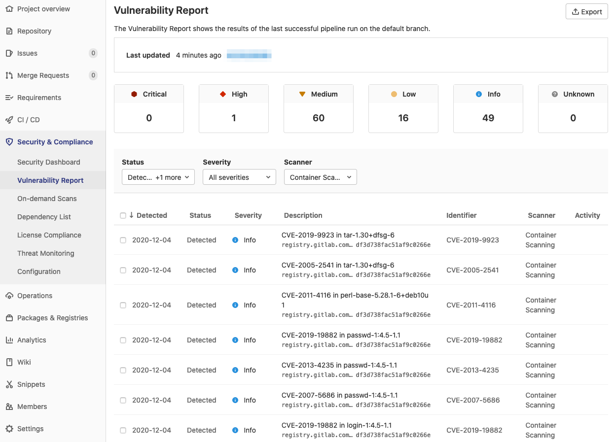

# Adding Anchore Scanning to GitLab

The Anchore Enterprise GitLab Scan integration enables vulnerability scanning
via Anchore Enterprise in GitLab CI. This includes automatic conversion from
the Anchore default vulnerability report format to the GitLab container
scanning format, for display in the GitLab Security & Compliance Vulnerability
UI.

## Requirements

Anchore Enterprise is deployed in your environment, with the API accessible
from your GitLab CI environment.
Credentials for your GitLab Container Registry are added to Anchore Enterprise,
under the Anchore account that you intend to use with GitLab CI.
See [Anchore's documentation](https://docs.anchore.com/current/docs/using/ui_usage/registries/)
for more information. For information on what registry/credentials must be
added to allow Anchore Enterprise to access your GitLab Container Registry,
see the [container registry documentation](../../user/packages/container_registry/index.md).

## Usage

In your GitLab project repository, ensure that the following variables are set
in Settings > CI/CD > Variables:

- `ANCHORE_CLI_URL`
- `ANCHORE_CLI_USER`
- `ANCHORE_CLI_PASS`

This allows the integration to access your Anchore Enterprise depoyment.
The `ANCHORE_CLI_PASS` variable should have protected and masked options set
to prevent exposure of the variable in job logs.

In your project’s `.gitlab-ci.yml`, include the following snippet anywhere in
your CI flow after your target container image has been built and pushed to the
GitLab Container Registry that you have made accessible from your Anchore
Enterprise deployment.

```yaml
containerscan:anchorescan:
  stage: test
  image: docker.io/anchore/enterprise-gitlab-scan:v1
  variables:
    ANCHORE_IMAGE: "${CI_REGISTRY_IMAGE}:${CI_COMMIT_SHA}"
  script:
    - anchore-gitlab-scan > gl-container-scanning-report.json
  artifacts:
    reports:
      container_scanning: gl-container-scanning-report.json
```

After a successful scan, results will be available for review and management
using the native security features in GitLab. Navigate to your project’s
Security & Compliance > Vulnerability Report UI to review any discovered
vulnerabilities in your container image.

### Example

For this example, we’ll add two sections to the GitLab CI `.gitlab-ci.yml`
file. The first runs Docker to build an image and push it to the GitLab
Container Registry for the project. The second runs Anchore Enterprise
vulnerability scanning on the image and converts the output to the GitLab
container scanning format.

Add `Dockerfile` and `.gitlab-ci.yml` To Your GitLab Project

Example Dockerfile:

```yaml
FROM alpine:latest

CMD /bin/sh
Example .gitlab-ci.yml:

# Build our image and push it to our project's container repo
containerbuild:
  stage: build
  image: docker:19.03.12
  variables:
    DOCKER_TLS_CERTDIR: "/certs"
  services:
    - docker:19.03.12-dind
  # See note below on Access Tokens for authenticating to the GitLab Container Registry
  before_script:
    - docker login -u $CI_REGISTRY_USER -p $CI_REGISTRY_PASSWORD $CI_REGISTRY
  script:
    - docker pull $CI_REGISTRY_IMAGE:latest || true
    - docker build --cache-from $CI_REGISTRY_IMAGE:latest --tag $CI_REGISTRY_IMAGE:$CI_COMMIT_SHA --tag $CI_REGISTRY_IMAGE:latest .
    - docker push $CI_REGISTRY_IMAGE:$CI_COMMIT_SHA
    - docker push $CI_REGISTRY_IMAGE:latest

# Scan with Anchore Enterprise and convert the results for the GitLab native security display
containerscan:anchorescan:
  stage: test
  image: docker.io/anchore/enterprise-gitlab-scan:v1
  variables:
    ANCHORE_IMAGE: "${CI_REGISTRY_IMAGE}:${CI_COMMIT_SHA}"
  script:
    - anchore-gitlab-scan > gl-container-scanning-report.json
  artifacts:
    reports:
      container_scanning: gl-container-scanning-report.json
```

#### Navigate To Settings > CI/CD; Expand the Variables Section

Expand the variables section and add your Anchore credentials as
[CI/CD Environment Variables](https://docs.gitlab.com/ee/ci/variables/).
Consider adding them as `Protected` variables.





#### Trigger GitLab CI

Make a change in the repository that will trigger GitLab CI so that your
pipeline runs.

Then navigate to the Pipelines tab where you can see details of your pipelines
that ran Anchore scanning.



#### Review Scan Report

The Anchore scan results will be shown on the Security Dashboard, the pipeline
Security tab, and the Merge Request widget along all other Secure scan results.



## Access Tokens

Authentication with the GitLab Container Registry can use a personal access token or a deploy token. Please see the GitLab documentation on authentication options.
