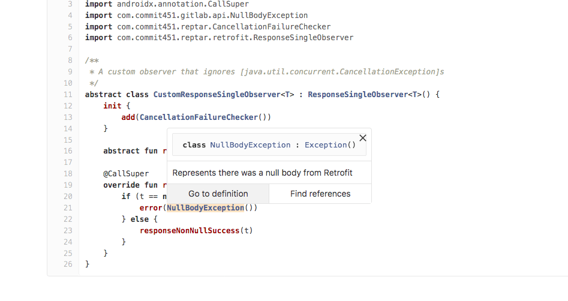
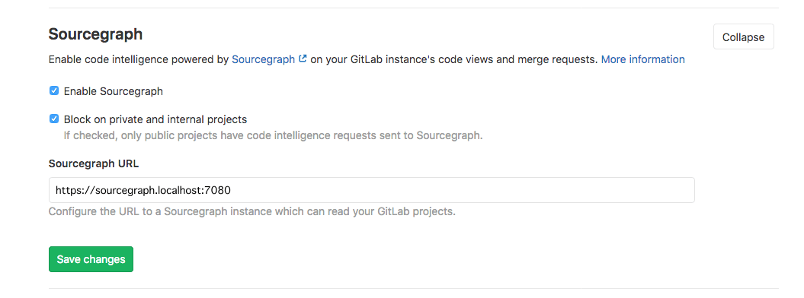
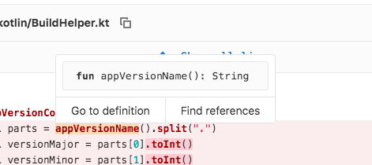

# Sourcegraph integration **(FREE)**

> - [Introduced](https://gitlab.com/gitlab-org/gitlab/-/merge_requests/16556) in GitLab 12.5.
> - Note that this integration is in BETA and deployed [behind a feature flag](#enable-the-sourcegraph-feature-flag) disabled by default. Self-managed instances can opt to enable it.

[Sourcegraph](https://sourcegraph.com) provides code intelligence features, natively integrated into the GitLab UI.

For GitLab.com users, see [Sourcegraph for GitLab.com](#sourcegraph-for-gitlabcom).



<i class="fa fa-youtube-play youtube" aria-hidden="true"></i>
For an overview, watch the video [Sourcegraph's new GitLab native integration](https://www.youtube.com/watch?v=LjVxkt4_sEA).

NOTE:
This feature requires user opt-in. After Sourcegraph has been enabled for your GitLab instance,
you can choose to enable Sourcegraph [through your user preferences](#enable-sourcegraph-in-user-preferences).

## Set up for self-managed GitLab instances **(FREE SELF)**

Before you can enable Sourcegraph code intelligence in GitLab you must:

- Enable the `sourcegraph` feature flag for your GitLab instance.
- Configure a Sourcegraph instance with your GitLab instance as an external service.

### Enable the Sourcegraph feature flag

NOTE:
If you are running a self-managed instance, the Sourcegraph integration is unavailable
unless the feature flag `sourcegraph` is enabled. This can be done from the Rails console
by instance administrators.

Use these commands to start the Rails console:

```shell
# Omnibus GitLab
gitlab-rails console

# Installation from source
cd /home/git/gitlab
sudo -u git -H bin/rails console -e production
```

Then run the following command to enable the feature flag:

```ruby
Feature.enable(:sourcegraph)
```

You can also enable the feature flag only for specific projects with:

```ruby
Feature.enable(:sourcegraph, Project.find_by_full_path('my_group/my_project'))
```

### Set up a self-managed Sourcegraph instance

If you are new to Sourcegraph, head over to the [Sourcegraph installation documentation](https://docs.sourcegraph.com/admin) and get your instance up and running.

If you are using an HTTPS connection to GitLab, you must [configure HTTPS](https://docs.sourcegraph.com/admin/http_https_configuration) for your Sourcegraph instance.

### Connect your Sourcegraph instance to your GitLab instance

1. Navigate to the site admin area in Sourcegraph.
1. [Configure your GitLab external service](https://docs.sourcegraph.com/admin/external_service/gitlab).
You can skip this step if you already have your GitLab repositories searchable in Sourcegraph.
1. Validate that you can search your repositories from GitLab in your Sourcegraph instance by running a test query.
1. Add your GitLab instance URL to the [`corsOrigin` setting](https://docs.sourcegraph.com/admin/config/site_config#corsOrigin) in your site configuration.

### Configure your GitLab instance with Sourcegraph

1. In GitLab, go to **Admin Area > Settings > General**.
1. Expand the **Sourcegraph** configuration section.
1. Check **Enable Sourcegraph**.
1. Set the Sourcegraph URL to your Sourcegraph instance, such as `https://sourcegraph.example.com`.



## Enable Sourcegraph in user preferences

If a GitLab administrator has enabled Sourcegraph, you can enable this feature in your user preferences.

1. In GitLab, click your avatar in the top-right corner, then click **Settings**. On the left-hand nav, click **Preferences**.
1. Under **Integrations**, find the **Sourcegraph** section.
1. Check **Enable Sourcegraph**.


## Using Sourcegraph code intelligence

Once enabled, participating projects display a code intelligence popover available in
the following code views:

- Merge request diffs
- Commit view
- File view

When visiting one of these views, you can now hover over a code reference to see a popover with:

- Details on how this reference was defined.
- **Go to definition**, which navigates to the line of code where this reference was defined.
- **Find references**, which navigates to the configured Sourcegraph instance, showing a list of references to the highlighted code.



## Sourcegraph for GitLab.com

Sourcegraph powered code intelligence is available for all public projects on GitLab.com.

Support for private projects is not yet available for GitLab.com;
follow the epic [&2201](https://gitlab.com/groups/gitlab-org/-/epics/2201)
for updates.

## Troubleshooting

### Sourcegraph isn't working

If you enabled Sourcegraph for your project but it isn't working, Sourcegraph may not have indexed the project yet. You can check for Sourcegraph's availability of your project by visiting `https://sourcegraph.com/gitlab.com/<project-path>`replacing `<project-path>` with the path to your GitLab project.

## Sourcegraph and Privacy

From Sourcegraph's [extension documentation](https://docs.sourcegraph.com/integration/browser_extension#privacy) which is the
engine behind the native GitLab integration:

> Sourcegraph integrations never send any logs, pings, usage statistics, or telemetry to Sourcegraph.com.
> They connect only to Sourcegraph.com as required to provide code intelligence or other functionality on public code.
> As a result, no private code, private repository names, usernames, or any other specific data is sent to Sourcegraph.com.
