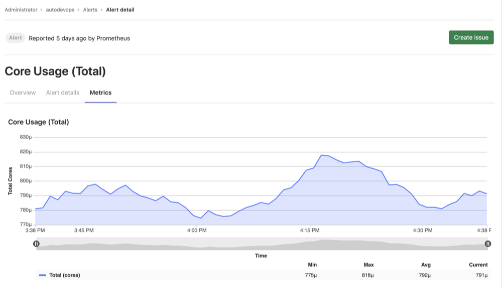
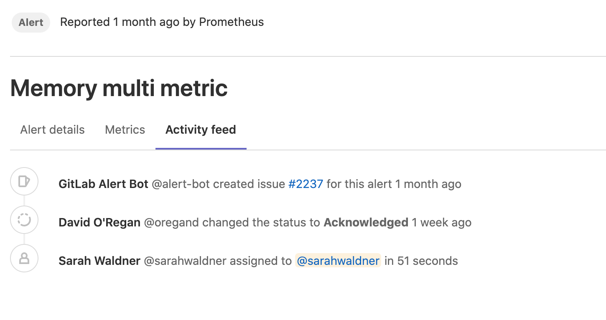
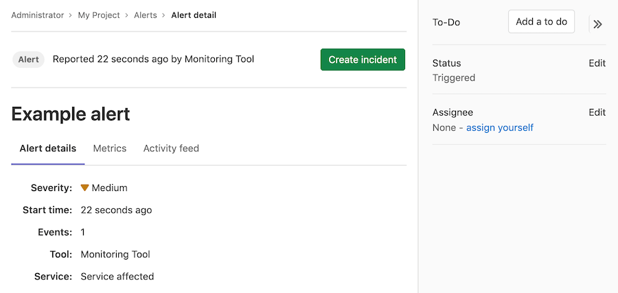

# Alerts **(CORE)**

Alerts are a critical entity in your incident management workflow. They represent a notable event that might indicate a service outage or disruption. GitLab provides a list view for triage and detail view for deeper investigation of what happened.

## Alert List

Users with at least Developer [permissions](../../user/permissions.md) can
access the Alert list at **Operations > Alerts** in your project's
sidebar. The Alert list displays alerts sorted by start time, but
you can change the sort order by clicking the headers in the Alert list.
([Introduced](https://gitlab.com/gitlab-org/gitlab/-/issues/217745) in GitLab 13.1.)

The alert list displays the following information:

- **Search**: The alert list supports a simple free text search on the title,
  description, monitoring tool, and service fields.
  ([Introduced](https://gitlab.com/gitlab-org/gitlab/-/issues/213884) in GitLab 13.1.)
- **Severity**: The current importance of a alert and how much attention it
  should receive. For a listing of all statuses, read [Alert Management severity](#alert-severity).
- **Start time**: How long ago the alert fired. This field uses the standard
  GitLab pattern of `X time ago`, but is supported by a granular date/time
  tooltip depending on the user's locale.
- **Alert description**: The description of the alert, which attempts to
  capture the most meaningful data.
- **Event count**: The number of times that an alert has fired.
- **Issue**: A link to the incident issue that has been created for the alert.
- **Status**: The current status of the alert:
  - **Triggered**: No one has begun investigation.
  - **Acknowledged**: Someone is actively investigating the problem.
  - **Resolved**: No further work is required.

NOTE:
Check out a live example available from the
[`tanuki-inc` project page](https://gitlab-examples-ops-incident-setup-everyone-tanuki-inc.34.69.64.147.nip.io/)
in GitLab to examine alerts in action.

## Alert severity

Each level of alert contains a uniquely shaped and color-coded icon to help
you identify the severity of a particular alert. These severity icons help you
immediately identify which alerts you should prioritize investigating:

Alerts contain one of the following icons:

| Severity | Icon                    | Color (hexadecimal) |
|----------|-------------------------|---------------------|
| Critical | **{severity-critical}** | `#8b2615`           |
| High     | **{severity-high}**     | `#c0341d`           |
| Medium   | **{severity-medium}**   | `#fca429`           |
| Low      | **{severity-low}**      | `#fdbc60`           |
| Info     | **{severity-info}**     | `#418cd8`           |
| Unknown  | **{severity-unknown}**  | `#bababa`           |

## Alert details page

Navigate to the Alert details view by visiting the [Alert list](alerts.md)
and selecting an alert from the list. You need least Developer [permissions](../../user/permissions.md)
to access alerts.

NOTE:
To review live examples of GitLab alerts, visit the
[alert list](https://gitlab.com/gitlab-examples/ops/incident-setup/everyone/tanuki-inc/-/alert_management)
for this demo project. Select any alert in the list to examine its alert details
page.

Alerts provide **Overview** and **Alert details** tabs to give you the right
amount of information you need.

### Alert details tab

The **Alert details** tab has two sections. The top section provides a short list of critical details such as the severity, start time, number of events, and originating monitoring tool. The second section displays the full alert payload.

### Metrics tab

> [Introduced](https://gitlab.com/gitlab-org/gitlab/-/issues/217768) in GitLab 13.2.

The **Metrics** tab displays a metrics chart for alerts coming from Prometheus. If the alert originated from any other tool, the **Metrics** tab is empty. To set up alerts for GitLab-managed Prometheus instances, see [Managed Prometheus instances](../metrics/alerts.md#managed-prometheus-instances). For externally-managed Prometheus instances, you must configure your alerting
rules to display a chart in the alert. For information about how to configure
your alerting rules, see [Embedding metrics based on alerts in incident issues](../metrics/embed.md#embedding-metrics-based-on-alerts-in-incident-issues). See
[External Prometheus instances](../metrics/alerts.md#external-prometheus-instances)
for information about setting up alerts for your self-managed Prometheus
instance.

To view the metrics for an alert:

1. Sign in as a user with Developer or higher [permissions](../../user/permissions.md).
1. Navigate to **Operations > Alerts**.
1. Select the alert you want to view.
1. Below the title of the alert, select the **Metrics** tab.

#### View an alert's logs

> - [Introduced](https://gitlab.com/gitlab-org/gitlab/-/issues/201846) in GitLab Ultimate 12.8. and [improved](https://gitlab.com/gitlab-org/gitlab/-/issues/217768) in GitLab 13.3.
> - [Moved](https://gitlab.com/gitlab-org/gitlab/-/merge_requests/25455) to [GitLab Core](https://about.gitlab.com/pricing/) 12.9.

Viewing logs from a metrics panel can be useful if you're triaging an
application incident and need to [explore logs](../metrics/dashboards/index.md#chart-context-menu)
from across your application. These logs help you understand what's affecting
your application's performance and how to resolve any problems.

To view the logs for an alert:

1. Sign in as a user with Developer or higher [permissions](../../user/permissions.md).
1. Navigate to **Operations > Alerts**.
1. Select the alert you want to view.
1. Below the title of the alert, select the **Metrics** tab.
1. Select the [menu](../metrics/dashboards/index.md#chart-context-menu) of
   the metric chart to view options.
1. Select **View logs**.

### Activity feed tab

> [Introduced](https://gitlab.com/groups/gitlab-org/-/epics/3066) in GitLab 13.1.

The **Activity feed** tab is a log of activity on the alert. When you take action on an alert, this is logged as a system note. This gives you a linear
timeline of the alert's investigation and assignment history.

The following actions result in a system note:

- [Updating the status of an alert](#update-an-alerts-status)
- [Creating an incident based on an alert](#create-an-incident-from-an-alert)
- [Assignment of an alert to a user](#assign-an-alert)

## Alert actions

There are different actions available in GitLab to help triage and respond to alerts.

### Update an alert's status

The Alert detail view enables you to update the Alert Status.
See [Create and manage alerts in GitLab](alerts.md) for more details.

### Create an incident from an alert

> [Introduced](https://gitlab.com/gitlab-org/gitlab/-/issues/217745) in GitLab 13.1.

The Alert detail view enables you to create an issue with a
description populated from an alert. To create the issue,
select the **Create Issue** button. You can then view the issue from the
alert by selecting the **View Issue** button.

Closing a GitLab issue associated with an alert changes the alert's status to
Resolved. See [Create and manage alerts in GitLab](alerts.md) for more details
about alert statuses.

### Assign an alert

> [Introduced](https://gitlab.com/groups/gitlab-org/-/epics/3066) in GitLab 13.1.

In large teams, where there is shared ownership of an alert, it can be
difficult to track who is investigating and working on it. Assigning alerts eases collaboration and delegation by indicating which user is owning the alert. GitLab supports only a single assignee per alert.

To assign an alert:

1. To display the list of current alerts, navigate to **Operations > Alerts**:

   

1. Select your desired alert to display its **Alert Details View**:

   

1. If the right sidebar is not expanded, select
   **{angle-double-right}** **Expand sidebar** to expand it.
1. In the right sidebar, locate the **Assignee**, and then select **Edit**.
   From the dropdown menu, select each user you want to assign to the alert.
   GitLab creates a [to-do item](../../user/todos.md) for each user.

   

After completing their portion of investigating or fixing the alert, users can
unassign themselves from the alert. To remove an assignee, select **Edit** next to the **Assignee** dropdown menu
and deselect the user from the list of assignees, or select **Unassigned**.

### Create a to-do item from an alert

> [Introduced](https://gitlab.com/groups/gitlab-org/-/epics/3066) in GitLab 13.1.

You can manually create [To-Do list items](../../user/todos.md) for yourself
from the Alert details screen, and view them later on your **To-Do List**. To
add a to-do item:

1. To display the list of current alerts, navigate to **Operations > Alerts**.
1. Select your desired alert to display its **Alert Management Details View**.
1. Select the **Add a To-Do** button in the right sidebar:

   

Select the **To-Do List** **{todo-done}** in the navigation bar to view your current to-do list.

## Link runbooks to alerts

> Runbook URLs [introduced](https://gitlab.com/gitlab-org/gitlab/-/merge_requests/39315) in GitLab 13.3.

When creating alerts from the metrics dashboard for
[managed Prometheus instances](../metrics/alerts.md#managed-prometheus-instances),
you can link a runbook. When the alert triggers, you can access the runbook through
the [chart context menu](../metrics/dashboards/index.md#chart-context-menu) in the
upper-right corner of the metrics chart, making it easy for you to locate and access
the correct runbook:

## View the environment that generated the alert

> - [Introduced](https://gitlab.com/gitlab-org/gitlab/-/issues/232492) in GitLab 13.5 behind a feature flag, disabled by default.
> - [Enabled by default](https://gitlab.com/gitlab-org/gitlab/-/issues/232492) in GitLab 13.6.

WARNING:
This feature might not be available to you. Check the **version history** note above for details.

The environment information and the link are displayed in the [Alert Details tab](#alert-details-tab).
