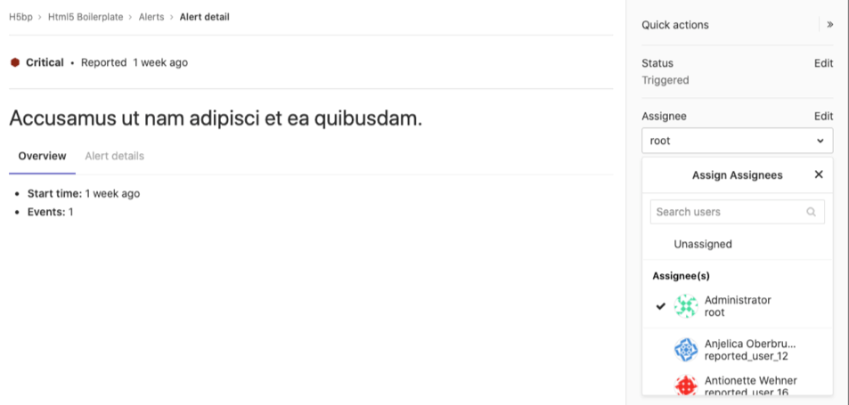
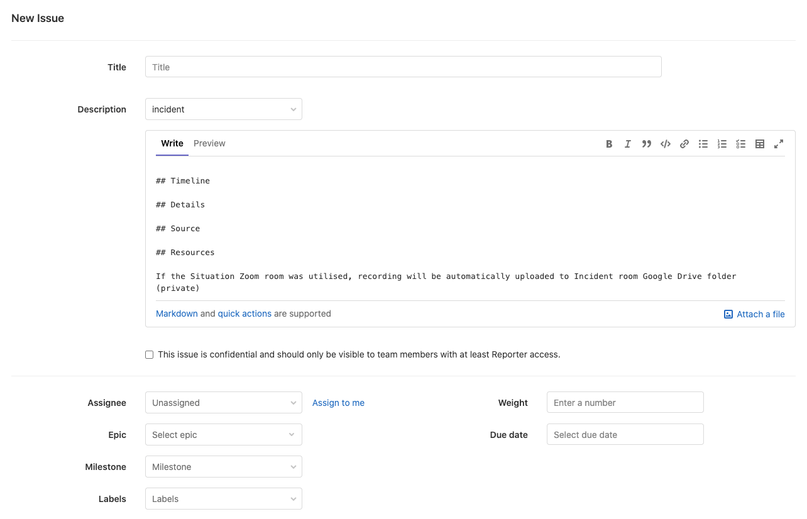
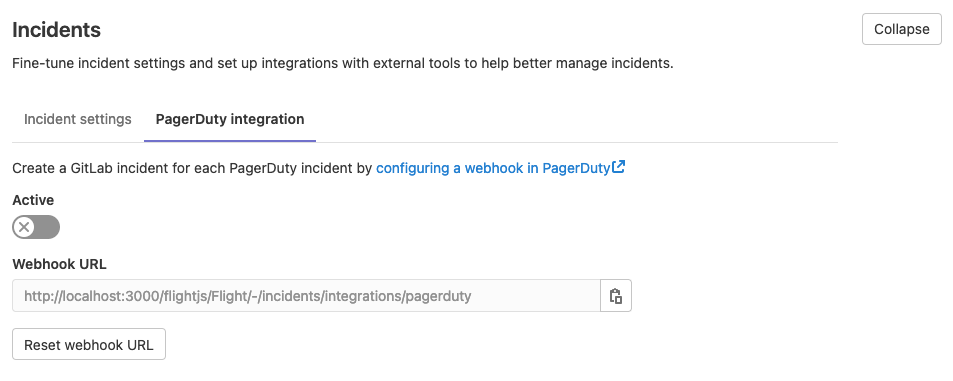

# Incident management

> [Introduced](https://gitlab.com/groups/gitlab-org/-/epics/2877) in GitLab 13.0.

Alert Management enables developers to easily discover and view the alerts
generated by their application. By surfacing alert information where the code is
being developed, efficiency and awareness can be increased.

GitLab offers solutions for handling incidents in your applications and services,
such as [setting up Prometheus alerts](#configure-prometheus-alerts),
[displaying metrics](#embed-metrics-in-incidents-and-issues), and sending notifications.
While no configuration is required to use the [manual features](#create-an-incident-manually)
of incident management, both automation and [configuration](#configure-incidents-ultimate)
of incident management are only available in
[GitLab Ultimate and GitLab.com Gold](https://about.gitlab.com/pricing/).

For users with at least Developer [permissions](../../user/permissions.md), the
Incident Management list is available at **Operations > Incidents**
in your project's sidebar. The list contains the following metrics:

- **Incident** - The description of the incident, which attempts to capture the
  most meaningful data.
- **Date created** - How long ago the incident was created. This field uses the
  standard GitLab pattern of `X time ago`, but is supported by a granular date/time
  tooltip depending on the user's locale.
- **Assignees** - The user assigned to the incident.
- **Published** - Whether or not an incident is published to the
  [Status Page](./status_page.md). **(ULTIMATE)**

The Incident Management list displays incidents sorted by incident created date.
([Introduced](https://gitlab.com/gitlab-org/gitlab/-/issues/229534) to GitLab core in 13.3).)
To see if a column is sortable, point your mouse at the header. Sortable columns
display an arrow next to the column name.

The Incident list supports a simple free text search, which filters on the
**Title** and **Incident** fields.

To filter incidents by their status, click **Open**, **Closed**, or **All**
above the incident list.

NOTE: **Note:**
Incidents share the [Issues API](../../user/project/issues/index.md).

## Enable Alert Management

NOTE: **Note:**
You will need at least Maintainer [permissions](../../user/permissions.md) to enable the Alert Management feature.

There are several ways to accept alerts into your GitLab project, as outlined below.
Enabling any of these methods will allow the Alerts list to display. After configuring
alerts, visit **{cloud-gear}** **Operations > Alerts** in your project's sidebar
to [view the list](#alert-management-list) of alerts.

### Opsgenie integration **(PREMIUM)**

> [Introduced](https://gitlab.com/groups/gitlab-org/-/epics/3066) in [GitLab Premium](https://about.gitlab.com/pricing/)  13.2.

A new way of monitoring Alerts via a GitLab integration is with
[Opsgenie](https://www.atlassian.com/software/opsgenie).

NOTE: **Note:**
If you enable the Opsgenie integration, you cannot have other GitLab alert services,
such as [Generic Alerts](../../user/project/integrations/generic_alerts.md) or
Prometheus alerts, active at the same time.

To enable Opsgenie integration:

1. Sign in as a user with Maintainer or Owner [permissions](../../user/permissions.md).
1. Navigate to **{cloud-gear}** **Operations > Alerts**.
1. In the **Integrations** select box, select Opsgenie.
1. Click the **Active** toggle.
1. In the **API URL**, enter the base URL for your Opsgenie integration, such
   as `https://app.opsgenie.com/alert/list`.
1. Click **Save changes**.

After enabling the integration, navigate to the Alerts list page at **{cloud-gear}** **Operations > Alerts**, and click **View alerts in Opsgenie**.

### Enable a Generic Alerts endpoint

GitLab provides the Generic Alerts endpoint so you can accept alerts from a third-party
alerts service. See the
[instructions for toggling generic alerts](../../user/project/integrations/generic_alerts.md#setting-up-generic-alerts)
to add this option. After configuring the endpoint, the
[Alerts list](#alert-management-list) is enabled.

To populate the alerts with data, see [Customizing the payload](../../user/project/integrations/generic_alerts.md#customizing-the-payload) for requests to the alerts endpoint.

### Enable GitLab-managed Prometheus alerts

You can install the GitLab-managed Prometheus application on your Kubernetes
cluster. For more information, see
[Managed Prometheus on Kubernetes](../../user/project/integrations/prometheus.md#managed-prometheus-on-kubernetes).
When GitLab-managed Prometheus is installed, the [Alerts list](#alert-management-list)
is also enabled.

To populate the alerts with data, see
[GitLab-Managed Prometheus instances](../metrics/alerts.md#managed-prometheus-instances).

### Enable external Prometheus alerts

You can configure an externally-managed Prometheus instance to send alerts
to GitLab. To set up this configuration, see the [configuring Prometheus](../metrics/alerts.md#external-prometheus-instances) documentation. Activating the external Prometheus
configuration also enables the [Alerts list](#alert-management-list).

To populate the alerts with data, see
[External Prometheus instances](../metrics/alerts.md#external-prometheus-instances).

## Alert Management severity

Each level of alert contains a uniquely shaped and color-coded icon to help
you identify the severity of a particular alert. These severity icons help you
immediately identify which alerts you should prioritize investigating:

Alerts contain one of the following icons:

| Severity | Icon | Color (hexadecimal) |
|---|---|---|
| Critical | **{severity-critical}** | `#8b2615` |
| High | **{severity-high}** | `#c0341d` |
| Medium | **{severity-medium}** | `#fca429` |
| Low | **{severity-low}** | `#fdbc60` |
| Info | **{severity-info}** | `#418cd8` |
| Unknown | **{severity-unknown}** | `#bababa` |

## Alert Management list

NOTE: **Note:**
You will need at least Developer [permissions](../../user/permissions.md) to view the Alert Management list.

You can find the Alert Management list at **{cloud-gear}** **Operations > Alerts** in your project's sidebar.
Each alert contains the following metrics:

- **Severity** - The current importance of a alert and how much attention it should receive.
- **Start time** - How long ago the alert fired. This field uses the standard GitLab pattern of `X time ago`, but is supported by a granular date/time tooltip depending on the user's locale.
- **Alert description** - The description of the alert, which attempts to capture the most meaningful data.
- **Event count** - The number of times that an alert has fired.
- **Issue** - A link to the incident issue that has been created for the alert.
- **Status** - The [current status](#alert-management-statuses) of the alert.

### Alert Management list sorting

> [Introduced](https://gitlab.com/gitlab-org/gitlab/-/issues/217745) in GitLab 13.1.

The Alert Management list displays alerts sorted by start time, but you can
change the sort order by clicking the headers in the Alert Management list.

To see if a column is sortable, point your mouse at the header. Sortable columns
display an arrow next to the column name, as shown in this example:

### Searching alerts

> [Introduced](https://gitlab.com/gitlab-org/gitlab/-/issues/213884) in GitLab 13.1.

The alert list supports a simple free text search.

This search filters on the following fields:

- Title
- Description
- Monitoring tool
- Service

### Alert Management statuses

Each alert contains a status dropdown to indicate which alerts need investigation.
Standard alert statuses include `triggered`, `acknowledged`, and `resolved`:

- **Triggered**: No one has begun investigation.
- **Acknowledged**: Someone is actively investigating the problem.
- **Resolved**: No further work is required.

## Alert Management details

NOTE: **Note:**
You will need at least Developer [permissions](../../user/permissions.md) to view Alert Management details.

Navigate to the Alert Management detail view by visiting the [Alert Management list](#alert-management-list) and selecting an Alert from the list.

### Update an Alert's status

The Alert Management detail view enables you to update the Alert Status.
See [Alert Management statuses](#alert-management-statuses) for more details.

### Create an Issue from an Alert

> [Introduced](https://gitlab.com/gitlab-org/gitlab/-/issues/217745) in GitLab 13.1.

The Alert Management detail view enables you to create an issue with a
description automatically populated from an alert. To create the issue,
click the **Create Issue** button. You can then view the issue from the
alert by clicking the **View Issue** button.

Closing a GitLab issue associated with an alert changes the alert's status to Resolved.
See [Alert Management statuses](#alert-management-statuses) for more details about statuses.

### Update an Alert's assignee

> [Introduced](https://gitlab.com/groups/gitlab-org/-/epics/3066) in GitLab 13.1.

The Alert Management detail view allows users to update the Alert assignee.

In large teams, where there is shared ownership of an alert, it can be difficult
to track who is investigating and working on it. The Alert Management detail view
enables you to update the Alert assignee:

NOTE: **Note:**
GitLab currently only supports a single assignee per alert.

1. To display the list of current alerts, click
   **{cloud-gear}** **Operations > Alerts**:

   

1. Select your desired alert to display its **Alert Management Details View**:

   

1. If the right sidebar is not expanded, click
   **{angle-double-right}** **Expand sidebar** to expand it.
1. In the right sidebar, locate the **Assignee** and click **Edit**. From the
   dropdown menu, select each user you want to assign to the alert. GitLab creates
   a [To-Do list item](../../user/todos.md) for each user.

   

To remove an assignee, click **Edit** next to the **Assignee** dropdown menu and
deselect the user from the list of assignees, or click **Unassigned**.

### Alert system notes

> [Introduced](https://gitlab.com/groups/gitlab-org/-/epics/3066) in GitLab 13.1.

When you take action on an alert, this is logged as a system note,
which is visible in the Alert Details view. This gives you a linear
timeline of the alert's investigation and assignment history.

The following actions will result in a system note:

- [Updating the status of an alert](#update-an-alerts-status)
- [Creating an issue based on an alert](#create-an-issue-from-an-alert)
- [Assignment of an alert to a user](#update-an-alerts-assignee)

### Create a To-Do from an Alert

> [Introduced](https://gitlab.com/groups/gitlab-org/-/epics/3066) in GitLab 13.1.

You can manually create [To-Do list items](../../user/todos.md) for yourself from the
Alert details screen, and view them later on your **To-Do List**. To add a To-Do:

1. To display the list of current alerts, click
   **{cloud-gear}** **Operations > Alerts**.
1. Select your desired alert to display its **Alert Management Details View**.
1. Click the **Add a To-Do** button in the right sidebar:

   

Click the **To-Do** **{todo-done}** in the navigation bar to view your current To-Do list.

### View an Alert's metrics data

> [Introduced](https://gitlab.com/gitlab-org/gitlab/-/issues/217768) in GitLab 13.2.

To view the metrics for an alert:

   1. Sign in as a user with Developer or higher [permissions](../../user/permissions.md).
   1. Navigate to **{cloud-gear}** **Operations > Alerts**.
   1. Click the alert you want to view.
   1. Below the title of the alert, click the **Metrics** tab.

For GitLab-managed Prometheus instances, metrics data is automatically available
for the alert, making it easy to see surrounding behavior. See
[Managed Prometheus instances](../metrics/alerts.md#managed-prometheus-instances)
for information on setting up alerts.

For externally-managed Prometheus instances, you can configure your alerting rules to
display a chart in the alert. See
[Embedding metrics based on alerts in incident issues](../metrics/embed.md#embedding-metrics-based-on-alerts-in-incident-issues)
for information on how to appropriately configure your alerting rules. See
[External Prometheus instances](../metrics/alerts.md#external-prometheus-instances)
for information on setting up alerts for your self-managed Prometheus instance.

## Use cases for assigning alerts

Consider a team formed by different sections of monitoring, collaborating on a
single application. After an alert surfaces, it's extremely important to
route the alert to the team members who can address and resolve the alert.

Assigning Alerts to multiple assignees eases collaboration and delegation. All
assignees are shown in your team's work-flows, and all assignees receive
notifications, simplifying communication and ownership of the alert.

After completing their portion of investigating or fixing the alert, users can
unassign their account from the alert when their role is complete.
The [alerts status](#alert-management-statuses) can be updated to
reflect if the alert has been resolved.

### Slack Notifications

> [Introduced](https://gitlab.com/gitlab-org/gitlab/-/issues/216326) in GitLab 13.1.

You can be alerted via a Slack message when a new alert has been received.

See the [Slack Notifications Service docs](../../user/project/integrations/slack.md) for information on how to set this up.

## Configure incidents **(ULTIMATE)**

> [Introduced](https://gitlab.com/gitlab-org/gitlab/-/issues/4925) in GitLab Ultimate 11.11.

With Maintainer or higher [permissions](../../user/permissions.md), you can enable or disable Incident Management features in the GitLab user interface
to create issues when alerts are triggered:

1. Navigate to **Settings > Operations > Incidents** and expand
   **Incidents**:

   

1. For GitLab versions 11.11 and greater, you can select the **Create an issue**
   checkbox to create an issue based on your own
   [issue templates](../../user/project/description_templates.md#creating-issue-templates).
   For more information, see
   [Trigger actions from alerts](../metrics/alerts.md#trigger-actions-from-alerts-ultimate) **(ULTIMATE)**.
1. To create issues from alerts, select the template in the **Issue Template**
   select box.
1. To send [separate email notifications](#notify-developers-of-alerts) to users
   with [Developer permissions](../../user/permissions.md), select
   **Send a separate email notification to Developers**.
1. Click **Save changes**.

Appropriately configured alerts include an
[embedded chart](../metrics/embed.md#embedding-metrics-based-on-alerts-in-incident-issues)
for the query corresponding to the alert. You can also configure GitLab to
[close issues](../metrics/alerts.md#trigger-actions-from-alerts-ultimate)
when you receive notification that the alert is resolved.

### Notify developers of alerts

GitLab can react to the alerts triggered from your applications and services
by creating issues and alerting developers through email. By default, GitLab
sends these emails to [owners and maintainers](../../user/permissions.md) of the project.
These emails contain details of the alert, and a link for more information.

To send separate email notifications to users with
[Developer permissions](../../user/permissions.md), see [Configure incidents](#configure-incidents-ultimate).

## Create an incident manually

> [Moved](https://gitlab.com/gitlab-org/monitor/health/-/issues/24) to GitLab core in 13.3.

For users with at least Developer [permissions](../../user/permissions.md), to create a Incident you can take any of the following actions:

- Navigate to **Operations > Incidents** and click **Create Incident**.
- Create a new issue using the `incident` template available when creating it.
- Create a new issue and assign the `incident` label to it.

## Configure PagerDuty integration

> [Introduced](https://gitlab.com/gitlab-org/gitlab/-/issues/119018) in GitLab 13.3.

You can set up a webhook with PagerDuty to automatically create a GitLab issue
for each PagerDuty incident. This configuration requires you to make changes
in both PagerDuty and GitLab:

1. Sign in as a user with Maintainer [permissions](../../user/permissions.md).
1. Navigate to **Settings > Operations > Incidents** and expand **Incidents**.
1. Select the **PagerDuty integration** tab:

   

1. Activate the integration, and save the changes in GitLab.
1. Copy the value of **Webhook URL** for use in a later step.
1. Follow the steps described in the
   [PagerDuty documentation](https://support.pagerduty.com/docs/webhooks)
   to add the webhook URL to a PagerDuty webhook integration.

To confirm the integration is successful, trigger a test incident from PagerDuty to
confirm that a GitLab issue is created from the incident.

## Configure Prometheus alerts

You can set up Prometheus alerts in:

- [GitLab-managed Prometheus](../metrics/alerts.md) installations.
- [Self-managed Prometheus](../metrics/alerts.md#external-prometheus-instances) installations.

Prometheus alerts are created by the special Alert Bot user. You can't remove this
user, but it does not count toward your license limit.

## Configure external generic alerts

GitLab can accept alerts from any source through a generic webhook receiver. When
[configuring the generic alerts integration](../../user/project/integrations/generic_alerts.md),
GitLab creates a unique endpoint which receives a JSON-formatted, customizable payload.

## Embed metrics in incidents and issues

You can embed metrics anywhere [GitLab Markdown](../../user/markdown.md) is used, such as descriptions,
comments on issues, and merge requests. Embedding metrics helps you share them
when discussing incidents or performance issues. You can output the dashboard directly
into any issue, merge request, epic, or any other Markdown text field in GitLab
by [copying and pasting the link to the metrics dashboard](../metrics/embed.md#embedding-gitlab-managed-kubernetes-metrics).

You can embed both
[GitLab-hosted metrics](../metrics/embed.md) and
[Grafana metrics](../metrics/embed_grafana.md)
in incidents and issue templates.

### Context menu

You can view more details about an embedded metrics panel from the context menu.
To access the context menu, click the **{ellipsis_v}** **More actions** dropdown box
above the upper right corner of the panel. For a list of options, see
[Chart context menu](../metrics/dashboards/index.md#chart-context-menu).

#### View logs from metrics panel

> - [Introduced](https://gitlab.com/gitlab-org/gitlab/-/issues/201846) in GitLab Ultimate 12.8.
> - [Moved](https://gitlab.com/gitlab-org/gitlab/-/merge_requests/25455) to [GitLab Core](https://about.gitlab.com/pricing/) 12.9.

Viewing logs from a metrics panel can be useful if you're triaging an application
incident and need to [explore logs](../metrics/dashboards/index.md#chart-context-menu)
from across your application. These logs help you understand what is affecting
your application's performance and resolve any problems.

## Integrate incidents with Slack

Slack slash commands allow you to control GitLab and view GitLab content without leaving Slack.

Learn how to [set up Slack slash commands](../../user/project/integrations/slack_slash_commands.md)
and how to [use the available slash commands](../../user/project/slash_commands.md).

## Integrate issues with Zoom

GitLab enables you to [associate a Zoom meeting with an issue](../../user/project/issues/associate_zoom_meeting.md)
for synchronous communication during incident management. After starting a Zoom
call for an incident, you can associate the conference call with an issue. Your
team members can join the Zoom call without requesting a link.
