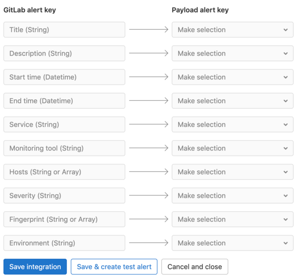
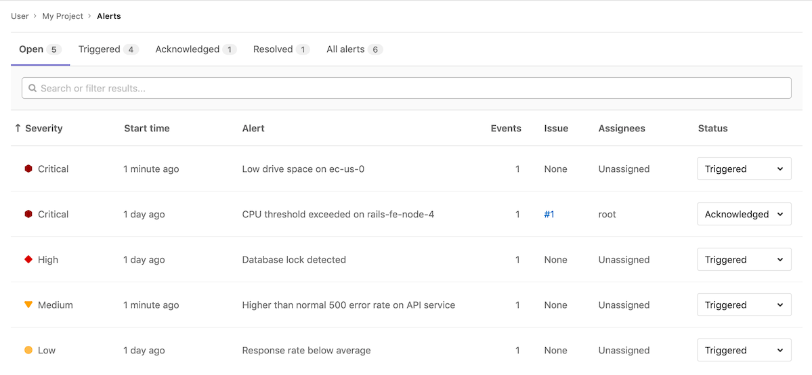

# Integrations **(FREE)**

> - [Introduced](https://gitlab.com/gitlab-org/gitlab/-/issues/13203) in GitLab Ultimate 12.4.
> - [Moved](https://gitlab.com/gitlab-org/gitlab/-/issues/42640) to GitLab Free in 12.8.

GitLab can accept alerts from any source via a webhook receiver. This can be configured
generically or, in GitLab versions 13.1 and greater, you can configure
[External Prometheus instances](../metrics/alerts.md#external-prometheus-instances)
to use this endpoint.

## Integrations list

> [Introduced](https://gitlab.com/gitlab-org/gitlab/-/issues/245331) in GitLab Free 13.5.

With the [Maintainer role or higher](../../user/permissions.md),
you can view the list of configured alerts integrations by navigating to **Settings > Operations**
in your project's sidebar menu, and expanding the **Alerts** section. The list displays
the integration name, type, and status (enabled or disabled):


## Configuration

GitLab can receive alerts via a HTTP endpoint that you configure,
or the [Prometheus integration](#external-prometheus-integration).

### Single HTTP Endpoint **(FREE)**

Enabling the HTTP Endpoint in a GitLab projects activates it to
receive alert payloads in JSON format. You can always
[customize the payload](#customize-the-alert-payload-outside-of-gitlab) to your liking.

1. Sign in to GitLab as a user with maintainer [permissions](../../user/permissions.md)
   for a project.
1. Navigate to **Settings > Operations** in your project.
1. Expand the **Alerts** section, and in the **Select integration type** dropdown menu,
   select **HTTP Endpoint**.
1. Toggle the **Active** alert setting. The URL and Authorization Key for the webhook configuration
   are available in the **View credentials** tab after you save the integration. You must also input
   the URL and Authorization Key in your external service.

### HTTP Endpoints **(PREMIUM)**

> [Introduced](https://gitlab.com/groups/gitlab-org/-/epics/4442) in GitLab Premium 13.6.

In [GitLab Premium](https://about.gitlab.com/pricing/), you can create multiple
unique HTTP endpoints to receive alerts from any external source in JSON format,
and you can [customize the payload](#customize-the-alert-payload-outside-of-gitlab).

1. Sign in to GitLab as a user with maintainer [permissions](../../user/permissions.md)
   for a project.
1. Navigate to **Settings > Operations** in your project.
1. Expand the **Alerts** section.
1. For each endpoint you want to create:

   1. Click the **Add new integration** button.
   1. In the **Select integration type** dropdown menu, select **HTTP Endpoint**.
   1. Name the integration.
   1. Toggle the **Active** alert setting. The **URL** and **Authorization Key** for the webhook
      configuration are available in the **View credentials** tab after you save the integration.
      You must also input the URL and Authorization Key in your external service.
   1. _(Optional)_ To map fields from your monitoring tool's alert to GitLab fields, enter a sample
      payload and click **Parse payload for custom mapping**. Valid JSON is required. If you update
      a sample payload, you must also remap the fields.

   1. _(Optional)_ If you provided a valid sample payload, select each value in
      **Payload alert key** to [map to a **GitLab alert key**](#map-fields-in-custom-alerts).
   1. To save your integration, click **Save Integration**. If desired, you can send a test alert
      from your integration's **Send test alert** tab after the integration is created.

The new HTTP Endpoint displays in the [integrations list](#integrations-list).
You can edit the integration by selecting the **{settings}** settings icon on the right
side of the integrations list.

#### Map fields in custom alerts

> [Introduced](https://gitlab.com/groups/gitlab-org/-/epics/4443) in [GitLab Premium](https://about.gitlab.com/pricing/) 13.10.

You can integrate your monitoring tool's alert format with GitLab alerts. To show the
correct information in the [Alert list](alerts.md) and the
[Alert Details page](alerts.md#alert-details-page), map your alert's fields to
GitLab fields when you [create an HTTP endpoint](#http-endpoints):



### External Prometheus integration

For GitLab versions 13.1 and greater, read
[External Prometheus Instances](../metrics/alerts.md#external-prometheus-instances)
to configure alerts for this integration.

## Customize the alert payload outside of GitLab

For HTTP Endpoints without [custom mappings](#map-fields-in-custom-alerts), you can customize the payload by sending the following
parameters. All fields are optional. If the incoming alert does not contain a value for the `Title` field, a default value of `New: Alert` will be applied.

| Property                  | Type            | Description |
| ------------------------- | --------------- | ----------- |
| `title`                   | String          | The title of the alert.|
| `description`             | String          | A high-level summary of the problem. |
| `start_time`              | DateTime        | The time of the alert. If none is provided, a current time is used. |
| `end_time`                | DateTime        | The resolution time of the alert. If provided, the alert is resolved. |
| `service`                 | String          | The affected service. |
| `monitoring_tool`         | String          | The name of the associated monitoring tool. |
| `hosts`                   | String or Array | One or more hosts, as to where this incident occurred. |
| `severity`                | String          | The severity of the alert. Case-insensitive. Can be one of: `critical`, `high`, `medium`, `low`, `info`, `unknown`. Defaults to `critical` if missing or value is not in this list. |
| `fingerprint`             | String or Array | The unique identifier of the alert. This can be used to group occurrences of the same alert. |
| `gitlab_environment_name` | String          | The name of the associated GitLab [environment](../../ci/environments/index.md). Required to [display alerts on a dashboard](../../user/operations_dashboard/index.md#adding-a-project-to-the-dashboard). |

You can also add custom fields to the alert's payload. The values of extra
parameters aren't limited to primitive types (such as strings or numbers), but
can be a nested JSON object. For example:

```json
{ "foo": { "bar": { "baz": 42 } } }
```

NOTE:
Ensure your requests are smaller than the
[payload application limits](../../administration/instance_limits.md#generic-alert-json-payloads).

Example request:

```shell
curl --request POST \
  --data '{"title": "Incident title"}' \
  --header "Authorization: Bearer <authorization_key>" \
  --header "Content-Type: application/json" \
  <url>
```

The `<authorization_key>` and `<url>` values can be found when configuring an alert integration.

Example payload:

```json
{
  "title": "Incident title",
  "description": "Short description of the incident",
  "start_time": "2019-09-12T06:00:55Z",
  "service": "service affected",
  "monitoring_tool": "value",
  "hosts": "value",
  "severity": "high",
  "fingerprint": "d19381d4e8ebca87b55cda6e8eee7385",
  "foo": {
    "bar": {
      "baz": 42
    }
  }
}
```

## Triggering test alerts

> [Introduced](https://gitlab.com/groups/gitlab-org/-/epics/3066) in GitLab Free in 13.2.

After a [project maintainer or owner](../../user/permissions.md)
configures an integration, you can trigger a test
alert to confirm your integration works properly.

1. Sign in as a user with Developer or greater [permissions](../../user/permissions.md).
1. Navigate to **Settings > Operations** in your project.
1. Click **Alert integrations** to expand the section.
1. Click the **{settings}** settings icon on the right side of the integration in [the list](#integrations-list).
1. Select the **Send test alert** tab to open it.
1. Enter a test payload in the payload field (valid JSON is required).
1. Click **Send**.

GitLab displays an error or success message, depending on the outcome of your test.

## Automatic grouping of identical alerts **(PREMIUM)**

> [Introduced](https://gitlab.com/gitlab-org/gitlab/-/issues/214557) in GitLab Premium 13.2.

In GitLab versions 13.2 and greater, GitLab groups alerts based on their
payload. When an incoming alert contains the same payload as another alert
(excluding the `start_time` and `hosts` attributes), GitLab groups these alerts
together and displays a counter on the [Alert Management List](incidents.md)
and details pages.

If the existing alert is already `resolved`, GitLab creates a new alert instead.



## Recovery alerts

> [Introduced](https://gitlab.com/gitlab-org/gitlab/-/issues/13402) in GitLab 13.4.

The alert in GitLab will be automatically resolved when an HTTP Endpoint
receives a payload with the end time of the alert set. For HTTP Endpoints
without [custom mappings](#map-fields-in-custom-alerts), the expected
field is `end_time`. With custom mappings, you can select the expected field.

You can also configure the associated [incident to be closed automatically](../incident_management/incidents.md#automatically-close-incidents-via-recovery-alerts) when the alert resolves.

## Link to your Opsgenie Alerts

> [Introduced](https://gitlab.com/groups/gitlab-org/-/epics/3066) in GitLab Premium 13.2.

WARNING:
We are building deeper integration with Opsgenie and other alerting tools through
[HTTP endpoint integrations](#single-http-endpoint) so you can see alerts in
the GitLab interface. As a result, the previous direct link to Opsgenie Alerts from
the GitLab alerts list is deprecated in
GitLab versions [13.8 and later](https://gitlab.com/gitlab-org/gitlab/-/issues/273657).

You can monitor alerts using a GitLab integration with [Opsgenie](https://www.atlassian.com/software/opsgenie).

If you enable the Opsgenie integration, you can't have other GitLab alert
services
active at the same time.

To enable Opsgenie integration:

1. Sign in as a user with the [Maintainer or Owner role](../../user/permissions.md).
1. Navigate to **Operations > Alerts**.
1. In the **Integrations** select box, select **Opsgenie**.
1. Select the **Active** toggle.
1. In the **API URL** field, enter the base URL for your Opsgenie integration,
   such as `https://app.opsgenie.com/alert/list`.
1. Select **Save changes**.

After you enable the integration, navigate to the Alerts list page at
**Operations > Alerts**, and then select **View alerts in Opsgenie**.
